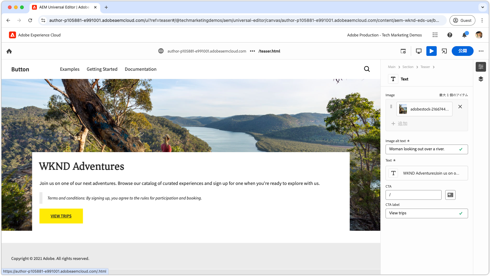

# Edge Delivery Services とユニバーサルエディターの開発者向けチュートリアル

このチュートリアルでは、ユニバーサルエディターによる強力なオーサリングと Edge Delivery Services を使用した非常に高速な配信を組み合わせた AEM web サイトの作成の基本について説明します。最後には、新しいプロジェクトを作成し、ローカル開発環境を設定し、新しいブロックを作成する方法の基本を理解できるようになります。

## プロジェクトのセットアップ

AEM as a Cloud Service でコードプロジェクトを作成し、新しいサイトを設定する方法について説明します。この設定により、ユニバーサルエディターを使用したシームレスな開発が可能になり、コンテンツの作成および Edge Delivery Services を通じた高速コンテンツ配信が実現します。

<!-- CARDS 

* ./1-new-code-project.md
* ./2-new-aem-site.md

-->
<!-- START CARDS HTML - DO NOT MODIFY BY HAND -->

    

        

            

                <figure class="image x-is-16by9">
                    
                </figure>
            

            

                

                    

                        <a href="./1-new-code-project.md" target="_blank" rel="referrer" title="コードプロジェクトの作成">コードプロジェクトの作成</a>
                    

                    
ユニバーサルエディターを使用して編集できる、Edge Delivery Services のコードプロジェクトを作成します。

                

                <a href="./1-new-code-project.md" target="_blank" rel="referrer" class="spectrum-Button spectrum-Button--outline spectrum-Button--primary spectrum-Button--sizeM" style="align-self: flex-start; margin-top: 1rem;">
                    詳細情報
                </a>
            

        

    

    

        

            

                <figure class="image x-is-16by9">
                    
                </figure>
            

            

                

                    

                        <a href="./2-new-aem-site.md" target="_blank" rel="referrer" title="AEM サイトの作成">AEM サイトの作成</a>
                    

                    
ユニバーサルエディターを使用して編集できる、Edge Delivery Services の AEM Sites のサイトを作成します。

                

                <a href="./2-new-aem-site.md" target="_blank" rel="referrer" class="spectrum-Button spectrum-Button--outline spectrum-Button--primary spectrum-Button--sizeM" style="align-self: flex-start; margin-top: 1rem;">
                    詳細情報
                </a>
            

        

    

<!-- END CARDS HTML - DO NOT MODIFY BY HAND -->

## 開発設定

高速な web サイト開発を可能にするローカル開発環境を設定する方法について説明します。この設定により、ユニバーサルエディターを使用したシームレスなサイト作成と、Edge Delivery Services を通じた効率的なコンテンツ配信が実現し、スムーズで最適化された開発ワークフローが確保されます。
<!-- CARDS 

* ./3-local-development-environment.md
* ./4-website-branding.md

-->
<!-- START CARDS HTML - DO NOT MODIFY BY HAND -->

    

        

            

                <figure class="image x-is-16by9">
                    
                </figure>
            

            

                

                    

                        <a href="./3-local-development-environment.md" target="_blank" rel="referrer" title="ローカル開発環境の設定">ローカル開発環境の設定</a>
                    

                    
Edge Delivery Services で配信され、ユニバーサルエディターで編集できるサイトのローカル開発環境を設定します。

                

                <a href="./3-local-development-environment.md" target="_blank" rel="referrer" class="spectrum-Button spectrum-Button--outline spectrum-Button--primary spectrum-Button--sizeM" style="align-self: flex-start; margin-top: 1rem;">
                    詳細情報
                </a>
            

        

    

    

        

            

                <figure class="image x-is-16by9">
                    
                </figure>
            

            

                

                    

                        <a href="./4-website-branding.md" target="_blank" rel="referrer" title="Web サイトのブランディングの追加">Web サイトのブランディングの追加</a>
                    

                    
Edge Delivery Services サイトのグローバル CSS、CSS 変数および web フォントを定義します。

                

                <a href="./4-website-branding.md" target="_blank" rel="referrer" class="spectrum-Button spectrum-Button--outline spectrum-Button--primary spectrum-Button--sizeM" style="align-self: flex-start; margin-top: 1rem;">
                    詳細情報
                </a>
            

        

    

<!-- END CARDS HTML - DO NOT MODIFY BY HAND -->

## ブロックの開発

コンテンツモデルを定義し、テストと開発用のサンプルコンテンツを設定して、新しいブロックを作成する方法について説明します。ブロックをレンダリングする 2 つの方法を探索し、AEM および Edge Delivery Services で最適なパフォーマンスと柔軟性を実現するブロックの構成方法を探索します。

<!-- CARDS 

* ./5-new-block.md {image = ./assets/5-new-block/card.png}
* ./6-author-block.md {image = ./assets/6-author-block/card.png}
* ./7a-block-css.md {image = ./assets/7a-block-css/card.png}
* ./7b-block-js-css.md {image = ./assets/7b-block-js-css/card.png}

-->
<!-- START CARDS HTML - DO NOT MODIFY BY HAND -->

    

        

            

                <figure class="image x-is-16by9">
                    
                </figure>
            

            

                

                    

                        <a href="./5-new-block.md" target="_blank" rel="referrer" title="ブロックの作成">ブロックの作成</a>
                    

                    
ユニバーサルエディターで編集できる Edge Delivery Services の web サイト用のブロックを作成します。

                

                <a href="./5-new-block.md" target="_blank" rel="referrer" class="spectrum-Button spectrum-Button--outline spectrum-Button--primary spectrum-Button--sizeM" style="align-self: flex-start; margin-top: 1rem;">
                    詳細情報
                </a>
            

        

    

    

        

            

                <figure class="image x-is-16by9">
                    
                </figure>
            

            

                

                    

                        <a href="./6-author-block.md" target="_blank" rel="referrer" title="ブロックのオーサリング">ブロックのオーサリング</a>
                    

                    
ユニバーサルエディターを使用して Edge Delivery Services ブロックを作成します。

                

                <a href="./6-author-block.md" target="_blank" rel="referrer" class="spectrum-Button spectrum-Button--outline spectrum-Button--primary spectrum-Button--sizeM" style="align-self: flex-start; margin-top: 1rem;">
                    詳細情報
             </a>
            

        

    

    

        

            

                <figure class="image x-is-16by9">
                    
                </figure>
            

            

                

                    

                        <a href="./7a-block-css.md" target="_blank" rel="referrer" title="CSS を使用したブロックの開発">CSS を使用したブロックの開発</a>
                    

                    
ユニバーサルエディターを使用して編集できる、Edge Delivery Services 用の CSS を使用してブロックを開発します。

                

                <a href="./7a-block-css.md" target="_blank" rel="referrer" class="spectrum-Button spectrum-Button--outline spectrum-Button--primary spectrum-Button--sizeM" style="align-self: flex-start; margin-top: 1rem;">
                    詳細情報
                </a>
            

        

    

    

        

            

                <figure class="image x-is-16by9">
                    
                </figure>
            

            

                

                    

                        <a href="./7b-block-js-css.md" target="_blank" rel="referrer" title="CSS と JS を使用したブロックの開発">CSS と JS を使用したブロックの開発</a>
                    

                    
ユニバーサルエディターを使用して編集できる、Edge Delivery Services 用の CSS と JavaScript を使用してブロックを開発します。

                

                <a href="./7b-block-js-css.md" target="_blank" rel="referrer" class="spectrum-Button spectrum-Button--outline spectrum-Button--primary spectrum-Button--sizeM" style="align-self: flex-start; margin-top: 1rem;">
                    詳細情報
                </a>
            

        

    

<!-- END CARDS HTML - DO NOT MODIFY BY HAND -->

## 次の手順

このチュートリアルは完了しました。次は、上記の集中的なハウツーで学んだ内容に基づいて作業を進めます。上記のガイドでは、ここで説明したコードと概念を拡張し、役割固有のユースケース、高度なテクニック、Edge Delivery Services とユニバーサルエディターの開発スキルを強化するその他のヒントについて説明します。

<!-- CARDS 

* ./how-to/block-options.md

-->
<!-- START CARDS HTML - DO NOT MODIFY BY HAND -->

    

        

            

                <figure class="image x-is-16by9">
                    
                </figure>
            

            

                

                    

                        <a href="./how-to/block-options.md" target="_blank" rel="referrer" title="ブロックオプション">ブロックオプション</a>
                    

                    
複数の表示オプションを使用してブロックを作成する方法について説明します。

                

                <a href="./how-to/block-options.md" target="_blank" rel="referrer" class="spectrum-Button spectrum-Button--outline spectrum-Button--primary spectrum-Button--sizeM" style="align-self: flex-start; margin-top: 1rem;">
                    詳細情報
                </a>
            

        

    

<!-- END CARDS HTML - DO NOT MODIFY BY HAND -->
