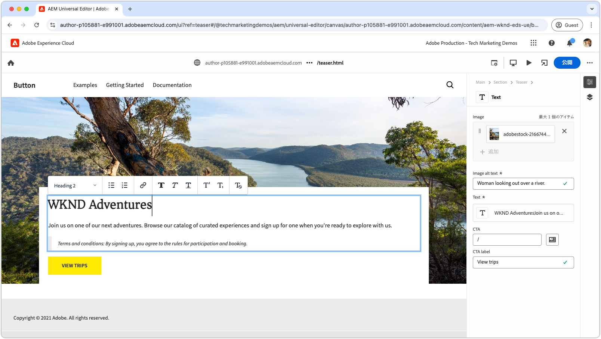

# Edge Delivery Servicesとユニバーサルエディターの開発者向けチュートリアル

このチュートリアルでは、強力なオーサリングと、ユニバーサルエディターおよびEdge Delivery Servicesを使用した超高速配信を組み合わせたAEM web サイトを構築するための基本を説明します。 最後に、新しいプロジェクトを作成する方法、ローカル開発環境を設定する方法、新しいブロックを作成する方法の基本的な理解が得られます。

## プロジェクトのセットアップ

AEM as a Cloud Serviceでコードプロジェクトを作成し、新しいサイトを設定する方法について説明します。 このセットアップにより、ユニバーサルエディターとのシームレスな開発が可能になり、コンテンツの作成と、Edge Delivery Servicesを通じた迅速なコンテンツ配信が可能になります。

<!-- XCARDS 

* ./1-new-code-project.md
* ./2-new-aem-site.md

-->
<!-- START CARDS HTML - DO NOT MODIFY BY HAND -->

    

        

            

                <figure class="image x-is-16by9">
                    
                </figure>
            

            

                

                    

                        <a href="./1-new-code-project.md" target="_blank" rel="referrer" title="コードプロジェクトの作成"> コードプロジェクトの作成 </a>
                    

                    
ユニバーサルエディターを使用して編集可能な、Edge Delivery Services用のコードプロジェクトを作成します。

                

                <a href="./1-new-code-project.md" target="_blank" rel="referrer" class="spectrum-Button spectrum-Button--outline spectrum-Button--primary spectrum-Button--sizeM" style="align-self: flex-start; margin-top: 1rem;">
                    詳細情報
                </a>
            

        

    

    

        

            

                <figure class="image x-is-16by9">
                    
                </figure>
            

            

                

                    

                        <a href="./2-new-aem-site.md" target="_blank" rel="referrer" title="AEM サイトの作成">AEM サイトの作成 </a>
                    

                    
AEM Sitesで、ユニバーサルエディターを使用して編集可能なEdge Delivery Services用のサイトを作成します。

                

                <a href="./2-new-aem-site.md" target="_blank" rel="referrer" class="spectrum-Button spectrum-Button--outline spectrum-Button--primary spectrum-Button--sizeM" style="align-self: flex-start; margin-top: 1rem;">
                    詳細情報
                </a>
            

        

    

<!-- END CARDS HTML - DO NOT MODIFY BY HAND -->

## 開発設定

迅速な web サイトローカル開発を可能にする開発環境の設定方法を説明します。 このセットアップにより、ユニバーサルエディターを使用したシームレスなサイト作成と、Edge Delivery Servicesを通じた効率的なコンテンツ配信が可能になり、最適化されたスムーズな開発ワークフローが実現します。
<!-- XCARDS 

* ./3-local-development-environment.md
* ./4-website-branding.md

-->
<!-- START CARDS HTML - DO NOT MODIFY BY HAND -->

    

        

            

                <figure class="image x-is-16by9">
                    
                </figure>
            

            

                

                    

                        <a href="./3-local-development-environment.md" target="_blank" rel="referrer" title="ローカル開発環境を設定">ローカル開発環境のセットアップ </a>
                    

                    
Edge Delivery Servicesが配信され、ユニバーサルエディターで編集可能なサイトのローカル開発環境を設定します。

                

                <a href="./3-local-development-environment.md" target="_blank" rel="referrer" class="spectrum-Button spectrum-Button--outline spectrum-Button--primary spectrum-Button--sizeM" style="align-self: flex-start; margin-top: 1rem;">
                    詳細情報
                </a>
            

        

    

    

        

            

                <figure class="image x-is-16by9">
                    
                </figure>
            

            

                

                    

                        <a href="./4-website-branding.md" target="_blank" rel="referrer" title="Web サイトのブランディングの追加">Web サイトのブランディングを追加 </a>
                    

                    
Edge Delivery Servicesサイトのグローバル CSS、CSS 変数および web フォントを定義します。

                

                <a href="./4-website-branding.md" target="_blank" rel="referrer" class="spectrum-Button spectrum-Button--outline spectrum-Button--primary spectrum-Button--sizeM" style="align-self: flex-start; margin-top: 1rem;">
                    詳細情報
                </a>
            

        

    

<!-- END CARDS HTML - DO NOT MODIFY BY HAND -->

## ブロック開発

コンテンツモデルを定義し、テストおよび開発用にサンプルコンテンツを設定することで、新しいブロックを作成する方法を説明します。 ブロックをレンダリングする 2 つの方法を検討し、AEMとEdge Delivery Servicesで最適なパフォーマンスと柔軟性を得るためにブロックを構築する方法を理解します。

<!-- CARDS 

* ./5-new-block.md {image = ./assets/5-new-block/card.png}
* ./6-author-block.md {image = ./assets/6-author-block/card.png}
* ./7a-block-css.md {image = ./assets/7a-block-css/card.png}
* ./7b-block-js-css.md {image = ./assets/7b-block-js-css/card.png}

-->
<!-- START CARDS HTML - DO NOT MODIFY BY HAND -->

    

        

            

                <figure class="image x-is-16by9">
                    
                </figure>
            

            

                

                    

                        <a href="./5-new-block.md" target="_blank" rel="referrer" title="ブロックの作成"> ブロックの作成 </a>
                    

                    
ユニバーサルエディターで編集可能なEdge Delivery Services web サイトのブロックを作成します。

                

                <a href="./5-new-block.md" target="_blank" rel="referrer" class="spectrum-Button spectrum-Button--outline spectrum-Button--primary spectrum-Button--sizeM" style="align-self: flex-start; margin-top: 1rem;">
                    詳細情報
                </a>
            

        

    

    

        

            

                <figure class="image x-is-16by9">
                    
                </figure>
            

            

                

                    

                        <a href="./6-author-block.md" target="_blank" rel="referrer" title="ブロックのオーサリング"> ブロックのオーサリング </a>
                    

                    
ユニバーサルエディターを使用してEdge Delivery Services ブロックを作成します。

                

                <a href="./6-author-block.md" target="_blank" rel="referrer" class="spectrum-Button spectrum-Button--outline spectrum-Button--primary spectrum-Button--sizeM" style="align-self: flex-start; margin-top: 1rem;">
                    詳細情報
                </a>
            

        

    

    

        

            

                <figure class="image x-is-16by9">
                    
                </figure>
            

            

                

                    

                        <a href="./7a-block-css.md" target="_blank" rel="referrer" title="CSS を使用したブロックの開発">CSS を使用したブロックの開発 </a>
                    

                    
ユニバーサルエディターを使用して編集可能な、Edge Delivery Services用の CSS を使用したブロックを開発します。

                

                <a href="./7a-block-css.md" target="_blank" rel="referrer" class="spectrum-Button spectrum-Button--outline spectrum-Button--primary spectrum-Button--sizeM" style="align-self: flex-start; margin-top: 1rem;">
                    詳細情報
                </a>
            

        

    

    

        

            

                <figure class="image x-is-16by9">
                    
                </figure>
            

            

                

                    

                        <a href="./7b-block-js-css.md" target="_blank" rel="referrer" title="CSS と JS を使用したブロックの開発">CSS と JS を使用したブロックの開発 </a>
                    

                    
ユニバーサルエディターを使用して編集可能な、CSS とJavaScriptを使用したEdge Delivery Services用ブロックを作成します。

                

                <a href="./7b-block-js-css.md" target="_blank" rel="referrer" class="spectrum-Button spectrum-Button--outline spectrum-Button--primary spectrum-Button--sizeM" style="align-self: flex-start; margin-top: 1rem;">
                    詳細情報
                </a>
            

        

    

<!-- END CARDS HTML - DO NOT MODIFY BY HAND -->
