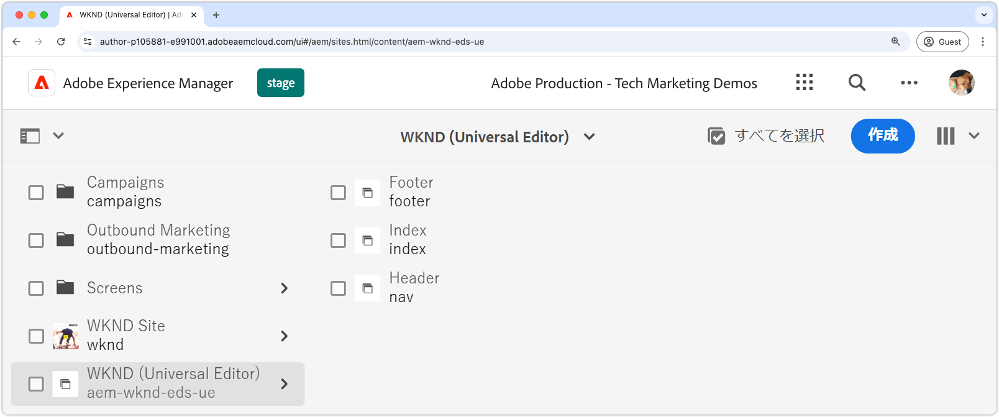

# AEM サイトの作成

AEM サイトは、web サイトのコンテンツを編集、管理、公開する場所です。Edge Delivery Services 経由で配信され、ユニバーサルエディターを使用して作成された AEM サイトを作成するには、[AEM オーサリングを使用した Edge Delivery Services サイトテンプレート](https://github.com/adobe-rnd/aem-boilerplate-xwalk/releases)を使用して AEM オーサーで新しいサイトを作成します。

AEM サイトは、web サイトのコンテンツを保存および作成する場所です。最終的なエクスペリエンスは、AEM サイトのコンテンツと [web サイトのコード](./1-new-code-project.md)を組み合わせたものです。

新しい AEM サイトを作成するには、[ドキュメントに記載されている詳細な手順](https://experienceleague.adobe.com/ja/docs/experience-manager-cloud-service/content/edge-delivery/wysiwyg-authoring/edge-dev-getting-started#create-aem-site)に従います。以下は、このチュートリアルで使用される値を含む手順の概要リストです。
1. AEM オーサーで&#x200B;**新しいサイトを作成**&#x200B;します。このチュートリアルでは、次のサイト名を使用します。
   * サイトのタイトル：`WKND (Universal Editor)`
   * サイト名：`aem-wknd-eds-ue`

      * サイト名の値は、[`paths.json` に追加](https://experienceleague.adobe.com/ja/docs/experience-manager-cloud-service/content/edge-delivery/wysiwyg-authoring/path-mapping)されたサイトのパス名と一致する必要があります。

2. [AEM オーサリングを使用した Edge Delivery Services サイトテンプレート](https://github.com/adobe-rnd/aem-boilerplate-xwalk/releases)から&#x200B;**最新のテンプレートを読み込みます**。
3. GitHub リポジトリ名と一致するように&#x200B;**サイトに名前を付け**、GitHub URL をリポジトリの URL として設定します。

## プレビューへの新しいサイトの公開

AEM オーサーでサイトを作成したら、Edge Delivery Services プレビューに公開して、コンテンツを[ローカル開発環境](./3-local-development-environment.md)で使用できるようにします。

1. **AEM オーサー**&#x200B;にログインし、**Sites** に移動します。
2. **新しいサイト**（`WKND (Universal Editor)`）を選択し、「**パブリケーションを管理**」をクリックします。
3. **宛先**&#x200B;の下にある「**プレビュー**」を選択し、「**次へ**」をクリックします。
4. **子を含める設定**&#x200B;で、「**子を含める**」を選択し、他のオプションを選択解除して、「**OK**」をクリックします。
5. 「**公開**」をクリックし、サイトのコンテンツを公開してプレビューします。
6. プレビューに公開すると、ページは Edge Delivery Services プレビュー環境で使用できます（ページは AEM プレビューサービスには表示されません）。
