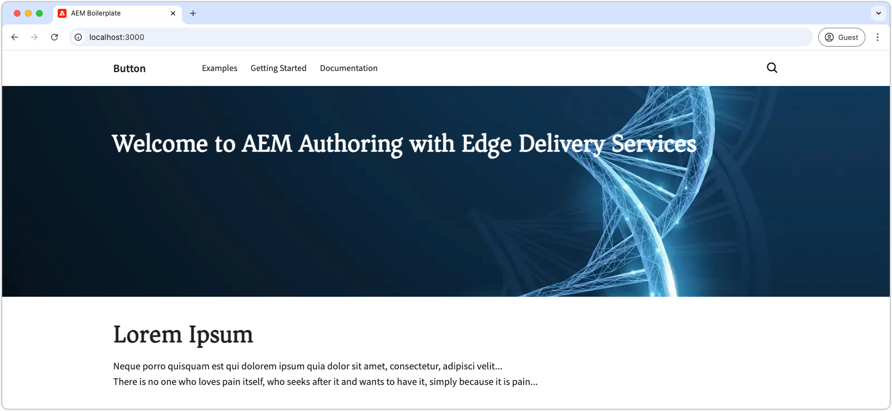

# Web サイトのブランディングの追加

最初に、グローバルスタイルを更新し、CSS 変数を定義し、web フォントを追加して、ブランド全体を設定します。これらの基本要素により、web サイトの一貫性と保守性が確保され、サイト全体で一貫して適用される必要があります。

## GitHub イシューの作成

すべてを整理しておくには、GitHub を使用して作業を追跡します。まず、この作業内容に関する GitHub イシューを作成します。

1. GitHub リポジトリに移動します（詳しくは、[コードプロジェクトの作成](./1-new-code-project.md)の章を参照）。
2. 「**イシュー**」タブをクリックし、「**新規イシュー**」をクリックします。
3. 実行する作業の&#x200B;**タイトル**&#x200B;と&#x200B;**説明**&#x200B;を書き込みます。
4. 「**新規イシューを送信**」をクリックします。

GitHub イシューは、後で[プルリクエストの作成](#merge-code-changes)時に使用されます。


## 作業用分岐の作成

組織を維持し、コードの品質を確保するには、作業内容別に新しい分岐を作成します。この方法により、新しいコードがパフォーマンスに悪影響を与えるのを防ぎ、変更が完了する前に変更が有効にならないようにします。

この章では、web サイトの基本的なスタイルに焦点を当てるので、`wknd-styles` という名前の分岐を作成します。

```bash
# ~/Code/aem-wknd-eds-ue

$ git checkout -b wknd-styles
```

## グローバル CSS

Edge Delivery Services では、`styles/styles.css` にあるグローバル CSS ファイルを使用して、web サイト全体の共通スタイルを設定します。`styles.css` では、カラー、フォント、間隔などの側面を制御し、サイト全体ですべてが一貫して見えるようにします。

グローバル CSS では、ブロックなどの下位レベルの構造に依存せず、サイトの全体的なルックアンドフィールと、共有される視覚的処理に焦点を合わせる必要があります。

グローバル CSS スタイルは、必要に応じて上書きできます。

### CSS 変数

[CSS 変数](https://developer.mozilla.org/ja/docs/Web/CSS/Using_CSS_custom_properties)は、カラー、フォント、サイズなどのデザイン設定を保存する優れた方法です。変数を使用すると、これらの要素を 1 か所で変更し、サイト全体で更新できます。

CSS 変数のカスタマイズを開始するには、次の手順に従います。

1. `styles/styles.css` ファイルをコードエディターで開きます。
2. グローバル CSS 変数が保存されている `:root` 宣言を見つけます。
3. WKND ブランドに合致するカラーおよびフォント変数を変更します。

次に例を示します。


```css
/* styles/styles.css */

:root {
  /* colors */
  --primary-color: rgb(255, 234, 3); /* WKND primary color */
  --secondary-color: rgb(32, 32, 32); /* Secondary brand color */
  --background-color: white; /* Background color */
  --light-color: rgb(235, 235, 235); /* Light background color */
  --dark-color: var(--secondary-color); /* Dark text color */
  --text-color: var(--secondary-color); /* Default text color */
  --link-color: var(--text-color); /* Link color */
  --link-hover-color: black; /* Link hover color */

  /* fonts */
  --heading-font: 'Roboto', sans-serif; /* Heading font */
  --body-font: 'Open Sans', sans-serif; /* Body font */
  --base-font-size: 16px; /* Base font size */
}
```

`:root` セクションの他の変数を探索して、デフォルト設定を確認します。

Web サイトを開発する際に、同じ CSS 値を繰り返す状況が発生した場合は、スタイルの管理を簡単にする新しい変数の作成を検討します。CSS 変数を使用することができる他の CSS プロパティの例には、`border-radius`、`padding`、`margin`、`box-shadow` などがあります。

### ベア要素

ベア要素は、CSS クラスを使用する代わりに、要素名を通じて直接スタイル設定されます。例えば、`.page-heading` CSS クラスにスタイルを設定する代わりに、`h1 { ... }` を使用して `h1` 要素にスタイルを適用します。

`styles/styles.css` ファイルでは、一連の基本スタイルが HTML ベア要素に適用されます。Edge Delivery Services の web サイトでは、Edge Delivery Service のネイティブなセマンティック HTML に準拠しているので、ベア要素の使用が優先されます。

WKND ブランディングに合わせるには、`styles.css` でいくつかのベア要素をスタイル設定します。

```css
/* styles/styles.css */

...
h2 {
  font-size: var(--heading-font-size-xl); /* Set font size for h2 */
}

/* Add a partial yellow underline under H2 */
h2::after {
  border-bottom: 2px solid var(--primary-color); /* Yellow underline */
  content: "";
  display: block;
  padding-top: 8px;
  width: 84px;
}
...
```

これらのスタイルにより、上書きされない限り、`h2` 要素は一貫して WKND ブランディングでスタイル設定され、明確な視覚階層を作成するのに役立ちます。各 `h2` の下にある部分的な黄色の下線が、見出しに独特のタッチを追加しています。

### 推測される要素

Edge Delivery Services では、プロジェクトの `scripts.js` および `aem.js` コードが、HTML 内のコンテキストに基づいて特定のベア HTML 要素を自動的に強化します。

例えば、周囲のテキストとインラインではなく、独自の行に作成されたアンカー（`<a>`）要素は、このコンテキストに基づいてボタンであると推測されます。これらのアンカーは、CSS クラス `button-container` を持つコンテナ `div` で自動的にラップされ、アンカー要素には `button` CSS クラスが追加されます。

例えば、リンクを独自の行に作成すると、Edge Delivery Services JavaScript は DOM を次のように更新します。

```html
<p class="button-container">
  <a href="/authored/link" title="Click me" class="button">Click me</a>
</p>
```

これらのボタンは、WKND ブランドに合わせてカスタマイズできます。WKND ブランドでは、ボタンは黄色の長方形に黒色のテキストが表示されます。

次に、`styles.css` で「推測されるボタン」をスタイル設定する方法の例を示します。

```css
/* styles/styles.css */

/* Buttons */
a.button:any-link,
button {
  box-sizing: border-box;
  display: inline-block;
  max-width: 100%;
  margin: 12px 0;
  border: 2px solid transparent;
  padding: 0.5em 1.2em;
  font-family: var(--body-font-family);
  font-style: normal;
  font-weight: 500;
  line-height: 1.25;
  text-align: center;
  text-decoration: none;
  cursor: pointer;
  overflow: hidden;
  text-overflow: ellipsis;
  white-space: nowrap;

  /* WKND specific treatments */
  text-transform: uppercase;
  background-color: var(--primary-color);
  color: var(--dark-color);
  border-radius: 0;
}
```

この CSS は、基本ボタンスタイルを定義し、大文字のテキスト、黄色の背景、黒色のテキストなどの WKND 固有の処理が含まれます。`background-color` および `color` プロパティでは、CSS 変数を使用して、ボタンのスタイルをブランドのカラーと一致させることができます。このアプローチにより、柔軟性を維持しながら、サイト全体でボタンが一貫してスタイル設定されます。

## Web Fonts

Edge Delivery Services プロジェクトでは、Web Fonts の使用を最適化して高いパフォーマンスを維持し、Lighthouse スコアへの影響を最小限に抑えます。この方法により、サイトの視覚的なアイデンティティを損なうことなく、高速なレンダリングが確保されます。Web Fonts を効率的に実装して最適なパフォーマンスを実現する方法を次に示します。

### フォントフェイス

`styles/fonts.css` ファイルの CSS `@font-face` 宣言を使用して、カスタム web フォントを追加します。`@font-faces` を `fonts.css` に追加すると、Web Fonts が最適なタイミングで読み込まれるので、Lighthouse スコアの維持に役立ちます。

1. `styles/fonts.css` を開きます。
2. WKND ブランドフォント（`Asar` および `Source Sans Pro`）を含めるには、次の `@font-face` 宣言を追加します。

```css
/* styles/fonts.css */

@font-face {
  font-family: Asar;
  font-style: normal;
  font-weight: 400;
  font-display: swap;
  src: url("https://fonts.gstatic.com/s/asar/v22/sZlLdRyI6TBIbkEaDZtQS6A.woff2") format('woff2');
  unicode-range: U+0000-00FF, U+0131, U+0152-0153, U+02BB-02BC, U+02C6, U+02DA, U+02DC, U+0304, U+0308, U+0329, U+2000-206F, U+20AC, U+2122, U+2191, U+2193, U+2212, U+2215, U+FEFF, U+FFFD;
}

@font-face {
  font-family: 'Source Sans Pro';
  font-style: italic;
  font-weight: 300;
  font-display: swap;
  src: url("https://fonts.gstatic.com/s/sourcesanspro/v22/6xKwdSBYKcSV-LCoeQqfX1RYOo3qPZZMkids18S0xR41.woff2") format('woff2');
  unicode-range: U+0000-00FF, U+0131, U+0152-0153, U+02BB-02BC, U+02C6, U+02DA, U+02DC, U+0304, U+0308, U+0329, U+2000-206F, U+20AC, U+2122, U+2191, U+2193, U+2212, U+2215, U+FEFF, U+FFFD;
}

@font-face {
  font-family: 'Source Sans Pro';
  font-style: italic;
  font-weight: 400;
  font-display: swap;
  src: url("https://fonts.gstatic.com/s/sourcesanspro/v22/6xK1dSBYKcSV-LCoeQqfX1RYOo3qPZ7nsDJB9cme.woff2") format('woff2');
  unicode-range: U+0000-00FF, U+0131, U+0152-0153, U+02BB-02BC, U+02C6, U+02DA, U+02DC, U+0304, U+0308, U+0329, U+2000-206F, U+20AC, U+2122, U+2191, U+2193, U+2212, U+2215, U+FEFF, U+FFFD;
}

@font-face {
  font-family: 'Source Sans Pro';
  font-style: italic;
  font-weight: 600;
  font-display: swap;
  src: url("https://fonts.gstatic.com/s/sourcesanspro/v22/6xKwdSBYKcSV-LCoeQqfX1RYOo3qPZY4lCds18S0xR41.woff2") format('woff2');
  unicode-range: U+0000-00FF, U+0131, U+0152-0153, U+02BB-02BC, U+02C6, U+02DA, U+02DC, U+0304, U+0308, U+0329, U+2000-206F, U+20AC, U+2122, U+2191, U+2193, U+2212, U+2215, U+FEFF, U+FFFD;
}

@font-face {
  font-family: 'Source Sans Pro';
  font-style: normal;
  font-weight: 300;
  font-display: swap;
  src: url("https://fonts.gstatic.com/s/sourcesanspro/v22/6xKydSBYKcSV-LCoeQqfX1RYOo3ik4zwlxdu3cOWxw.woff2") format('woff2');
  unicode-range: U+0000-00FF, U+0131, U+0152-0153, U+02BB-02BC, U+02C6, U+02DA, U+02DC, U+0304, U+0308, U+0329, U+2000-206F, U+20AC, U+2122, U+2191, U+2193, U+2212, U+2215, U+FEFF, U+FFFD;
}

@font-face {
  font-family: 'Source Sans Pro';
  font-style: normal;
  font-weight: 400;
  font-display: swap;
  src: url("https://fonts.gstatic.com/s/sourcesanspro/v22/6xK3dSBYKcSV-LCoeQqfX1RYOo3qOK7lujVj9w.woff2") format('woff2');
  unicode-range: U+0000-00FF, U+0131, U+0152-0153, U+02BB-02BC, U+02C6, U+02DA, U+02DC, U+0304, U+0308, U+0329, U+2000-206F, U+20AC, U+2122, U+2191, U+2193, U+2212, U+2215, U+FEFF, U+FFFD;
}

@font-face {
  font-family: 'Source Sans Pro';
  font-style: normal;
  font-weight: 600;
  font-display: swap;
  src: url("https://fonts.gstatic.com/s/sourcesanspro/v22/6xKydSBYKcSV-LCoeQqfX1RYOo3i54rwlxdu3cOWxw.woff2") format('woff2');
  unicode-range: U+0000-00FF, U+0131, U+0152-0153, U+02BB-02BC, U+02C6, U+02DA, U+02DC, U+0304, U+0308, U+0329, U+2000-206F, U+20AC, U+2122, U+2191, U+2193, U+2212, U+2215, U+FEFF, U+FFFD;
}
```

このチュートリアルで使用されているフォントは、Google Fonts から取得していますが、Web Fonts は [Adobe Fonts](https://fonts.adobe.com/) を含む任意のフォントプロバイダーから取得できます。

+++ローカル Web Fonts ファイルの使用

または、Web Fonts ファイルを `/fonts` フォルダーのプロジェクトにコピーし、`@font-face` 宣言で参照します。

このチュートリアルでは、簡単に理解できるように、リモートでホストされている Web Fonts を使用しています。

```css
/* styles/fonts.css */

@font-face { 
    font-family: Asar;
    ...
    src: url("/fonts/asar.woff2") format('woff2'),
    ...
}
```

+++

最後に、新しいフォントを使用するように、`styles/styles.css` CSS 変数を更新します。

```css
/* styles/styles.css */

:root {
    ...
    /* fonts */
    --body-font-family: 'Source Sans Pro', roboto-fallback, sans-serif;
    --heading-font-family: 'Asar', roboto-condensed-fallback, sans-serif;
    ...
}
```

`roboto-fallback` と `roboto-condensed-fallback` は、カスタム `Asar` および `Source Sans Pro` web フォントをサポートするように調整するように、[フォールバックフォント](#fallback-fonts)の節で更新されるフォールバックフォントです。

### フォールバックフォント

Web Fonts は、サイズによりパフォーマンスに影響を与えることが多く、累積レイアウトシフト（CLS）スコアが増加し、全体的な Lighthouse スコアが低下する可能性があります。Web Fonts の読み込み中にテキストを即座に表示するように、Edge Delivery Services プロジェクトではブラウザーネイティブのフォールバックフォントが使用されます。このアプローチは、目的のフォントを適用しながら、スムーズなユーザーエクスペリエンスを維持するのに役立ちます。

最適なフォールバックフォントを選択するには、アドビの [Helix Font Fallback Chrome 拡張機能](https://www.aem.live/developer/font-fallback)を使用します。これにより、カスタムフォントが読み込まれる前に、ブラウザーで使用する近似フォントが決定されます。パフォーマンスを向上させ、ユーザーにシームレスなエクスペリエンスを確保するには、結果として得られるフォールバックフォント宣言を `styles/styles.css` ファイルに追加する必要があります。

{align=center}

[Helix Font Fallback Chrome 拡張機能](https://www.aem.live/developer/font-fallback)を使用するには、web ページに Edge Delivery Services の web サイトで使用されているものと同じバリエーションの web フォントが適用されていることを確認します。このチュートリアルでは、[wknd.site](http://wknd.site/us/en.html) の拡張機能について説明します。Web サイトを開発する際は、拡張機能を [wknd.site](http://wknd.site/us/en.html) ではなく、作業中のサイトに適用します。

```css
/* styles/styles.css */
...

/* fallback fonts */

/* Fallback font for Asar (normal - 400) */
@font-face {
    font-family: "asar-normal-400-fallback";
    size-adjust: 95.7%;
    src: local("Arial");
}

/* Fallback font for Source Sans Pro (normal - 400) */
@font-face {
    font-family: "source-sans-pro-normal-400-fallback";
    size-adjust: 92.9%;
    src: local("Arial");
}

...
```

`styles/styles.css` のフォント CSS 変数の「実際」のフォントファミリー名の後に、フォールバックフォントファミリー名を追加します。

```css
/* styles/styles.css */

:root {
    ...
    /* fonts */
    --body-font-family: 'Source Sans Pro', source-sans-pro-normal-400-fallback, sans-serif;
    --heading-font-family: 'Asar', asar-normal-400-fallback, sans-serif;
    ...
}
```

## 開発プレビュー

CSS を追加すると、AEM CLI のローカル開発環境によって変更が自動的に再読み込みされるので、CSS がブロックに与える影響をすばやく簡単に確認できます。




## 最終的な CSS ファイルのダウンロード

更新された CSS ファイルは、以下のリンクからダウンロードできます。

* [`styles.css`](https://raw.githubusercontent.com/davidjgonzalez/aem-wknd-eds-ue/refs/heads/main/styles/styles.css)
* [`fonts.css`](https://raw.githubusercontent.com/davidjgonzalez/aem-wknd-eds-ue/refs/heads/main/styles/fonts.css)

## CSS ファイルのリント

コードの変更が確実にクリーンで一貫性を持たせるには、[頻繁にリント](./3-local-development-environment.md#linting)します。定期的にリンティングを行うと、問題を早期に発見し、全体的な開発時間を短縮できます。すべてのリンティングの問題が解決されるまで、作業をメイン分岐に結合できません。

```bash
$ npm run lint:css
```

## コードの変更の結合

これらの更新に基づいて今後の作業をビルドするには、変更を GitHub の `main` 分岐に結合します。

```bash
$ git add .
$ git commit -m "Add global CSS, CSS variables, and web fonts"
$ git push origin wknd-styles
```

変更が `wknd-styles` 分岐にプッシュされたら、GitHub でプルリクエストを作成して、`main` 分岐に結合します。

1. [新しいプロジェクトの作成](./1-new-code-project.md)の章から GitHub リポジトリに移動します。
2. 「**プルリクエスト**」タブをクリックし、「**新しいプルリクエスト**」を選択します。
3. `wknd-styles` をソース分岐として設定し、`main` をターゲット分岐として設定します。
4. 変更を確認し、「**プルリクエストを作成**」をクリックします。
5. プルリクエストの詳細に、**次の内容を追加します**。

   ```
   Add basic global CSS, CSS variables, and web fonts (including fallback fonts) to support the WKND brand.
   
   Fix #1
   
   Test URLs:
   - Before: https://main--wknd-aem-eds-ue--davidjgonzalez.aem.live/
   - After: https://wknd-styles--wknd-aem-eds-ue--davidjgonzalez.aem.live/
   ```

   * `Fix #1` は、以前に作成した GitHub イシューを参照します。
   * テスト URL では、検証と比較に使用する分岐を AEM Code Sync に指示します。「After」の URL では、作業用分岐 `wknd-styles`を使用して、コードの変更が web サイトのパフォーマンスに与える影響を確認します。

6. 「**プルリクエストを作成**」をクリックします。
7. [AEM Code Sync GitHub アプリ](./1-new-code-project.md)が&#x200B;**品質チェックを完了**&#x200B;するまで待ちます。失敗した場合は、エラーを解決してチェックを再実行します。
8. チェックに合格したら、`main` に&#x200B;**プルリクエストを結合**&#x200B;します。

変更を `main` に結合すると、実稼動環境にデプロイされたとは見なされず、これらの更新に基づいて新しい開発を進めることができます。
