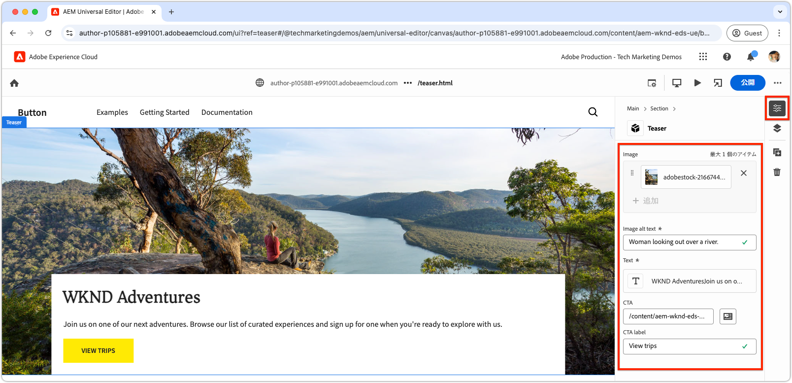
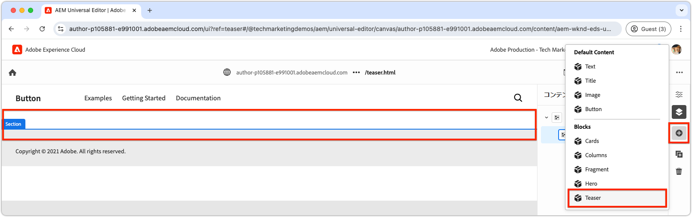

# 新しいブロックを作成

この章では、ユニバーサルエディターを使用して、Edge Delivery Services web サイト用の新しい編集可能なティーザーブロックを作成するプロセスについて説明します。


`teaser` という名前のブロックに、次の要素が表示されます。

- **画像**：視覚的に魅力的な画像。
- **テキストコンテンツ**:
   - **タイトル**：フォーカスを引き出すための説得力のある見出し。
   - **本文**：オプションの利用条件など、コンテキストや詳細を提供する説明的なコンテンツ。
   - **コールトゥアクション（CTA）ボタン**：ユーザーのインタラクションを促し、さらなるエンゲージメントの実現に導くように設計されたリンク。

`teaser` ブロックのコンテンツはユニバーサルエディターで編集できるため、使いやすさと web サイト全体での再利用性が確保されます。

`teaser` ブロックは、ボイラープレートの `hero` ブロックに似ています。したがって、`teaser` ブロックは、開発の概念を説明する簡単な例としてのみ機能するように設計されています。

## 新しい Git ブランチの作成

クリーンで整理されたワークフローを維持するには、特定の開発タスクごとに新しいブランチを作成します。 これにより、不完全なコードやテストされていないコードを実稼動環境にデプロイする際の問題を回避できます。

1. **main ブランチから開始**：最新の実稼動コードを使用して作業することで、堅牢な基盤を確保できます。
2. **リモート変更の取得**:GitHub から最新のアップデートを取得すると、開発を開始する前に、最新のコードを確実に利用できるようになります。
   - 例：`wknd-styles` ブランチからの変更を `main` に結合した後、最新の更新を取得する
3. **新しいブランチの作成**:

```bash
# ~/Code/aem-wknd-eds-ue

$ git fetch origin  
$ git checkout -b teaser origin/main  
```

`teaser` ブランチを作成したら、ティーザーブロックの開発を開始できます。

## フォルダーをブロック

プロジェクトの `blocks` ディレクトリに `teaser` という名前の新規フォルダーを作成します。 このフォルダーには、ブロックの JSON、CSS、JavaScript ファイルが含まれ、ブロックのファイルを 1 か所に整理します。

```
# ~/Code/aem-wknd-eds-ue

/blocks/teaser
```

ブロックフォルダー名はブロックの ID として機能し、開発全体でブロックを参照するために使用されます。

## JSON をブロック

ブロック JSON は、ブロックの 3 つの主要な側面を定義します。

- **定義**：ブロックをユニバーサルエディターの編集可能なコンポーネントとして登録し、ブロックモデルおよびオプションでフィルターにリンクします。
- **モデル**: ブロックのオーサリングフィールドと、これらのフィールドがセマンティックEdge Delivery ServicesHTMLとしてレンダリングされる方法を指定します。
- **フィルター**：ユニバーサルエディターを使用してブロックを追加できるコンテナを制限するフィルタリングルールを設定します。 ほとんどのブロックはコンテナではなく、その ID が他のコンテナブロックのフィルターに追加されます。

次の初期構造を持つ新しいファイルを `/blocks/teaser/_teaser.json` に正確な順序で作成します。 キーが正しくない場合は、正しく作成されない可能性があります。

[!BADGE /blocks/teaser/_teaser.json]{type=Neutral tooltip="以下のコードサンプルのファイル名。"}

```json
{
    "definitions": [],
    "models": [],
    "filters": []
}
```

### ブロックモデル

ブロックモデルは、以下を定義するので、ブロック設定の重要な部分になります。

1. 編集可能なフィールドを定義したオーサリングエクスペリエンス。

   

2. フィールドの値がEdge Delivery ServicesHTMLにレンダリングされる方法。

モデルには [ ブロックの定義に対応する `id` が割り当てられ ](#block-definition) 編集可能なフィールドを指定する `fields` 配列が含まれています。

`fields` 配列の各フィールドには、次の必須プロパティを含む JSON オブジェクトがあります。

| JSON プロパティ | 説明 |
|---------------|-----------------------------------------------------------------------------------------------------------------------|
| `component` | [ フィールドタイプ ](https://experienceleague.adobe.com/en/docs/experience-manager-cloud-service/content/implementing/developing/universal-editor/field-types#component-types) （`text`、`reference`、`aem-content` など）。 |
| `name` | フィールドの名前。AEMで値が保存されている JCR プロパティにマッピングされます。 |
| `label` | ユニバーサルエディターで作成者に表示されるラベル。 |

オプションを含むプロパティの包括的なリストについては、[ ユニバーサルエディターフィールドのドキュメント ](https://experienceleague.adobe.com/en/docs/experience-manager-cloud-service/content/implementing/developing/universal-editor/field-types#fields) を参照してください。

#### ブロック設計


ティーザーブロックには、次の編集可能な要素が含まれています。

1. **画像**：ティーザーの視覚的なコンテンツを表します。
2. **テキストコンテンツ**：タイトル、本文、コールトゥアクションボタンが含まれ、白い長方形に収められています。
   - **title** と **body text** は、同じリッチテキストエディターで作成できます。
   - **CTA** は、**label** の `text` フィールド、および **link** の `aem-content` フィールドを介してオーサリングできます。

ティーザーブロックのデザインは、2 つの論理コンポーネント（画像コンテンツとテキストコンテンツ）に分割され、構造化された直感的なオーサリングエクスペリエンスをユーザーに提供します。

### ブロックフィールド

ブロックに必要な次のフィールドを定義します。画像、画像の代替テキスト、テキスト、CTA ラベル、CTA リンク。

>[!BEGINTABS]

>[!TAB  正しい方法 ]

**このタブでは、ティーザーブロックを適切にモデル化する方法を説明します。**

ティーザーは、画像とテキストの 2 つの論理領域で構成されます。 Edge Delivery ServicesHTMLを目的の web エクスペリエンスとして表示するために必要なコードを簡単にするために、ブロックモデルにはこの構造を反映する必要があります。

- **フィールドを折りたたむ ](https://experienceleague.adobe.com/en/docs/experience-manager-cloud-service/content/edge-delivery/wysiwyg-authoring/content-modeling#field-collapse) を使用して、** 画像 **と [ 画像代替テキスト** をグループ化します。
- [CTAの要素のグループ化 ](https://experienceleague.adobe.com/en/docs/experience-manager-cloud-service/content/edge-delivery/wysiwyg-authoring/content-modeling#element-grouping) と [ フィールド折りたたみ ](https://experienceleague.adobe.com/en/docs/experience-manager-cloud-service/content/edge-delivery/wysiwyg-authoring/content-modeling#field-collapse) を使用して、テキストコンテンツフィールドをグループ化します。

[ フィールドを折りたたむ ](https://experienceleague.adobe.com/en/docs/experience-manager-cloud-service/content/edge-delivery/wysiwyg-authoring/content-modeling#field-collapse)、[ 要素のグループ化 ](https://experienceleague.adobe.com/en/docs/experience-manager-cloud-service/content/edge-delivery/wysiwyg-authoring/content-modeling#element-grouping)、または [ タイプの推論 ](https://experienceleague.adobe.com/en/docs/experience-manager-cloud-service/content/edge-delivery/wysiwyg-authoring/content-modeling#type-inference) に詳しくない場合は、続行する前にリンクされているドキュメントを確認してください。これらは適切に構造化されたブロックモデルの作成に不可欠なものだからです。

次の例では、

- [ 型の推論 ](https://experienceleague.adobe.com/en/docs/experience-manager-cloud-service/content/edge-delivery/wysiwyg-authoring/content-modeling#type-inference) を使用すると、`image` フィールドから ``HTML要素が自動的に作成されます。 フィールドの折りたたみは、`image` フィールドと `imageAlt` フィールドと共に使用して、`` HTML要素を作成します。 `src` 属性は `image` フィールドの値に設定され、`alt` 属性は `imageAlt` フィールドの値に設定されます。
- `textContent` は、フィールドの分類に使用されるグループ名です。 セマンティックにする必要がありますが、このブロックに固有のものであれば何でも構いません。 これにより、ユニバーサルエディターは、最終的なHTML出力の同じ `<div>` 要素内でこのプレフィックスを持つすべてのフィールドをレンダリングするように通知されます。
- フィールドの折りたたみは、コールトゥアクション（CTA）の `textContent` グループ内でも適用されます。 CTAは、[type inference](https://experienceleague.adobe.com/en/docs/experience-manager-cloud-service/content/edge-delivery/wysiwyg-authoring/content-modeling#type-inference) を使用して `<a>` として作成されます。 `cta` フィールドは、`<a>` 要素の `href` 属性を設定するために使用され、`ctaText` フィールドは、`<a ...>` タグ内のリンクのテキストコンテンツを提供します。

[!BADGE /blocks/teaser/_teaser.json]{type=Neutral tooltip="以下のコードサンプルのファイル名。"}

```json
{
    "definitions": [],
    "models": [
        {
            "id": "teaser", 
            "fields": [
                {
                    "component": "reference",
                    "valueType": "string",
                    "name": "image",
                    "label": "Image",
                    "multi": false
                },
                {
                    "component": "text",
                    "valueType": "string",
                    "name": "imageAlt",
                    "label": "Image alt text",
                    "required": true
                },
                {
                    "component": "richtext",
                    "name": "textContent_text",
                    "label": "Text",
                    "valueType": "string",
                    "required": true
                },
                {
                    "component": "aem-content",
                    "name": "textContent_cta",
                    "label": "CTA",
                    "valueType": "string"
                },
                {
                    "component": "text",
                    "name": "textContent_ctaText",
                    "label": "CTA label",
                    "valueType": "string"
                }
            ]
        }
    ],
    "filters": []
}
```

このモデルは、ブロックのユニバーサルエディターのオーサリング入力を定義します。

このブロックの結果のEdge Delivery ServicesHTMLでは、画像が最初の div に配置され、要素グループ `textContent` フィールドが 2 番目の div に配置されます。

```html
<div>
    <div>
        <!-- This div contains the field-collapsed image fields  -->
        <picture>
            ...
            <source .../>            
            
        </picture>
    </div>
    <div>
        <!-- This div, via element grouping contains the textContent fields -->
        <h2>The authored title</h2>
        <p>The authored body text</p>
        <a href="/authored/cta/link">The authored CTA label</a>
    </div>
</div>        
```

[ 次の章 ](./7a-block-css.md) で示すように、このHTML構造により、まとまりのあるユニットとしてブロックのスタイルを簡単に設定できます。

フィールドの折りたたみと要素のグループ化を使用しない場合の結果については、上記の **間違った方法** タブを参照してください。

>[!TAB  間違った方法 ]

**このタブは、ティーザーブロックをモデル化するための次善の方法を示していますが、これは正しい方法に対する並置にすぎません。**

[ フィールドを折りたたむ ](https://experienceleague.adobe.com/en/docs/experience-manager-cloud-service/content/edge-delivery/wysiwyg-authoring/content-modeling#field-collapse) および [ 要素のグループ化 ](https://experienceleague.adobe.com/en/docs/experience-manager-cloud-service/content/edge-delivery/wysiwyg-authoring/content-modeling#element-grouping) を使用せずに、各フィールドをブロックモデル内のスタンドアロンフィールドとして定義することは魅力的に思われるかもしれません。 ただし、この監視により、ブロックを凝集体ユニットとしてスタイル設定することが複雑になります。

例えば、ティーザーモデルは、次のようにフィールドの折りたたみや要素のグループ化を **なし** で定義できます。

[!BADGE /blocks/teaser/_teaser.json]{type=Neutral tooltip="以下のコードサンプルのファイル名。"}

```json
{
    "definitions": [],
    "models": [
        {
            "id": "teaser", 
            "fields": [
                {
                    "component": "reference",
                    "valueType": "string",
                    "name": "image",
                    "label": "Image",
                    "multi": false
                },
                {
                    "component": "text",
                    "valueType": "string",
                    "name": "alt",
                    "label": "Image alt text",
                    "required": true
                },
                {
                    "component": "richtext",
                    "name": "text",
                    "label": "Text",
                    "valueType": "string",
                    "required": true
                },
                {
                    "component": "aem-content",
                    "name": "link",
                    "label": "CTA",
                    "valueType": "string"
                },
                {
                    "component": "text",
                    "name": "label",
                    "label": "CTA label",
                    "valueType": "string"
                }
            ]
        }
    ],
    "filters": []
}
```

ブロックのEdge Delivery ServicesHTMLによって、各フィールドの値が別々の `div` にレンダリングされるので、コンテンツの理解、スタイルの適用、HTML構造の調整が複雑になり、目的のデザインが実現されます。

```html
<div>
    <div>
        <!-- This div contains the field-collapsed image  -->
        <picture>
            ...
            <source .../>            
            
        </picture>
    </div>
    <div>
        <p>The authored alt text</p>
    </div>
    <div>
        <h2>The authored title</h2>
        <p>The authored body text</p>
    </div>
    <div>
        <a href="/authored/cta/link">/authored/cta/link</a>
    </div>
    <div>
        The authored CTA label
    </div>
</div>        
```

各フィールドは独自の `div` で分離されているので、画像コンテンツとテキストコンテンツを統一された単位としてスタイル設定することは困難です。 必要なデザインを手間と創造性をもって実現することは可能ですが、[ 要素のグループ化 ](https://experienceleague.adobe.com/en/docs/experience-manager-cloud-service/content/edge-delivery/wysiwyg-authoring/content-modeling#element-grouping) を使用してテキストコンテンツフィールドをグループ化し、[ フィールドの折りたたみ ](https://experienceleague.adobe.com/en/docs/experience-manager-cloud-service/content/edge-delivery/wysiwyg-authoring/content-modeling#field-collapse) を使用して、作成した値を要素属性として追加する方が、よりシンプルで簡単かつ意味的に正しい方法です。

ティーザーブロックをより適切にモデル化する方法については、上の **書き込み方法** タブを参照してください。

>[!ENDTABS]


### ブロック定義

ブロック定義は、ユニバーサルエディターにブロックを登録します。 ブロック定義で使用される JSON プロパティの分類を次に示します。

| JSON プロパティ | 説明 |
|---------------|-------------|
| `definition.title` | ユニバーサルエディターの **追加** ブロックに表示されるブロックのタイトル。 |
| `definition.id` | `filters` での使用を制御するために使用される、ブロックの一意の ID。 |
| `definition.plugins.xwalk.page.resourceType` | ユニバーサルエディターでコンポーネントをレンダリングするための Sling リソースタイプを定義します。 常に `core/franklin/components/block/v#/block` リソースタイプを使用します。 |
| `definition.plugins.xwalk.page.template.name` | ブロックの名前。 ブロックのフォルダー名に一致するように、小文字でハイフンを付ける必要があります。 この値は、ユニバーサルエディターでブロックのインスタンスにラベルを付ける場合にも使用されます。 |
| `definition.plugins.xwalk.page.template.model` | この定義を `model` 定義にリンクします。この定義は、ユニバーサルエディターでブロックに表示されるオーサリングフィールドを制御します。 この値は、`model.id` 値に一致する必要があります。 |

ブロック定義の JSON の例を次に示します。

[!BADGE /blocks/teaser/_teaser.json]{type=Neutral tooltip="以下のコードサンプルのファイル名。"}

```json
{
    "definitions": [{
      "title": "Teaser",
      "id": "teaser",
      "plugins": {
        "xwalk": {
          "page": {
            "resourceType": "core/franklin/components/block/v1/block",
            "template": {
              "name": "Teaser",
              "model": "teaser",
              "textContent_text": "<h2>Enter a title</h2><p>...and body text here!</p>",
              "textContent_cta": "/",
              "textContent_ctaText": "Click me!"
            }
          }
        }
      }
    }],
    "models": [... from previous section ...],
    "filters": []
}
```

この例では、次のようになります。

- このブロックの名前は「ティーザー」で、ユニバーサルエディターで編集できるフィールドを決定する `teaser` モデルを使用します。
- このブロックには、`textContent_text` フィールドのデフォルトコンテンツが含まれます。これは、タイトルと本文テキスト用のリッチテキスト領域であり、CTA（コールトゥアクション）のリンクとラベル用の `textContent_cta` と `textContent_ctaText` です。 初期コンテンツを含んだテンプレートのフィールド名は、[ コンテンツモデルのフィールド配列 ](#block-model) で定義されたフィールド名と一致します。

この構造により、ブロックは、レンダリングに適したフィールド、コンテンツモデル、リソースタイプを使用して、ユニバーサルエディターで設定されます。

### フィルターのブロック

ブロックの `filters` 配列は、[ コンテナブロック ](https://experienceleague.adobe.com/en/docs/experience-manager-cloud-service/content/edge-delivery/wysiwyg-authoring/content-modeling#container) について、コンテナに追加できるその他のブロックを定義します。 フィルターは、コンテナに追加できるブロック ID （`model.id`）のリストを定義します。

[!BADGE /blocks/teaser/_teaser.json]{type=Neutral tooltip="以下のコードサンプルのファイル名。"}

```json
{
  "definitions": [... populated from previous section ...],
  "models": [... populated from previous section ...],
  "filters": []
}
```

ティーザーコンポーネントは [ コンテナブロック ](https://experienceleague.adobe.com/en/docs/experience-manager-cloud-service/content/edge-delivery/wysiwyg-authoring/content-modeling#container) ではないので、他のブロックを追加することはできません。 その結果、`filters` の配列は空のままになります。 代わりに、ティーザーの ID をセクションブロックのフィルターリストに追加して、ティーザーをセクションに追加できるようにします。



断面ブロックなどのAdobe提供のブロックは、フィルタをプロジェクトの `models` フォルダに格納します。 調整するには、Adobe提供のブロック（例：`/models/_section.json`）の JSON ファイルを見つけ、ティーザーの ID （`teaser`）をフィルターリストに追加します。 この設定は、ティーザーコンポーネントをセクションコンテナブロックに追加できることをユニバーサルエディターにシグナルで通知します。

[!BADGE /models/_section.json]{type=Neutral tooltip="以下のコードサンプルのファイル名。"}

```json
{
  "definitions": [],
  "models": [],
  "filters": [
    {
      "id": "section",
      "components": [
        "text",
        "image",
        "button",
        "title",
        "hero",
        "cards",
        "columns",
        "fragment",
        "teaser"
      ]
    }
  ]
}
```

`teaser` のティーザーブロック定義 ID が `components` 配列に追加されます。

## JSON ファイルをリンクする

変更がクリーンで一貫性を持つようにするため、必ず [ 頻繁にリントする ](./3-local-development-environment.md#linting) ようにします。 リンティングは、頻繁に問題を早期に発見し、開発全体の時間を短縮するのに役立ちます。 `npm run lint:js` コマンドは JSON ファイルもリンクし、構文エラーをキャッチします。

```bash
# ~/Code/aem-wknd-eds-ue

$ npm run lint:js
```

## プロジェクト JSON の構築

ブロック JSON ファイル（`blocks/teaser/_teaser.json`、`models/_section.json`）を設定したら、プロジェクトの `component-models.json`、`component-definitions.json`、`component-filters.json` の各ファイルにコンパイルする必要があります。 コンパイルは、プロジェクトの [build JSON](./3-local-development-environment.md#build-json-fragments) npm スクリプトを実行して行われます。

```bash
# ~/Code/aem-wknd-eds-ue

$ npm run build:json
```

## ブロック定義のデプロイ

ユニバーサルエディターでブロックを使用できるようにするには、プロジェクトをコミットし、GitHub リポジトリのブランチ（この場合は `teaser` ブランチ）にプッシュする必要があります。

ユニバーサルエディターが使用する正確なブランチ名は、ユニバーサルエディターの URL を使用して、ユーザーごとに調整できます。

```bash
# ~/Code/aem-wknd-eds-ue

$ git add .
$ git commit -m "Add teaser block JSON files so it is available in Universal Editor"
$ git push origin teaser
```

クエリパラメーター `?ref=teaser` を使用してユニバーサルエディターを開くと、新しい `teaser` ブロックがブロックパレットに表示されます。 ブロックにはスタイル設定がないので、ブロックのフィールドがセマンティックHTMLとしてレンダリングされ、[ グローバル CSS](./4-website-branding.md#global-css) を介してのみスタイル設定されます。
