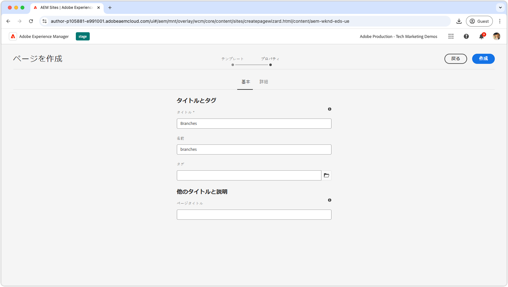
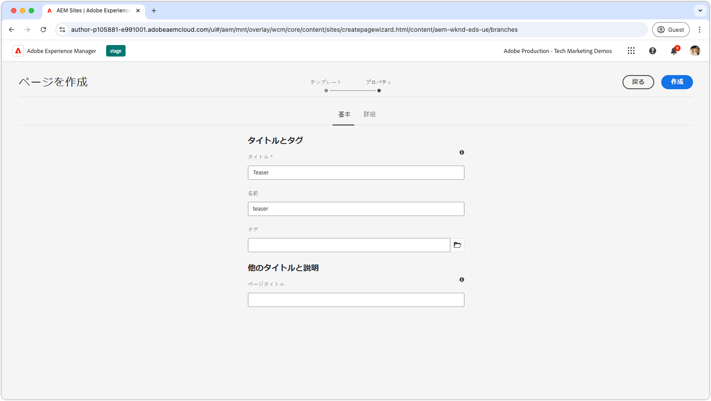
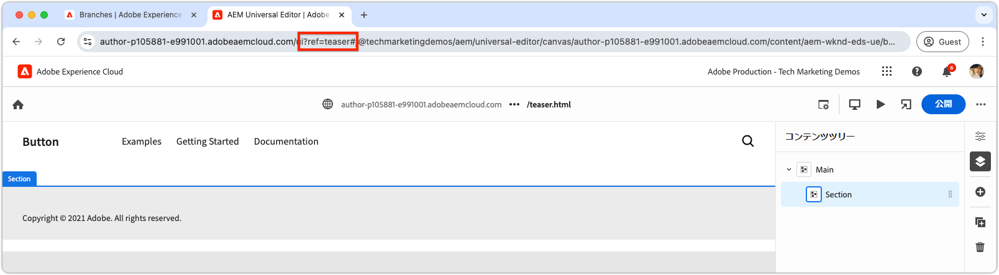
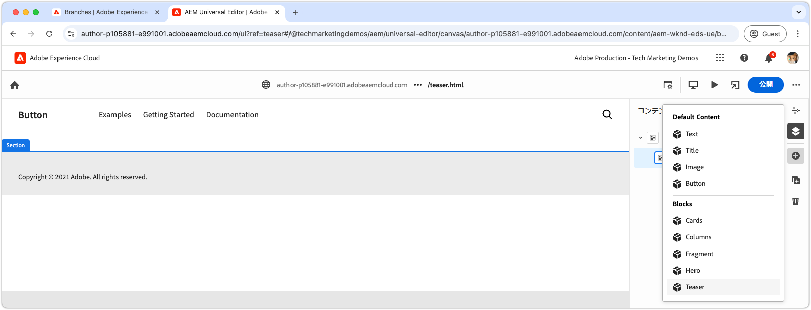
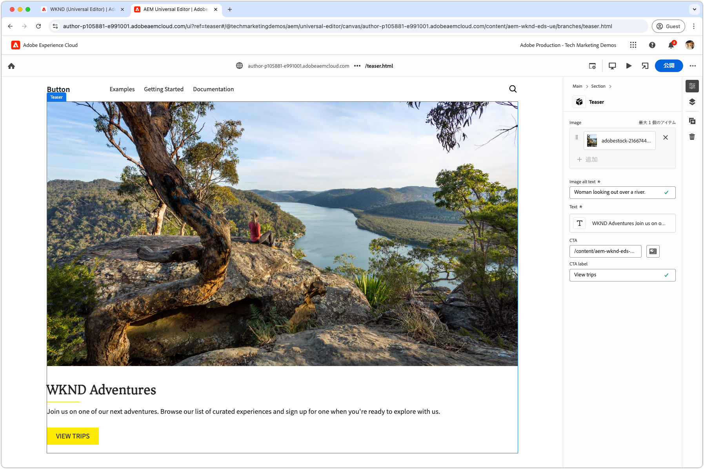
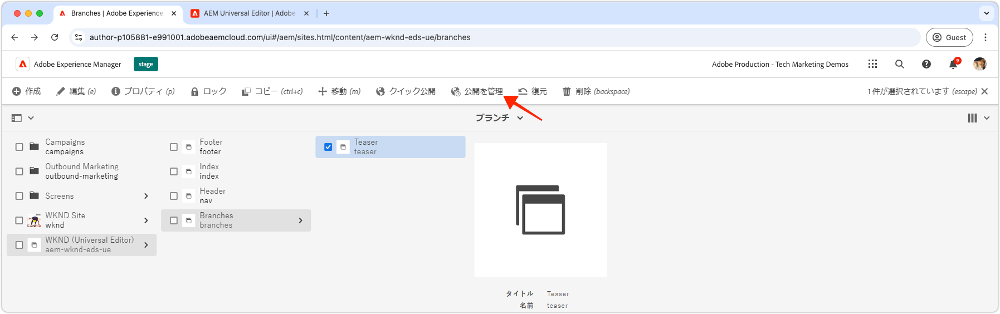

# ブロックのオーサリング

[ ティーザーブロックの JSON](./5-new-block.md) を `teaser` ブランチにプッシュすると、AEM ユニバーサルエディターでブロックが編集可能になります。

開発時のブロックのオーサリングは、次のようないくつかの理由で重要です。

1. ブロックの定義とモデルが正確であることを確認します。
1. これにより、開発者はブロックのセマンティックHTMLを確認でき、開発の基盤となります。
1. これにより、コンテンツとセマンティックHTMLの両方をプレビュー環境にデプロイでき、ブロックの開発を迅速化できます。

## `teaser` ブランチのコードを使用してユニバーサルエディターを開きます

1. AEM オーサーにログインします。
2. **Sites** に移動して、（前の章 [ で作成したサイト（WKND （ユニバーサルエディター） ](./2-new-aem-site.md) を選択します。

   

3. ページを作成または編集して新しいブロックを追加し、コンテキストでローカル開発をサポートできるようにします。 ページはサイト内のどこでも作成できますが、多くの場合、新しい作業ごとに個別のページを作成することをお勧めします。 **ブランチ** という名前の新しい「フォルダー」ページを作成します。 各サブページは、同じ名前の Git ブランチの開発をサポートするために使用されます。

   

4. **ブランチ** ページの下に開発ブランチ名と一致する **ティーザー** という新しいページを作成し、**開く** をクリックしてページを編集します。

   

5. URL に `?ref=teaser` を追加して、`teaser` ブランチからコードを読み込むようにユニバーサルエディターを更新します。 必ずクエリパラメーター **BEFORE** を `#` の記号として追加してください。

   

6. **メイン** の下の最初のセクションを選択し、「**追加**」ボタンをクリックして **ティーザー** ブロックを選択します。

   

7. キャンバスで、新しく追加されたティーザーを選択し、右側またはインライン編集機能を使用してフィールドを作成します。

   

8. オーサリングが完了したら、前のブラウザータブ（AEM Sites管理）に切り替えて「ティーザー」ページを選択し、「**パブリケーションの管理**」をクリックします。次に、「**プレビュー**」を選択して変更内容をプレビュー環境に公開します。 その後、変更内容が web サイトの `aem.page` ドメインに公開されます。
   

9. プレビューに公開する変更が表示されるのを待ってから、[AEM CLI](./3-local-development-environment.md#install-the-aem-cli)[http://localhost:3000/branches/teaser} を使用して Web ページを開き ](http://localhost:3000/branches/teaser) す。

   

これで、作成したティーザーブロックのコンテンツとセマンティックHTMLがプレビュー web サイトで利用できるようになり、ローカル開発環境でAEM CLI を使用して開発する準備が整いました。
