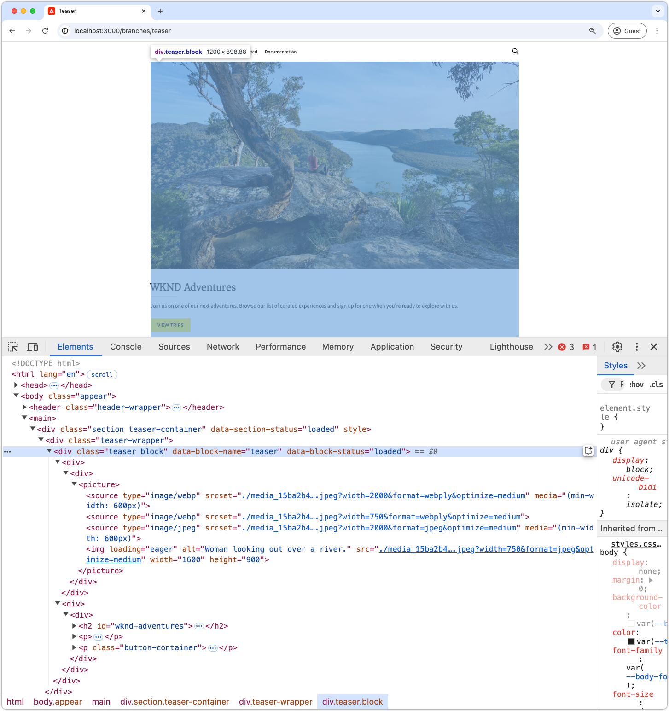

# CSS を使用したブロックの開発

Edge Delivery Services内のブロックは、CSS を使用してスタイル設定されます。 ブロックの CSS ファイルは、ブロックのディレクトリに格納され、ブロックと同じ名前が付けられます。 例えば、`teaser` という名前のブロックの CSS ファイルは、`blocks/teaser/teaser.css` にあります。

理想的には、スタイル設定にブロックに必要なのは CSS のみで、JavaScriptによる DOM の変更や CSS クラスの追加は不要です。 JavaScriptが必要かどうかは、ブロックの [ コンテンツモデリング ](./5-new-block.md#block-model) とその複雑さによって異なります。 必要に応じて、[JavaScriptをブロック ](./7b-block-js-css.md) 追加できます。

CSS のみのアプローチを使用すると、（ほとんど）ベアセマンティックのブロックのHTML要素がターゲットとなり、スタイルが設定されます。

## ブロックHTML

Edge Delivery Services ブロックのスタイルを設定する方法を理解するには、まず、スタイル設定に使用できる DOM を確認します。 DOM は、AEM CLI のローカル開発環境が提供するブロックを調べることで確認できます。 ユニバーサルエディターの DOM は若干異なるので、使用しないでください。

>[!BEGINTABS]

>[!TAB  スタイルに DOM]

次に、スタイル設定のターゲットとなるティーザーブロックの DOM を示します。

Edge Delivery Services JavaScriptによって推測される `<p class="button-container">...` 素として [ 自動的に拡張 ](./4-website-branding.md#inferred-elements) される要素に注意してください。

```html
...
<body>
    <header/>
    <main>
        <div>
            <!-- Start block HTML -->
            <div class="teaser block" data-block-name="teaser" data-block-status="loaded">
                <div>
                    <div>
                        <picture>
                            <source type="image/webp" srcset="./media_15ba2b455e29aca38c1ca653d24c40acaec8a008f.jpeg?width=2000&amp;format=webply&amp;optimize=medium" media="(min-width: 600px)">
                            <source type="image/webp" srcset="./media_15ba2b455e29aca38c1ca653d24c40acaec8a008f.jpeg?width=750&amp;format=webply&amp;optimize=medium">
                            <source type="image/jpeg" srcset="./media_15ba2b455e29aca38c1ca653d24c40acaec8a008f.jpeg?width=2000&amp;format=jpeg&amp;optimize=medium" media="(min-width: 600px)">
                            
                        </picture>
                    </div>
                </div>
                <div>
                    <div>
                        <h2 id="wknd-adventures">WKND Adventures</h2>
                        <p>Join us on one of our next adventures. Browse our list of curated experiences and sign up for one when you're ready to explore with us.</p>
                        <p class="button-container"><a href="/" title="View trips" class="button">View trips</a></p>
                    </div>
                </div>
            </div>     
            <!-- End block HTML -->
        </div>
    </main>
    <footer/>
</body>
...
```

>[!TAB DOM を見つける方法 ]

スタイル設定する DOM を見つけるには、スタイルが設定されていないブロックが含まれているページをローカル開発環境で開き、ブロックを選択して、DOM を調べます。



>[!ENDTABS]

## CSS をブロック

ファイル名としてブロックの名前を使用して、ブロックのフォルダーに新しい CSS ファイルを作成します。 例えば、**ティーザー** ブロックの場合、ファイルは `/blocks/teaser/teaser.css` にあります。

この CSS ファイルは、Edge Delivery ServicesのJavaScriptがページ上でティーザーブロックを表す DOM 要素を検出すると、自動的に読み込まれます。

[!BADGE /blocks/teaser/teaser.css]{type=Neutral tooltip="以下のコードサンプルのファイル名。"}

```css
/* /blocks/teaser/teaser.css */

/* Scope each selector in the block with `.block.teaser` to avoid accidental conflicts outside the block */
.block.teaser {
    animation: teaser-fade-in .6s;
    position: relative;
    width: 1600px;
    max-width: 100vw;
    left: 50%; 
    transform: translateX(-50%);
    height: 500px;
}

/* The image is rendered to the first div in the block */
.block.teaser picture {
    position: absolute;
    z-index: -1;
    inset: 0;
    box-sizing: border-box;
}

.block.teaser picture img {
    object-fit: cover;
    object-position: center;
    width: 100%;
    height: 100%;
}

/** 
The teaser's text is rendered to the second (also the last) div in the block.

These styles are scoped to the second (also the last) div in the block (.block.teaser > div:last-child).

This div order can be used to target different styles to the same semantic elements in the block. 
For example, if the block has two images, we could target the first image with `.block.teaser > div:first-child img`, 
and the second image with `.block.teaser > div:nth-child(2) img`.
**/
.block.teaser > div:last-child {
    position: absolute;
    bottom: 0;
    left: 50%;
    transform: translateX(-50%);
    background: var(--background-color);
    padding: 1.5rem 1.5rem 1rem;
    width: 80vw;
    max-width: 1200px;
}

/** 
The following elements reside within `.block.teaser > div:last-child` and could be scoped as such, for example:

 .block.teaser > div:last-child p { .. }

However since these element can only appear in the second/last div per our block's model, it's unnecessary to add this additional scope.
**/

/* Regardless of the authored heading level, we only want one style the heading */
.block.teaser h1,
.block.teaser h2,
.block.teaser h3,
.block.teaser h4,
.block.teaser h5,
.block.teaser h6 {
    font-size: var(--heading-font-size-xl);
    margin: 0;
}

.block.teaser h1::after,
.block.teaser h2::after,
.block.teaser h3::after,
.block.teaser h4::after,
.block.teaser h5::after,
.block.teaser h6::after {
    border-bottom: 0;
}

.block.teaser p {
    font-size: var(--body-font-size-s);
    margin-bottom: 1rem;
}

/* Add underlines to links in the text */
.block.teaser a:hover {
    text-decoration: underline;
}

/* Add specific spacing to buttons. These button CSS classes are automatically added by Edge Delivery Services. */
.block.teaser .button-container {
    margin: 0;
    padding: 0;
}

.block.teaser .button {
    background-color: var(--primary-color);
    border-radius: 0;
    color: var(--dark-color);
    font-size: var(--body-font-size-xs);
    font-weight: bold;
    padding: 1em 2.5em;
    margin: 0;
    text-transform: uppercase;
}

/** Animations 
    Scope the @keyframes to the block (teaser) to avoid accidental conflicts outside the block

    Global @keyframes can defines in styles/styles.css and used in this file.
**/

@keyframes teaser-fade-in {
    from {
        opacity: 0;
    }

    to {
        opacity: 1;
    }
}
```

## 開発のプレビュー

CSS がコードプロジェクトで記述されているため、AEM CLI のホットリロードで変更内容が反映されるので、CSS によるブロックへの影響を迅速かつ簡単に理解できます。


## コードをリンクする

クリーンで一貫性のあるコードを確実に変更するため、コードを [ 頻繁に lint](./3-local-development-environment.md#linting) します。 リンティングは、問題を早期に発見し、開発全体の時間を短縮するのに役立ちます。 すべてのリンティングの問題が解決されるまで、開発作業を `main` に結合することはできません。

```bash
# ~/Code/aem-wknd-eds-ue

$ npm run lint:css
```

## ユニバーサルエディターでプレビュー

AEM ユニバーサルエディターで変更を表示するには、変更を追加してコミットし、ユニバーサルエディターで使用される Git リポジトリーブランチにプッシュします。 この手順は、ブロックを実装してもオーサリングエクスペリエンスが中断しなかったことを確認するのに役立ちます。

```bash
# ~/Code/aem-wknd-eds-ue

$ git add .
$ git commit -m "Add CSS-only implementation for teaser block"
$ git push origin teaser
```

これで、`?ref=teaser` クエリパラメーターを追加する際に、ユニバーサルエディターで変更をプレビューできます。


