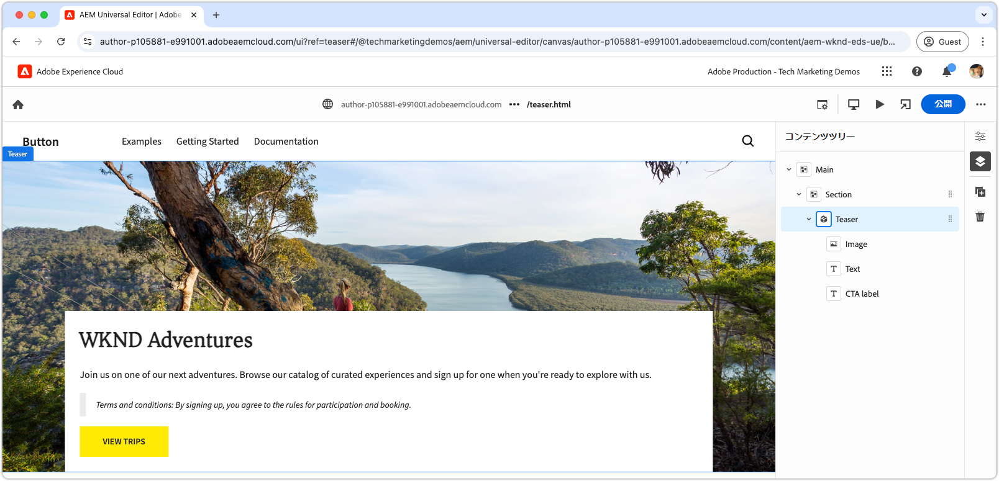

# CSS と JavaScript を使用したブロックの開発

[前の章](./7b-block-js-css.md)では、CSS のみを使用してブロックをスタイル設定する方法について説明しました。ここでは、JavaScript と CSS の両方を使用してブロックを開発することに焦点を当てます。

次の例に、ブロックを 3 つの方法で拡張する方法を示します。

1. カスタム CSS クラスの追加。
1. イベントリスナーを使用した動きの追加。
1. ティーザーのテキストにオプションで含めることができる利用条件の処理。

## 一般的なユースケース

このアプローチは、次のシナリオで特に役立ちます。

- **外部 CSS 管理：**&#x200B;ブロックの CSS が Edge Delivery Services の外部で管理され、HTML 構造と一致していない場合。
- **追加属性：**&#x200B;アクセシビリティの [ARIA](https://developer.mozilla.org/en-US/docs/Web/Accessibility/ARIA) や[マイクロデータ](https://developer.mozilla.org/ja/docs/Web/HTML/Microdata)などの追加属性が必要な場合。
- **JavaScript の機能強化：**&#x200B;イベントリスナーなどのインタラクティブな機能が必要な場合。

この方法はブラウザーネイティブの JavaScript DOM 操作に依存しますが、DOM を変更する場合、特に要素を移動する場合は注意が必要です。このような変更により、ユニバーサルエディターのオーサリングエクスペリエンスが中断される場合があります。理想的には、ブロックの[コンテンツモデル](./5-new-block.md#block-model)は、大規模な DOM 変更の必要性を最小限に抑えるように慎重に設計する必要があります。

## ブロックの HTML

ブロック開発にアプローチするには、まず Edge Delivery Services によって公開される DOM を確認します。構造は JavaScript で強化され、CSS でスタイル設定されます。

>[!BEGINTABS]

>[!TAB 装飾する DOM]

次は、JavaScript と CSS を使用して装飾するターゲットとなるティーザーブロックの DOM です。

```html
...
<body>
    <header/>
    <main>
        <div>
            <!-- Start block HTML -->
            <div class="teaser block" data-block-name="teaser" data-block-status="loaded">
                <div>
                    <div>
                    <picture>
                        <source type="image/webp" srcset="./media_15ba2b455e29aca38c1ca653d24c40acaec8a008f.jpeg?width=2000&amp;format=webply&amp;optimize=medium" media="(min-width: 600px)">
                        <source type="image/webp" srcset="./media_15ba2b455e29aca38c1ca653d24c40acaec8a008f.jpeg?width=750&amp;format=webply&amp;optimize=medium">
                        <source type="image/jpeg" srcset="./media_15ba2b455e29aca38c1ca653d24c40acaec8a008f.jpeg?width=2000&amp;format=jpeg&amp;optimize=medium" media="(min-width: 600px)">
                        
                    </picture>
                    </div>
                </div>
                <div>
                    <div>
                    <h2 id="wknd-adventures">WKND Adventures</h2>
                    <p>Join us on one of our next adventures. Browse our list of curated experiences and sign up for one when you're ready to explore with us.</p>
                    <p class="button-container"><a href="/" title="View trips" class="button">View trips</a></p>
                    </div>
                </div>
            </div>     
            <!-- End block HTML -->
        </div>
    </main>
    <footer/>
</body>
...
```

>[!TAB DOM を見つける方法]

装飾する DOM を見つけるには、ローカル開発環境で装飾されていないブロックを含むページを開き、ブロックを選択して DOM を検査します。


>[!ENDTABS]


## ブロックの JavaScript

ブロックに JavaScript 機能を追加するには、ブロックのディレクトリにブロックと同じ名前の JavaScript ファイル（例：`/blocks/teaser/teaser.js`）を作成します。

JavaScript ファイルでは、デフォルトの関数を書き出す必要があります。

```javascript
export default function decorate(block) { ... }
```

デフォルトの関数は、Edge Delivery Services HTML のブロックを表す DOM 要素／ツリーを取得し、ブロックのレンダリング時に実行されるカスタム JavaScript を含みます。

この例の JavaScript は、主に次の 3 つのアクションを実行します。

1. CTA ボタンにイベントリスナーを追加し、ポインタを合わせる際に画像をズームします。
1. ブロックの要素にセマンティック CSS クラスを追加します。これは、既存の CSS デザインシステムを統合する際に役立ちます。
1. `Terms and conditions:` で始まる段落に特別な CSS クラスを追加します。

[!BADGE /blocks/teaser/teaser.js]{type=Neutral tooltip="以下のコードサンプルのファイル名。"}

```javascript
/* /blocks/teaser/teaser.js */

/**
 * Adds a zoom effect to image using event listeners.
 *
 * When the CTA button is hovered over, the image zooms in.
 *
 * @param {HTMLElement} block represents the block's' DOM tree
 */
function addEventListeners(block) {
  block.querySelector('.button').addEventListener('mouseover', () => {
    block.querySelector('.image').classList.add('zoom');
  });

  block.querySelector('.button').addEventListener('mouseout', () => {
    block.querySelector('.image').classList.remove('zoom');
  });
}

/**
   * Entry point to block's JavaScript.
   * Must be exported as default and accept a block's DOM element.
   * This function is called by the project's style.js, and passed the block's element.
   *
   * @param {HTMLElement} block represents the block's' DOM element/tree
   */
export default function decorate(block) {
  /* This JavaScript makes minor adjustments to the block's DOM */

  // Dress the DOM elements with semantic CSS classes so it's obvious what they are.
  // If needed we could also add ARIA roles and attributes, or add/remove/move DOM elements.

  // Add a class to the first picture element to target it with CSS
  block.querySelector('picture').classList.add('image-wrapper');

  // Use previously applied classes to target new elements
  block.querySelector('.image-wrapper img').classList.add('image');

  // Mark the second/last div as the content area (white, bottom aligned box w/ text and cta)
  block.querySelector(':scope > div:last-child').classList.add('content');

  // Mark the first H1-H6 as a title
  block.querySelector('h1,h2,h3,h4,h5,h6').classList.add('title');

  // Process each paragraph and mark it as text or terms-and-conditions
  block.querySelectorAll('p').forEach((p) => {
    const innerHTML = p.innerHTML?.trim();

    // If the paragraph starts with Terms and conditions: then style it as such
    if (innerHTML?.startsWith("Terms and conditions:")) {
      /* If a paragraph starts with '*', add a special CSS class. */
      p.classList.add('terms-and-conditions');
    }
  });

  // Add event listeners to the block
  addEventListeners(block);
}
```

## ブロックの CSS

[前の章](./7a-block-css.md)で `teaser.css` を作成した場合は、削除するか、`teaser.css.bak` に名前を変更します。この章では、ティーザーブロックに異なる CSS を実装するからです。

ブロックのフォルダーに `teaser.css` ファイルを作成します。このファイルには、ブロックをスタイル設定する CSS コードが含まれます。この CSS コードは、ブロックの要素と、`teaser.js` の JavaScript によって追加された特定のセマンティクス CSS クラスをターゲットとしています。

ベア要素は、直接スタイル設定することも、カスタム適用された CSS クラスを使用してスタイル設定することもできます。より複雑なブロックの場合、セマンティック CSS クラスを適用すると、特に長期間にわたって大規模なチームで作業する場合に、CSS をよりわかりやすく保守しやすくなります。

[ 以前と同様 ](./7a-block-css.md#develop-a-block-with-css)、他のブロックとの競合を避け `.block.teaser` ために、[CSS ネスト ](https://developer.mozilla.org/en-US/docs/Web/CSS/CSS_nesting) を使用して CSS の範囲をスコープに設定します。

[!BADGE /blocks/teaser/teaser.css]{type=Neutral tooltip="以下のコードサンプルのファイル名。"}

```css
/* /blocks/teaser/teaser.css */

/* Scope each selector in the block with `.block.teaser` to avoid accidental conflicts outside the block */
.block.teaser {
    animation: teaser-fade-in 1s;
    position: relative;
    width: 1600px;
    max-width: 100vw;
    left: 50%; 
    transform: translateX(-50%);
    height: 500px;
    overflow: hidden; 

    /* The teaser image */
    .image-wrapper {
        position: absolute;
        z-index: -1;
        inset: 0;
        box-sizing: border-box;
        overflow: hidden; 

        .image {
            object-fit: cover;
            object-position: center;
            width: 100%;
            height: 100%;
            transform: scale(1); 
            transition: transform 0.6s ease-in-out;

            .zoom {
                transform: scale(1.1);
            }            
        }
    }

    /* The teaser text content */
    .content {
        position: absolute;
        bottom: 0;
        left: 50%;
        transform: translateX(-50%);
        background: var(--background-color);
        padding: 1.5rem 1.5rem 1rem;
        width: 80vw;
        max-width: 1200px;
  
        .title {
            font-size: var(--heading-font-size-xl);
            margin: 0;
        }

        .title::after {
            border-bottom: 0;
        }

        p {
            font-size: var(--body-font-size-s);
            margin-bottom: 1rem;
            animation: teaser-fade-in .6s;
        
            &.terms-and-conditions {
                font-size: var(--body-font-size-xs);
                color: var(--secondary-color);
                padding: .5rem 1rem;
                font-style: italic;
                border: solid var(--light-color);
                border-width: 0 0 0 10px;
            }
        }

        /* Add underlines to links in the text */
        a:hover {
            text-decoration: underline;
        }

        /* Add specific spacing to buttons. These button CSS classes are automatically added by Edge Delivery Services. */
        .button-container {
            margin: 0;
            padding: 0;
        
            .button {   
                background-color: var(--primary-color);
                border-radius: 0;
                color: var(--dark-color);
                font-size: var(--body-font-size-xs);
                font-weight: bold;
                padding: 1em 2.5em;
                margin: 0;
                text-transform: uppercase;
            }
        }
    }
}

/** Animations 
    Scope the @keyframes to the block (teaser) to avoid accidental conflicts outside the block

    Global @keyframes can defines in styles/styles.css and used in this file.
**/
@keyframes teaser-fade-in {
    from {
        opacity: 0;
    }

    to {
        opacity: 1;
    }
}
```

## 利用条件の追加

上記の実装では、`Terms and conditions:` というテキストで始まる段落を特別にスタイル設定するサポートが追加されます。この機能を検証するには、ユニバーサルエディターで、ティーザーブロックのテキストコンテンツを更新して利用条件を含めます。

[ブロックのオーサリング](./6-author-block.md)の手順に従って、テキストを編集して最後に&#x200B;**利用条件**&#x200B;の段落を含めます。

```
WKND Adventures

Join us on one of our next adventures. Browse our list of curated experiences and sign up for one when you're ready to explore with us.

Terms and conditions: By signing up, you agree to the rules for participation and booking.
```

段落がローカル開発環境で利用条件のスタイルでレンダリングされることを確認します。これらのコード変更は、ユニバーサルエディターが使用するように設定されている [GitHub の分岐にプッシュ](#preview-in-universal-editor)されるまで、ユニバーサルエディターに反映されません。

## 開発プレビュー

CSS と JavaScript を追加すると、AEM CLI のローカル開発環境によって変更がホットリロードされ、コードがブロックに与える影響をすばやく簡単に視覚化できます。CTA にポインタを合わせて、ティーザーの画像がズームインおよびズームアウトされることを確認します。


## コードのリント

コードの変更をクリーンで一貫性のある状態に保つには、[頻繁にリント](./3-local-development-environment.md#linting)します。定期的なリンティングを行うと、問題を早期に発見し、全体的な開発時間を短縮できます。すべてのリンティングの問題が解決されるまで、開発作業を `main` 分岐に結合できません。

```bash
# ~/Code/aem-wknd-eds-ue

$ npm run lint
```

## ユニバーサルエディターでのプレビュー

AEM のユニバーサルエディターで変更を表示するには、ユニバーサルエディターで使用される Git リポジトリ分岐に変更を追加、コミット、プッシュします。これにより、ブロックの実装によってオーサリングエクスペリエンスが中断されなくなります。

```bash
# ~/Code/aem-wknd-eds-ue

$ git add .
$ git commit -m "CSS and JavaScript implementation for teaser block"
$ git push origin teaser
```

これで、`?ref=teaser` クエリパラメーターを追加する際に、ユニバーサルエディターで変更をプレビューできます。


