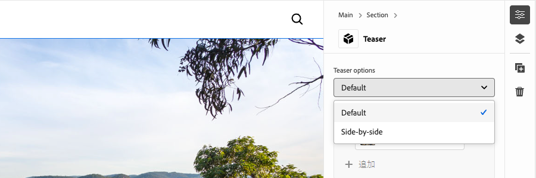
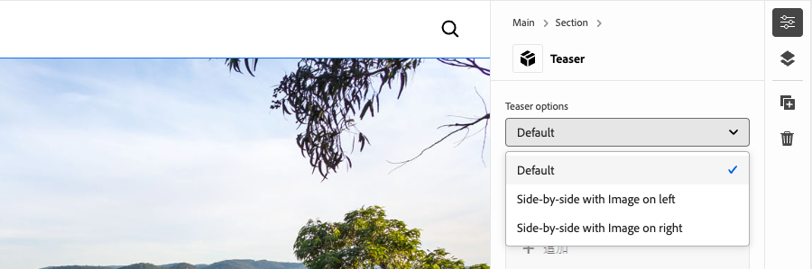
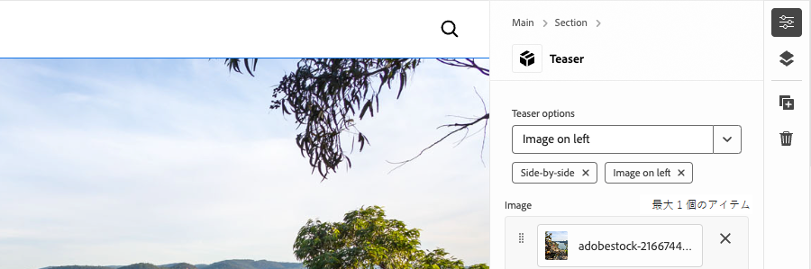
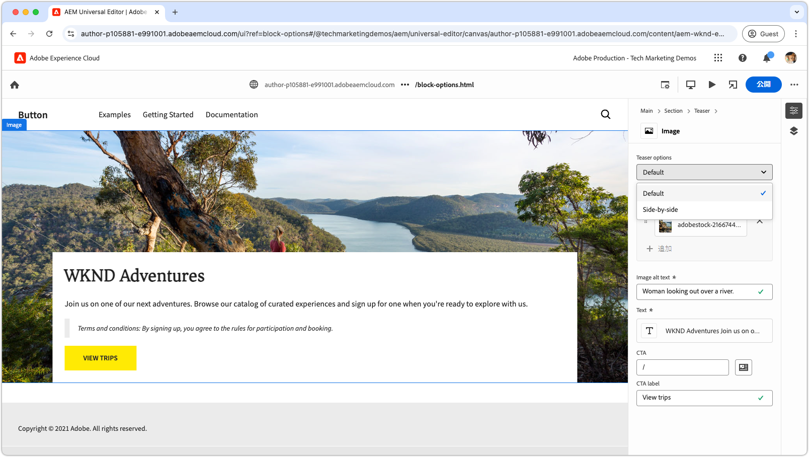
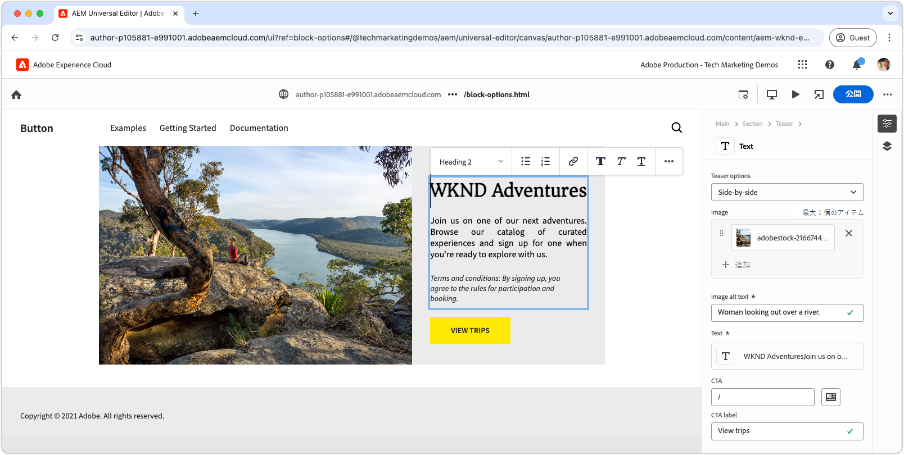

# オプションを使用したブロックの開発

このチュートリアルは、Edge Delivery Services とユニバーサルエディターのチュートリアルに基づいて作成しています。ここでは、ブロックにブロックオプションを追加するプロセスについて説明します。ブロックオプションを定義することで、ブロックの外観と機能をカスタマイズし、様々なコンテンツのニーズに合わせて異なるバリエーションを実現できます。これにより、サイトのデザインシステム内での柔軟性と再利用性が向上します。

{align="center"}

このチュートリアルでは、ティーザーブロックにブロックオプションを追加して、作成者が 2 つの表示オプション（「**デフォルト**」と「**並べて表示**」）から選択できるようにします。「**デフォルト**」オプションでは、画像がテキストの上と背景に表示され、「**並べて表示**」オプションでは、画像とテキストが並べて表示されます。

## 一般的なユースケース

**Edge Delivery Services** および&#x200B;**ユニバーサルエディター**&#x200B;の開発で&#x200B;**ブロックオプション**&#x200B;を使用する一般的なユースケースには、次が含まれます（ただし、これらに限定されません）。

1. **レイアウトのバリエーション：**&#x200B;レイアウトを簡単に切り替えられます。例えば、水平と垂直、グリッドとリストなどです。
2. **スタイル設定のバリエーション：**&#x200B;テーマや視覚的な処理を簡単に切り替えられます。例えば、ライトモードとダークモード、大きいテキストと小さいテキストなどです。
3. **コンテンツの表示コントロール：**&#x200B;要素の表示を切り替えたり、コンテンツスタイル（コンパクトと詳細）を切り替えたりします。

これらのオプションにより、動的で適応性のあるブロックを作成する際の柔軟性と効率性が向上します。

このチュートリアルでは、ティーザーブロックを「**デフォルト**」と「**並べて表示**」の 2 つの異なるレイアウトで表示できるレイアウトのバリエーションのユースケースを示します。

## ブロックモデル

ティーザーブロックにブロックオプションを追加するには、`/block/teaser/_teaser.json` にある JSON フラグメントを開き、モデル定義に新しいフィールドを追加します。このフィールドでは、`name` プロパティを `classes` に設定します。これは、ブロックの Edge Delivery Services HTML に適用されるブロックオプションを保存するのに AEM で使用する保護されたフィールドです。

### フィールドの設定

以下のタブでは、単一の CSS クラスを使用した単一選択、複数の CSS クラスを使用した単一選択、複数の CSS クラスを使用した複数選択など、ブロックモデルでブロックオプションを設定する様々な方法について説明します。このチュートリアルでは、**単一の CSS クラスを使用した選択**&#x200B;で使用される[よりシンプルなアプローチを実装](#field-configuration-for-this-tutorial)します。

>[!BEGINTABS]

>[!TAB 単一の CSS クラスを使用した選択]

このチュートリアルでは、`select`（ドロップダウン）入力タイプを使用して作成者が単一のブロックオプションを選択し、単一の対応する CSS クラスとして適用する方法について説明します。

{align="center"}

#### ブロックモデル

「**デフォルト**」オプションでは、空の文字列（`""`）で表示され、「**並べて表示**」オプションでは、`"side-by-side"` が使用されます。オプションの&#x200B;**名前**&#x200B;と&#x200B;**値**&#x200B;は同じにする必要はありませんが、**値**&#x200B;によってブロックの HTML に適用される CSS クラスが決定されます。例えば、「**並べて表示**」オプションの値は、`side-by-side` ではなく `layout-10` に指定できます。ただし、オプション値の明確さと一貫性を確保することを目的に、CSS クラスには意味のある名前を使用することをお勧めします。

[!BADGE /blocks/teaser/_teaser.json]{type=Neutral tooltip="以下のコードサンプルのファイル名。"}

```json{highlight="4,8,9-18"}
...
"fields": [
    {
        "component": "select",
        "name": "classes",
        "value": "",
        "label": "Teaser options",
        "valueType": "string",
        "options": [
            {
                "name": "Default",
                "value": ""
            },
            {
                "name": "Side-by-side",
                "value": "side-by-side"
            }
        ]
    }
]
...
```

#### ブロックの HTML

作成者が次のオプションを選択すると、対応する値が CSS クラスとしてブロックの HTML に追加されます。

- 「**デフォルト**」を選択した場合：

  ```html
  <div class="block teaser">
      <!-- Block content here -->
  </div>
  ```

- 「**並べて表示**」を選択した場合：

  ```html
  <div class="block teaser side-by-side">
      <!-- Block content here -->
  </div>
  ```

これにより、選択したオープンに応じて、異なるスタイル設定と条件付き JavaScript を適用できます。


>[!TAB 複数の CSS クラスを使用した選択]

**このチュートリアルでは、このアプローチは使用しませんが、代替方法と高度なブロックオプションについて説明します。**

`select` 入力タイプを使用すると、作成者は単一のブロックオプションを選択し、オプションで複数の CSS クラスにマッピングできます。これを行うには、CSS クラスをスペース区切り値としてリストします。

{align="center"}

#### ブロックモデル

例えば、「**並べて表示**」オプションでは、画像が左側（`side-by-side left`）または右側（`side-by-side right`）に表示されるバリエーションをサポートできます。

[!BADGE /blocks/teaser/_teaser.json]{type=Neutral tooltip="以下のコードサンプルのファイル名。"}

```json{highlight="4,8,9-21"}
...
"fields": [
    {
        "component": "select",
        "name": "classes",
        "value": "",
        "label": "Teaser options",
        "valueType": "string",
        "options": [
            {
                "name": "Default",
                "value": ""
            },
            {
                "name": "Side-by-side with Image on left",
                "value": "side-by-side left"
            },
            {
                "name": "Side-by-side with Image on right",
                "value": "side-by-side right"
            }
        ]
    }
]
...
```

#### ブロックの HTML

作成者が次のオプションを選択すると、対応する値がブロックの HTML 内のスペース区切りセットの CSS クラスとして適用されます。

- 「**デフォルト**」を選択した場合：

  ```html
  <div class="block teaser">
      <!-- Block content here -->
  </div>
  ```

- 「**画像を左に並べて表示**」を選択した場合：

  ```html
  <div class="block teaser side-by-side left">
      <!-- Block content here -->
  </div>
  ```

- 「**画像を右に並べて表示**」を選択した場合：

  ```html
  <div class="block teaser side-by-side right">
      <!-- Block content here -->
  </div>
  ```

これにより、選択したオプションに応じて、異なるスタイル設定と条件付き JavaScript を適用できます。


>[!TAB 複数の CSS クラスを使用した複数選択]

**このチュートリアルでは、このアプローチは使用しませんが、代替方法と高度なブロックオプションについて説明します。**

`"component": "multiselect"` の入力タイプを使用すると、作成者は複数のオプションを同時に選択できます。これにより、複数のデザイン選択を組み合わせて、ブロックの外観を複雑に並べ替えることができます。

{align="center"}

### ブロックモデル

例えば、「**並べて表示**」、「**画像を左に**」、「**画像を右に**」では、画像が左側（`side-by-side left`）または右側（`side-by-side right`）に配置されるバリエーションをサポートできます。

[!BADGE /blocks/teaser/_teaser.json]{type=Neutral tooltip="以下のコードサンプルのファイル名。"}

```json{highlight="4,6,8,10-21"}
...
"fields": [
    {
        "component": "multiselect",
        "name": "classes",
        "value": [],
        "label": "Teaser options",
        "valueType": "array",
        "options": [
            {
                "name": "Side-by-side",
                "value": "side-by-side"
            },
            {
                "name": "Image on left",
                "value": "left"
            },
            {
                "name": "Image on right",
                "value": "right"
            }
        ]
    }
]
...
```

#### ブロックの HTML

作成者が次の複数オプションを選択すると、対応する値がブロックの HTML 内のスペース区切りの CSS クラスとして適用されます。

- 「**並べて表示**」および「**画像を左に**」を選択した場合：

  ```html{highlight="1"}
  <div class="block teaser side-by-side left">
      <!-- Block content here -->
  </div>
  ```

- 「**並べて表示**」および「**画像を右に**」を選択した場合：

  ```html{highlight="1"}
  <div class="block teaser side-by-side right">
      <!-- Block content here -->
  </div>
  ```

複数選択には柔軟性がありますが、デザインの並べ替えの管理が複雑になります。制限がないと、選択内容が競合して、破損したエクスペリエンスやオフブランドのエクスペリエンスが生じる可能性があります。

例：

- 「**並べて表示**」を選択せずに「**画像を左に**」または「**画像を右に**」を選択すると、暗黙的に「**デフォルト**」が適用され、画像が常に背景として設定されるので、左揃えと右揃えは無関係になります。
- 「**画像を左に**」と「**画像を右に**」の両方を選択すると矛盾が生じます。
- 「**画像を左に**」または「**画像を右に**」を指定せずに「**並べて表示**」を選択すると、画像の位置が指定されていないので、曖昧と見なされる場合があります。

複数選択を使用する際に問題が発生したり、作成者が混乱したりしないようにするには、オプションを適切に計画し、すべての並べ替えをテストする必要があります。複数選択は、レイアウトを変更する選択肢ではなく、「大きい」や「ハイライト表示」などのシンプルで競合しない機能強化に最適です。


>[!TAB 「デフォルト」オプション]

**このチュートリアルでは、このアプローチは使用しませんが、代替方法と高度なブロックオプションについて説明します。**

ユニバーサルエディターでページに新しいブロックインスタンスを追加する際に、ブロックオプションをデフォルトとして設定できます。これを行うには、[ブロックの定義](../5-new-block.md#block-definition)で `classes` プロパティのデフォルト値を設定します。

#### ブロックの定義

次の例では、`classes` フィールドの `value` プロパティを `side-by-side` に割り当てることで、デフォルトのオプションが「**並べて表示**」に設定されています。ブロックモデルの対応するブロックオプション入力はオプションです。

また、同じブロックに対して、それぞれ異なる名前とクラスを持つ複数のエントリを定義することもできます。これにより、ユニバーサルエディターでは、それぞれ特定のブロックオプションが事前設定された個別のブロックエントリを表示できます。これらはエディターでは個別のブロックとして表示されますが、コードベースには、選択したオプションに基づいて動的にレンダリングされる単一のブロックが含まれています。

[!BADGE /blocks/teaser/_teaser.json]{type=Neutral tooltip="以下のコードサンプルのファイル名。"}

```json{highlight="12"}
{
    "definitions": [{
      "title": "Teaser",
      "id": "teaser",
      "plugins": {
        "xwalk": {
          "page": {
            "resourceType": "core/franklin/components/block/v1/block",
            "template": {
              "name": "Teaser",
              "model": "teaser",
              "classes": "side-by-side",
              "textContent_text": "<h2>Enter a title</h2><p>...and body text here!</p>",
              "textContent_cta": "/",
              "textContent_ctaText": "Click me!"
            }
          }
        }
      }
    }],
    "models": [... from previous section ...],
    "filters": []
}
```

>[!ENDTABS]


### このチュートリアルのフィールドの設定


このチュートリアルでは、上記の最初のタブで説明した単一の CSS クラスを使用した選択アプローチを使用します。これにより、2 つの個別のブロックオプション（「**デフォルト**」と「**並べて表示**」）が可能になります。

ブロックの JSON フラグメント内のモデル定義に、ブロックオプション用の単一の選択フィールドを追加します。このフィールドでは、作成者はデフォルトのレイアウトと並べて表示のレイアウトを選択できます。

[!BADGE /blocks/teaser/_teaser.json]{type=Neutral tooltip="以下のコードサンプルのファイル名。"}

```json{highlight="7-24"}
{
    "definitions": [...],
    "models": [
        {
            "id": "teaser", 
            "fields": [
                {
                    "component": "select",
                    "name": "classes",
                    "value": "",
                    "label": "Teaser options",
                    "description": "",
                    "valueType": "string",
                    "options": [
                        {
                            "name": "Default",
                            "value": ""
                        },
                        {
                            "name": "Side-by-side",
                            "value": "side-by-side"
                        }
                    ]
                },
                {
                    "component": "reference",
                    "valueType": "string",
                    "name": "image",
                    "label": "Image",
                    "multi": false
                },
                {
                    "component": "text",
                    "valueType": "string",
                    "name": "imageAlt",
                    "label": "Image alt text",
                    "required": true
                },
                {
                    "component": "richtext",
                    "name": "textContent_text",
                    "label": "Text",
                    "valueType": "string",
                    "required": true
                },
                {
                    "component": "aem-content",
                    "name": "textContent_cta",
                    "label": "CTA",
                    "valueType": "string"
                },
                {
                    "component": "text",
                    "name": "textContent_ctaText",
                    "label": "CTA label",
                    "valueType": "string"
                }
            ]
        }
    ],
    "filters": []
}
```

## ユニバーサルエディターの更新ブロック

更新されたブロックオプション入力をユニバーサルエディターで使用できるようにするには、JSON コードの変更を GitHub にデプロイし、新しいページを作成して、「**並べて表示**」オプションを使用してティーザーブロックを追加して作成し、ページを公開してプレビューします。公開したら、コーディングのローカル開発環境にページを読み込みます。

### GitHub への変更のプッシュ

更新されたブロックオプション入力をユニバーサルエディターで使用してブロックオプションを設定し、結果として得られる HTML に対して開発できるようにするには、プロジェクトをリントし、変更を GitHub 分岐（この場合は、`block-options` 分岐）にプッシュする必要があります。

```bash
# ~/Code/aem-wknd-eds-ue

# Lint the changes to catch any syntax errors
$ npm run lint 

$ git add .
$ git commit -m "Add Teaser block option to JSON file so it is available in Universal Editor"
$ git push origin teaser
```

### テストページの作成

AEM オーサーサービスで、開発用のティーザーブロックを追加する新しいページを作成します。[Edge Delivery Services およびユニバーサルエディター開発者向けチュートリアル](../0-overview.md)の[ブロックのオーサリング](../6-author-block.md)の章の規則に従って、`branches` ページの下にテストページを作成し、作業中の Git 分岐にちなんで名前を付けます（この場合は、`block-options`）。

### ブロックのオーサリング

ユニバーサルエディターで新しい&#x200B;**ブロックオプション**&#x200B;ページを編集し、**ティーザー**&#x200B;ブロックを追加します。`block-options` GitHub 分岐のコードを使用してページを読み込むには、URL にクエリパラメーター `?ref=block-options` を追加します。

ブロックダイアログに、「**デフォルト**」と「**並べて表示**」の選択を含む&#x200B;**ティーザーオプション**&#x200B;ドロップダウンが含まれるようになりました。「**並べて表示**」を選択し、残りのコンテンツのオーサリングを完了します。

{align="center"}

オプションで、**ティーザー**&#x200B;ブロックを 2 つ追加します。1 つは「**デフォルト**」に設定し、もう 1 つは「**並べて表示**」に設定します。これにより、開発中に両方のオプションを並べてプレビューでき、「**並べて表示**」を実装しても「**デフォルト**」オプションに影響を与えないことが確保されます。

### プレビューへの公開

ティーザーブロックをページに追加したら、「**公開**」ボタンを使用し、ユニバーサルエディターで&#x200B;**プレビュー**&#x200B;に公開することを選択して、[プレビューにページを公開](../6-author-block.md)します。

## ブロックの HTML

ブロック開発を開始するには、まず Edge Delivery Services プレビューによって公開される DOM 構造を確認します。DOM は JavaScript で強化され、CSS でスタイル設定され、ブロックの作成とカスタマイズの基盤を提供します。

>[!BEGINTABS]

>[!TAB 装飾する DOM]

次は、JavaScript と CSS を使用して装飾するターゲットとなる、「**並べて表示**」ブロックオプションが選択されたティーザーブロックの DOM です。

```html{highlight="7"}
...
<body>
    <header/>
    <main>
        <div>
            <!-- Start block HTML -->
            <div class="teaser block side-by-side" data-block-name="teaser" data-block-status="loaded">
                <div>
                    <div>
                    <picture>
                        <source type="image/webp" srcset="./media_15ba2b455e29aca38c1ca653d24c40acaec8a008f.jpeg?width=2000&amp;format=webply&amp;optimize=medium" media="(min-width: 600px)">
                        <source type="image/webp" srcset="./media_15ba2b455e29aca38c1ca653d24c40acaec8a008f.jpeg?width=750&amp;format=webply&amp;optimize=medium">
                        <source type="image/jpeg" srcset="./media_15ba2b455e29aca38c1ca653d24c40acaec8a008f.jpeg?width=2000&amp;format=jpeg&amp;optimize=medium" media="(min-width: 600px)">
                        
                    </picture>
                    </div>
                </div>
                <div>
                    <div>
                    <h2 id="wknd-adventures">WKND Adventures</h2>
                    <p>Join us on one of our next adventures. Browse our list of curated experiences and sign up for one when you're ready to explore with us.</p>
                    <p>Terms and conditions: By signing up, you agree to the rules for participation and booking.</p>
                    <p class="button-container"><a href="/" title="View trips" class="button">View trips</a></p>
                    </div>
                </div>
            </div>     
            <!-- End block HTML -->
        </div>
    </main>
    <footer/>
</body>
...
```

>[!TAB DOM を見つける方法]

装飾する DOM を見つけるには、ローカル開発環境でブロックを含むページを開き、web ブラウザーの開発者ツールを使用してブロックを選択して DOM を検査します。これにより、装飾する関連要素を識別できます。

{align="center"}

>[!ENDTABS]

## ブロックの CSS

「**並べて表示**」オプションに特定の CSS スタイルを追加するには、`blocks/teaser/teaser.css` を編集します。このファイルには、ブロックのデフォルトの CSS が含まれます。

「**並べて表示**」オプションのスタイルを変更するには、`side-by-side` クラスで設定されたティーザーブロックをターゲットにする、範囲指定された新しい CSS ルールを `teaser.css` ファイルに追加します。

```css
.block.teaser.side-by-side { ... }
```

または、より簡潔なバージョンとして CSS ネストを使用することもできます。

```css
.block.teaser {
    ... Default teaser block styles ...

    &.side-by-side {
        ... Side-by-side teaser block styles ...
    }
}
```

`&.side-by-side` ルール内で、`side-by-side` クラスが適用された際にブロックをスタイル設定するために必要な CSS プロパティを追加します。

一般的なアプローチは、共有セレクターに `all: initial` を適用してデフォルトのスタイルをリセットし、次に `side-by-side` バリアントに必要なスタイルを追加することです。ほとんどのスタイルがオプション間で共有されている場合は、特定のプロパティを上書きする方が簡単になる可能性があります。ただし、複数のセレクターを変更する必要がある場合は、すべてのスタイルをリセットし、必要なスタイルのみを再適用すると、コードがより明確でメンテナンスしやすくなる場合があります。
[!BADGE /blocks/teaser/teaser.css]{type=Neutral tooltip="以下のコードサンプルのファイル名。"}

```css
/* /blocks/teaser/teaser.css */

/* Scope each selector in the block with `.block.teaser` to avoid accidental conflicts outside the block */
.block.teaser {
    animation: teaser-fade-in 1s;
    position: relative;
    width: 1600px;
    max-width: 100vw;
    left: 50%; 
    transform: translateX(-50%);
    height: 500px;
    overflow: hidden; 


    /* The teaser image */
    .image-wrapper {
        position: absolute;
        z-index: -1;
        inset: 0;
        box-sizing: border-box;
        overflow: hidden; 

        .image {
            object-fit: cover;
            object-position: center;
            width: 100%;
            height: 100%;
            transform: scale(1); 
            transition: transform 0.6s ease-in-out;

            .zoom {
                transform: scale(1.1);
            }            
        }
    }

    /* The teaser text content */
    .content {
        position: absolute;
        bottom: 0;
        left: 50%;
        transform: translateX(-50%);
        background: var(--background-color);
        padding: 1.5rem 1.5rem 1rem;
        width: 80vw;
        max-width: 1200px;
  
        .title {
            font-size: var(--heading-font-size-xl);
            margin: 0;
        }

        .title::after {
            border-bottom: 0;
        }

        p {
            font-size: var(--body-font-size-s);
            margin-bottom: 1rem;
            animation: teaser-fade-in .6s;
        }

        p.terms-and-conditions {
            font-size: var(--body-font-size-xs);
            color: var(--secondary-color);
            padding: .5rem 1rem;
            font-style: italic;
            border: solid var(--light-color);
            border-width: 0 0 0 10px;
        }

        /* Add underlines to links in the text */
        a:hover {
            text-decoration: underline;
        }

        /* Add specific spacing to buttons. These button CSS classes are automatically added by Edge Delivery Services. */
        .button-container {
            margin: 0;
            padding: 0;        

            .button {   
                background-color: var(--primary-color);
                border-radius: 0;
                color: var(--dark-color);
                font-size: var(--body-font-size-xs);
                font-weight: bold;
                padding: 1em 2.5em;
                margin: 0;
                text-transform: uppercase;
            }
        }
    }

    /**
    *  Add styling for the side-by-side variant 
    **/

    /* This evaluates to .block.teaser.side-by-side */
    &.side-by-side {    
        /* Since this default teaser option doesn't have a style (such as `.default`), we use `all: initial` to reset styles rather than overriding individual styles. */
        all: initial;
        display: flex;
        margin: auto;
        max-width: 900px;

        .image-wrapper {
            all: initial;
            flex: 2;
            overflow: hidden;                 
            
            * {
                height: 100%;
            }        

            .image {
                object-fit: cover;
                object-position: center;
                width: 100%;
                height: 100%;
                transform: scale(1); 
                transition: transform 0.6s ease-in-out;                

                &.zoom {
                    /* This option has a different zoom level than the default */
                    transform: scale(1.5);
                }
            }
        }

        .content {
            all: initial;
            flex: 1;
            background-color: var(--light-color);
            padding: 3.5em 2em 2em;
            font-size: var(--body-font-size-s);
            font-family: var(--body-font-family);
            text-align: justify;
            text-justify: newspaper;
            hyphens: auto;

            p.terms-and-conditions {
                border: solid var(--text-color);
                border-width: 0;
                padding-left: 0;
                text-align: left;
            }
        }

        /* Media query for mobile devices */
        @media (width <= 900px) {
            flex-direction: column; /* Stack elements vertically on mobile */
        }
    }
}

/** Animations 
    Scope the @keyframes to the block (teaser) to avoid accidental conflicts outside the block

    Global @keyframes can defines in styles/styles.css and used in this file.
**/
@keyframes teaser-fade-in {
    from {
        opacity: 0;
    }

    to {
        opacity: 1;
    }
}
```


## ブロックの JavaScript

ブロック要素に適用されたクラスを確認することで、ブロックのアクティブなオプションを簡単に識別できます。この例では、アクティブなオプションに応じて、`.image-wrapper` スタイルが適用される場所を調整する必要があります。

`getOptions` 関数は、`block` と `teaser` を除く、ブロックに適用されたクラスの配列を返します（すべてのブロックには `block` クラスがあり、すべてのティーザーブロックには `teaser` クラスがあるからです）。配列内の残りのクラスは、アクティブなオプションを示します。配列が空の場合は、デフォルトのオプションが適用されます。

```javascript
function getOptions(block) {
  // Get the block's classes, excluding 'block' and 'teaser'; anything remaining is a block option.
  return [...block.classList].filter((c) => !['block', 'teaser'].includes(c));
}
```

このオプションリストを使用すると、ブロックの JavaScript でカスタムロジックを条件付きで実行できます。

```javascript
if (getOptions(block).includes('side-by-side')) {
  /* For side-by-side teaser, add the image-wrapper to a higher-level div to support CSS */
  block.querySelector(':scope > div:first-child').classList.add('image-wrapper');
} else if (!getOptions(block)) {
  /* For the default option, add the image-wrapper to the picture element to support CSS */
  block.querySelector('picture').classList.add('image-wrapper');
}
```

「デフォルト」と「並べて表示」の両方のオプションを備えたティーザーブロックの完全に更新された JavaScript ファイルを次に示します。

[!BADGE /blocks/teaser/teaser.js]{type=Neutral tooltip="以下のコードサンプルのファイル名。"}

```javascript
/* /blocks/teaser/teaser.js */

/**
 * Block options are applied as classes to the block's DOM element
 * alongside the `block` and `<block-name>` classes.
 *
 * @param {HTMLElement} block represents the block's DOM element/tree
 */
function getOptions(block) {
  // Get the block's classes, excluding 'block' and 'teaser'.
  return [...block.classList].filter((c) => !['block', 'teaser'].includes(c));
}

/**
 * Adds a zoom effect to the image using event listeners.
 *
 * When the CTA button is hovered over, the image zooms in.
 *
 * @param {HTMLElement} block represents the block's DOM tree
 */
function addEventListeners(block) {
  block.querySelector('.button').addEventListener('mouseover', () => {
    block.querySelector('.image').classList.add('zoom');
  });

  block.querySelector('.button').addEventListener('mouseout', () => {
    block.querySelector('.image').classList.remove('zoom');
  });
}

/**
 * Entry point to the block's JavaScript.
 * Must be exported as default and accept a block's DOM element.
 * This function is called by the project's style.js, passing the block's element.
 *
 * @param {HTMLElement} block represents the block's DOM element/tree
 */
export default function decorate(block) {
  /* Common treatments for all options */
  block.querySelector(':scope > div:last-child').classList.add('content');
  block.querySelector('h1,h2,h3,h4,h5,h6').classList.add('title');
  block.querySelector('img').classList.add('image');

  // Process each paragraph and mark it as text or terms-and-conditions
  block.querySelectorAll('p').forEach((p) => {
    const innerHTML = p.innerHTML?.trim();
    if (innerHTML?.startsWith('Terms and conditions:')) {
      p.classList.add('terms-and-conditions');
    }
  });

  /* Conditional treatments for specific options */
  if (getOptions(block).includes('side-by-side')) {
    /* For side-by-side teaser, add the image-wrapper to a higher-level div to support CSS */
    block.querySelector(':scope > div:first-child').classList.add('image-wrapper');
  } else if (!getOptions(block)) {
    /* For the default option, add the image-wrapper to the picture element to support CSS */
    block.querySelector('picture').classList.add('image-wrapper');
  }

  addEventListeners(block);
}
```

## 開発プレビュー

CSS と JavaScript を追加すると、AEM CLI のローカル開発環境によって変更がホットリロードされ、コードがブロックに与える影響をすばやく簡単に視覚化できます。CTA にポインタを合わせて、ティーザーの画像がズームインおよびズームアウトされることを確認します。


## コードのリント

コードの変更をクリーンで一貫性のある状態に保つには、[頻繁にリント](../3-local-development-environment.md#linting)します。定期的なリンティングを行うと、問題を早期に発見し、全体的な開発時間を短縮できます。すべてのリンティングの問題が解決されるまで、開発作業を `main` 分岐に結合できません。

```bash
# ~/Code/aem-wknd-eds-ue

$ npm run lint
```

## ユニバーサルエディターでのプレビュー

AEM のユニバーサルエディターで変更を表示するには、ユニバーサルエディターで使用される Git リポジトリ分岐に変更を追加、コミット、プッシュします。これにより、ブロックの実装によってオーサリングエクスペリエンスが中断されなくなります。

```bash
# ~/Code/aem-wknd-eds-ue

$ git add .
$ git commit -m "CSS and JavaScript implementation for Teaser block option Side-by-side"
# JSON files are compiled automatically and added to the commit via a Husky pre-commit hook
$ git push origin block-options
```

これで、`?ref=block-options` クエリパラメーターを使用する際に、ユニバーサルエディターに変更が表示されます。

{align="center"}


## おめでとうございます。

これで、Edge Delivery Services とユニバーサルエディターのブロックオプションについて探索し、より柔軟にコンテンツ編集をカスタマイズおよび効率化するツールを使用できるようになりました。効率を向上させ、一貫性を維持することを目的に、プロジェクトでこれらのオプションの適用を開始します。

その他のベストプラクティスと高度なテクニックについて詳しくは、[ユニバーサルエディターのドキュメント](https://experienceleague.adobe.com/ja/docs/experience-manager-cloud-service/content/edge-delivery/wysiwyg-authoring/create-block#block-options)を参照してください。
