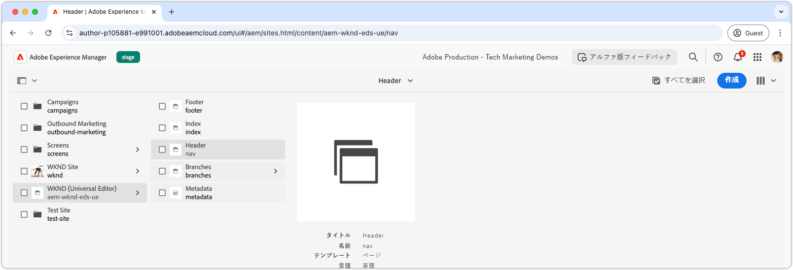
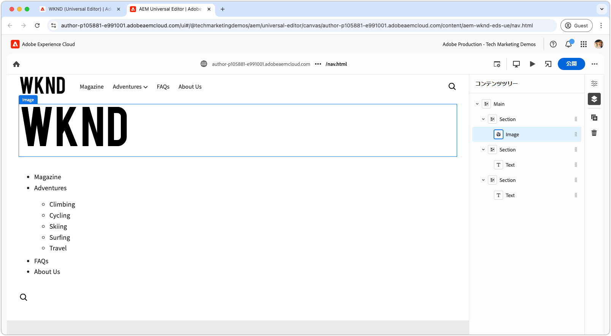
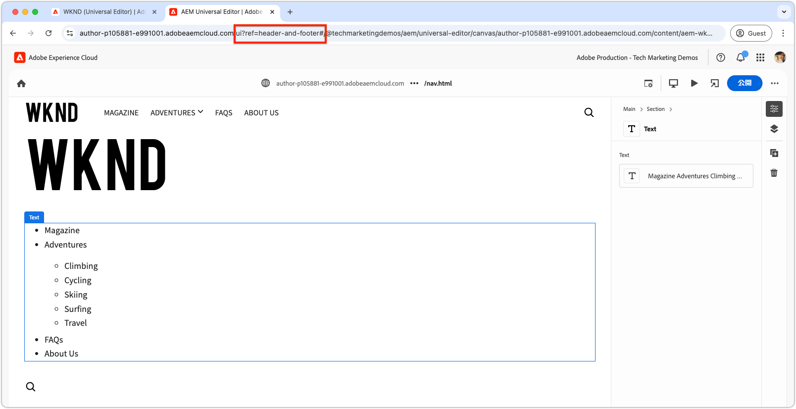
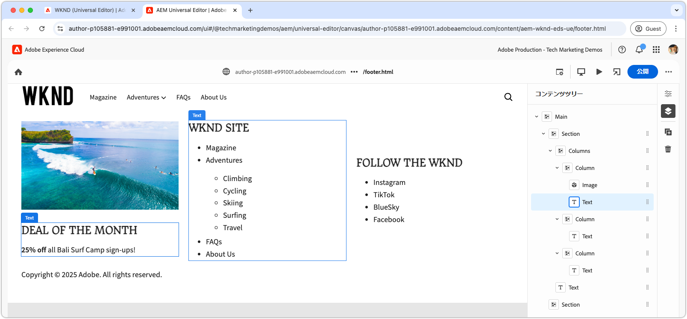

# ヘッダーとフッターの開発

{align="center"}

ヘッダーとフッターは、HTML `<header>` および `<footer>` 要素に直接連結されるので、Edge Delivery Services（EDS）において独特の役割を果たします。 通常のページコンテンツとは異なり、ページは個別に管理され、ページキャッシュ全体をパージしなくても独立して更新できます。 実装はコードプロジェクト内で `blocks/header` および `blocks/footer` の下のブロックとして存在しますが、作成者は、任意のブロックの組み合わせを含めることができる専用のAEM ページを通じてコンテンツを編集できます。

## ヘッダーブロック

{align="center"}

ヘッダーは、Edge Delivery Services HTML `<header>` 要素にバインドされる特別なブロックです。
`<header>` 要素は空で配信され、XHR （AJAX）を介して別のAEM ページに入力されます。
これにより、ヘッダーをページコンテンツとは独立して管理でき、すべてのページの完全なキャッシュパージを必要とせずにヘッダーを更新できます。

ヘッダーブロックは、ヘッダーコンテンツを含むAEM ページフラグメントをリクエストし、`<header>` 要素でレンダリングする役割を果たします。

[!BADGE /blocks/header/header.js]{type=Neutral tooltip="以下のコードサンプルのファイル名。"}

```javascript
import { getMetadata } from '../../scripts/aem.js';
import { loadFragment } from '../fragment/fragment.js';

...

export default async function decorate(block) {
  // load nav as fragment

  // Get the path to the AEM page fragment that defines the header content from the <meta name="nav"> tag. This is set via the site's Metadata file.
  const navMeta = getMetadata('nav');

  // If the navMeta is not defined, use the default path `/nav`.
  const navPath = navMeta ? new URL(navMeta, window.location).pathname : '/nav';

  // Make an XHR (AJAX) call to request the AEM page fragment and serialize it to a HTML DOM tree.
  const fragment = await loadFragment(navPath);
  
  // Add the content from the fragment HTML to the block and decorate it as needed
  ...
}
```

`loadFragment()` 関数は `${navPath}.plain.html` に対して XHR （AJAX）リクエストを行い、ページの `<main>` タグに存在するAEM ページのHTMLの EDS HTML レンディションを返し、そのコンテンツを含むすべてのブロックで処理し、更新された DOM ツリーを返します。

## ヘッダーページの作成

ヘッダーブロックを開発する前に、まずそのコンテンツをユニバーサルエディターで作成して、開発対象を用意します。

ヘッダーコンテンツは、`nav` という名前の専用のAEM ページにあります。

{align="center"}

ヘッダーを作成するには：

1. ユニバーサルエディターで `nav` ページを開きます
1. デフォルトのボタンを、WKND ロゴを含む **画像ブロック** に置き換えます
1. **テキストブロック** 内のナビゲーションメニューを次の方法で更新します。
   - 目的のナビゲーションリンクの追加
   - 必要に応じたサブナビゲーション項目の作成
   - 現時点では、ホームページ（`/`）へのすべてのリンクを設定

{align="center"}

### 公開してプレビュー

ヘッダーページを更新した状態で、[ ページをプレビュー用に公開 ](../6-author-block.md) します。

ヘッダーコンテンツは独自のページ（`nav` ページ）に存在するので、ヘッダーの変更を有効にするには、そのページを公開する必要があります。 ヘッダーを使用する他のページを公開しても、Edge Delivery Servicesのヘッダーコンテンツは更新されません。

## ブロックの HTML

ブロック開発を開始するには、まず Edge Delivery Services プレビューによって公開される DOM 構造を確認します。DOM は JavaScript で強化され、CSS でスタイル設定され、ブロックの作成とカスタマイズの基盤を提供します。

ヘッダーはフラグメントとして読み込まれるので、DOM に挿入され、`loadFragment()` 経由でデコレートされた後に、XHR リクエストによって返されるHTMLを調べる必要があります。 これは、ブラウザーのデベロッパーツールで DOM を調べることで実行できます。


>[!BEGINTABS]

>[!TAB 装飾する DOM]

次に、提供された `header.js` を使用して読み込まれ、DOM に挿入された後のヘッダーページのHTMLを示します。

```html
<header class="header-wrapper">
  <div class="header block" data-block-name="header" data-block-status="loaded">
    <div class="nav-wrapper">
      <nav id="nav" aria-expanded="true">
        <div class="nav-hamburger">
          <button type="button" aria-controls="nav" aria-label="Close navigation">
            <span class="nav-hamburger-icon"></span>
          </button>
        </div>
        <div class="section nav-brand" data-section-status="loaded" style="">
          <div class="default-content-wrapper">
            <p class="">
              <a href="#" title="Button" class="">Button</a>
            </p>
          </div>
        </div>
        <div class="section nav-sections" data-section-status="loaded" style="">
          <div class="default-content-wrapper">
            <ul>
              <li aria-expanded="false">Examples</li>
              <li aria-expanded="false">Getting Started</li>
              <li aria-expanded="false">Documentation</li>
            </ul>
          </div>
        </div>
        <div class="section nav-tools" data-section-status="loaded" style="">
          <div class="default-content-wrapper">
            <p>
              <span class="icon icon-search">
                
              </span>
            </p>
          </div>
        </div>
      </nav>
    </div>
  </div>
</header>
```

>[!TAB DOM を見つける方法]

Web ブラウザーのデベロッパーツールでページの `<header>` 要素を検索および検査します。

{align="center"}

>[!ENDTABS]


## ブロックの JavaScript

[AEM Boilerplate XWalk プロジェクトテンプレートの `/blocks/header/header.js` ファイルは ](https://github.com/adobe-rnd/aem-boilerplate-xwalk) ドロップダウンメニューやレスポンシブモバイルビューなど、JavaScriptのナビゲーションを提供します。

`header.js` スクリプトは多くの場合、サイトのデザインに合わせて大幅にカスタマイズされますが、ヘッダーページフラグメントを取得して処理する `decorate()` の最初の行を保持することが不可欠です。

[!BADGE /blocks/header/header.js]{type=Neutral tooltip="以下のコードサンプルのファイル名。"}

```javascript
export default async function decorate(block) {
  // load nav as fragment
  const navMeta = getMetadata('nav');
  const navPath = navMeta ? new URL(navMeta, window.location).pathname : '/nav';
  const fragment = await loadFragment(navPath);
  ...
```

残りのコードは、プロジェクトのニーズに合わせて変更できます。

ヘッダー要件に応じて、ボイラープレートコードを調整または削除できます。 このチュートリアルでは、提供されたコードを使用して、最初に作成した画像の周りにハイパーリンクを追加し、サイトのホームページにリンクすることで、コードを強化します。

テンプレートのコードは、次の順序の 3 つのセクションで構成されると仮定して、ヘッダーページフラグメントを処理します。

1. **ブランドセクション** - ロゴを含み、`.nav-brand` クラスでスタイル設定されます。
2. **セクションセクション** - サイトのメインメニューを定義し、スタイルを `.nav-sections` に設定します。
3. **ツールセクション** – 検索、ログイン/ログアウト、プロファイルなどの要素が含まれ、スタイルは `.nav-tools` に設定されます。

ロゴ画像からホームページへのハイパーリンクを作成するには、次のようにブロックJavaScriptを更新します。

>[!BEGINTABS]

>[!TAB  更新されたJavaScript]

ロゴ画像をサイトのホームページ（`/`）へのリンクでラップする更新されたコードを以下に示します。

[!BADGE /blocks/header/header.js]{type=Neutral tooltip="以下のコードサンプルのファイル名。"}

```javascript
export default async function decorate(block) {

  ...
  const navBrand = nav.querySelector('.nav-brand');
  
  // WKND: Turn the picture (image) into a linked site logo
  const logo = navBrand.querySelector('picture');
  
  if (logo) {
    // Replace the first section's contents with the authored image wrapped with a link to '/' 
    navBrand.innerHTML = `<a href="/" aria-label="Home" title="Home" class="home">${logo.outerHTML}</a>`;
    // Make sure the logo is not lazy loaded as it's above the fold and can affect page load speed
    navBrand.querySelector('img').settAttribute('loading', 'eager');
  }

  const navSections = nav.querySelector('.nav-sections');
  if (navSections) {
    // WKND: Remove Edge Delivery Services button containers and buttons from the nav sections links
    navSections.querySelectorAll('.button-container, .button').forEach((button) => {
      button.classList = '';
    });

    ...
  }
  ...
}
```

>[!TAB  オリジナルJavaScript]

以下は、テンプレートから生成された元の `header.js` です。

[!BADGE /blocks/header/header.js]{type=Neutral tooltip="以下のコードサンプルのファイル名。"}

```javascript
export default async function decorate(block) {
  ...
  const navBrand = nav.querySelector('.nav-brand');
  const brandLink = navBrand.querySelector('.button');
  if (brandLink) {
    brandLink.className = '';
    brandLink.closest('.button-container').className = '';
  }

  const navSections = nav.querySelector('.nav-sections');
  if (navSections) {
    navSections.querySelectorAll(':scope .default-content-wrapper > ul > li').forEach((navSection) => {
      if (navSection.querySelector('ul')) navSection.classList.add('nav-drop');
      navSection.addEventListener('click', () => {
        if (isDesktop.matches) {
          const expanded = navSection.getAttribute('aria-expanded') === 'true';
          toggleAllNavSections(navSections);
          navSection.setAttribute('aria-expanded', expanded ? 'false' : 'true');
        }
      });
    });
  }
  ...
}
```

>[!ENDTABS]


## ブロックの CSS

`/blocks/header/header.css` を更新して、WKND のブランドに従ってスタイルを設定します。

`header.css` の下部にカスタム CSS を追加して、チュートリアルの変更を見やすく理解しやすくします。 これらのスタイルはテンプレートの CSS ルールに直接統合することもできますが、別々に保つことで、何が変更されたかを理解するのに役立ちます。

元のセットの後に新しいルールを追加するので、テンプレートルールよりも優先されるように、`header .header.block nav` CSS セレクターでラップします。

[!BADGE /blocks/header/header.css]{type=Neutral tooltip="以下のコードサンプルのファイル名。"}

```css
/* /blocks/header/header.css */

... Existing CSS generated by the template ...

/* Add the following CSS to the end of the header.css */

/** 
* WKND customizations to the header 
* 
* These overrides can be incorporated into the provided CSS,
* however they are included discretely in thus tutorial for clarity and ease of addition.
* 
* Because these are added discretely
* - They are added to the bottom to override previous styles.
* - They are wrapped in a header .header.block nav selector to ensure they have more specificity than the provided CSS.
* 
**/

header .header.block nav {
  /* Set the height of the logo image.
     Chrome natively sets the width based on the images aspect ratio */
  .nav-brand img {
    height: calc(var(--nav-height) * .75);
    width: auto;
    margin-top: 5px;
  }
  
  .nav-sections {
    /* Update menu items display properties */
    a {
      text-transform: uppercase;
      background-color: transparent;
      color: var(--text-color);
      font-weight: 500;
      font-size: var(--body-font-size-s);
    
      &:hover {
        background-color: auto;
      }
    }

    /* Adjust some spacing and positioning of the dropdown nav */
    .nav-drop {
      &::after {
        transform: translateY(-50%) rotate(135deg);
      }
      
      &[aria-expanded='true']::after {
        transform: translateY(50%) rotate(-45deg);
      }

      & > ul {
        top: 2rem;
        left: -1rem;      
       }
    }
  }
```

## 開発プレビュー

CSS とJavaScriptが開発されると、AEM CLI のローカル開発環境が変更内容をホットリロードし、コードがブロックに与える影響をすばやく簡単に視覚化できます。 CTA にポインタを合わせて、ティーザーの画像がズームインおよびズームアウトされることを確認します。

{align="center"}

## コードのリント

コードの変更をクリーンで一貫性のある状態に保つには、[頻繁にリント](../3-local-development-environment.md#linting)します。定期的なリンティングを行うと、問題を早期に発見し、全体的な開発時間を短縮できます。すべてのリンティングの問題が解決されるまで、開発作業を `main` 分岐に結合できません。

```bash
# ~/Code/aem-wknd-eds-ue

$ npm run lint
```

## ユニバーサルエディターでのプレビュー

AEM のユニバーサルエディターで変更を表示するには、ユニバーサルエディターで使用される Git リポジトリ分岐に変更を追加、コミット、プッシュします。これにより、ブロックの実装によってオーサリングエクスペリエンスが中断されなくなります。

```bash
# ~/Code/aem-wknd-eds-ue

$ git add .
$ git commit -m "CSS and JavaScript implementation for Header block"
# JSON files are compiled automatically and added to the commit via a Husky pre-commit hook
$ git push origin header-and-footer
```

これで、`?ref=header-and-footer` クエリパラメーターを使用する際に、ユニバーサルエディターに変更が表示されます。

{align="center"}

## フッター

ヘッダーと同様に、フッターコンテンツは専用のAEM ページ（この場合はフッターページ（`footer`））に作成されます。 フッターは、フラグメントとして読み込まれ、CSS とJavaScriptでデコレートされるのと同じパターンに従います。

>[!BEGINTABS]

>[!TAB フッター]

フッターは、次を含む 3 列のレイアウトで実装する必要があります。

- プロモーション（画像とテキスト）が表示されている左側の列
- ナビゲーションリンクを含む中央列
- ソーシャルメディアリンクを含む右側の列
- 著作権を含む 3 列すべてが一番下にある行

{align="center"}

>[!TAB  フッターコンテンツ ]

フッターページの列ブロックを使用して、3 列の効果を作成します。

| 列 1 | 列 2 | 列 3 |
| ---------|----------------|---------------|
| 画像 | 見出し 3 | 見出し 3 |
| テキスト | リンクのリスト | リンクのリスト |

{align="center"}

>[!TAB  フッターコード ]

以下の CSS では、フッターブロックのスタイルを 3 列のレイアウト、一定の間隔およびタイポグラフィで設定します。 フッター実装では、テンプレートで提供されるJavaScriptのみを使用します。

[!BADGE /blocks/footer/footer.css]{type=Neutral tooltip="以下のコードサンプルのファイル名。"}

```css
/* /blocks/footer/footer.css */

footer {
  background-color: var(--light-color);

  .block.footer {
    border-top: solid 1px var(--dark-color);
    font-size: var(--body-font-size-s);

    a { 
      all: unset;
      
      &:hover {
        text-decoration: underline;
        cursor: pointer;
      }
    }

    img {
      width: 100%;
      height: 100%;
      object-fit: cover;
      border: solid 1px white;
    }

    p {
      margin: 0;
    }

    ul {
      list-style: none;
      padding: 0;
      margin: 0;

      li {
        padding-left: .5rem;
      }
    }

    & > div {
      margin: auto;
      max-width: 1200px;
    }

    .columns > div {
      gap: 5rem;
      align-items: flex-start;

      & > div:first-child {
        flex: 2;
      }
    }

    .default-content-wrapper {
      padding-top: 2rem;
      margin-top: 2rem;
      font-style: italic;
      text-align: right;
    }
  }
}

@media (width >= 900px) {
  footer .block.footer > div {
    padding: 40px 32px 24px;
  }
}
```


>[!ENDTABS]

## おめでとうございます。

これで、Edge Delivery Servicesとユニバーサルエディターでヘッダーとフッターを管理および開発する方法を確認しました。 学習内容：

- メインコンテンツとは別の専用のAEM ページで作成
- 非同期でフラグメントとして読み込まれ、独立した更新を有効にする
- JavaScriptと CSS で装飾して、レスポンシブナビゲーションエクスペリエンスを作成
- ユニバーサルエディターとシームレスに統合され、コンテンツ管理を容易にします。

このパターンは、サイト全体のナビゲーションコンポーネントを実装するための、柔軟で保守可能なアプローチを提供します。

その他のベストプラクティスと高度なテクニックについて詳しくは、[ユニバーサルエディターのドキュメント](https://experienceleague.adobe.com/ja/docs/experience-manager-cloud-service/content/edge-delivery/wysiwyg-authoring/create-block#block-options)を参照してください。
