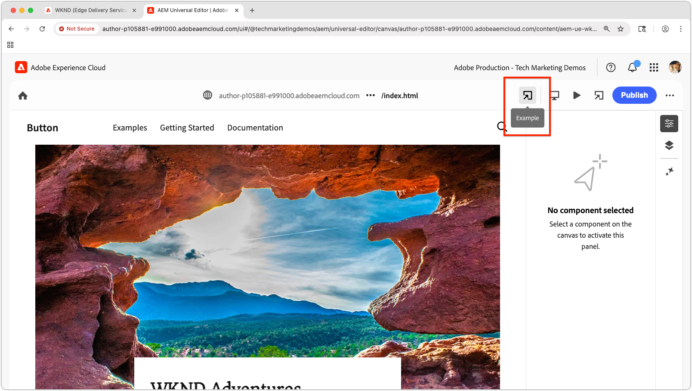

# ローカルのユニバーサルエディター拡張機能のプレビュー

>[!TIP]
> 方法を説明します [&#x200B; ユニバーサルエディター拡張機能の作成 &#x200B;](https://developer.adobe.com/uix/docs/services/aem-universal-editor/)。

開発中にユニバーサルエディター拡張機能をプレビューするには、次の操作が必要です。

1. 拡張機能をローカルで実行します。
2. 自己署名証明書を受け入れます。
3. ユニバーサルエディターでページを開きます。
4. 場所の URL を更新して、ローカル拡張機能を読み込みます。

## 拡張機能をローカルで実行

ここでは、[&#x200B; ユニバーサルエディター拡張機能 &#x200B;](https://developer.adobe.com/uix/docs/services/aem-universal-editor/) が既に作成されていて、ローカルでテストおよび開発する際にプレビューすることを前提としています。

ユニバーサルエディター拡張機能を次で起動します。

```bash
$ aio app run
```

次のような出力が表示されます。

```
To view your local application:
  -> https://localhost:9080
To view your deployed application in the Experience Cloud shell:
  -> https://experience.adobe.com/?devMode=true#/custom-apps/?localDevUrl=https://localhost:9080
```

これにより、デフォルトで `https://localhost:9080` で拡張機能が実行されます。


## 自己署名証明書を受け入れる

ユニバーサルエディターで拡張機能を読み込むには HTTPS が必要です。 ローカル開発では自己署名証明書を使用するので、ブラウザーで明示的に信頼する必要があります。

新しいブラウザータブを開き、`aio app run` のコマンドで出力されたローカル拡張機能 URL に移動します。

```
https://localhost:9080
```

ブラウザーに証明書に関する警告が表示されます。 証明書を受け入れて続行します。


承認されると、ローカル拡張機能のプレースホルダーページが表示されます。


## ユニバーサルエディターでページを開く

[&#x200B; ユニバーサルエディターコンソール &#x200B;](https://experience.adobe.com/#/@myOrg/aem/editor/canvas/) を使用して、またはユニバーサルエディターを使用するAEM Sitesのページを編集して、ユニバーサルエディターを開きます。


## 拡張機能の読み込み

ユニバーサルエディターで、インターフェイスの上部中央にある **Location** フィールドを見つけます。 **フォルダーを展開し、（ブラウザーのアドレスバーではなく** 「場所」フィールドの **URL** を更新します。

次のクエリパラメーターを追加します。

* `devMode=true` - ユニバーサルエディターの開発モードを有効にします。
* `ext=https://localhost:9080` - ローカルで実行されている拡張機能を読み込みます。

例：

```
https://author-pXXX-eXXX.adobeaemcloud.com/content/aem-ue-wknd/index.html?devMode=true&ext=https://localhost:9080
```


## 拡張機能のプレビュー

ブラウザーの **ハードリロード** を実行し、更新された URL が使用されるようにします。

ユニバーサルエディターは、ブラウザーセッションでのみ、ローカル拡張機能を読み込むようになりました。

ローカルで行ったコード変更は、直ちに反映されます。



