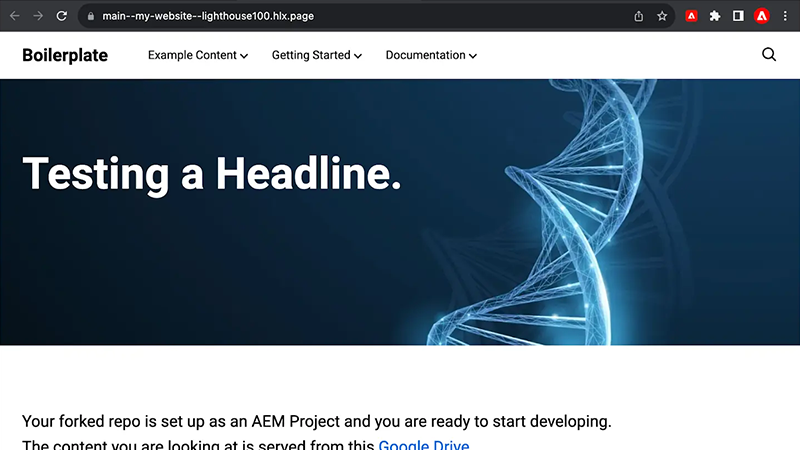

# Edge 配信サービスのビデオ

Edge 配信サービスを使用して web サイトを高速化する方法。

>[!VIDEO](https://video.tv.adobe.com/v/3427989/?learn=on)

Edge 配信サービスとその機能について詳しくは、[ドキュメント](https://experienceleague.adobe.com/ja/docs/experience-manager-cloud-service/content/edge-delivery/overview)を参照してください。

## Edge Delivery Services開発者向けチュートリアル

    <!-- Document-based authoring -->
    

      

        

          <figure class="image is-16by9">
            
          </figure>
        

        

          

            

              <a href="https://experienceleague.adobe.com/en/docs/experience-manager-cloud-service/content/edge-delivery/build/tutorial" title="ドキュメントベースのオーサリング web サイトのチュートリアル"> ドキュメントベースのオーサリング web サイトのチュートリアル </a>
            

            
ドキュメントベースのオーサリングを使用して作成されたEdge Delivery Services web サイトを作成する方法について説明します。

            <a href="https://experienceleague.adobe.com/en/docs/experience-manager-cloud-service/content/edge-delivery/build/tutorial" class="spectrum-Button
              spectrum-Button--outline spectrum-Button--primary
              spectrum-Button--sizeM">
               チュートリアルを開始 
            </a>
          

        

      

    

    <!-- Universal Editor -->
    

      

        

          <figure class="image is-16by9">
            
          </figure>
        

        

          

            

              <a href="https://experienceleague.adobe.com/en/docs/experience-manager-cloud-service/content/edge-delivery/wysiwyg-authoring/edge-dev-getting-started" title="ユニバーサルエディター web サイトチュートリアル"> ユニバーサルエディター web サイトチュートリアル </a>
            

            
ユニバーサルエディターを使用して作成されたEdge Delivery Services web サイトを作成する方法を説明します。

            <a href="https://experienceleague.adobe.com/en/docs/experience-manager-cloud-service/content/edge-delivery/wysiwyg-authoring/edge-dev-getting-started" class="spectrum-Button
              spectrum-Button--outline spectrum-Button--primary
              spectrum-Button--sizeM">
               チュートリアルを開始 
            </a>
          

        

      

    
    
  

## Edge Delivery Services の概要

    <!-- Prerequisites -->
    

      

        

          <figure class="image is-16by9">
            
          </figure>
        

        

          

            
5 分

            

              <a href="./developing/prerequisites.md" title="前提条件">開発者の前提条件</a>
            

            
Edge Delivery Services の開発を始めるための必要事項。

            <a href="./developing/prerequisites.md" class="spectrum-Button
              spectrum-Button--outline spectrum-Button--primary
              spectrum-Button--sizeM">
 ビデオを視聴
 </a>
          

        

      

    
 
    <!-- Setting up your Repository-->
    

      

        

          <figure class="image is-16by9">
            
          </figure>
        

        

          

            
1 分

            

              <a href="./developing/aem-boilerplate.md" title="ボイラープレートテンプレートを使用">AEM ボイラープレート</a>
            

            
AEM ボイラープレートテンプレートを使用して、コードリポジトリを設定します。

            <a href="./developing/aem-boilerplate.md" class="spectrum-Button
              spectrum-Button--outline spectrum-Button--primary
              spectrum-Button--sizeM">
 ビデオを視聴
 </a>
          

        

      

    

    <!-- Linking Google Drive -->
    

      

        

          <figure class="image is-16by9">
            
          </figure>
        

        

          

            
1 分

            

              <a href="./developing/content-repository.md" title="Google Drive をリンク">Google Drive をリンク</a>
            

            
Google Drive をすべてのコンテンツのリポジトリとして使用します。

            <a href="./developing/content-repository.md" class="spectrum-Button
              spectrum-Button--outline spectrum-Button--primary
              spectrum-Button--sizeM">
 ビデオを視聴
 </a>
          

        

      

    

    <!-- Link Sharepoint --->
    

      

        

          <figure class="image is-16by9">
            
          </figure>
        

        

          

            
1 分

            

              <a href="./developing/content-repository.md" title="SharePoint をリンク">SharePoint をリンク</a>
            

            
SharePoint をすべてのコンテンツのリポジトリとして使用します。

            <a href="./developing/content-repository.md"
              class="spectrum-Button spectrum-Button--outline
              spectrum-Button--primary spectrum-Button--sizeM">
 ビデオを視聴
 </a>
          

        

      

    

    <!-- Previewing and Publishing Content -->
    

      

        

          <figure class="image is-16by9">
            
          </figure>
        

        

          

            
1 分

            

              <a href="./developing/preview-and-publish.md" title="コンテンツをプレビューおよび公開">コンテンツをプレビューおよび公開</a>
            

            
AEM Sidekick を使用して、コンテンツをプレビューおよび公開します。

            <a href="./developing/preview-and-publish.md" class="spectrum-Button
              spectrum-Button--outline spectrum-Button--primary
              spectrum-Button--sizeM">
 ビデオを視聴
 </a>
          

        

      

    

    <!-- Using the Sidekick -->
    

      

        

          <figure class="image is-16by9">
            
          </figure>
        

        

          

            
1 分

            

              <a href="./developing/sidekick.md" title="Sidekick の使用">AEM Sidekick を使用</a>
            

            
AEM Sidekick の使用方法を学びます。

            <a href="./developing/sidekick.md" class="spectrum-Button
              spectrum-Button--outline spectrum-Button--primary
              spectrum-Button--sizeM">
 ビデオを視聴
 </a>
          

        

      

    

 <!-- Document Structure -->
    

      

        

          <figure class="image is-16by9">
            
          </figure>
        

        

          

            
1 分

            

              <a href="./developing/document-structure.md" title="ドキュメント構造">ドキュメント構造</a>
            

            
デフォルトのコンテンツ、セクション、ブロックを含むドキュメント構造を調べる 

            <a href="./developing/document-structure.md" class="spectrum-Button
              spectrum-Button--outline spectrum-Button--primary
              spectrum-Button--sizeM">
 ビデオを視聴
 </a>
          

        

      

    
  
     <!--Local Development -->
    

      

        

          <figure class="image is-16by9">
            
          </figure>
        

        

          

            
2 分

            

              <a href="./developing/local-development.md" title="ローカル開発">ローカル開発</a>
            

            
ローカル開発環境を設定します。

            <a href="./developing/local-development.md" class="spectrum-Button
              spectrum-Button--outline spectrum-Button--primary
              spectrum-Button--sizeM">
 ビデオを視聴
 </a>
          

        

      

    

    <!--Integrate with Git -->
    

      

        

          <figure class="image is-16by9">
            
          </figure>
        

        

          

            
2 分

            

              <a href="./developing/git.md" title="Git との統合">Git との統合</a>
            

            
Git と Edge Delivery Services を設定します。

            <a href="./developing/git.md" class="spectrum-Button
              spectrum-Button--outline spectrum-Button--primary
              spectrum-Button--sizeM">
 ビデオを視聴
 </a>
          

        

      

    

## ハウツービデオ

    <!--Create RSS Feeds -->
    

      

        

          <figure class="image is-16by9">
            
          </figure>
        

        

          

            
2 分

            

              <a href="./how-to/rss.md" title="RSS フィードを作成">RSS フィードを作成</a>
            

            
RSS フィードの作成方法を学びます。

            <a href="./how-to/rss.md" class="spectrum-Button
              spectrum-Button--outline spectrum-Button--primary
              spectrum-Button--sizeM">
 ビデオを視聴
 </a>
          

        

      

    

    <!--Social Media Sharing -->
    

      

        

          <figure class="image is-16by9">
            
          </figure>
        

        

          

            
2 分

            

              <a href="./how-to/social-media-sharing.md" title="ソーシャルメディア共有">ソーシャルメディア共有</a>
            

            
ソーシャルメディア共有用にコンテンツを最適化する方法を学びます。

            <a href="./how-to/social-media-sharing.md" class="spectrum-Button
              spectrum-Button--outline spectrum-Button--primary
              spectrum-Button--sizeM">
 ビデオを視聴
 </a>
          

        

      

    

    <!--Delete a Page -->
    

      

        

          <figure class="image is-16by9">
            
          </figure>
        

        

          

            
2 分

            

              <a href="./how-to/delete-page.md" title="ページの削除">ページの削除</a>
            

            
ページの削除方法を学びます。

            <a href="./how-to/delete-page.md" class="spectrum-Button
              spectrum-Button--outline spectrum-Button--primary
              spectrum-Button--sizeM">
 ビデオを視聴
 </a>
          

        

      

    
    
  

