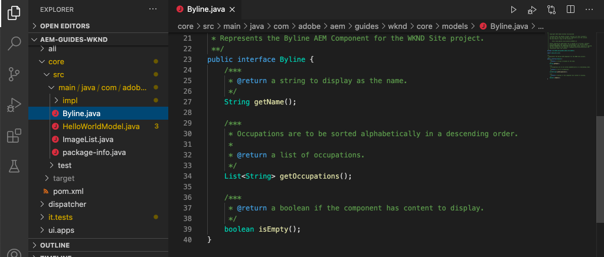

# AEMコンポーネントでAdobeクライアントデータレイヤーをカスタマイズ{#customize-data-layer}

カスタムのAEMコンポーネントのコンテンツを使用してAdobeクライアントデータレイヤーをカスタマイズする方法について説明します。 [AEMコアコンポーネントが提供するAPIを使用して](https://experienceleague.adobe.com/docs/experience-manager-core-components/using/developing/data-layer/extending.html)を拡張し、データレイヤーをカスタマイズする方法を説明します。

## 作成する内容


このチュートリアルでは、WKND [Bylineコンポーネント](https://experienceleague.adobe.com/docs/experience-manager-learn/getting-started-wknd-tutorial-develop/custom-component.html)を更新して、Adobeクライアントデータレイヤーを拡張する様々なオプションについて説明します。 これはカスタムコンポーネントで、このチュートリアルで学習した内容は、他のカスタムコンポーネントにも適用できます。

### 目的 {#objective}

1. SlingモデルとコンポーネントHTLを拡張して、コンポーネントデータをデータレイヤーに挿入します
1. コアコンポーネントデータレイヤーユーティリティを使用して作業を軽減
1. コアコンポーネントのデータ属性を使用して、既存のデータレイヤーイベントにフックします。

## 前提条件 {#prerequisites}

このチュートリアルを完了するには、**ローカル開発環境**&#x200B;が必要です。 スクリーンショットとビデオは、macOSで実行されているCloud ServiceSDKとしてAEMを使用してキャプチャされます。 コマンドとコードは、特に断りのない限り、ローカルのオペレーティングシステムとは独立しています。

**AEM as a Cloud Service は初めてですか？** AEMをCloud ServiceSDKとして使用してローカル開発環境を設定するには、 [次のガイドを参照してください](https://docs.adobe.com/content/help/ja-JP/experience-manager-learn/cloud-service/local-development-environment-set-up/overview.html)。

**AEM 6.5を初めて使用する場合** ローカル開発環境を設定するには、 [次のガイドを参照してください](https://docs.adobe.com/content/help/ja-JP/experience-manager-learn/foundation/development/set-up-a-local-aem-development-environment.html)。

## WKNDリファレンスサイト{#set-up-wknd-site}をダウンロードして展開します

このチュートリアルでは、WKNDリファレンスサイトのBylineコンポーネントを拡張します。 WKNDコードベースのコピーを作成し、ローカル環境にインストールします。

1. [http://localhost:4502](http://localhost:4502)で実行されているAEMのローカルクイックスタート&#x200B;**author**&#x200B;インスタンスを開始します。
1. ターミナルウィンドウを開き、Gitを使用してWKNDコードベースのコピーを作成します。

   ```shell
   $ git clone git@github.com:adobe/aem-guides-wknd.git
   ```

1. WKNDコードベースをAEMのローカルインスタンスにデプロイします。

   ```shell
   $ cd aem-guides-wknd
   $ mvn clean install -PautoInstallSinglePackage
   ```

   >[!NOTE]
   >
   > AEM 6.5と最新のサービスパックを使用している場合は、Mavenコマンドに`classic`プロファイルを追加します。
   >
   > `mvn clean install -PautoInstallSinglePackage -Pclassic`

1. 新しいブラウザーウィンドウを開き、AEMにログインします。 **雑誌**&#x200B;を次のように開きます。[http://localhost:4502/content/wknd/us/en/magazine/guide-la-skateparks.html](http://localhost:4502/content/wknd/us/en/magazine/guide-la-skateparks.html).

   

   エクスペリエンスフラグメントの一部としてページに追加されたBylineコンポーネントの例が表示されます。 エクスペリエンスフラグメントは、[http://localhost:4502/editor.html/content/experience-fragments/wknd/language-masters/en/contributors/stacey-roswells/byline.html](http://localhost:4502/editor.html/content/experience-fragments/wknd/language-masters/en/contributors/stacey-roswells/byline.html)に表示できます。
1. 開発者ツールを開き、**コンソール**&#x200B;に次のコマンドを入力します。

   ```js
   window.adobeDataLayer.getState();
   ```

   Inspectは、AEMサイトのデータ層の現在の状態を確認する応答です。 ページと個々のコンポーネントに関する情報が表示されます。

   

   Bylineコンポーネントがデータレイヤーに表示されないことを確認します。

## Byline Slingモデルの更新{#sling-model}

データレイヤー内のコンポーネントに関するデータを挿入するには、まずコンポーネントのSlingモデルを更新する必要があります。 次に、BylineのJavaインターフェイスとSlingモデルの実装を更新し、新しいメソッド`getData()`を追加します。 このメソッドには、データレイヤーに挿入するプロパティが含まれます。

1. 選択したIDEで`aem-guides-wknd`プロジェクトを開きます。 `core`モジュールに移動します。
1. `Byline.java`（`core/src/main/java/com/adobe/aem/guides/wknd/core/models/Byline.java`）ファイルを開きます。

   

1. イン追加ターフェイスに対する新しいメソッド：

   ```java
   public interface Byline {
       ...
       /***
        * Return data about the Byline Component to populate the data layer
        * @return String
        */
       String getData();
   }
   ```

1. `BylineImpl.java`（`core/src/main/java/com/adobe/aem/guides/wknd/core/models/impl/BylineImpl.java`）ファイルを開きます。

   これは`Byline`インターフェイスの実装で、Slingモデルとして実装されます。

1. 次追加のimport文をファイルの先頭に追加します。

   ```java
   import java.util.HashMap;
   import java.util.Map;
   import org.apache.sling.api.resource.Resource;
   import com.fasterxml.jackson.core.JsonProcessingException;
   import com.fasterxml.jackson.databind.ObjectMapper;
   import com.adobe.cq.wcm.core.components.util.ComponentUtils;
   ```

   `fasterxml.jackson` APIは、JSONとして公開するデータのシリアライズに使用されます。 AEMコアコンポーネントの`ComponentUtils`は、データレイヤーが有効になっているかどうかを確認するために使用されます。

1. 実装さ追加れていないメソッド`getData()`から`BylineImple.java`:

   ```java
   public class BylineImpl implements Byline {
       ...
       @Override
       public String getData() {
           Resource bylineResource = this.request.getResource();
           // Use ComponentUtils to verify if the DataLayer is enabled
           if (ComponentUtils.isDataLayerEnabled(bylineResource)) {
   
               //Create a map of properties we want to expose
               Map<String, Object> bylineProperties = new HashMap<String,Object>();
               bylineProperties.put("@type", bylineResource.getResourceType());
               bylineProperties.put("name", this.getName());
               bylineProperties.put("occupation", this.getOccupations());
               bylineProperties.put("fileReference", image.getFileReference());
   
               //Use AEM Core Component utils to get a unique identifier for the Byline component (in case multiple are on the page)
               String bylineComponentID = ComponentUtils.getId(bylineResource, this.currentPage, this.componentContext);
   
               // Return the bylineProperties as a JSON String with a key of the bylineResource's ID
               try {
                   return String.format("{\"%s\":%s}",
                       bylineComponentID,
                       // Use the ObjectMapper to serialize the bylineProperties to a JSON string
                       new ObjectMapper().writeValueAsString(bylineProperties));
               } catch (JsonProcessingException e) {
   
                   LOGGER.error("Unable to generate dataLayer JSON string", e);
               }
   
           }
           // return null if the Data Layer is not enabled
           return null;
       }
   }
   ```

   上記のメソッドでは、JSONとして公開するプロパティを取り込むために新しい`HashMap`が使用されます。 `getName()`や`getOccupations()`などの既存のメソッドが使用されます。 `@type` コンポーネントの固有のリソースタイプを表します。これにより、クライアントは、コンポーネントのタイプに基づいてイベントやトリガーを容易に識別できます。

   `ObjectMapper`は、プロパティをシリアル化してJSON文字列を返すために使用します。 その後、このJSON文字列をデータレイヤーに挿入できます。

1. ターミナルウィンドウを開きます。Mavenのスキルを使って`core`モジュールだけを構築し、展開します。

   ```shell
   $ cd aem-guides-wknd/core
   $ mvn clean install -PautoInstallBundle
   ```

## Byline HTLの更新{#htl}

次に、`Byline` [HTL](https://experienceleague.adobe.com/docs/experience-manager-htl/using/htl/block-statements.html?lang=en#htl)を更新します。 HTL(HTML Template Language)は、コンポーネントのHTMLをレンダリングするために使用するテンプレートです。

各AEMコンポーネントの特殊なデータ属性`data-cmp-data-layer`は、そのデータレイヤーを公開するために使用されます。  AEM Core Componentsが提供するJavaScriptは、このデータ属性を探します。このデータ属性の値は、Byline Slingモデルの`getData()`メソッドから返されるJSON文字列で入力され、値はAdobeクライアントデータレイヤーに挿入されます。

1. IDEで`aem-guides-wknd`プロジェクトを開きます。 `ui.apps`モジュールに移動します。
1. `byline.html`（`ui.apps/src/main/content/jcr_root/apps/wknd/components/byline/byline.html`）ファイルを開きます。

   

1. `byline.html`を更新して`data-cmp-data-layer`属性を含めます。

   ```diff
     <div data-sly-use.byline="com.adobe.aem.guides.wknd.core.models.Byline"
       data-sly-use.placeholderTemplate="core/wcm/components/commons/v1/templates.html"
       data-sly-test.hasContent="${!byline.empty}"
   +   data-cmp-data-layer="${byline.data}"
       class="cmp-byline">
       ...
   ```

   `data-cmp-data-layer`の値は`"${byline.data}"`に設定されました。`byline`は、以前に更新されたSlingモデルです。 `.data` は、前の演習で `getData()` 実装したHTLでJava Getterメソッドを呼び出すための標準的な表記法です。

1. ターミナルウィンドウを開きます。Mavenのスキルを使って`ui.apps`モジュールだけを構築し、展開します。

   ```shell
   $ cd aem-guides-wknd/ui.apps
   $ mvn clean install -PautoInstallPackage
   ```

1. ブラウザーに戻り、Bylineコンポーネントを含むページを再度開きます。[http://localhost:4502/content/wknd/us/en/magazine/guide-la-skateparks.html](http://localhost:4502/content/wknd/us/en/magazine/guide-la-skateparks.html).

1. 開発者ツールを開き、ページのHTMLソースでBylineコンポーネントを確認します。

   

   `data-cmp-data-layer`にSlingモデルのJSON文字列が入力されていることがわかります。

1. ブラウザーの開発者ツールを開き、**コンソール**&#x200B;に次のコマンドを入力します。

   ```js
   window.adobeDataLayer.getState();
   ```

1. `component`の下の応答の下に移動し、`byline`コンポーネントのインスタンスがデータレイヤーに追加されていることを確認します。

   

   次のようなエントリが表示されます。

   ```json
   byline-136073cfcb:
       @type: "wknd/components/byline"
       fileReference: "/content/dam/wknd/en/contributors/stacey-roswells.jpg"
       name: "Stacey Roswells"
       occupation: (3) ["Artist", "Photographer", "Traveler"]
       parentId: "page-30d989b3f8"
   ```

   公開されるプロパティがSlingモデルの`HashMap`に追加されたものと同じであることを確認してください。

## 追加クリックイベント{#click-event}

Adobeクライアントデータレイヤーはイベント駆動型で、アクションをトリガーする最も一般的なイベントの1つは`cmp:click`イベントです。 AEMコアコンポーネントを使用すると、データ要素を使用してコンポーネントを簡単に登録できます。`data-cmp-clickable`.

クリック可能な要素は、通常、CTAボタンまたはナビゲーションリンクです。 残念ながら、Bylineコンポーネントにはこれらの要素はありませんが、他のカスタムコンポーネントではこれが一般的である可能性があるので、任意の場所に登録します。

1. IDEで`ui.apps`モジュールを開きます
1. `byline.html`（`ui.apps/src/main/content/jcr_root/apps/wknd/components/byline/byline.html`）ファイルを開きます。

1. `byline.html`を更新して、Bylineの&#x200B;**name**&#x200B;要素に`data-cmp-clickable`属性を含めます。

   ```diff
     <h2 class="cmp-byline__name" 
   +    data-cmp-clickable="${byline.data ? true : false}">
        ${byline.name}
     </h2>
   ```

1. 新しいターミナルを開きます。 Mavenのスキルを使って`ui.apps`モジュールだけを構築し、展開します。

   ```shell
   $ cd aem-guides-wknd/ui.apps
   $ mvn clean install -PautoInstallPackage
   ```

1. ブラウザーに戻り、Bylineコンポーネントが追加されたページを再度開きます。[http://localhost:4502/content/wknd/us/en/magazine/guide-la-skateparks.html](http://localhost:4502/content/wknd/us/en/magazine/guide-la-skateparks.html).

   イベントをテストするには、開発者コンソールを使用して手動でJavaScriptを追加します。 その方法に関するビデオについては、[AEMコアコンポーネントでのAdobeクライアントデータレイヤーの使用](data-layer-overview.md)を参照してください。

1. ブラウザーの開発者ツールを開き、**コンソール**&#x200B;に次のメソッドを入力します。

   ```javascript
   function bylineClickHandler(event) {
       var dataObject = window.adobeDataLayer.getState(event.eventInfo.path);
       if (dataObject != null && dataObject['@type'] === 'wknd/components/byline') {
           console.log("Byline Clicked!");
           console.log("Byline name: " + dataObject['name']);
       }
   }
   ```

   この単純なメソッドは、Bylineコンポーネントの名前のクリックを処理する必要があります。

1. **コンソール**&#x200B;に次のメソッドを入力します。

   ```javascript
   window.adobeDataLayer.push(function (dl) {
        dl.addEventListener("cmp:click", bylineClickHandler);
   });
   ```

   上記のメソッドは、イベントリスナーをデータレイヤーにプッシュして`cmp:click`イベントをリッスンし、`bylineClickHandler`を呼び出します。

   >[!CAUTION]
   >
   > この演習全体でブラウザを更新することは&#x200B;****&#x200B;ではなく&lt;a0/>重要です。そうしないと、コンソールJavaScriptが失われます。

1. ブラウザーの&#x200B;**コンソール**&#x200B;を開き、Bylineコンポーネントで作成者の名前をクリックします。

   

   コンソールメッセージ`Byline Clicked!`と署名名が表示されます。

   `cmp:click`イベントは最も簡単に接続できます。 より複雑なコンポーネントを作成し、その他の動作を追跡する場合は、カスタムJavaScriptを追加して新しいイベントを追加および登録できます。 優れた例はカルーセルコンポーネントです。このコンポーネントは、スライドが切り替えられるたびに`cmp:show`イベントをトリガします。 詳細は[ソースコードを参照してください](https://github.com/adobe/aem-core-wcm-components/blob/master/content/src/content/jcr_root/apps/core/wcm/components/carousel/v1/carousel/clientlibs/site/js/carousel.js#L219)。

## DataLayerBuilderユーティリティ{#data-layer-builder}を使用

この章で[更新](#sling-model)したSlingモデルの場合、`HashMap`を使用し、各プロパティを手動で設定してJSON文字列を作成することを選択しました。 この方法は、小さな1回限りのコンポーネントでは適切に機能しますが、AEMコアコンポーネントを拡張するコンポーネントでは、多くの余分なコードが生じる可能性があります。

重い持ち上げのほとんどを実行するユーティリティクラス`DataLayerBuilder`が存在します。 これにより、実装で必要なプロパティのみを拡張できます。 `DataLayerBuilder`を使用するようにSlingモデルを更新します。

1. IDEに戻り、`core`モジュールに移動します。
1. `Byline.java`（`core/src/main/java/com/adobe/aem/guides/wknd/core/models/Byline.java`）ファイルを開きます。
1. `getData()`メソッドを変更して`ComponentData`の型を返します

   ```java
   import com.adobe.cq.wcm.core.components.models.datalayer.ComponentData;
   ...
   public interface Byline {
       ...
       /***
        * Return data about the Byline Component to populate the data layer
        * @return ComponentData
        */
       ComponentData getData();
   }
   ```

   `ComponentData` は、AEMコアコンポーネントで提供されるオブジェクトです。前の例と同様に、結果はJSON文字列になりますが、多くの追加作業を行います。

1. `BylineImpl.java`（`core/src/main/java/com/adobe/aem/guides/wknd/core/models/impl/BylineImpl.java`）ファイルを開きます。

1. 追加次のインポート文：

   ```java
   import com.adobe.cq.wcm.core.components.models.datalayer.ComponentData;
   import com.adobe.cq.wcm.core.components.models.datalayer.builder.DataLayerBuilder;
   ```

1. `getData()`メソッドを次のメソッドに置き換えます。

   ```java
   @Override
   public ComponentData getData() {
       Resource bylineResource = this.request.getResource();
       // Use ComponentUtils to verify if the DataLayer is enabled
       if (ComponentUtils.isDataLayerEnabled(bylineResource)) {
   
           return DataLayerBuilder.extending(getImage().getData()).asImageComponent()
               .withTitle(this::getName)
               .build();
   
       }
       // return null if the Data Layer is not enabled
       return null;
   }
   ```

   Bylineコンポーネントは、Image Coreコンポーネントの一部を再利用して、作成者を表す画像を表示します。 上記のスニペットでは、[DataLayerBuilder](https://javadoc.io/doc/com.adobe.cq/core.wcm.components.core/latest/com/adobe/cq/wcm/core/components/models/datalayer/builder/ComponentDataBuilder.html)を使用して`Image`コンポーネントのデータレイヤーを拡張します。 これにより、JSONオブジェクトに、使用されている画像に関するすべてのデータが事前に入力されます。 また、`@type`やコンポーネントの固有な識別子の設定など、ルーチンの機能の一部も実行します。 この方法は非常に小さいことに注意してください。

   唯一のプロパティが`withTitle`を拡張し、`getName()`の値に置き換えられました。

1. ターミナルウィンドウを開きます。Mavenのスキルを使って`core`モジュールだけを構築し、展開します。

   ```shell
   $ cd aem-guides-wknd/core
   $ mvn clean install -PautoInstallBundle
   ```

1. IDEに戻り、`ui.apps`の下の`byline.html`ファイルを開きます
1. `byline.data.json`を使用して`data-cmp-data-layer`属性を設定するようにHTLを更新します。

   ```diff
     <div data-sly-use.byline="com.adobe.aem.guides.wknd.core.models.Byline"
       data-sly-use.placeholderTemplate="core/wcm/components/commons/v1/templates.html"
       data-sly-test.hasContent="${!byline.empty}"
   -   data-cmp-data-layer="${byline.data}"
   +   data-cmp-data-layer="${byline.data.json}"
   ```

   現在、`ComponentData`型のオブジェクトを返しています。 このオブジェクトにはgetterメソッド`getJson()`が含まれ、これは`data-cmp-data-layer`属性の入力に使用されます。

1. ターミナルウィンドウを開きます。Mavenのスキルを使って`ui.apps`モジュールだけを構築し、展開します。

   ```shell
   $ cd aem-guides-wknd/ui.apps
   $ mvn clean install -PautoInstallPackage
   ```

1. ブラウザーに戻り、Bylineコンポーネントが追加されたページを再度開きます。[http://localhost:4502/content/wknd/us/en/magazine/guide-la-skateparks.html](http://localhost:4502/content/wknd/us/en/magazine/guide-la-skateparks.html).
1. ブラウザーの開発者ツールを開き、**コンソール**&#x200B;に次のコマンドを入力します。

   ```js
   window.adobeDataLayer.getState();
   ```

1. `component`の下の応答の下に移動し、`byline`コンポーネントのインスタンスを探します。

   

   次のようなエントリが表示されます。

   ```json
   byline-136073cfcb:
       @type: "wknd/components/byline"
       dc:title: "Stacey Roswells"
       image:
           @type: "image/jpeg"
           repo:id: "142658f8-4029-4299-9cd6-51afd52345c0"
           repo:modifyDate: "2019-10-25T23:49:51Z"
           repo:path: "/content/dam/wknd/en/contributors/stacey-roswells.jpg"
           xdm:tags: []
       parentId: "page-30d989b3f8"
       repo:modifyDate: "2019-10-18T20:17:24Z"
   ```

   `byline`コンポーネントエントリ内に`image`オブジェクトが存在することを確認してください。 DAMのアセットに関する情報が多くあります。 また、`@type`と一意のid（この場合は`byline-136073cfcb`）が自動的に入力され、コンポーネントが変更されたときに示す`repo:modifyDate`が自動的に入力されていることも確認してください。

## 追加の例{#additional-examples}

1. データレイヤーの拡張の別の例は、WKNDコードベースの`ImageList`コンポーネントを検査することで表示できます。
   * `ImageList.java` - `core` モジュール内のJavaインターフェイス。
   * `ImageListImpl.java` - `core` モジュール内のSlingモデル。
   * `image-list.html` - `ui.apps` モジュール内のHTLテンプレート。

   >[!NOTE]
   >
   > [DataLayerBuilder](https://javadoc.io/doc/com.adobe.cq/core.wcm.components.core/latest/com/adobe/cq/wcm/core/components/models/datalayer/builder/ComponentDataBuilder.html)を使用する場合、`occupation`のようなカスタムプロパティを含めるのは、少し難しくなります。 ただし、イメージまたはページを含むコアコンポーネントを拡張する場合は、このユーティリティを使用すると多くの時間を節約できます。

   >[!NOTE]
   >
   > 実装全体で再利用されるオブジェクト用に高度なデータレイヤーを作成する場合は、データレイヤー要素を独自のデータレイヤー固有のJavaオブジェクトに抽出することをお勧めします。 例えば、Commerce Core Componentsは、コマース実装内の多くのコンポーネントで使用できる`ProductData`と`CategoryData`のインターフェイスを追加しました。 詳しくは、aem-cif-core-components repo](https://github.com/adobe/aem-core-cif-components/tree/master/bundles/core/src/main/java/com/adobe/cq/commerce/core/components/datalayer)の[コードを確認してください。

## バリデーターが{#congratulations}

AEMコンポーネントを使用してAdobeクライアントデータレイヤーを拡張およびカスタマイズする方法をいくつか試してみました。

## その他のリソース {#additional-resources}

* [Adobeクライアントデータレイヤードキュメント](https://github.com/adobe/adobe-client-data-layer/wiki)
* [コアコンポーネントとのデータレイヤーの統合](https://github.com/adobe/aem-core-wcm-components/blob/master/DATA_LAYER_INTEGRATION.md)
* [Adobeクライアントデータレイヤーおよびコアコンポーネントドキュメントの使用](https://docs.adobe.com/content/help/ja-JP/experience-manager-core-components/using/developing/data-layer/overview.html)
