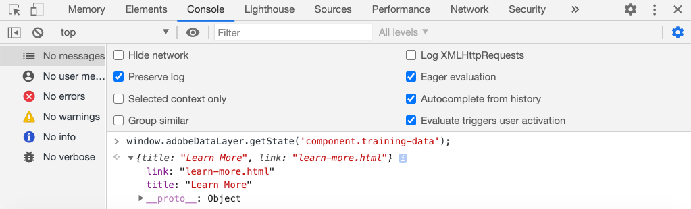

# AEMコアコンポーネントでのAdobeクライアントデータレイヤーの使用 {#overview}

Adobeクライアントデータレイヤーでは、Web ページでの訪問者エクスペリエンスに関するデータを収集および保存し、このデータに簡単にアクセスできるようにする標準的な方法が導入されています。 Adobe Client Data Layer はプラットフォームに依存しませんが、AEM で使用するためにコアコンポーネントに完全に統合されています。

>[!VIDEO](https://video.tv.adobe.com/v/41195?quality=12&learn=on)

>[!NOTE]
>
> AEMサイトでAdobeクライアントデータレイヤーを有効にしますか？ [手順はこちらを参照してください。](https://experienceleague.adobe.com/docs/experience-manager-core-components/using/developing/data-layer/overview.html#installation-activation).

## データレイヤーの調査

ブラウザーとライブ環境の開発者ツールを使用するだけで、Adobeクライアントデータレイヤーの組み込み機能を把握できます [WKND リファレンスサイト](https://wknd.site/).

>[!NOTE]
>
> 以下のスクリーンショットは、Chrome ブラウザーから取得したものです。

1. に移動します。 [https://wknd.site](https://wknd.site)
1. 開発者ツールを開き、 **コンソール**:

   ```js
   window.adobeDataLayer.getState();
   ```

   Inspectは、AEMサイト上のデータレイヤーの現在の状態を確認する応答を返します。 ページと個々のコンポーネントに関する情報が表示されます。

   

1. コンソールで次のように入力して、データオブジェクトをデータレイヤーにプッシュします。

   ```js
   window.adobeDataLayer.push({
       "component": {
           "training-data": {
               "title": "Learn More",
               "link": "learn-more.html"
           }
       }
   });
   ```

1. コマンドを実行します。 `adobeDataLayer.getState()` 再び見つけて `training-data`.
1. 次に、コンポーネントの特定の状態のみを返すパスパラメーターを追加します。

   ```js
   window.adobeDataLayer.getState('component.training-data');
   ```

   

## イベントの操作

データレイヤーのイベントに基づいて任意のカスタムコードをトリガー化することをお勧めします。 次に、様々なイベントの登録とリスニングを参照します。

1. コンソールに次のヘルパーメソッドを入力します。

   ```js
   function getDataObjectHelper(event, filter) {
       if (event.hasOwnProperty("eventInfo") && event.eventInfo.hasOwnProperty("path")) {
           var dataObject = window.adobeDataLayer.getState(event.eventInfo.path);
           if (dataObject != null) {
               for (var property in filter) {
                   if (!dataObject.hasOwnProperty(property) || (filter[property] !== null && filter[property] !== dataObject[property])) {
                       return;
                   }
                   return dataObject;
               }
           }
       }
       return;
   }
   ```

   上記のコードは、 `event` オブジェクトを選択し、 `adobeDataLayer.getState` メソッドを使用して、イベントをトリガーしたオブジェクトの現在の状態を取得します。 次に、ヘルパーメソッドは、 `filter` 現在の `dataObject` が満たす場合、フィルターが返されます。

   >[!CAUTION]
   >
   > それは重要です **not** この演習全体でブラウザーを更新する場合、コンソール JavaScript は失われます。

1. 次に、 **ティーザー** コンポーネントは、 **カルーセル**.

   ```js
   function teaserShownHandler(event) {
       var dataObject = getDataObjectHelper(event, {"@type": "wknd/components/teaser"});
       if(dataObject != null) {
           console.log("Teaser Shown: " + dataObject['dc:title']);
           console.log(dataObject);
       }
   }
   ```

   この `teaserShownHandler` が `getDataObjectHelper` フィルターを通す方法 `wknd/components/teaser` を `@type` を使用して、他のコンポーネントによってトリガーされたイベントを除外します。

1. 次に、イベントリスナーをデータレイヤーにプッシュして、 `cmp:show` イベント。

   ```js
   window.adobeDataLayer.push(function (dl) {
        dl.addEventListener("cmp:show", teaserShownHandler);
   });
   ```

   この `cmp:show` イベントは、 **カルーセル** または **タブ** コンポーネント。

1. ページでカルーセルスライドを切り替え、コンソールステートメントを確認します。

   

1. のリスンを停止するには、データレイヤーからイベントリスナーを削除します。 `cmp:show` イベント：

   ```js
   window.adobeDataLayer = window.adobeDataLayer || [];
   window.adobeDataLayer.push(function(dl) {
       dl.removeEventListener("cmp:show", teaserShownHandler);
   });
   ```

1. ページに戻り、カルーセルスライドを切り替えます。 これ以上のステートメントがログに記録されず、イベントがリッスンされていないことを確認します。

1. 次に、ページ表示イベントがトリガーされたときに呼び出されるイベントハンドラーを作成します。

   ```js
   function pageShownHandler(event) {
       var dataObject = getDataObjectHelper(event, {"@type": "wknd/components/page"});
       if(dataObject != null) {
           console.log("Page Shown: " + dataObject['dc:title']);
           console.log(dataObject);
       }
   }
   ```

   リソースタイプ `wknd/components/page` を使用してイベントをフィルタリングします。

1. 次に、イベントリスナーをデータレイヤーにプッシュして、 `cmp:show` イベント，呼び出し `pageShownHandler`.

   ```js
   window.adobeDataLayer = window.adobeDataLayer || [];
   window.adobeDataLayer.push(function (dl) {
        dl.addEventListener("cmp:show", pageShownHandler);
   });
   ```

1. ページデータで実行されたコンソールステートメントがすぐに表示されます。

   

   この `cmp:show` イベントを呼び出すことができます。 ページが明確に読み込まれているのに、イベントハンドラーがトリガーされたのはなぜですか？という質問が表示される場合があります。

   これは、Adobe・クライアント・データ・レイヤーの独自の機能の 1 つで、イベント・リスナーを登録できます。 **前** または **後** データレイヤーが初期化されました。 これは、競合状態を避けるための重要な機能です。

   データレイヤーは、順番に発生したすべてのイベントのキュー配列を保持します。 データレイヤーは、デフォルトで、 **過去** また、 **将来**. イベントを過去または未来のみにフィルタリングできます。 [詳しくは、ドキュメントを参照してください。](https://github.com/adobe/adobe-client-data-layer/wiki#addeventlistener).


## 次の手順

イベントドリブン型Adobeクライアントデータレイヤーを使用して [ページデータを収集してAdobe Analyticsに送信](../analytics/collect-data-analytics.md).

また、 [AEMコンポーネントでのAdobeクライアントデータレイヤーのカスタマイズ](./data-layer-customize.md)


## その他のリソース {#additional-resources}

* [Adobeクライアントデータレイヤードキュメント](https://github.com/adobe/adobe-client-data-layer/wiki)
* [Adobeクライアントデータレイヤーとコアコンポーネントのドキュメントの使用](https://experienceleague.adobe.com/docs/experience-manager-core-components/using/developing/data-layer/overview.html)
