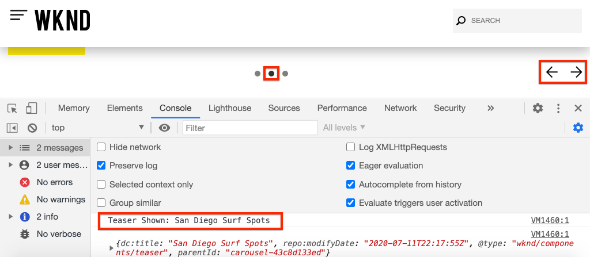

# AEMコアコンポーネントとのAdobeクライアントデータレイヤーの使用{#overview}

Adobeクライアントデータレイヤーでは、Webページ上での訪問者エクスペリエンスに関するデータを収集して保存し、そのデータに簡単にアクセスできるようにする標準的な方法が導入されています。 Adobe Client Data Layer はプラットフォームに依存しませんが、AEM で使用するためにコアコンポーネントに完全に統合されています。

>[!VIDEO](https://video.tv.adobe.com/v/41195?quality=12&learn=on)

>[!NOTE]
>
> AEMサイトでAdobeクライアントデータレイヤーを有効にしますか。 [説明はこちら](https://docs.adobe.com/content/help/en/experience-manager-core-components/using/developing/data-layer/overview.html#installation-activation)。

## データレイヤーの調査

Adobeのクライアントデータレイヤーの組み込み機能は、お使いのブラウザーと[WKNDリファレンスサイト](https://wknd.site/)の開発者ツールを使用するだけで分かります。

>[!NOTE]
>
> 以下に、Chromeブラウザーから取得したスクリーンショットを示します。

1. [https://wknd.site](https://wknd.site)に移動します。
1. 開発者ツールを開き、**コンソール**&#x200B;に次のコマンドを入力します。

   ```js
   window.adobeDataLayer.getState();
   ```

   Inspectは、AEMサイトのデータ層の現在の状態を確認する応答です。 ページと個々のコンポーネントに関する情報が表示されます。

   

1. コンソールで次のように入力して、データオブジェクトをデータレイヤーにプッシュします。

   ```js
   window.adobeDataLayer.push({
       "component": {
           "training-data": {
               "title": "Learn More",
               "link": "learn-more.html"
           }
       }
   });
   ```

1. コマンド`adobeDataLayer.getState()`をもう一度実行し、`training-data`のエントリを探します。
1. 次に、パスパラメーターを追加して、コンポーネントの特定の状態のみを返します。

   ```js
   window.adobeDataLayer.getState('component.training-data');
   ```

   

## イベントの操作

データレイヤーのイベントに基づいてカスタムコードをトリガーすることをお勧めします。 次に、様々なイベントの登録とリスニングを参照します。

1. コンソールに次のヘルパーメソッドを入力します。

   ```js
   function getDataObjectHelper(event, filter) {
       if (event.hasOwnProperty("eventInfo") && event.eventInfo.hasOwnProperty("path")) {
           var dataObject = window.adobeDataLayer.getState(event.eventInfo.path);
           if (dataObject != null) {
               for (var property in filter) {
                   if (!dataObject.hasOwnProperty(property) || (filter[property] !== null && filter[property] !== dataObject[property])) {
                       return;
                   }
                   return dataObject;
               }
           }
       }
       return;
   }
   ```

   上記のコードは`event`オブジェクトを検査し、`adobeDataLayer.getState`メソッドを使用してイベントをトリガーしたオブジェクトの現在の状態を取得します。 次に、ヘルパーメソッドは、`filter`条件を検査し、現在の`dataObject`がフィルターを満たす場合にのみ、その条件が返されます。

   >[!CAUTION]
   >
   > この演習全体でブラウザを更新することは&#x200B;****&#x200B;ではなく重要です。そうしないと、コンソールJavaScriptが失われます。

1. 次に、**Teaser**&#x200B;コンポーネントが&#x200B;**カルーセル**&#x200B;内に表示されたときに呼び出されるイベントハンドラーを入力します。

   ```js
   function teaserShownHandler(event) {
       var dataObject = getDataObjectHelper(event, {"@type": "wknd/components/teaser"});
       if(dataObject != null) {
           console.log("Teaser Shown: " + dataObject['dc:title']);
           console.log(dataObject);
       }
   }
   ```

   `teaserShownHandler`は、`getDataObjectHelper`メソッドを呼び出し、`wknd/components/teaser`のフィルターを`@type`として渡して、他のコンポーネントによってトリガーされるイベントを除外します。

1. 次に、イベントリスナーをデータレイヤーにプッシュして`cmp:show`イベントをリッスンします。

   ```js
   window.adobeDataLayer.push(function (dl) {
        dl.addEventListener("cmp:show", teaserShownHandler);
   });
   ```

   `cmp:show`イベントは、**カルーセル**&#x200B;に新しいスライドが表示された場合や、**タブ**&#x200B;コンポーネントで新しいタブが選択された場合など、様々なコンポーネントによってトリガーされます。

1. ページでカルーセルスライドが切り替わり、コンソールの文を確認します。

   

1. `cmp:show`イベントのリッスンを停止するには、イベントリスナーをデータレイヤーから削除します。

   ```js
   window.adobeDataLayer = window.adobeDataLayer || [];
   window.adobeDataLayer.push(function(dl) {
       dl.removeEventListener("cmp:show", teaserShownHandler);
   });
   ```

1. ページに戻り、カルーセルスライドを切り替えます。 これ以上の文はログに記録されず、イベントが聞かれていないことを確認します。

1. 次に、ページ表示イベントがトリガされたときに呼び出されるイベントハンドラを入力します。

   ```js
   function pageShownHandler(event) {
       var dataObject = getDataObjectHelper(event, {"@type": "wknd/components/page"});
       if(dataObject != null) {
           console.log("Page Shown: " + dataObject['dc:title']);
           console.log(dataObject);
       }
   }
   ```

   リソースタイプ`wknd/components/page`は、イベントのフィルタリングに使用されます。

1. 次に、イベントリスナーをデータレイヤーにプッシュして`cmp:show`イベントをリッスンし、`pageShownHandler`を呼び出します。

   ```js
   window.adobeDataLayer = window.adobeDataLayer || [];
   window.adobeDataLayer.push(function (dl) {
        dl.addEventListener("cmp:show", pageShownHandler);
   });
   ```

1. ページデータでコンソール文が実行されたのがすぐにわかります。

   

   ページの`cmp:show`イベントは、ページの最上部にある各ページの読み込み時にトリガーされます。 ページが明確に読み込まれているのに、イベントハンドラーがトリガーされたのはなぜか、と尋ねられることがあります。

   これは、Adobeクライアントデータレイヤーの固有の機能の1つで、データレイヤーの初期化後&#x200B;**または**&#x200B;の前に&#x200B;**イベントリスナーを登録できる点です。**&#x200B;これは、競合状態を回避するための重要な機能です。

   データレイヤーは、連続して発生したすべてのイベントのキュー配列を保持します。 データレイヤーは、デフォルトでは、**過去**&#x200B;で発生したイベントのトリガーイベントコールバックと、**将来**&#x200B;で発生したイベントを返します。 イベントをフィルターして過去または未来のみにすることができます。 [詳しくは、ドキュメントを参照してください](https://github.com/adobe/adobe-client-data-layer/wiki#addeventlistener)。


## 次の手順

次のチュートリアルを見て、イベント主導型のAdobeクライアントデータレイヤーを[収集ページデータに使用し、Adobe Analytics](../analytics/collect-data-analytics.md)に送信する方法を学びます。

または、[AdobeクライアントデータレイヤーをAEMコンポーネントでカスタマイズする方法](./data-layer-customize.md)を学びます。


## その他のリソース {#additional-resources}

* [Adobeクライアントデータレイヤードキュメント](https://github.com/adobe/adobe-client-data-layer/wiki)
* [Adobeクライアントデータレイヤーおよびコアコンポーネントドキュメントの使用](https://docs.adobe.com/content/help/en/experience-manager-core-components/using/developing/data-layer/overview.html)
