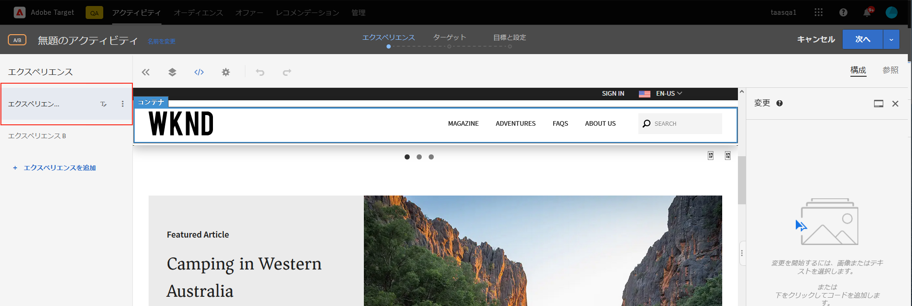
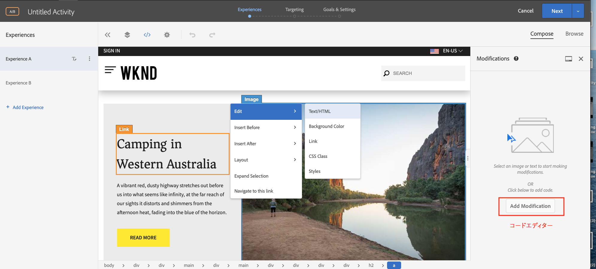
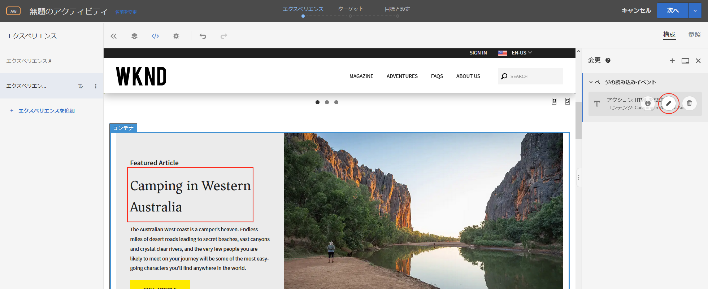
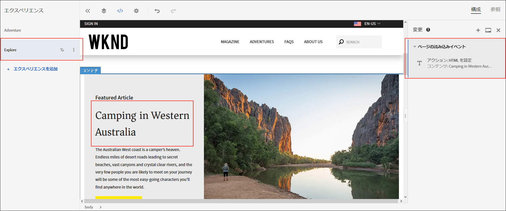
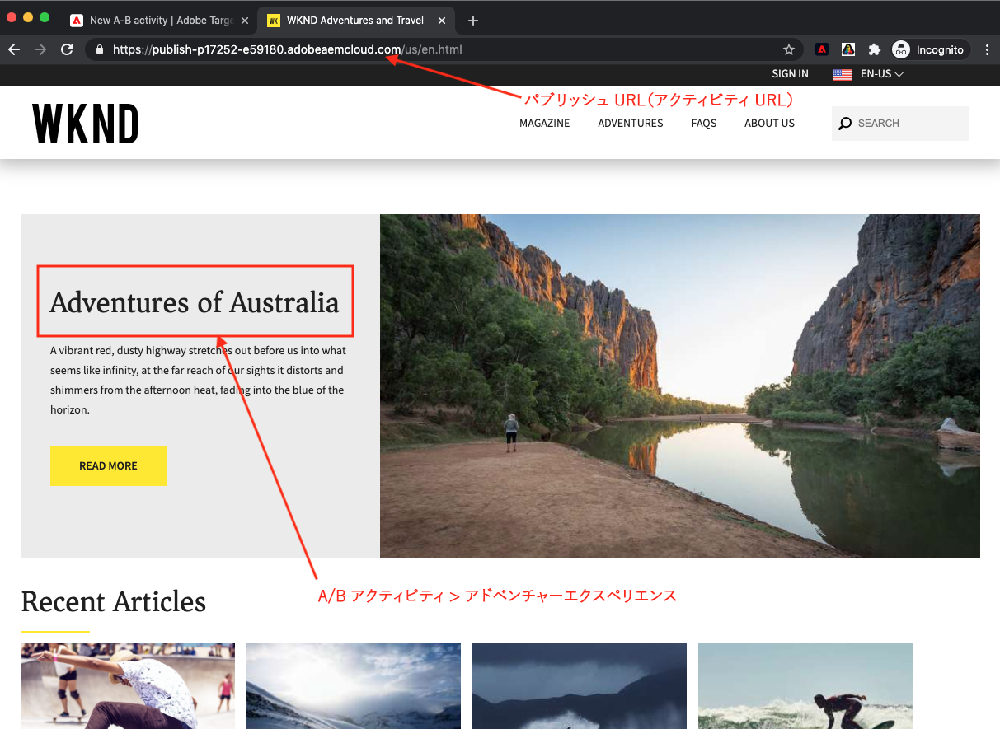

# Visual Experience Composerを使用したパーソナライゼーション{#personalization-vec}

Visual Experience Composer(VEC)を使用してA/Bテストターゲットアクティビティを作成する方法を説明します。

## 前提条件

AEM WebサイトでVECを使用するには、次の設定を完了する必要があります。

1. [Adobe Target追加のAEM Webサイト](./add-target-launch-extension.md)
1. [トリガーとAdobe Targetが起動から](./load-and-fire-target.md)

## シナリオの概要

WKNDサイトのホームページは、地域のアクティビティや、情報カードの形で都市周辺で行う最善の方法を表示します。 マーケティング担当者には、アドベンチャーセクションのテーザーにテキストを変更し、コンバージョンの向上を理解することで、ホームページを変更するタスクが割り当てられています。

## Visual Experience Composer(VEC)を使用したA/Bテストの作成手順

1. [Adobe Experience Cloud](https://experience.adobe.com/)にログインし、__ターゲット__&#x200B;をタップし、__アクティビティ__&#x200B;タブに移動します

   + Experience Cloudダッシュボードに&#x200B;__ターゲット__&#x200B;が表示されない場合は、右上の組織切り替えボタンで正しいAdobe組織が選択されていること、および[Adobe Admin Console](https://adminconsole.adobe.com/)のターゲットへのアクセス権が与えられていることを確認してください。

1. **アクティビティを作成**&#x200B;ボタンをクリックし、**A/Bテスト**&#x200B;アクティビティを選択します

   

1. 「**Visual Experience Composer**」オプションを選択し、アクティビティURLを入力して、「**次へ**」をクリックします

   

1. 新しいアクティビティを作成すると、Visual Experience Composerの左側に2つのタブが表示されます。*エクスペリエンスA*&#x200B;と&#x200B;*エクスペリエンスB*。 リストからエクスペリエンスを選択します。 「**エクスペリエンス**」ボタンを使用して、新しいエクスペリエンスをリストに追加追加できます。

   

1. 開始が変更を加えるためのページ上の画像またはテキストを選択するか、またはを使用する場合は、コードエディターを使用してHTML要素を選択できます。

   

1. テキストを&#x200B;*西オーストラリアのキャンピング*&#x200B;から&#x200B;*オーストラリアの冒険*&#x200B;に変更します。 エクスペリエンスに追加された変更のリストは、「変更」の下に表示されます。 変更したアイテムをクリックして編集し、CSSセレクターと新しいコンテンツを表示できます。

   

1. *エクスペリエンスA*&#x200B;の名前を&#x200B;*アドベンチャー*&#x200B;に変更
1. 同様に、*エクスペリエンスB*&#x200B;のテキストを&#x200B;*西オーストラリアのキャンピング*&#x200B;から&#x200B;*オーストラリアの自然を探検*&#x200B;に更新します。

   

1. 「**次へ**」をクリックしてターゲット設定に移動し、2つのエクスペリエンス間で手動のトラフィック配分を50 ～ 50に保ちます。

   

1. 「目標と設定」で、レポートソースをAdobe Targetとして選択し、目標指標をページ表示アクションを使用したコンバージョンとして選択します。

   

1. アクティビティの名前を入力し、「保存」をクリックします。
1. 保存したアクティビティをアクティブ化して、変更をライブにプッシュします。

   

1. サイトページ(手順3のアクティビティURL)を新しいタブで開き、A/Bテストアクティビティからエクスペリエンス（アドベンチャーまたはエクスプローラ）のいずれかを表示できるようにします。

   

## 概要

この章では、マーケティング担当者が、テストを実行するコードを変更することなく、Webページのレイアウトとコンテンツをドラッグ&amp;ドロップ、入れ替え、変更することで、Visual Experience Composerを使用してエクスペリエンスを作成できました。

## サポートリンク

+ [Adobe Experience Cloudデバッガー — Chrome](https://chrome.google.com/webstore/detail/adobe-experience-cloud-de/ocdmogmohccmeicdhlhhgepeaijenapj)
+ [Adobe Experience Cloudデバッガ — Firefox](https://addons.mozilla.org/en-US/firefox/addon/adobe-experience-platform-dbg/)
