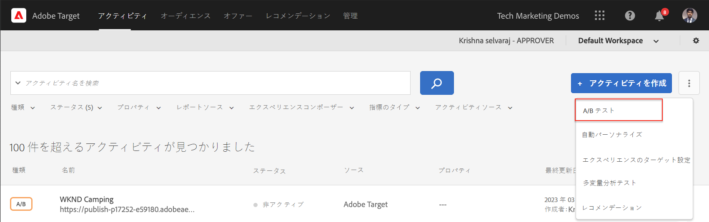
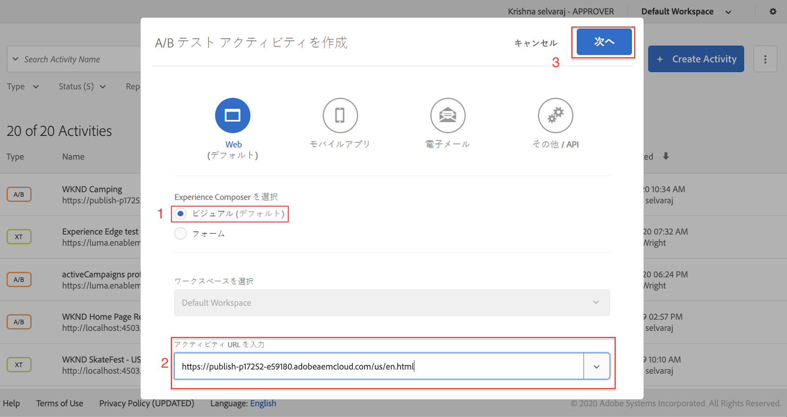
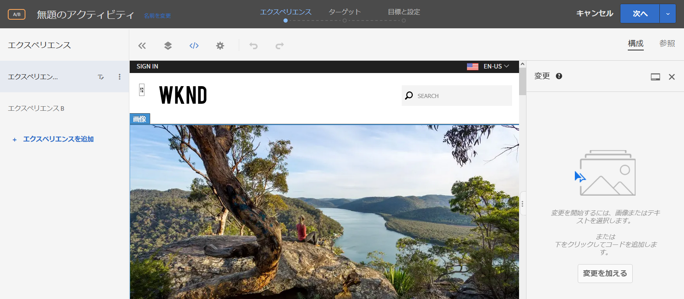
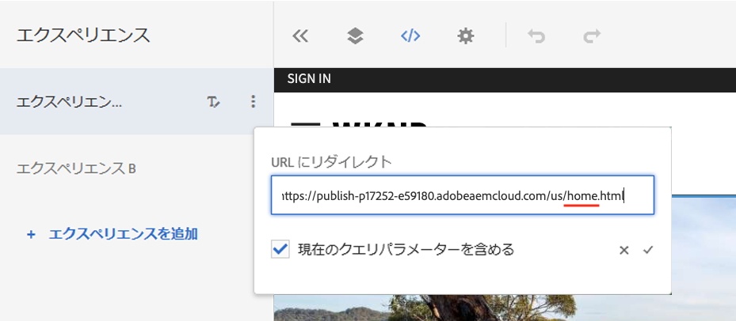
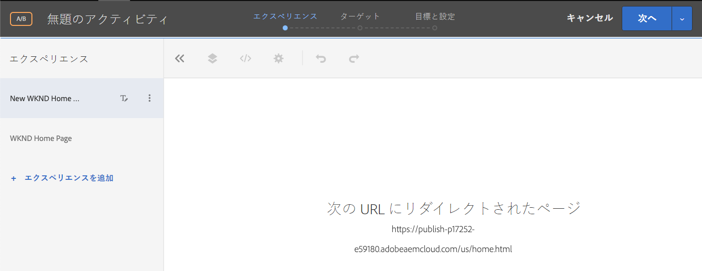
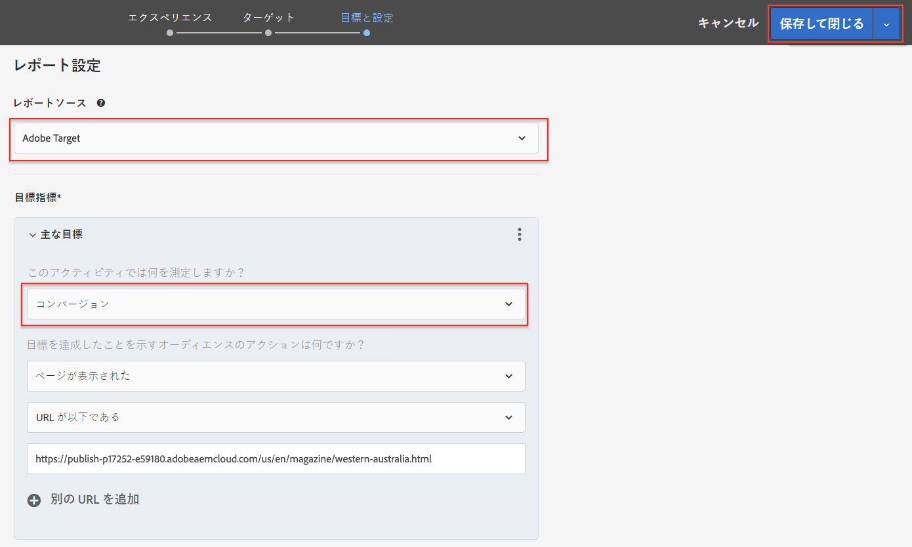
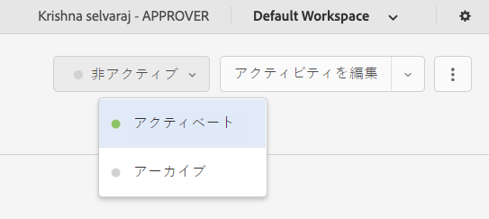
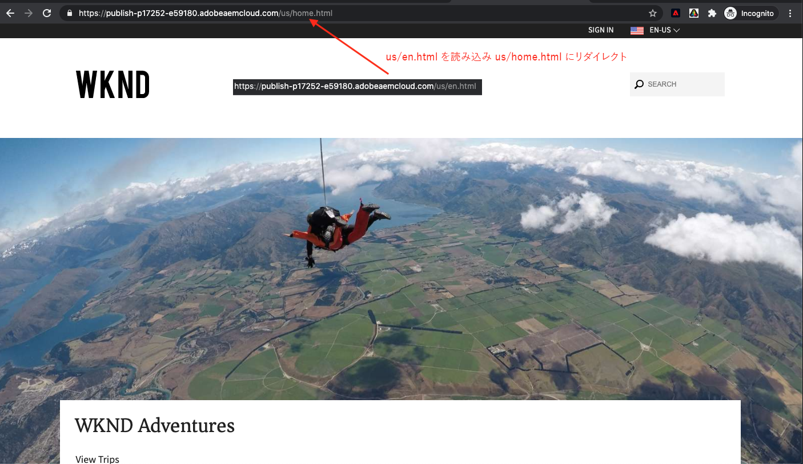

# 完全なWebページエクスペリエンスのパーソナライズ{#personalization-fpe}

AEM上でホストされているサイトページを、Adobe Targetを使用して新しいページにリダイレクトするアクティビティを作成する方法を説明します。

## 前提条件

AEM Webサイトのページ全体をパーソナライズするには、次の設定を行う必要があります。

1. [Adobe Target追加のAEM Webサイト](./add-target-launch-extension.md)
1. [トリガーとAdobe Targetが起動から](./load-and-fire-target.md)

## シナリオの概要

WKNDサイトはホームページを再設計し、現在のホームページ訪問者を新しいホームページにリダイレクトしたいと考えています。 同時に、再設計されたホームページがユーザーの関与と売上高を改善する方法についても理解します。 マーケティング担当者には、訪問者を新しいホームページにリダイレクトするアクティビティを作成するタスクが割り当てられています。 WKNDのサイトホームページを調べ、Adobe Targetを使用したアクティビティの作成方法を学びましょう。

## Visual Experience Composer(VEC)を使用したA/Bテストの作成手順

1. Adobe Targetにログインし、「アクティビティ」タブに移動します
1. **アクティビティを作成**&#x200B;ボタンをクリックし、**A/Bテスト**&#x200B;アクティビティを選択します

   

1. 「**Visual Experience Composer**」オプションを選択し、アクティビティURLを入力して、「**次へ**」をクリックします

   

1. 新しいアクティビティを作成すると、Visual Experience Composerの左側に2つのタブが表示されます。*エクスペリエンスA*&#x200B;と&#x200B;*エクスペリエンスB*。 リストからエクスペリエンスを選択します。 「**エクスペリエンス**」ボタンを使用して、新しいエクスペリエンスをリストに追加追加できます。

   

1. エクスペリエンスAで使用できる表示オプションを選択し、「**URLにリダイレクト**」オプションを選択して、新しいWKNDサイトホームページのURLを指定します。

   

1. *エクスペリエンスA*&#x200B;を&#x200B;*新しいWKNDホームページ*&#x200B;に変更し、*エクスペリエンスB*&#x200B;を&#x200B;*WKNDホームページ*&#x200B;に変更します

   

1. 「**次へ**」をクリックして「ターゲット」に移動し、2つのエクスペリエンス間で手動のトラフィック配分を50 ～ 50に維持します。

   

1. 「目標と設定」で、レポートソースをAdobe Targetとして選択し、目標指標をページ表示アクションを使用したコンバージョンとして選択します。

   

1. アクティビティの名前を入力し、「保存」をクリックします。
1. 保存したアクティビティをアクティブ化して、変更をライブにプッシュします。

   

1. サイトページ(手順3のアクティビティURL)を新しいタブで開き、A/Bテストアクティビティからエクスペリエンス(WKNDホームページまたは新しいWKNDホームページ)のいずれかを表示できるようにします。 `us/en.html` リダイレクト先 `us/home.html`:

   

## 概要

マーケティング担当者は、AEMでホストされるサイトページを、Adobe Targetを使用して新しいページにリダイレクトするアクティビティを作成できました。

## サポートリンク

* [Adobe Experience Cloudデバッガー — Chrome](https://chrome.google.com/webstore/detail/adobe-experience-cloud-de/ocdmogmohccmeicdhlhhgepeaijenapj)
* [Adobe Experience Cloudデバッガ — Firefox](https://addons.mozilla.org/en-US/firefox/addon/adobe-experience-platform-dbg/)

