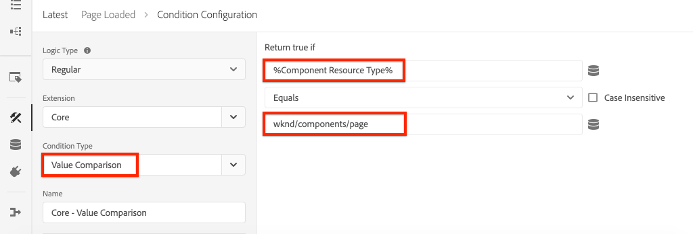

# Adobe Analyticsでのページデータの収集

[Adobeクライアントデータレイヤーの組み込み機能とAEMコアコンポーネント](https://docs.adobe.com/content/help/ja-JP/experience-manager-core-components/using/developing/data-layer/overview.html)を使用して、Adobe Experience Manager Sitesのページに関するデータを収集する方法を説明します。 [Experience Platform Launch と Adobe Analytics 拡張は、ルールを作成して Adobe Analytics にページデータを送信するために使用されます。](https://www.adobe.com/experience-platform/launch.html)[](https://docs.adobe.com/content/help/ja-JP/launch/using/extensions-ref/adobe-extension/analytics-extension/overview.html)

## 作成する内容


このチュートリアルでは、Adobeクライアントデータレイヤーのイベントに基づいてLaunchルールをトリガーし、ルールを起動するタイミングの条件を追加し、AEMページの&#x200B;**Page Name**&#x200B;と&#x200B;**Page Template**&#x200B;をAdobe Analyticsに送信します。

### 目的 {#objective}

1. データレイヤーに対する変更に基づいて、Launchでイベント駆動型ルールを作成する
1. Launchのデータ要素へのページデータレイヤープロパティのマッピング
1. ページデータを収集し、ページビュービーコンと共にAdobe Analyticsに送信

## 前提条件

以下が必要です。

* **Experience Platform** LaunchProperty
* **Adobe** Analyticstest/devレポートスイートIDとトラッキングサーバー。[新しいレポートスイート](https://docs.adobe.com/content/help/en/analytics/admin/manage-report-suites/new-report-suite/new-report-suite.html)の作成については、次のドキュメントを参照してください。
* [Experience Platformデ](https://docs.adobe.com/content/help/en/platform-learn/tutorials/data-ingestion/web-sdk/introduction-to-the-experience-platform-debugger.html) バッガーブラウザー拡張機能。このチュートリアルのスクリーンショットは、Chromeブラウザーからキャプチャしたものです。
* （オプション）[Adobeクライアントデータレイヤーが有効なAEM Site](https://docs.adobe.com/content/help/en/experience-manager-core-components/using/developing/data-layer/overview.html#installation-activation)。 このチュートリアルでは、公開サイト[https://wknd.site/us/en.html](https://wknd.site/us/en.html)を使用しますが、独自のサイトを使用しても構いません。

>[!NOTE]
>
> LaunchとAEMサイトの統合について [このビデオシリーズを参照してください](../experience-platform-launch/overview.md)。

## WKNDサイトのLaunch環境の切り替え

[https://wknd.](https://wknd.site) siteは、AEM実装のリファレンスとチュートリアルとして設計されたオープンソ [ースプロジ](https://github.com/adobe/aem-guides-wknd) ェクトに基づいて構築された、公開 [](https://docs.adobe.com/content/help/ja-JP/experience-manager-learn/getting-started-wknd-tutorial-develop/overview.html) サイトです。

AEM環境を設定してWKNDコードベースをインストールする代わりに、Experience Platformデバッガーを使用して、ライブ[https://wknd.site/](https://wknd.site/)を&#x200B;** Launchプロパティに&#x200B;**切り替えることができます。**&#x200B;もちろん、既に[Adobeクライアントデータレイヤーが有効になっている場合は、独自のAEMサイトを使用できます。](https://docs.adobe.com/content/help/en/experience-manager-core-components/using/developing/data-layer/overview.html#installation-activation)

1. Experience Platform Launchにログインし、[Launchプロパティ](https://docs.adobe.com/content/help/en/core-services-learn/implementing-in-websites-with-launch/configure-launch/launch.html)を作成します（まだ作成していない場合）。
1. 最初のLaunch [ライブラリが作成され、](https://docs.adobe.com/content/help/en/launch/using/reference/publish/libraries.html#create-a-library)Launch [環境](https://docs.adobe.com/content/help/en/launch/using/reference/publish/environments.html)に昇格されていることを確認します。
1. ライブラリの公開先の環境からLaunch埋め込みコードをコピーします。

   

1. ブラウザーで新しいタブを開き、[https://wknd.site/](https://wknd.site/)に移動します。
1. Debuggerブラウザー拡張機能をExperience Platformする

   

1. **Launch** / **設定**&#x200B;に移動し、**挿入された埋め込みコード**&#x200B;の下で、既存のLaunch埋め込みコードを、手順3でコピーした&#x200B;**&#x200B;埋め込みコードに置き換えます。

   

1. 「WKND」タブで、**コンソールログ**&#x200B;と&#x200B;**デバッガーをロック**&#x200B;します。

   

## WKNDサイト上のAdobeクライアントデータレイヤーの確認

[WKND参照プロジェクト](https://github.com/adobe/aem-guides-wknd)は、AEMコアコンポーネントを使用して構築され、[Adobeクライアントデータレイヤーがデフォルトで有効](https://docs.adobe.com/content/help/en/experience-manager-core-components/using/developing/data-layer/overview.html#installation-activation)になっています。 次に、Adobeクライアントデータレイヤーが有効になっていることを確認します。

1. [https://wknd.site](https://wknd.site)に移動します。
1. ブラウザーの開発者ツールを開き、**コンソール**&#x200B;に移動します。 次のコマンドを実行します。

   ```js
   adobeDataLayer.getState();
   ```

   これは、クライアントデータレイヤーのAdobeの現在の状態を返します。

   

1. 応答を展開し、`page`エントリを調べます。 次のようなデータスキーマが表示されます。

   ```json
   page-2eee4f8914:
       @type: "wknd/components/page"
       dc:description: WKND is a collective of outdoors, music, crafts, adventure sports, and travel enthusiasts that want to share our experiences, connections, and expertise with the world.
       dc:title: "WKND Adventures and Travel"
       repo:modifyDate: "2020-08-31T21:02:21Z"
       repo:path: "/content/wknd/us/en.html"
       xdm:language: "en-US"
       xdm:tags: ["Attract"]
       xdm:template: "/conf/wknd/settings/wcm/templates/landing-page-template"
   ```

   データレイヤーの[ページスキーマ](https://docs.adobe.com/content/help/en/experience-manager-core-components/using/developing/data-layer/overview.html#page)、`dc:title`、`xdm:language`および`xdm:template`から派生した標準プロパティを使用して、Adobe Analyticsにページデータを送信します。

   >[!NOTE]
   >
   > `adobeDataLayer` JavaScriptオブジェクトが表示されない場合 サイトで[Adobeクライアントデータレイヤーが有効](https://docs.adobe.com/content/help/en/experience-manager-core-components/using/developing/data-layer/overview.html#installation-activation)になっていることを確認します。

## 「Page Loaded」ルールの作成

Adobeクライアントデータレイヤーは、**イベント**&#x200B;駆動型データレイヤーです。 AEM **Page**&#x200B;データレイヤーが読み込まれると、イベント`cmp:show`がトリガーされます。 `cmp:show`イベントに基づいてトリガーされるルールを作成します。

1. Experience Platform Launchに移動し、AEM Siteと統合されたWebプロパティに移動します。
1. Launch UIの「**ルール**」セクションに移動し、「**新しいルールを作成**」をクリックします。

   

1. ルールに「**Page Loaded**」と名前を付けます。
1. **イベント** **追加**&#x200B;をクリックして、**イベント設定**&#x200B;ウィザードを開きます。
1. 「**イベントタイプ**」で、「**カスタムコード**」を選択します。

   

1. メインパネルで「**エディターを開く**」をクリックし、次のコードスニペットを入力します。

   ```js
   var pageShownEventHandler = function(evt) {
      // defensive coding to avoid a null pointer exception
      if(evt.hasOwnProperty("eventInfo") && evt.eventInfo.hasOwnProperty("path")) {
         //trigger Launch Rule and pass event
         console.debug("cmp:show event: " + evt.eventInfo.path);
         var event = {
            //include the path of the component that triggered the event
            path: evt.eventInfo.path,
            //get the state of the component that triggered the event
            component: window.adobeDataLayer.getState(evt.eventInfo.path)
         };
   
         //Trigger the Launch Rule, passing in the new `event` object
         // the `event` obj can now be referenced by the reserved name `event` by other Launch data elements
         // i.e `event.component['someKey']`
         trigger(event);
      }
   }
   
   //set the namespace to avoid a potential race condition
   window.adobeDataLayer = window.adobeDataLayer || [];
   //push the event listener for cmp:show into the data layer
   window.adobeDataLayer.push(function (dl) {
      //add event listener for `cmp:show` and callback to the `pageShownEventHandler` function
      dl.addEventListener("cmp:show", pageShownEventHandler);
   });
   ```

   上記のコードスニペットでは、[関数](https://github.com/adobe/adobe-client-data-layer/wiki#pushing-a-function)をデータレイヤーにプッシュしてイベントリスナーを追加します。 `cmp:show`イベントがトリガーされると、`pageShownEventHandler`関数が呼び出されます。 この関数では、いくつかのサニティチェックが追加され、イベントをトリガーしたコンポーネントのデータレイヤー](https://github.com/adobe/adobe-client-data-layer/wiki#getstate)の最新の[状態で新しい`event`が構築されます。

   その後、`trigger(event)`が呼び出されます。 `trigger()` は、Launchでの予約名で、Launchルールを「トリガー」します。`event`オブジェクトをパラメーターとして渡し、その後、`event`という名前のLaunchで別の予約名で公開します。 Launchのデータ要素で、次のような様々なプロパティを参照できるようになりました。`event.component['someKey']`.

1. 変更内容を保存します。
1. 次に、「**アクション**」の下の「**追加**」をクリックして、「**アクションの設定**」ウィザードを開きます。
1. 「**アクションタイプ**」で、「**カスタムコード**」を選択します。

   

1. メインパネルで「**エディターを開く**」をクリックし、次のコードスニペットを入力します。

   ```js
   console.debug("Page Loaded ");
   console.debug("Page name: " + event.component['dc:title']);
   console.debug("Page type: " + event.component['@type']);
   console.debug("Page template: " + event.component['xdm:template']);
   ```

   `event`オブジェクトは、カスタムイベントで呼び出される`trigger()`メソッドから渡されます。 `component` は、カスタムイベントのデータレイヤーから派生 `getState` した現在のページです。以前の[ページスキーマ](https://docs.adobe.com/content/help/en/experience-manager-core-components/using/developing/data-layer/overview.html#page)をデータレイヤーで公開して、すぐに使用できる様々なキーを確認できるようにしたことを思い出してください。

1. 変更を保存し、Launchで[ビルド](https://docs.adobe.com/content/help/en/launch/using/reference/publish/builds.html)を実行して、AEMサイトで使用する[環境](https://docs.adobe.com/content/help/en/launch/using/reference/publish/environments.html)にコードを昇格させます。

   >[!NOTE]
   >
   > [Adobe Experience Platform Debugger](https://docs.adobe.com/content/help/en/platform-learn/tutorials/data-ingestion/web-sdk/introduction-to-the-experience-platform-debugger.html)を使用して、埋め込みコードを&#x200B;**開発**&#x200B;環境に切り替えると非常に役立ちます。

1. AEMサイトに移動し、開発者ツールを開いてコンソールを表示します。 ページを更新すると、コンソールメッセージがログに記録されていることが確認できます。

   

## データ要素の作成

次に、複数のデータ要素を作成し、Adobeクライアントデータレイヤーから異なる値を取り込みます。 前の演習で見たように、カスタムコードを使用してデータレイヤーのプロパティに直接アクセスできます。 データ要素を使用する利点は、Launchルール全体で再利用できる点です。

以前の[ページスキーマ](https://docs.adobe.com/content/help/en/experience-manager-core-components/using/developing/data-layer/overview.html#page)をデータレイヤーで公開した後に呼び出します。

データ要素は、`@type`、`dc:title`および`xdm:template`プロパティにマッピングされます。

### コンポーネントリソースタイプ

1. Experience Platform Launchに移動し、AEM Siteと統合されたWebプロパティに移動します。
1. 「**データ要素**」セクションに移動し、「**新しいデータ要素を作成**」をクリックします。
1. **名前**&#x200B;には、**コンポーネントリソースタイプ**&#x200B;と入力します。
1. **データ要素のタイプ**&#x200B;に対して、**カスタムコード**&#x200B;を選択します。

   

1. 「**エディターを開く**」をクリックし、カスタムコードエディターで次のように入力します。

   ```js
   if(event && event.component && event.component.hasOwnProperty('@type')) {
       return event.component['@type'];
   }
   ```

   変更内容を保存します。

   >[!NOTE]
   >
   > `event`オブジェクトは、Launchで&#x200B;**ルール**&#x200B;をトリガーしたイベントに基づいて使用可能になり、範囲が指定されます。 データ要素の値は、ルール内でデータ要素が&#x200B;*参照*&#x200B;されるまで設定されません。 したがって、このデータ要素は、前の手順&#x200B;*で作成した「**Page Loaded**」ルールなどのルール内で安全に使用できますが、他のコンテキストでは安全に使用できません。*

### ページ名

1. 「**データ要素を追加**」をクリックします。
1. **名前**&#x200B;には、**ページ名**&#x200B;と入力します。
1. **データ要素のタイプ**&#x200B;に対して、**カスタムコード**&#x200B;を選択します。
1. 「**エディターを開く**」をクリックし、カスタムコードエディターで次のように入力します。

   ```js
   if(event && event.component && event.component.hasOwnProperty('dc:title')) {
       return event.component['dc:title'];
   }
   ```

   変更内容を保存します。

### ページテンプレート

1. 「**データ要素を追加**」をクリックします。
1. **名前**&#x200B;には、**ページテンプレート**&#x200B;と入力します。
1. **データ要素のタイプ**&#x200B;に対して、**カスタムコード**&#x200B;を選択します。
1. 「**エディターを開く**」をクリックし、カスタムコードエディターで次のように入力します。

   ```js
   if(event && event.component && event.component.hasOwnProperty('xdm:template')) {
       return event.component['xdm:template'];
   }
   ```

   変更内容を保存します。

1. これで、ルールの一部として3つのデータ要素が必要になりました。

   

## Analytics拡張機能の追加

次に、Analytics拡張機能をLaunchプロパティに追加します。 このデータはどこかで送る必要がある！

1. Experience Platform Launchに移動し、AEM Siteと統合されたWebプロパティに移動します。
1. **拡張機能** > **カタログ**&#x200B;に移動します。
1. **Adobe Analytics**&#x200B;拡張機能を探し、「**インストール**」をクリックします。

   

1. **ライブラリ管理** / **レポートスイート**&#x200B;で、各Launch環境で使用するレポートスイートIDを入力します。

   

   >[!NOTE]
   >
   > このチュートリアルでは、すべての環境に対して1つのレポートスイートを使用しても構いませんが、実際の環境では、次の画像に示すように、個別のレポートスイートを使用する必要があります

   >[!TIP]
   >
   >*ライブラリを最新の状態に保ちやすいので、*「自分のライブラリを管理」オプション`AppMeasurement.js`をライブラリ管理設定として使用することをお勧めします。

1. 「**Activity Map**&#x200B;を使用」チェックボックスをオンにします。

   

1. 「**一般**/**トラッキングサーバー**」に、トラッキングサーバー(例：`tmd.sc.omtrdc.net`と入力します。 サイトが`https://`をサポートしている場合は、SSLトラッキングサーバーを入力します。

   

1. 「**保存**」をクリックして、変更を保存します。

## 「Page Loaded」ルールに条件を追加する

次に、**Page Loaded**&#x200B;ルールを更新して、**Component Resource Type**&#x200B;データ要素を使用し、`cmp:show`イベントが&#x200B;**Page**&#x200B;に対してのみ実行されるようにします。 `cmp:show`イベントを発生させる他のコンポーネント。例えば、カルーセルコンポーネントは、スライドが変更されると実行します。 したがって、このルールに条件を追加することが重要です。

1. Launch UIで、前に作成した「**Page Loaded**」ルールに移動します。
1. 「**条件**」で「**追加**」をクリックし、「**条件の設定**」ウィザードを開きます。
1. 「**条件の種類**」で「**値の比較**」を選択します。
1. フォームフィールドの最初の値を`%Component Resource Type%`に設定します。 データ要素アイコンを使用して、**コンポーネントリソースタイプ**&#x200B;データ要素を選択できます。 比較器を`Equals`のままにします。
1. 2番目の値を`wknd/components/page`に設定します。

   

   >[!NOTE]
   >
   > この条件は、このチュートリアルで前に作成した`cmp:show`イベントをリッスンするカスタムコード関数内に追加できます。 ただし、UI内に追加すると、ルールを変更する必要が生じる可能性のある追加のユーザーをより明確に把握できます。 加えて、データ要素を使用できます！

1. 変更内容を保存します。

## Analytics変数とトリガーページビュービーコンの設定

現在、**Page Loaded**&#x200B;ルールは、単にコンソールステートメントを出力します。 次に、データ要素とAnalytics拡張機能を使用して、**Page Loaded**&#x200B;ルールでAnalytics変数を&#x200B;**アクション**&#x200B;として設定します。 また、**ページビュービーコン**&#x200B;をトリガーし、収集したデータをAdobe Analyticsに送信する追加のアクションも設定します。

1. **Page Loaded**&#x200B;ルール&#x200B;**remove** the **Core - Custom Code**&#x200B;アクション（コンソールステートメント）:

   

1. 「アクション」の下の「**追加**」をクリックして、新しいアクションを追加します。
1. **Extension**&#x200B;タイプを&#x200B;**Adobe Analytics**&#x200B;に設定し、**アクションタイプ**&#x200B;を&#x200B;**変数を設定**&#x200B;に設定します。

   

1. メインパネルで、使用可能な&#x200B;**eVar**&#x200B;を選択し、データ要素&#x200B;**ページテンプレート**&#x200B;の値としてを設定します。 データ要素アイコンを使用して、**ページテンプレート**&#x200B;要素を選択します。

   

1. 「**追加の設定**」で下にスクロールし、「**ページ名**」をデータ要素&#x200B;**ページ名**&#x200B;に設定します。

   

   変更内容を保存します。

1. 次に、**プラス**&#x200B;アイコンをタップして、**Adobe Analyticsの右側に「アクション」を追加し、変数**&#x200B;を設定します。

   

1. **Extension**&#x200B;タイプを&#x200B;**Adobe Analytics**&#x200B;に設定し、**アクションタイプ**&#x200B;を&#x200B;**Send Beacon**&#x200B;に設定します。 これはページビューと見なされるので、デフォルトのトラッキング設定は&#x200B;**`s.t()`**&#x200B;のままにします。

   

1. 変更内容を保存します。**Page Loaded**&#x200B;ルールには、次の設定が必要です。

   

   * **1.** イベントをリッスン `cmp:show` します。
   * **2.** イベントがページによってトリガーされたことを確認します。
   * **3.** ページ名およびページテ **ンプレ** ートのAnalytics **変数の設定**
   * **4.** Analyticsページビュービーコンの送信
1. すべての変更を保存し、Launchライブラリをビルドして、適切な環境に昇格します。

## ページビュービーコンとAnalytics呼び出しの検証

これで、**Page Loaded**&#x200B;ルールがAnalyticsビーコンを送信したので、Experience Platformデバッガーを使用してAnalyticsトラッキング変数を表示できます。

1. ブラウザーで[WKND Site](https://wknd.site/us/en.html)を開きます。
1. デバッガーアイコンをクリックして、Experience Platformデバッガーを開きます。
1. 前述のように、デバッガーがLaunchプロパティを&#x200B;*お使いの*&#x200B;開発環境にマッピングしていることを確認し、**コンソールログ**&#x200B;を確認します。
1. Analyticsメニューを開き、レポートスイートが&#x200B;**&#x200B;レポートスイートに設定されていることを確認します。 ページ名も入力する必要があります。

   

1. 下にスクロールし、**Network Requests**&#x200B;を展開します。 **ページテンプレート**&#x200B;に設定された&#x200B;**evar**&#x200B;を見つけることができます。

   

1. ブラウザーに戻り、デベロッパーコンソールを開きます。 ページ上部の&#x200B;**カルーセル**&#x200B;をクリックします。

   

1. ブラウザーコンソールで、コンソールステートメントを確認します。

   

   これは、カルーセルが`cmp:show`イベント&#x200B;*をトリガーし、*&#x200B;をチェックしたので、**コンポーネントのリソースタイプ**&#x200B;を確認したので、イベントは発生しないためです。

   >[!NOTE]
   >
   > コンソールログが表示されない場合は、Experience Platformデバッガーの&#x200B;**Launch**&#x200B;で&#x200B;**コンソールログ**&#x200B;がオンになっていることを確認してください。

1. [西オーストラリア](https://wknd.site/us/en/magazine/western-australia.html)のような記事ページに移動します。 「ページ名」と「テンプレートタイプ」が変更されるのを確認します。

## バリデーターが

イベントドリブン型のAdobeクライアントデータレイヤーとExperience Platform Launchを使用して、AEM Siteからデータページデータを収集し、Adobe Analyticsに送信しただけです。

### 次の手順

次のチュートリアルを参照して、イベントドリブン型Adobeクライアントデータレイヤーを使用して、Adobe Experience Managerサイト上の特定のコンポーネントのクリックを[追跡する方法を学びます](track-clicked-component.md)。
