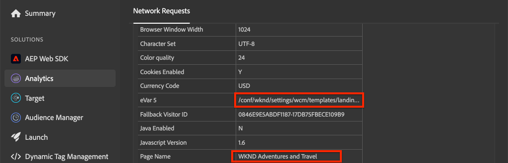

# Adobe Analyticsとページデータを収集する

Adobe Experience Manager Sitesのページに関するデータを収集するために、 [Adobeクライアントデータレイヤーの組み込み機能とAEMコアコンポーネント](https://docs.adobe.com/content/help/en/experience-manager-core-components/using/developing/data-layer/overview.html) （英語）を使用する方法を説明します。 [Experience Platform Launch](https://www.adobe.com/experience-platform/launch.html) と [Adobe Analytics拡張子は](https://docs.adobe.com/content/help/ja-JP/launch/using/extensions-ref/adobe-extension/analytics-extension/overview.html) 、Adobe Analyticsにページデータを送信するルールの作成に使用されます。

## 作成する内容


このチュートリアルでは、Adobeクライアントデータレイヤーからのイベントに基づいて起動ルールをトリガし、いつルールを起動するかの条件を追加し、AEMページの **ページ名** と **ページテンプレート** (Page Name)をAdobe Analyticsに送信します。

### 目的 {#objective}

1. データレイヤーに対する変更に基づいて、起動でイベント型ルールを作成する
1. 「起動」でページデータレイヤーのプロパティをデータ要素にマップ
1. ページデータを収集し、ページ表示ビーコンと共にAdobe Analyticsに送信

## 前提条件

以下は必須です。

* **Experience Platform Launch** プロパティ
* **Adobe Analytics** test/devレポートスイートIDとトラッキングサーバー。 新しいレポートスイートを [作成するには、次のドキュメントを参照してください](https://docs.adobe.com/content/help/en/analytics/admin/manage-report-suites/new-report-suite/new-report-suite.html)。
* [Experience Platformデバッガ](https://docs.adobe.com/content/help/en/platform-learn/tutorials/data-ingestion/web-sdk/introduction-to-the-experience-platform-debugger.html) ブラウザ拡張機能。 Chromeブラウザーでキャプチャした、このチュートリアルのスクリーンショットです。
* （オプション） [Adobeクライアントデータレイヤーが有効なAEMサイト](https://docs.adobe.com/content/help/en/experience-manager-core-components/using/developing/data-layer/overview.html#installation-activation)。 このチュートリアルでは、公開サイトhttps://wknd.site/us/en.htmlを使用し [ますが](https://wknd.site/us/en.html) 、お客様独自のサイトをご利用いただけるようお勧めします。

>[!NOTE]
>
> LaunchとAEMサイトの統合に関するヘルプが必要ですか？ [このビデオシリーズを参照してください](../experience-platform-launch/overview.md)。

## WKNDサイトの起動環境の切り替え

[https://wknd.site](https://wknd.site) は、AEM実装のリファレンスと [チュートリアルとして設計されたオープンソースプロジェクト](https://github.com/adobe/aem-guides-wknd)[](https://docs.adobe.com/content/help/ja-JP/experience-manager-learn/getting-started-wknd-tutorial-develop/overview.html) （オープンソースプロジェクト）に基づいて構築された、公開されるサイトです。

AEM環境を設定してWKNDコードベースをインストールする代わりに、Experience Platformデバッガーを使用して **、本番用のhttps://wknd.site/** を [Launchプロパティに](https://wknd.site/)** 切り替えることができます。 既に [Adobeクライアントデータレイヤーが有効になっている場合は、独自のAEMサイトを使用できます。](https://docs.adobe.com/content/help/en/experience-manager-core-components/using/developing/data-layer/overview.html#installation-activation)

1. Experience Platform Launchにログインし、起動プロパティを [作成します](https://docs.adobe.com/content/help/en/core-services-learn/implementing-in-websites-with-launch/configure-launch/launch.html) （まだ作成していない場合）。
1. 最初の起動 [ライブラリが作成され](https://docs.adobe.com/content/help/en/launch/using/reference/publish/libraries.html#create-a-library) 、起動 [環境に昇格されていることを確認します](https://docs.adobe.com/content/help/ja-JP/launch/using/reference/publish/environments.html)。
1. ライブラリの公開先の環境から「開始」埋め込みコードをコピーします。

   

1. ブラウザーで新しいタブを開き、https://wknd.site/に移動し [ます。](https://wknd.site/)
1. Experience Platformデバッガブラウザ拡張機能を開く

   

1. **起動** / **設定に移動し、「** 挿入された埋め込みコード **」の下の既存の起動コードを、手順3でコピーした埋め込みコード**** の既存の起動コードに置き換えます。

   

1. [ **コンソールログ** ]を有効にし、[WKND]タブでデバッガをロックします **** 。

   

## WKNDサイトのAdobeクライアントデータレイヤーの確認

[WKNDリファレンスプロジェクト](https://github.com/adobe/aem-guides-wknd) は、AEMコアコンポーネントを使用して構築され、デフォルトで [Adobeクライアントデータレイヤーが有効になっています](https://docs.adobe.com/content/help/en/experience-manager-core-components/using/developing/data-layer/overview.html#installation-activation) 。 次に、Adobeクライアントデータレイヤーが有効になっていることを確認します。

1. https://wknd.siteに移動し [ます](https://wknd.site)。
1. ブラウザの開発者ツールを開き、 **コンソールに移動します**。 次のコマンドを実行します。

   ```js
   adobeDataLayer.getState();
   ```

   Adobeクライアントデータレイヤーの現在の状態を返します。

   

1. 応答を展開し、 `page` エントリを調べます。 次のようなデータスキーマが表示されます。

   ```json
   page-2eee4f8914:
       @type: "wknd/components/page"
       dc:description: "WKND is a collective of outdoors, music, crafts, adventure sports, and travel enthusiasts that want to share our experiences, connections, and expertise with the world."
       dc:title: "WKND Adventures and Travel"
       repo:modifyDate: "2020-08-31T21:02:21Z"
       repo:path: "/content/wknd/us/en.html"
       xdm:language: "en-US"
       xdm:tags: ["Attract"]
       xdm:template: "/conf/wknd/settings/wcm/templates/landing-page-template"
   ```

   ここでは、 [ページスキーマ](https://docs.adobe.com/content/help/en/experience-manager-core-components/using/developing/data-layer/overview.html#page)、 `dc:title`およびデータレイヤーの標準プロパティを使用し `xdm:language``xdm:template` て、ページデータをAdobe Analyticsに送信します。

   >[!NOTE]
   >
   > JavaScriptオブジェクトが表示されない `adobeDataLayer` 場合 サイトで [Adobeクライアントデータレイヤーが有効になっていることを確認します](https://docs.adobe.com/content/help/en/experience-manager-core-components/using/developing/data-layer/overview.html#installation-activation) 。

## ページ型ルールの作成

Adobe・クライアント・データ・レイヤーは、 **イベント** 駆動データ・レイヤーです。 AEM **Page** データレイヤーが読み込まれると、イベントがトリガーされ `cmp:show`ます。 イベントに基づいてトリガーされるルールを作成し `cmp:show` ます。

1. Experience Platform Launchに移動し、AEM Siteに統合されたWebプロパティに移動します。
1. 「UIの起動」の「 **ルール** 」セクションに移動し、「新しいルールを **作成**」をクリックします。

   

1. ルールに「 **Page Loaded**」という名前を付けます。
1. 「 **イベント****」をクリックし、** イベント設定 **** ウィザードを開きます。
1. 「 **イベントタイプ** 」で「 **カスタムコード**」を選択します。

   

1. メインパネルで **「エディターを開く** 」をクリックし、次のコードスニペットを入力します。

   ```js
   var pageShownEventHandler = function(evt) {
      // defensive coding to avoid a null pointer exception
      if(evt.hasOwnProperty("eventInfo") && evt.eventInfo.hasOwnProperty("path")) {
         //trigger Launch Rule and pass event
         console.debug("cmp:show event: " + evt.eventInfo.path);
         var event = {
            //include the path of the component that triggered the event
            path: evt.eventInfo.path,
            //get the state of the component that triggered the event
            component: window.adobeDataLayer.getState(evt.eventInfo.path)
         };
   
         //Trigger the Launch Rule, passing in the new `event` object
         // the `event` obj can now be referenced by the reserved name `event` by other Launch data elements
         // i.e `event.component['someKey']`
         trigger(event);
      }
   }
   
   //set the namespace to avoid a potential race condition
   window.adobeDataLayer = window.adobeDataLayer || [];
   //push the event listener for cmp:show into the data layer
   window.adobeDataLayer.push(function (dl) {
      //add event listener for `cmp:show` and callback to the `pageShownEventHandler` function
      dl.addEventListener("cmp:show", pageShownEventHandler);
   });
   ```

   上記のコードスニペットでは、関数をデータレイヤーに [プッシュしてイベントリスナーを追加します](https://github.com/adobe/adobe-client-data-layer/wiki#pushing-a-function) 。 イベントがトリガされると、 `cmp:show` 関数が呼び出され `pageShownEventHandler` ます。 この関数では、いくつかのサニティチェックが追加され、イベントをトリガーしたコンポーネントのデータレイヤーの最新 `event` 状態で新しい状態が構築されます [](https://github.com/adobe/adobe-client-data-layer/wiki#getstate) 。

   その後 `trigger(event)` に。 `trigger()` は、起動で予約された名前で、起動ルールを「トリガー」します。 この `event` オブジェクトをパラメータとして渡し、その後、Launch内の別の予約名で公開され `event`ます。 起動のデータ要素は、次のような様々なプロパティを参照できるようになりました。 `event.component['someKey']`.

1. 変更内容を保存します。
1. 「 **アクション** 」の次に **、「** 追加」をクリックして「 **アクションの設定** 」ウィザードを開きます。
1. 「 **アクションタイプ** 」で、「 **カスタムコード**」を選択します。

   

1. メインパネルで **「エディターを開く** 」をクリックし、次のコードスニペットを入力します。

   ```js
   console.debug("Page Loaded ");
   console.debug("Page name: " + event.component['dc:title']);
   console.debug("Page type: " + event.component['@type']);
   console.debug("Page template: " + event.component['xdm:template']);
   ```

   この `event` オブジェクトは、カスタムイベントで呼び出される `trigger()` メソッドから渡されます。 `component` は、カスタムイベントのデータレイヤーから派生した現在 `getState` のページです。 初期の段階では、 [ページスキーマ](https://docs.adobe.com/content/help/en/experience-manager-core-components/using/developing/data-layer/overview.html#page) (Page)がデータレイヤーによって公開されていて、あらかじめ用意されている様々なキーを確認できます。

1. 変更を保存し、「起動」で [ビルドを実行して](https://docs.adobe.com/content/help/en/launch/using/reference/publish/builds.html) 、コードをAEMサイトで [](https://docs.adobe.com/content/help/ja-JP/launch/using/reference/publish/environments.html) 使用されている環境に移行します。

   >[!NOTE]
   >
   > 埋め込みコードを [開発](https://docs.adobe.com/content/help/en/platform-learn/tutorials/data-ingestion/web-sdk/introduction-to-the-experience-platform-debugger.html) 環境に切り替えるには、 **** Adobe Experience Platformデバッガを使用すると非常に便利です。

1. AEMサイトに移動し、開発者ツールを開いてコンソールを表示します。 ページを更新すると、コンソールメッセージがログに記録されていることが確認できます。

   

## データ要素の作成

次に、複数のデータ要素を作成して、Adobeクライアントデータレイヤーから様々な値を取り込みます。 前の練習で見たように、カスタムコードを使用してデータレイヤーのプロパティに直接アクセスできます。 データ要素を使用する利点は、起動ルール全体で再利用できる点です。

以前は、データレイヤーによって [公開されたページスキーマ](https://docs.adobe.com/content/help/en/experience-manager-core-components/using/developing/data-layer/overview.html#page) :

データ要素は、、、 `@type`およびの各 `dc:title``xdm:template` プロパティにマップされます。

### コンポーネントリソースタイプ

1. Experience Platform Launchに移動し、AEM Siteに統合されたWebプロパティに移動します。
1. 「 **データ要素** 」セクションに移動し、「新しいデータ要素の **作成**」をクリックします。
1. [ **名前** ]に **、** Component Resource Typeと入力します。
1. 「 **データ要素のタイプ** 」で「 **カスタムコード**」を選択します。

   

1. 「 **エディターを開く** 」をクリックし、カスタムコードエディターで次のように入力します。

   ```js
   if(event && event.component && event.component.hasOwnProperty('@type')) {
       return event.component['@type'];
   }
   ```

   変更内容を保存します。

   >[!NOTE]
   >
   > オブジェクトが使用可能になり、起動時にルー `event` ルをトリガーしたイベントに基づいてスコープされることを忘れないで **ください** 。 データ要素の値は、データ要素がルール内で *参照されるまで設定されません* 。 したがって、前の手順で作成した **ページが読み込まれたルールのように、ルール内でこのデータ要素を使用しても安全です** が、他のコンテキストでは安全ではありません ** 。

### ページ名

1. 「 **追加データ要素**」をクリックします。
1. [ **名前** ]に **Page Nameと入力します**。
1. 「 **データ要素のタイプ** 」で「 **カスタムコード**」を選択します。
1. 「 **エディターを開く** 」をクリックし、カスタムコードエディターで次のように入力します。

   ```js
   if(event && event.component && event.component.hasOwnProperty('dc:title')) {
       return event.component['dc:title'];
   }
   ```

   変更内容を保存します。

### ページテンプレート

1. 「 **追加データ要素**」をクリックします。
1. [ **名前** ]に **Page Nameと入力します**。
1. 「 **データ要素のタイプ** 」で「 **カスタムコード**」を選択します。
1. 「 **エディターを開く** 」をクリックし、カスタムコードエディターで次のように入力します。

   ```js
   if(event && event.component && event.component.hasOwnProperty('xdm:template')) {
       return event.component['xdm:template'];
   }
   ```

   変更内容を保存します。

1. これで、ルールの一部として3つのデータ要素が作成されます。

   

## Analytics追加拡張機能

次に、Analyticsの拡張機能をLaunchプロパティに追加します。 このデータはどこかに送る必要がある！

1. Experience Platform Launchに移動し、AEM Siteに統合されたWebプロパティに移動します。
1. エクス **テンション** / **カタログに移動**
1. **Adobe Analytics** 拡張機能を探し、「 **Install」をクリックします**

   

1. ライ **ブラリ管理** / **レポートスイート**&#x200B;で、各起動環境で使用するレポートスイートIDを入力します。

   

   >[!NOTE]
   >
   > このチュートリアルのすべての環境に対して1つのレポートスイートを使用しても問題ありませんが、実際には、次の図のように、個別のレポートスイートを使用する必要があります。

   >[!TIP]
   >
   >ライブラリの管理設定では、ライブラリを最新の状態に維持しやすいので *、「ライブラリを自分用に* 管理 `AppMeasurement.js` 」オプションを使用することをお勧めします。

1. **一般** / **トラッキングサーバー**、 `tmd.sc.omtrdc.net`. サイトで `https://`

   

1. 「**保存**」をクリックして、変更を保存します。

## Page Loaded追加ルールの条件

次に、「 **Page Loaded** 」ルールを更新し、「 **Component Resource Type** 」データ要素を使用して、ルールが `cmp:show` Pageの **イベントの場合にのみ実行されるようにします**。 他のコンポーネントでは、 `cmp:show` イベントを実行できます。例えば、カルーセルコンポーネントは、スライドが変更されると起動します。 したがって、このルールに条件を追加することが重要です。

1. 起動UIで、前に作成した **ページが読み込まれた** 」ルールに移動します。
1. 「 **条件** 」の下の「 **追加** 」をクリックして、 **条件の設定** ウィザードを開きます。
1. 「 **条件タイプ** 」で、「 **値の比較**」を選択します。
1. フォームフィールドの最初の値をに設定し `%Component Resource Type%`ます。 データ要素アイコン  、「 **Component Resource Type** 」データ要素を選択できます。 比較器をに設定したままにし `Equals`ます。
1. 2番目の値をに設定し `wknd/components/page`ます。

   

   >[!NOTE]
   >
   > この条件は、このチュートリアルの前述の例で作成した `cmp:show` イベントをリッスンするカスタムコード関数内に追加できます。 ただし、UI内に追加すると、ルールの変更が必要になる可能性のある追加のユーザをより明確に表示できます。 加えてデータ要素を使う！

1. 変更内容を保存します。

## Analytics変数の設定とページ表示ビーコンのトリガー

現在、 **Page Loaded** （ページ読み込み済み）ルールは、単にコンソール文を出力します。 次に、データ要素とAnalytics拡張機能を使用して、Analytics変数を **ページ読み込み済み****(** ページ)ルールのアクションとして設定します。 また、 **ページ表示ビーコンをトリガーし、収集したデータをAdobe Analyticsに送信する追加アクションも設定します** 。

1. 「 **Page Loaded** 」ルールで **、「** Core - Custom Code **** （コンソール文）」アクションを削除します。

   

1. 「アクション」の下のをクリックし **** 追加て、新しいアクションを追加します。
1. 「 **拡張子** 」タイプを「 **Adobe Analytics** 」に設定し、「 **アクションタイプ** 」を「 **変数」に設定します**

   

1. メインパネルで使用可能な **eVarを選択し** 、データ要素 **ページテンプレートの値として設定します**。 データ要素アイコン  を使用して、 **ページテンプレート** 要素を選択します。

   

1. 「 **追加設定** 」で下にスクロールし、「 **ページ名** 」をデータ要素「 **ページ名**」に設定します。

   

   変更内容を保存します。

1. 次に、 **Adobe Analyticsの右側に「アクション — 変数を設定** 」を追加します。次に、 **プラス** アイコンをタップします。

   

1. 「 **Extension** type( **拡張のタイプ)」を** 「 **Adobe Analytics** 」に設定し、「Action Type（アクションのタイプ） **」を「Send Beacon**」に設定します。 これはページ表示と見なされるので、デフォルトのトラッキングはに設定したままにし **`s.t()`**&#x200B;ます。

   

1. 変更内容を保存します。これで、 **Page Loaded** Ruleの設定は次のようになります。

   

   * **1.** イベントをリッスンし `cmp:show` ます。
   * **2.** イベントがページによってトリガーされたことを確認します。
   * **3.** ページ名 **および****ページテンプレートのAnalytics変数の設定**
   * **4.** Analyticsページ表示ビーコンの送信
1. すべての変更を保存し、起動ライブラリを作成して、適切な環境に昇格します。

## ページ表示ビーコンとAnalytics呼び出しの検証

これで、 **ページが読み込まれた** 」ルールがAnalyticsビーコンを送信したので、Experience Platformデバッガーを使用してAnalyticsトラッキング変数を確認できるはずです。

1. ブラウザで [WKNDサイト](https://wknd.site/us/en.html) を開きます。
1. デバッガーアイコン「  、Experience Platformデバッガーを開きます。
1. 前述のとおり、デバッガがLaunchプロパティを開発環境にマッピングし *ていることを確認し* 、[ **コンソールログ** ]がオンになっていることを確認します。
1. Analyticsメニューを開き、レポートスイートがレポートスイートに設定されている *ことを確認します* 。 ページ名も入力する必要があります。

   

1. 下にスクロールし、「 **ネットワーク要求**」を展開します。 **ページテンプレートに対する** evar **の設定は、次のようになっています**。

   

1. ブラウザーに戻り、デベロッパーコンソールを開きます。 ページ上部の **カルーセル** （「カルーセル」）をクリックします。

   

1. ブラウザーコンソールで、コンソール文を確認します。

   

   これは、カルーセルが `cmp:show` イベントをトリガーし *ますが* 、 **Component Resource Type**（コンポーネントリソースタイプ）を確認したので、イベントが起動されないからです。

   >[!NOTE]
   >
   > コンソールログが表示されない場合は、 **Experience Platformデバッガの「** 起動 **」で「コンソールログ** 」がオンになっていることを確認してください。

1. 「 [西オーストラリア」などの記事ページに移動します](https://wknd.site/us/en/magazine/western-australia.html)。 [ページ名]と[テンプレートタイプ]が変化することを確認します。

## バリデーターが

先ほど、イベント主導型のAdobeクライアントデータレイヤーとExperience Platform Launchを使用して、AEMサイトからデータページデータを収集し、Adobe Analyticsに送信しました。

### 次の手順

次のチュートリアルを見て、イベント主導型のAdobeクライアントデータレイヤーを使用して、Adobe Experience Managerサイトの特定のコンポーネントのクリックを [追跡する方法を学習します](track-clicked-component.md)。
