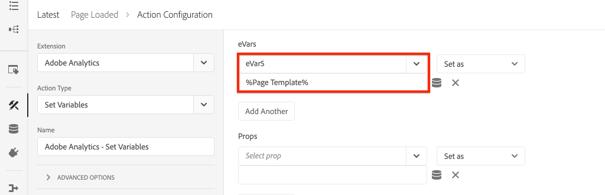

# Adobe Analyticsでのページデータの収集

の組み込み機能の使用方法を学ぶ [AdobeクライアントデータレイヤーとAEMコアコンポーネント](https://experienceleague.adobe.com/docs/experience-manager-core-components/using/developing/data-layer/overview.html?lang=ja) をクリックして、Adobe Experience Manager Sitesのページに関するデータを収集します。 [Experience Platform Launch](https://www.adobe.com/experience-platform/launch.html?lang=ja) そして [Adobe Analytics拡張機能](https://experienceleague.adobe.com/docs/experience-platform/tags/extensions/adobe/analytics/overview.html?lang=ja) は、ページデータをAdobe Analyticsに送信するルールを作成するために使用されます。

## 作成する内容


このチュートリアルでは、Adobeクライアントデータレイヤーのイベントに基づいて Launch ルールをトリガーし、ルールを実行する必要があるタイミングの条件を追加して、 **ページ名** および **ページテンプレート** をAEM Page からAdobe Analyticsに追加します。

### 目的 {#objective}

1. データレイヤーへの変更に基づいて、Launch でイベント駆動型ルールを作成する
1. Launch でページデータレイヤーのプロパティをデータ要素にマッピングする
1. ページデータを収集し、ページビュービーコンと共にAdobe Analyticsに送信

## 前提条件

以下が必要です。

* **Experience Platform Launch** プロパティ
* **Adobe Analytics** テスト/開発レポートスイート ID とトラッキングサーバー。 詳しくは、次のドキュメントを参照してください。 [新しいレポートスイートの作成](https://experienceleague.adobe.com/docs/analytics/admin/manage-report-suites/new-report-suite/new-report-suite.html).
* [Experience Platformデバッガー](https://experienceleague.adobe.com/docs/debugger-learn/tutorials/experience-platform-debugger/introduction-to-the-experience-platform-debugger.html) ブラウザー拡張機能。 このチュートリアルのスクリーンショットは、Chrome ブラウザーからキャプチャしたものです。
* （オプション） AEM Site を [Adobeクライアントデータレイヤーが有効です](https://experienceleague.adobe.com/docs/experience-manager-core-components/using/developing/data-layer/overview.html#installation-activation). このチュートリアルでは、公開サイトを使用します [https://wknd.site/us/en.html](https://wknd.site/us/en.html) ただし、自分のサイトを使用することを歓迎します。

>[!NOTE]
>
> Launch とAEMサイトの統合について不明な点がある場合は、 [このビデオシリーズを見る](../experience-platform/data-collection/tags/overview.md).

## WKND サイトの Launch 環境の切り替え

[https://wknd.site](https://wknd.site) は、 [オープンソースプロジェクト](https://github.com/adobe/aem-guides-wknd) 参照として設計され、 [チュートリアル](https://experienceleague.adobe.com/docs/experience-manager-learn/getting-started-wknd-tutorial-develop/overview.html?lang=ja) AEM実装の場合。

AEM環境を設定して WKND コードベースをインストールする代わりに、Experience Platformデバッガーを使用して **スイッチ** 生者 [https://wknd.site/](https://wknd.site/) から *あなたの* Launch プロパティ。 もちろん、既にAEM [Adobeクライアントデータレイヤーが有効です](https://experienceleague.adobe.com/docs/experience-manager-core-components/using/developing/data-layer/overview.html#installation-activation)

1. Experience Platform Launchにログインし、 [Launch プロパティの作成](https://experienceleague.adobe.com/docs/launch-learn/implementing-in-websites-with-launch/configure-launch/launch.html) （まだの場合）。
1. 最初の起動を確認する [ライブラリが作成されました](https://experienceleague.adobe.com/docs/experience-platform/tags/publish/libraries.html#create-a-library) ローンチに昇格しました。 [環境](https://experienceleague.adobe.com/docs/experience-platform/tags/publish/environments/environments.html?lang=ja).
1. ライブラリの公開先の環境から Launch 埋め込みコードをコピーします。

   

1. ブラウザーで新しいタブを開き、に移動します。 [https://wknd.site/](https://wknd.site/)
1. Debugger ブラウザー拡張機能をExperience Platform

   

1. に移動します。 **起動** > **設定** および **挿入された埋め込みコード** 既存の Launch 埋め込みコードを *あなたの* 手順 3 からコピーした埋め込みコード。

   

1. 有効にする **コンソールログ** および **ロック** デバッガーを「 WKND 」タブに表示します。

   

## WKND サイトのAdobeクライアントデータレイヤーを検証

この [WKND 参照プロジェクト](https://github.com/adobe/aem-guides-wknd) は、AEMコアコンポーネントで構築され、 [Adobeクライアントデータレイヤーが有効です](https://experienceleague.adobe.com/docs/experience-manager-core-components/using/developing/data-layer/overview.html#installation-activation) デフォルトでは。 次に、Adobeの Client Data Layer が有効になっていることを確認します。

1. に移動します。 [https://wknd.site](https://wknd.site).
1. ブラウザーの開発者ツールを開き、 **コンソール**. 次のコマンドを実行します。

   ```js
   adobeDataLayer.getState();
   ```

   これは、クライアントデータレイヤーのAdobeの状態を返します。

   

1. 応答を展開し、 `page` エントリ。 次のようなデータスキーマが表示されます。

   ```json
   page-2eee4f8914:
       @type: "wknd/components/page"
       dc:description: WKND is a collective of outdoors, music, crafts, adventure sports, and travel enthusiasts that want to share our experiences, connections, and expertise with the world.
       dc:title: "WKND Adventures and Travel"
       repo:modifyDate: "2020-08-31T21:02:21Z"
       repo:path: "/content/wknd/us/en.html"
       xdm:language: "en-US"
       xdm:tags: ["Attract"]
       xdm:template: "/conf/wknd/settings/wcm/templates/landing-page-template"
   ```

   ここでは、 [ページスキーマ](https://experienceleague.adobe.com/docs/experience-manager-core-components/using/developing/data-layer/overview.html#page),  `dc:title`, `xdm:language` および `xdm:template` 」で指定します。

   >[!NOTE]
   >
   > 表示されない `adobeDataLayer` javascript オブジェクト？ 次を確認します。 [Adobeクライアントデータレイヤーが有効になっています](https://experienceleague.adobe.com/docs/experience-manager-core-components/using/developing/data-layer/overview.html#installation-activation) を選択します。

## 「Page Loaded」ルールの作成

Adobeクライアントデータレイヤーは **イベント** 駆動型データレイヤー。 AEM **ページ** データレイヤーが読み込まれると、イベントがトリガーされます `cmp:show`. 次の条件に基づいてトリガーされるルールを作成します `cmp:show` イベント。

1. Experience Platform Launchに移動し、AEM Site と統合された Web プロパティに移動します。
1. 次に移動： **ルール** Launch UI のセクションでセクションを開き、 **新規ルールの作成**.

   

1. ルールに名前を付ける **Page Loaded**.
1. クリック **イベント** **追加** 開く **イベント設定** ウィザード。
1. の下 **イベントタイプ** 選択 **カスタムコード**.

   

1. クリック **編集画面を開く** メインパネルで、次のコードスニペットを入力します。

   ```js
   var pageShownEventHandler = function(evt) {
      // defensive coding to avoid a null pointer exception
      if(evt.hasOwnProperty("eventInfo") && evt.eventInfo.hasOwnProperty("path")) {
         //trigger Launch Rule and pass event
         console.debug("cmp:show event: " + evt.eventInfo.path);
         var event = {
            //include the path of the component that triggered the event
            path: evt.eventInfo.path,
            //get the state of the component that triggered the event
            component: window.adobeDataLayer.getState(evt.eventInfo.path)
         };
   
         //Trigger the Launch Rule, passing in the new `event` object
         // the `event` obj can now be referenced by the reserved name `event` by other Launch data elements
         // i.e `event.component['someKey']`
         trigger(event);
      }
   }
   
   //set the namespace to avoid a potential race condition
   window.adobeDataLayer = window.adobeDataLayer || [];
   //push the event listener for cmp:show into the data layer
   window.adobeDataLayer.push(function (dl) {
      //add event listener for `cmp:show` and callback to the `pageShownEventHandler` function
      dl.addEventListener("cmp:show", pageShownEventHandler);
   });
   ```

   上記のコードスニペットにより、次の方法でイベントリスナーを追加します。 [関数のプッシュ](https://github.com/adobe/adobe-client-data-layer/wiki#pushing-a-function) をデータレイヤーに追加します。 次の場合に `cmp:show` イベントがトリガーされた `pageShownEventHandler` 関数が呼び出されます。 この関数では、いくつかのサニティチェックが追加され、新しい `event` は、最新の [データレイヤーの状態](https://github.com/adobe/adobe-client-data-layer/wiki#getstate) イベントをトリガーしたコンポーネントの

   その後 `trigger(event)` が呼び出されます。 `trigger()` は、Launch で予約された名前で、Launch ルールを「トリガー」します。 我々は、 `event` オブジェクトは、次に、Launch の別の予約名で公開され、 `event`. Launch のデータ要素で、次のような様々なプロパティを参照できるようになりました。 `event.component['someKey']`.

1. 変更を保存します。
1. 次の下 **アクション** クリック **追加** 開く **アクションの設定** ウィザード。
1. の下 **アクションタイプ** 選択 **カスタムコード**.

   

1. クリック **編集画面を開く** メインパネルで、次のコードスニペットを入力します。

   ```js
   console.debug("Page Loaded ");
   console.debug("Page name: " + event.component['dc:title']);
   console.debug("Page type: " + event.component['@type']);
   console.debug("Page template: " + event.component['xdm:template']);
   ```

   この `event` オブジェクトが `trigger()` メソッドがカスタムイベントで呼び出されました。 `component` は、データレイヤーから派生した現在のページです `getState` カスタムイベント内で使用されます。 以前の [ページスキーマ](https://experienceleague.adobe.com/docs/experience-manager-core-components/using/developing/data-layer/overview.html#page) データレイヤーによって公開され、標準で公開されている様々なキーを確認できます。

1. 変更を保存し、 [ビルド](https://experienceleague.adobe.com/docs/experience-platform/tags/publish/builds.html) （Launch で）をクリックして、 [環境](https://experienceleague.adobe.com/docs/experience-platform/tags/publish/environments/environments.html?lang=ja) をAEM Site で使用している場合にのみ使用できます。

   >[!NOTE]
   >
   > これは、 [Adobe Experience Platform Debugger](https://experienceleague.adobe.com/docs/debugger-learn/tutorials/experience-platform-debugger/introduction-to-the-experience-platform-debugger.html) 埋め込みコードを **開発** 環境。

1. AEMサイトに移動し、開発者ツールを開いてコンソールを表示します。 ページを更新すると、コンソールメッセージがログに記録されていることがわかります。

   

## データ要素の作成

次に、複数のデータ要素を作成し、Adobeクライアントデータレイヤーから異なる値をキャプチャします。 前の演習で見たように、カスタムコードを使用して、データレイヤーのプロパティに直接アクセスできます。 データ要素を使用する利点は、データ要素が Launch ルール全体で再利用できる点です。

以前の [ページスキーマ](https://experienceleague.adobe.com/docs/experience-manager-core-components/using/developing/data-layer/overview.html#page) データレイヤーで公開：

データ要素は `@type`, `dc:title`、および `xdm:template` プロパティ。

### コンポーネントリソースタイプ

1. Experience Platform Launchに移動し、AEM Site と統合された Web プロパティに移動します。
1. 次に移動： **データ要素** 「 」セクションで、「 」をクリックします。 **新規データ要素の作成**.
1. の場合 **名前** 入力 **コンポーネントリソースタイプ**.
1. の場合 **データ要素タイプ** 選択 **カスタムコード**.

   

1. クリック **編集画面を開く** カスタムコードエディターで次のように入力します。

   ```js
   if(event && event.component && event.component.hasOwnProperty('@type')) {
       return event.component['@type'];
   }
   ```

   変更を保存します。

   >[!NOTE]
   >
   > 以下を思い出してください。 `event` オブジェクトは、 **ルール** Launch 内。 データ要素の値は、データ要素が *参照* ルール内で使用できます。 したがって、このデータ要素は、 **Page Loaded** 前の手順で作成されたルール *しかし* 他のコンテキストでは安全に使用できません。

### ページ名

1. クリック **データ要素を追加**.
1. の場合 **名前** 入力 **ページ名**.
1. の場合 **データ要素タイプ** 選択 **カスタムコード**.
1. クリック **編集画面を開く** カスタムコードエディターで次のように入力します。

   ```js
   if(event && event.component && event.component.hasOwnProperty('dc:title')) {
       return event.component['dc:title'];
   }
   ```

   変更を保存します。

### ページテンプレート

1. クリック **データ要素を追加**.
1. の場合 **名前** 入力 **ページテンプレート**.
1. の場合 **データ要素タイプ** 選択 **カスタムコード**.
1. クリック **編集画面を開く** カスタムコードエディターで次のように入力します。

   ```js
   if(event && event.component && event.component.hasOwnProperty('xdm:template')) {
       return event.component['xdm:template'];
   }
   ```

   変更を保存します。

1. これで、ルールの一部として 3 つのデータ要素が用意されました。

   

## Analytics 拡張機能の追加

次に、Analytics 拡張機能を Launch プロパティに追加します。 このデータはどこかで送信する必要があります。

1. Experience Platform Launchに移動し、AEM Site と統合された Web プロパティに移動します。
1. に移動します。 **拡張機能** > **カタログ**
1. を **Adobe Analytics** 拡張機能とクリック **インストール**

   

1. の下 **ライブラリ管理** > **レポートスイート**」で、各 Launch 環境で使用するレポートスイート id を入力します。

   

   >[!NOTE]
   >
   > このチュートリアルでは、すべての環境に対して 1 つのレポートスイートを使用しても構いませんが、実際の環境では、次の画像に示すように、個別のレポートスイートを使用する必要があります

   >[!TIP]
   >
   >アドビでは、 *「自分のライブラリを管理」オプション* ライブラリ管理設定を使用すると、 `AppMeasurement.js` ライブラリを最新の状態に更新しました。

1. 有効にするにはチェックボックスをオンにします。 **使用Activity Map**.

   

1. の下 **一般** > **トラッキングサーバー**&#x200B;に設定し、トラッキングサーバー ( 例： `tmd.sc.omtrdc.net`. サイトが `https://`

   

1. 「**保存**」をクリックして、変更を保存します。

## 「Page Loaded」ルールに条件を追加する

次に、 **Page Loaded** 使用するルール **コンポーネントリソースタイプ** データ要素を使用して、 `cmp:show` イベントが **ページ**. 他のコンポーネントは、 `cmp:show` イベント（例えば、カルーセルコンポーネントは、スライドが変更されると実行されます）。 したがって、このルールに条件を追加することが重要です。

1. Launch UI で、 **Page Loaded** ルールが作成されました。
1. の下 **条件** クリック **追加** 開く **条件の設定** ウィザード。
1. の場合 **条件タイプ** 選択 **値の比較**.
1. フォームフィールドの最初の値をに設定します。 `%Component Resource Type%`. データ要素アイコンを使用できます。  をクリックし、 **コンポーネントリソースタイプ** データ要素。 比較器をに設定したままにします。 `Equals`.
1. 2 番目の値をに設定します。 `wknd/components/page`.

   

   >[!NOTE]
   >
   > この条件は、 `cmp:show` イベントが作成されました。 ただし、UI 内で追加すると、ルールを変更する必要が生じる可能性のある追加のユーザーをより明確に把握することができます。 さらに、データ要素を使用できます。

1. 変更を保存します。

## Set Analytics Variables andトリガーページビュービーコン

現在、 **Page Loaded** ルールは、単にコンソールステートメントを出力します。 次に、データ要素と Analytics 拡張機能を使用して、Analytics 変数を **アクション** 内 **Page Loaded** ルール。 また、をトリガーする追加のアクションを設定します **ページビュービーコン** 収集したデータをAdobe Analyticsに送信します。

1. 内 **Page Loaded** ルール **削除** の **コア — カスタムコード** アクション（コンソールステートメント）:

   

1. 「アクション」で、 **追加** をクリックして新しいアクションを追加します。
1. を **拡張** 入力 **Adobe Analytics** そして、 **アクションタイプ** から  **変数を設定**

   

1. メインパネルで、使用可能な **eVar** データ要素の値として設定します。 **ページテンプレート**. データ要素アイコンを使用する  をクリックし、 **ページテンプレート** 要素。

   

1. 下にスクロール（の下） **追加設定** 設定 **ページ名** をデータ要素に追加します。 **ページ名**:

   

   変更を保存します。

1. 次に、の右側に「アクション」を追加します。 **Adobe Analytics — 変数を設定** をタップすることで **プラス** アイコン：

   

1. を **拡張** 入力 **Adobe Analytics** そして、 **アクションタイプ** から  **ビーコンを送信**. これはページビューと見なされるので、デフォルトのトラッキング設定はにしておきます。 **`s.t()`**.

   

1. 変更内容を保存します。この **Page Loaded** ルールは、次の設定になるはずです。

   

   * **1.** をリッスンします。 `cmp:show` イベント。
   * **2.** イベントがページによってトリガーされたことを確認します。
   * **3.** の Analytics 変数の設定 **ページ名** および **ページテンプレート**
   * **4.** Analytics ページビュービーコンの送信
1. すべての変更を保存し、Launch ライブラリを構築して、適切な環境に昇格します。

## ページビュービーコンと Analytics 呼び出しの検証

これで、 **Page Loaded** ルールが Analytics ビーコンを送信する場合は、Analytics Debugger を使用して Analytics トラッキング変数をExperience Platformできます。

1. を開きます。 [WKND サイト](https://wknd.site/us/en.html) ブラウザーに表示されます。
1. デバッガーアイコンをクリックします。  をクリックして、Experience PlatformDebugger を開きます。
1. デバッガーが Launch プロパティをにマッピングしていることを確認します。 *あなたの* 開発環境（前述のとおり） **コンソールログ** がオンになっている。
1. Analytics メニューを開き、レポートスイートが *あなたの* レポートスイートを使用します。 「ページ名」も入力する必要があります。

   

1. 下にスクロールして展開 **ネットワークリクエスト**. 次を見つけることができます： **evar** を **ページテンプレート**:

   

1. ブラウザーに戻り、デベロッパーコンソールを開きます。 クリックスルー **カルーセル** をクリックします。

   

1. ブラウザーコンソールで、コンソールステートメントを確認します。

   

   これは、カルーセルがトリガーa を実行するからです `cmp:show` イベント *しかし* 我々が～を確認したので **コンポーネントリソースタイプ**&#x200B;に値を指定しない場合、イベントは発生しません。

   >[!NOTE]
   >
   > コンソールログが表示されない場合は、 **コンソールログ** は以下でチェックされています **起動** (Experience PlatformDebugger)

1. 次のような記事ページに移動します。 [西オーストラリア](https://wknd.site/us/en/magazine/western-australia.html). 「ページ名」と「テンプレートタイプ」が変更されるのを確認します。

## おめでとうございます。

イベントドリブン型AdobeクライアントデータレイヤーとExperience Platform Launchを使用して、AEM Site からデータページデータを収集し、Adobe Analyticsに送信しただけです。

### 次のステップ

イベントドリブン型Adobeクライアントデータレイヤーを使用して [Adobe Experience Managerサイト上の特定のコンポーネントのクリックの追跡](track-clicked-component.md).
