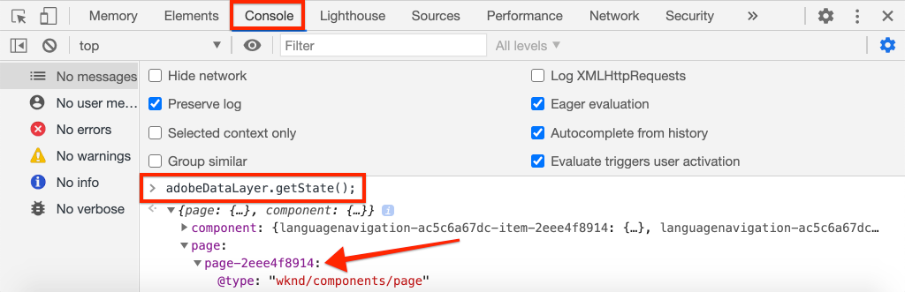

# Adobe Analytics でページデータを収集

[Adobe Client Data Layer with AEM Core Components](https://experienceleague.adobe.com/docs/experience-manager-core-components/using/developing/data-layer/overview.html?lang=ja) の組み込み機能を使用して、Adobe Experience Manager Sites のページに関するデータを収集する方法を学びます。[Experience Platform Launch](https://www.adobe.com/experience-platform/launch.html?lang=ja) と [Adobe Analytics 拡張機能](https://experienceleague.adobe.com/docs/experience-platform/tags/extensions/adobe/analytics/overview.html?lang=ja)を使用して、ページデータを Adobe Analytics に送信するルールを作成します。

## 作成する内容


このチュートリアルでは、Adobe Client Data Layer からのイベントに基づいて起動ルールをトリガーし、ルールを起動する条件を追加して、AEM Page の&#x200B;**ページ名**&#x200B;および&#x200B;**ページ テンプレート**&#x200B;を Adobe Analytics に送信します。

### 目的 {#objective}

1. データレイヤーへの変更に基づいて、Experience Platform Launch でイベント駆動型ルールを作成する
1. Experience Platform Launch でページデータレイヤーのプロパティをデータ要素にマッピングする
1. ページデータを収集し、ページビュービーコンと共に Adobe Analytics に送信する

## 前提条件

必要なものは以下のとおりです。

* **Experience Platform Launch** プロパティ
* **Adobe Analytics** テスト／開発レポートスイート ID とトラッキングサーバー。 詳しくは、[新しいレポートスイートの作成](https://experienceleague.adobe.com/docs/analytics/admin/manage-report-suites/new-report-suite/new-report-suite.html?lang=ja)ドキュメントを参照してください。 
* [Experience Platform デバッガー](https://experienceleague.adobe.com/docs/debugger-learn/tutorials/experience-platform-debugger/introduction-to-the-experience-platform-debugger.html?lang=ja)ブラウザー拡張機能。 このチュートリアルのスクリーンショットは、Chrome ブラウザーからキャプチャしたものです。
* （オプション）[Adobe Client Data Layer を有効にした](https://experienceleague.adobe.com/docs/experience-manager-core-components/using/developing/data-layer/overview.html?lang=ja#installation-activation) AEM Site。このチュートリアルでは、公開サイト [https://wknd.site/us/en.html](https://wknd.site/us/en.html) を使用しますが、独自のサイトを使用してもかまいません。

>[!NOTE]
>
> Experience Platform Launch と AEM サイトの統合について不明な点がある場合は、[こちらのビデオシリーズ](../experience-platform/data-collection/tags/overview.md)をご覧ください。

## WKND サイトの Experience Platform Launch 環境の切り替え

[https://wknd.site](https://wknd.site) は、[オープンソースプロジェクト](https://github.com/adobe/aem-guides-wknd)に基づいて構築された公開サイトであり、AEM 実装のリファレンスおよび [チュートリアル](https://experienceleague.adobe.com/docs/experience-manager-learn/getting-started-wknd-tutorial-develop/overview.html?lang=ja)として設計されています。 

AEM環境を設定して WKND コードベースをインストールする代わりに、Experience Platform デバッガーを使用して、ライブの [https://wknd.site/](https://wknd.site/) を&#x200B;*自身の* Experience Platform Launch プロパティに&#x200B;**切り替える**&#x200B;ことができます。もちろん、[Adobe Client Data Layer が有効になっている](https://experienceleague.adobe.com/docs/experience-manager-core-components/using/developing/data-layer/overview.html?lang=ja#installation-activation)場合は、独自の AEM サイトを使用できます。

1. Experience Platform Launch にログインし、[Experience Platform Launch プロパティを作成します](https://experienceleague.adobe.com/docs/launch-learn/implementing-in-websites-with-launch/configure-launch/launch.html?lang=ja) （まだの場合）。
1. 初回の Experience Platform Launch [ライブラリが作成され](https://experienceleague.adobe.com/docs/experience-platform/tags/publish/libraries.html#create-a-library?lang=ja)、Experience Platform Launch [環境](https://experienceleague.adobe.com/docs/experience-platform/tags/publish/environments/environments.html?lang=ja)に昇格されていることを確認します。
1. ライブラリの公開先の環境から Experience Platform Launch 埋め込みコードをコピーします。

   

1. ブラウザーで新しいタブを開き、[https://wknd.site/](https://wknd.site/) に移動します。 
1. Experience Platform デバッガーブラウザー拡張機能を開きます

   

1. **Experience Platform Launch**／**設定**&#x200B;に移動し、**挿入された埋め込みコード**&#x200B;の下にある既存の Experience Platform Launch 埋め込みコードを、手順 3 からコピーした&#x200B;**&#x200B;埋め込みコードに置換します。

   

1. **コンソールログ**&#x200B;を有効にし、WKND タブでデバッガーを&#x200B;**ロック**&#x200B;します。

   

## WKND サイトでの Adobe Client Data Layer の検証

[WKND 参照プロジェクト](https://github.com/adobe/aem-guides-wknd)は AEM コアコンポーネントで作成され、デフォルトで [Adobe Client Data Layer が有効](https://experienceleague.adobe.com/docs/experience-manager-core-components/using/developing/data-layer/overview.html?lang=ja#installation-activation)になっています。次に、Adobe Client Data Layer が有効になっていることを検証します。

1. [https://wknd.site](https://wknd.site) に移動します。
1. ブラウザーのデベロッパーツールを開き、**コンソール**&#x200B;に移動します。次のコマンドを実行します。

   ```js
   adobeDataLayer.getState();
   ```

   これは、Adobe Client Data Layer の現在の状態を返します。

   

1. 応答を展開し、`page` エントリを調べます。次のようなデータスキーマが表示されます。

   ```json
   page-2eee4f8914:
       @type: "wknd/components/page"
       dc:description: WKND is a collective of outdoors, music, crafts, adventure sports, and travel enthusiasts that want to share our experiences, connections, and expertise with the world.
       dc:title: "WKND Adventures and Travel"
       repo:modifyDate: "2020-08-31T21:02:21Z"
       repo:path: "/content/wknd/us/en.html"
       xdm:language: "en-US"
       xdm:tags: ["Attract"]
       xdm:template: "/conf/wknd/settings/wcm/templates/landing-page-template"
   ```

   データ レイヤーの[ページスキーマ](https://experienceleague.adobe.com/docs/experience-manager-core-components/using/developing/data-layer/overview.html#page?lang=ja)、`dc:title`、`xdm:language`、`xdm:template` から派生した標準プロパティを使用して、ページデータを Adobe Analytics に送信します。

   >[!NOTE]
   >
   > `adobeDataLayer` JavaScript オブジェクトが表示されない場合は、サイトで [Adobe Client Data Layer が有効になっている](https://experienceleague.adobe.com/docs/experience-manager-core-components/using/developing/data-layer/overview.html?lang=ja#installation-activation)ことを確認してください。

## 「ページの読み込み」ルールの作成

Adobe Client Data Layer は、**イベント**&#x200B;駆動型のデータレイヤーです。AEM **ページ**&#x200B;データレイヤーが読み込まれると、イベント `cmp:show` がトリガーされます。`cmp:show` イベントに基づいてトリガーされるルールを作成します。

1. Experience Platform Launch に移動し、AEM サイトと統合された web プロパティに移動します。
1. Experience Platform Launch UI の「**ルール**」セクションに移動し、「**新しいルールを作成**」をクリックします。

   

1. ルールに「**ページの読み込み**」という名前を付けます。
1. 「**イベント****の追加**」をクリックして、**イベント設定**&#x200B;ウィザードを開きます。
1. **イベントタイプ**&#x200B;の下で、「**カスタムコード**」を選択します。

   

1. メインパネルで「**エディターを開く**」をクリックして、次のコードスニペットを入力します。

   ```js
   var pageShownEventHandler = function(evt) {
      // defensive coding to avoid a null pointer exception
      if(evt.hasOwnProperty("eventInfo") && evt.eventInfo.hasOwnProperty("path")) {
         //trigger Launch Rule and pass event
         console.debug("cmp:show event: " + evt.eventInfo.path);
         var event = {
            //include the path of the component that triggered the event
            path: evt.eventInfo.path,
            //get the state of the component that triggered the event
            component: window.adobeDataLayer.getState(evt.eventInfo.path)
         };
   
         //Trigger the Launch Rule, passing in the new `event` object
         // the `event` obj can now be referenced by the reserved name `event` by other Launch data elements
         // i.e `event.component['someKey']`
         trigger(event);
      }
   }
   
   //set the namespace to avoid a potential race condition
   window.adobeDataLayer = window.adobeDataLayer || [];
   //push the event listener for cmp:show into the data layer
   window.adobeDataLayer.push(function (dl) {
      //add event listener for `cmp:show` and callback to the `pageShownEventHandler` function
      dl.addEventListener("cmp:show", pageShownEventHandler);
   });
   ```

   上記のコードスニペットでは、データレイヤーに[関数をプッシュ](https://github.com/adobe/adobe-client-data-layer/wiki#pushing-a-function)して、イベントリスナーを追加します。`cmp:show` イベントがトリガーされると、`pageShownEventHandler` 関数が呼び出されます。この関数では、いくつかの健全性チェックが追加され、イベントをトリガーしたコンポーネントの[データレイヤーの最新の状態](https://github.com/adobe/adobe-client-data-layer/wiki#getstate)で新しい `event` が構築されます。

   その後、`trigger(event)` が呼び出されます。`trigger()` は Experience Platform Launch の予約名であり、Experience Platform Launch ルールを「トリガー」します。`event` オブジェクトをパラメーターとして渡します。このパラメーターは、Experience Platform Launch の名前付き `event` の別の予約名によって公開されます。Experience Platform Launch のデータ要素は、`event.component['someKey']` などの様々なプロパティを参照できるようになりました。

1. 変更を保存します。
1. 次に、**アクション**&#x200B;で「**追加**」をクリックして、**アクションの設定**&#x200B;ウィザードを開きます。
1. **アクションタイプ**&#x200B;で「**カスタムコード**」を選択します。

   

1. メインパネルで「**エディターを開く**」をクリックし、次のコードスニペットを入力します。

   ```js
   console.debug("Page Loaded ");
   console.debug("Page name: " + event.component['dc:title']);
   console.debug("Page type: " + event.component['@type']);
   console.debug("Page template: " + event.component['xdm:template']);
   ```

   `event` オブジェクトは、カスタムイベントで呼び出された `trigger()` メソッドから渡されます。`component` は、カスタムイベントのデータレイヤー `getState` から派生した現在のページです。[ページスキーマ](https://experienceleague.adobe.com/docs/experience-manager-core-components/using/developing/data-layer/overview.html#page?lang=ja)をデータレイヤーで公開すると、標準で公開されている様々なキーを確認できます。

1. 変更を保存し、Experience Platform Launch で[ビルド](https://experienceleague.adobe.com/docs/experience-platform/tags/publish/builds.html)を実行して、AEM サイトで使用されている[環境](https://experienceleague.adobe.com/docs/experience-platform/tags/publish/environments/environments.html?lang=ja)にコードをプロモートします。

   >[!NOTE]
   >
   > [Adobe Experience Platform デバッガー](https://experienceleague.adobe.com/docs/debugger-learn/tutorials/experience-platform-debugger/introduction-to-the-experience-platform-debugger.html?lang=ja)を使用して、埋め込みコードを&#x200B;**開発**&#x200B;環境に切り替えると、非常に便利です。

1. AEM サイトに移動し、デベロッパーツールを開いてコンソールを表示します。ページを更新すると、コンソールメッセージがログに記録されていることがわかります。

   

## データ要素の作成

次に、複数のデータ要素を作成し、Adobe Client Data Layer から様々な値をキャプチャします。前の演習で見たように、カスタムコードを介してデータレイヤーのプロパティに直接アクセスできることがわかりました。データ要素を使用する利点は、Experience Platform Launch ルール全体で再利用できることです。

[ページスキーマ](https://experienceleague.adobe.com/docs/experience-manager-core-components/using/developing/data-layer/overview.html#page?lang=ja)をデータレイヤーで公開します。

データ要素は、`@type`、`dc:title`、`xdm:template`の各プロパティにマッピングされています。

### コンポーネントのリソースタイプ

1. Experience Platform Launch に移動し、AEM サイトと統合された web プロパティに移動します。
1. **データ要素**&#x200B;セクションに移動し、「**新規作成データ要素**」をクリックします。
1. 「**名前**」には、「**コンポーネントリソースタイプ**」と入力します。
1. 「**データ要素タイプ**」で「**カスタムコード**」を選択します。

   

1. 「**エディターを開く**」をクリックし、カスタムコードエディターに以下を入力します。

   ```js
   if(event && event.component && event.component.hasOwnProperty('@type')) {
       return event.component['@type'];
   }
   ```

   変更を保存します。

   >[!NOTE]
   >
   > `event` オブジェクトは、Experience Platform Launch の&#x200B;**ルール**&#x200B;をトリガーしたイベントに基づいて利用可能になり、スコープが設定されることを思い出してください。データ要素の値は、データ要素がルール内で&#x200B;*参照*&#x200B;されるまで設定されません。したがって、このデータ要素は、前のステップで作成された「**ページの読み込み**」ルールなどのルール内で安全にできます&#x200B;*が*、他のコンテキストでは安全に使用できません。

### ページ名

1. 「**データ要素の追加**」をクリックします。
1. 「**名前**」には、「**ページ名**」と入力します。
1. 「**データ要素タイプ**」は、「**カスタムコード**」を選択してください。
1. 「**エディターを開く**」をクリックし、カスタムコードエディターに以下を入力します。

   ```js
   if(event && event.component && event.component.hasOwnProperty('dc:title')) {
       return event.component['dc:title'];
   }
   ```

   変更を保存します。

### ページテンプレート

1. 「**データ要素の追加**」をクリックします。
1. 「**名前**」には、「**ページテンプレート**」と入力します。
1. 「**データ要素のタイプ**」には、「**カスタムコード**」を選択します。
1. 「**エディターを開く**」をクリックし、カスタムコードエディターに以下を入力します。

   ```js
   if(event && event.component && event.component.hasOwnProperty('xdm:template')) {
       return event.component['xdm:template'];
   }
   ```

   変更を保存します。

1. これで、ルールの一部として 3 つのデータ要素が揃ったはずです。

   

## Analytics 拡張機能の追加

次に、Experience Platform Launch プロパティに Analytics 拡張機能を追加します。 このデータをどこかに送信する必要があります。

1. Experience Platform Launch に移動し、AEM サイトと統合された web プロパティに移動します。
1. **拡張機能**／**カタログ**&#x200B;に移動します。
1. **Adobe Analytics** 拡張機能を探し、「**インストール**」をクリックします。

   

1. **ライブラリ管理**／**レポートスイート**&#x200B;に、各 Experience Platform Launch 環境で使用するレポートスイート ID を入力します。

   。

   >[!NOTE]
   >
   > このチュートリアルでは、すべての環境で 1 つのレポートスイートを使用しても問題ありませんが、実際の使用では、以下の画像のように別々のレポートスイートを使用することになります

   >[!TIP]
   >
   >ライブラリ管理設定として、*「自分のためにライブラリを管理」オプション*&#x200B;を使用すると、`AppMeasurement.js` ライブラリを最新の状態に保つことが非常に容易になるため、推奨しています。

1. チェックボックスをオンにして「**Activity Map を使用**」を有効にします。

   

1. **一般**／**トラッキングサーバー**&#x200B;に、トラッキングサーバーを入力します（例：`tmd.sc.omtrdc.net`）自社のサイトが `https://` をサポートしている場合は、SSLトラッキングサーバーを入力します

   

1. 「**保存**」をクリックして、変更を保存します。

## ページロードルールに条件を追加する

次に、**ページロード** ルールを更新し、**コンポーネントリソース タイプ** データ要素を使用して、`cmp:show` イベントが **ページ** のときだけルールが発生するようにします。他のコンポーネントも `cmp:show` イベントを発生させることができます（例；スライドが変更されるとカルーセルコンポーネントを実行する）。したがって、このルールには条件を追加することが重要です。

1. Experience Platform Launch UIで、先ほど作成した&#x200B;**ページの読み込み**&#x200B;ルールに移動します。
1. 「**条件**」で「**追加**」をクリックすると、**条件設定**&#x200B;ウィザードが表示されます。
1. 「**条件タイプ**」では「**値比較**」を選択します。
1. フォームフィールドの最初の値を `%Component Resource Type%` に設定します。データ要素アイコン  で、**コンポーネント リソースタイプ**&#x200B;データ要素を選択することができます。コンパレーターは `Equals` のままにしてください。
1. 2 番目の値を `wknd/components/page` に設定します。

   

   >[!NOTE]
   >
   > この条件は、チュートリアルの前半で作成した `cmp:show` イベントを監視するカスタムコード関数内に追加することが可能です。しかし、UI 内に追加することで、ルールの変更を必要とする可能性のある追加ユーザーに対して、可視性を高めることができます。さらに、データ要素を使用できます。

1. 変更を保存します。

## Analytics 変数の設定とページビュービーコンのトリガー

現在、**ページの読み込み**&#x200B;ルールは、単にコンソールステートメントを出力します。次に、データ要素と Analytics 拡張機能を使用して、**ページの読み込み**&#x200B;ルールの&#x200B;**アクション**&#x200B;として Analytics 変数を設定します。また、**ページビュービーコン**&#x200B;をトリガーし、収集したデータを Adobe Analytics に送信するアクションを追加で設定します。

1. **ページの読み込み**&#x200B;ルールの&#x200B;**削除**&#x200B;アクション（**コア - カスタムコード**&#x200B;コンソールステートメント）を削除します。

   

1. 「アクション」で、「**追加**」をクリックして新しいアクションを追加します。
1. **拡張機能**&#x200B;の種類を **Adobe Analytics**、**アクションタイプ**&#x200B;を「**変数の設定**」に設定します。

   

1. メインパネルで利用可能な **eVar** を選択し、データ要素&#x200B;**ページテンプレート**&#x200B;の値として設定します。「データ要素」アイコンで、**ページテンプレート**&#x200B;要素を選択します。

   

1. 下にスクロールして、**追加設定**&#x200B;で、**ページ名**&#x200B;をデータ要素&#x200B;**ページ名**&#x200B;に設定します。

   

   変更を保存します。

1. 次に、**Adobe Analytics - 変数を設定**&#x200B;の右側に、**プラス**&#x200B;アイコンをタップして、追加のアクションを追加します。

   

1. **拡張機能**&#x200B;の種類を **Adobe Analytics**、**アクションタイプ**&#x200B;を「**ビーコンの送信**」に設定します。これはページビューとみなされるため、デフォルトのトラッキング設定は **`s.t()`** のままにしておきます。

   

1. 変更を保存します。**ページの読み込み**&#x200B;ルールは、次のような構成になります。

   

   * **1.**`cmp:show` イベントをリッスンします。
   * **2.** イベントがページによってトリガーされたことを確認します。
   * **3.****ページ名**&#x200B;と&#x200B;**ページテンプレート**&#x200B;に Analytics の変数を設定する
   * **4.** Analytics ページビュービーコンの送信
1. すべての変更を保存し、Experience Platform Launch ライブラリを構築して、適切な環境に昇格します。

## ページビュービーコンと Analytics 呼び出しの検証

**ページの読み込み**&#x200B;ルールが Analytics ビーコンを送信するようになったので、Experience Platform Debugger を使用して Analytics トラッキング変数を確認できます。

1. ブラウザーで [WKND サイト](https://wknd.site/us/en.html)を開きます。
1.  の「デバッガー」アイコンをクリックして Experience Platform Debugger を起動します。
1. 前述のように、デバッガーが Experience Platform Launch プロパティを&#x200B;*自分の*&#x200B;開発環境にマッピングし、**コンソールログ**&#x200B;がオンになることを確認します。
1. Analytics メニューを開き、レポートスイートが&#x200B;*自身の*&#x200B;レポートスイートに設定されていることを確認します。「ページ名」も入力する必要があります。

   

1. 下にスクロールして、**ネットワークリクエスト**&#x200B;を展開します。**ページテンプレート**&#x200B;に設定されている&#x200B;**eVar**&#x200B;を確認できます。

   

1. ブラウザーに戻り、デベロッパーコンソールを開きます。ページ上部で&#x200B;**カルーセル**&#x200B;をクリックスルーします。

   

1. ブラウザーコンソールで、コンソールステートメントを確認します。

   

   これは、カルーセルが `cmp:show` イベントをトリガーする&#x200B;*が*、**コンポートリソースタイプ**&#x200B;のチェックにより、イベントが発生しないためです。

   >[!NOTE]
   >
   > コンソールログが表示されない場合は、Experience Platform Debugger の **Experience Platform Launch** で **コンソールログ**&#x200B;がチェックされていることを確認します。

1. 「[西オーストラリア](https://wknd.site/us/en/magazine/western-australia.html)」などの記事ページに移動します。「ページ名」と「テンプレートタイプ」が変更されるのを確認します。

## これで完了です。

イベントドリブン型 Adobe Client Data Layer と Experience Platform Launch を使用して、AEM Sites からデータページデータを収集し、Adobe Analytics に送信しました。

### 次の手順

イベント駆動型の Adobe Client Data Layer を使用して、[Adobe Experience Manager サイト](track-clicked-component.md)上の特定のコンポーネントのクリックを追跡する方法については、次のチュートリアルを参照してください。
