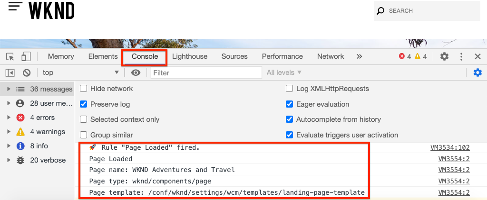

# Adobe Analyticsとページデータを収集する

[AdobeクライアントデータレイヤーとAEMコアコンポーネント](https://docs.adobe.com/content/help/ja-JP/experience-manager-core-components/using/developing/data-layer/overview.html)の組み込み機能を使用して、Adobe Experience Manager Sitesのページに関するデータを収集する方法を説明します。 [Experience Platform Launch と Adobe Analytics 拡張は、ルールを作成して Adobe Analytics にページデータを送信するために使用されます。](https://www.adobe.com/experience-platform/launch.html)[](https://docs.adobe.com/content/help/ja-JP/launch/using/extensions-ref/adobe-extension/analytics-extension/overview.html)

## 作成する内容


このチュートリアルでは、Adobeクライアントデータレイヤーからのイベントに基づいて起動ルールをトリガし、ルールを起動するタイミングの条件を追加し、AEMページの&#x200B;**ページ名**&#x200B;と&#x200B;**ページテンプレート**&#x200B;をAdobe Analyticsに送信します。

### 目的 {#objective}

1. データレイヤーに対する変更に基づいて、起動でイベント型ルールを作成する
1. 「起動」でページデータレイヤーのプロパティをデータ要素にマップ
1. ページデータを収集し、ページ表示ビーコンと共にAdobe Analyticsに送信

## 前提条件

以下は必須です。

* **Experience Platform** の起動プロパティ
* **Adobe** 分析/開発レポートスイートIDとトラッキングサーバー。[新しいレポートスイート](https://docs.adobe.com/content/help/en/analytics/admin/manage-report-suites/new-report-suite/new-report-suite.html)の作成については、次のドキュメントを参照してください。
* [Experience Platform](https://docs.adobe.com/content/help/en/platform-learn/tutorials/data-ingestion/web-sdk/introduction-to-the-experience-platform-debugger.html) Debuggerbrowser拡張機能。Chromeブラウザーでキャプチャした、このチュートリアルのスクリーンショットです。
* （オプション）[Adobeクライアントデータレイヤーを有効にしたAEMサイト](https://docs.adobe.com/content/help/en/experience-manager-core-components/using/developing/data-layer/overview.html#installation-activation)。 このチュートリアルでは、公開サイト[https://wknd.site/us/en.html](https://wknd.site/us/en.html)を使用しますが、自分のサイトを使用することをお勧めします。

>[!NOTE]
>
> LaunchとAEMサイトの統合に関するヘルプが必要ですか？ [このビデオシリーズを参照してください](../experience-platform-launch/overview.md)。

## WKNDサイトの起動環境の切り替え

[https://wknd.](https://wknd.site) siteは、AEM実装のリファレンスとチュートリアルとして設計されたオープンソース [プロジェクト](https://github.com/adobe/aem-guides-wknd)  [](https://docs.adobe.com/content/help/ja-JP/experience-manager-learn/getting-started-wknd-tutorial-develop/overview.html) に基づいて構築された公開サイトです。

AEM環境を設定してWKNDコードベースをインストールする代わりに、Experience Platformデバッガを使用して、ライブ[https://wknd.site/](https://wknd.site/)を&#x200B;*お使いの* Launchプロパティに&#x200B;**切り替えることができます。**[Adobeクライアントデータレイヤーが既に有効になっている場合は、独自のAEMサイトを使用できます](https://docs.adobe.com/content/help/en/experience-manager-core-components/using/developing/data-layer/overview.html#installation-activation)

1. Experience Platform Launchにログインし、[起動プロパティ](https://docs.adobe.com/content/help/en/core-services-learn/implementing-in-websites-with-launch/configure-launch/launch.html)を作成します（まだ作成していない場合）。
1. 初期起動[ライブラリが](https://docs.adobe.com/content/help/en/launch/using/reference/publish/libraries.html#create-a-library)作成され、起動[環境](https://docs.adobe.com/content/help/en/launch/using/reference/publish/environments.html)に昇格されていることを確認します。
1. ライブラリの公開先の環境から「開始」埋め込みコードをコピーします。

   

1. ブラウザーで新しいタブを開き、[https://wknd.site/](https://wknd.site/)に移動します。
1. Experience Platformデバッガブラウザ拡張機能を開く

   

1. **起動**/**設定**&#x200B;に移動し、**挿入された埋め込みコード**&#x200B;の下で、既存の起動の埋め込みコードを手順3からコピーした&#x200B;**&#x200B;埋め込みコードに置き換えます。

   

1. 「**コンソールログ**」と「**WKND」タブのデバッガーをロック**&#x200B;します。

   

## WKNDサイトのAdobeクライアントデータレイヤーの確認

[WKND Referenceプロジェクト](https://github.com/adobe/aem-guides-wknd)はAEMコアコンポーネントを使用して構築され、デフォルトで[Adobeクライアントデータレイヤーが有効](https://docs.adobe.com/content/help/en/experience-manager-core-components/using/developing/data-layer/overview.html#installation-activation)になっています。 次に、Adobeクライアントデータレイヤーが有効になっていることを確認します。

1. [https://wknd.site](https://wknd.site)に移動します。
1. ブラウザーの開発者ツールを開き、**コンソール**&#x200B;に移動します。 次の コマンドを実行します。

   ```js
   adobeDataLayer.getState();
   ```

   Adobeクライアントデータレイヤーの現在の状態を返します。

   

1. 応答を展開し、`page`エントリを調べます。 次のようなデータスキーマが表示されます。

   ```json
   page-2eee4f8914:
       @type: "wknd/components/page"
       dc:description: "WKND is a collective of outdoors, music, crafts, adventure sports, and travel enthusiasts that want to share our experiences, connections, and expertise with the world."
       dc:title: "WKND Adventures and Travel"
       repo:modifyDate: "2020-08-31T21:02:21Z"
       repo:path: "/content/wknd/us/en.html"
       xdm:language: "en-US"
       xdm:tags: ["Attract"]
       xdm:template: "/conf/wknd/settings/wcm/templates/landing-page-template"
   ```

   データレイヤーの[ページスキーマ](https://docs.adobe.com/content/help/en/experience-manager-core-components/using/developing/data-layer/overview.html#page)、`dc:title`、`xdm:language`、`xdm:template`から派生する標準プロパティを使用して、Adobe Analyticsにページデータを送信します。

   >[!NOTE]
   >
   > `adobeDataLayer` javascriptオブジェクトが表示されませんか？ サイトで[Adobeクライアントデータレイヤーが有効](https://docs.adobe.com/content/help/en/experience-manager-core-components/using/developing/data-layer/overview.html#installation-activation)になっていることを確認してください。

## ページ型ルールの作成

Adobe・クライアント・データ・レイヤーは、**イベント**&#x200B;駆動データ・レイヤーです。 AEM **ページ**&#x200B;データレイヤーが読み込まれると、イベント`cmp:show`がトリガされます。 `cmp:show`イベントに基づいてトリガーされるルールを作成します。

1. Experience Platform Launchに移動し、AEM Siteに統合されたWebプロパティに移動します。
1. 起動UIの&#x200B;**ルール**&#x200B;セクションに移動し、**新しいルールを作成**&#x200B;をクリックします。

   

1. ルールに「**読み込まれたページ**」という名前を付けます。
1. **イベント** **追加**&#x200B;をクリックして、**イベントの設定**&#x200B;ウィザードを開きます。
1. 「**イベントタイプ**」で、「**カスタムコード**」を選択します。

   

1. メインパネルで「**エディターを開く**」をクリックし、次のコードスニペットを入力します。

   ```js
   var pageShownEventHandler = function(evt) {
      // defensive coding to avoid a null pointer exception
      if(evt.hasOwnProperty("eventInfo") && evt.eventInfo.hasOwnProperty("path")) {
         //trigger Launch Rule and pass event
         console.debug("cmp:show event: " + evt.eventInfo.path);
         var event = {
            //include the path of the component that triggered the event
            path: evt.eventInfo.path,
            //get the state of the component that triggered the event
            component: window.adobeDataLayer.getState(evt.eventInfo.path)
         };
   
         //Trigger the Launch Rule, passing in the new `event` object
         // the `event` obj can now be referenced by the reserved name `event` by other Launch data elements
         // i.e `event.component['someKey']`
         trigger(event);
      }
   }
   
   //set the namespace to avoid a potential race condition
   window.adobeDataLayer = window.adobeDataLayer || [];
   //push the event listener for cmp:show into the data layer
   window.adobeDataLayer.push(function (dl) {
      //add event listener for `cmp:show` and callback to the `pageShownEventHandler` function
      dl.addEventListener("cmp:show", pageShownEventHandler);
   });
   ```

   上記のコードスニペットでは、[関数](https://github.com/adobe/adobe-client-data-layer/wiki#pushing-a-function)をデータレイヤーにプッシュすることで、イベントリスナーを追加します。 `cmp:show`イベントがトリガされると、`pageShownEventHandler`関数が呼び出されます。 この関数では、いくつかのサニティチェックが追加され、イベントをトリガーしたコンポーネントの最新の[状態のデータレイヤー](https://github.com/adobe/adobe-client-data-layer/wiki#getstate)で新しい`event`が構築されます。

   その後`trigger(event)`が呼び出されます。 `trigger()` は、起動で予約された名前で、起動ルールを「トリガー」します。`event`オブジェクトをパラメータとして渡し、その後、`event`という名前のLaunchで別の予約名で公開されます。 起動のデータ要素は、次のような様々なプロパティを参照できるようになりました。`event.component['someKey']`.

1. 変更内容を保存します。
1. **アクション**&#x200B;の次に&#x200B;**追加**&#x200B;をクリックして、**アクションの設定**&#x200B;ウィザードを開きます。
1. 「**アクションタイプ**」で、「**カスタムコード**」を選択します。

   

1. メインパネルで「**エディターを開く**」をクリックし、次のコードスニペットを入力します。

   ```js
   console.debug("Page Loaded ");
   console.debug("Page name: " + event.component['dc:title']);
   console.debug("Page type: " + event.component['@type']);
   console.debug("Page template: " + event.component['xdm:template']);
   ```

   `event`オブジェクトは、カスタムイベントで呼び出される`trigger()`メソッドから渡されます。 `component` は、カスタムイベントのデータレイヤーから派生した現在 `getState` のページです。初期の[データレイヤーで公開されたページスキーマ](https://docs.adobe.com/content/help/en/experience-manager-core-components/using/developing/data-layer/overview.html#page)を思い出して、初期状態で公開された様々なキーを確認します。

1. 変更を保存し、起動に[build](https://docs.adobe.com/content/help/en/launch/using/reference/publish/builds.html)を実行して、コードをAEMサイトで使用されている[環境](https://docs.adobe.com/content/help/en/launch/using/reference/publish/environments.html)に昇格させます。

   >[!NOTE]
   >
   > [Adobe Experience Platformデバッガー](https://docs.adobe.com/content/help/en/platform-learn/tutorials/data-ingestion/web-sdk/introduction-to-the-experience-platform-debugger.html)を使用して、埋め込みコードを&#x200B;**開発版**&#x200B;環境に切り替えると便利です。

1. AEMサイトに移動し、開発者ツールを開いてコンソールを表示します。 ページを更新すると、コンソールメッセージがログに記録されていることが確認できます。

   

## データ要素の作成

次に、複数のデータ要素を作成して、Adobeクライアントデータレイヤーから様々な値を取り込みます。 前の練習で見たように、カスタムコードを使用してデータレイヤーのプロパティに直接アクセスできます。 データ要素を使用する利点は、起動ルール全体で再利用できる点です。

以前の[ページスキーマ](https://docs.adobe.com/content/help/en/experience-manager-core-components/using/developing/data-layer/overview.html#page)は、データレイヤーによって公開されています。

データ要素は、`@type`、`dc:title`および`xdm:template`プロパティにマップされます。

### コンポーネントリソースタイプ

1. Experience Platform Launchに移動し、AEM Siteに統合されたWebプロパティに移動します。
1. 「**データ要素**」セクションに移動し、「**新しいデータ要素を作成**」をクリックします。
1. **名前**&#x200B;に対して、**コンポーネントリソースタイプ**&#x200B;と入力します。
1. **データ要素タイプ**&#x200B;に対して、**カスタムコード**&#x200B;を選択します。

   

1. 「**エディターを開く**」をクリックし、カスタムコードエディターで次のように入力します。

   ```js
   if(event && event.component && event.component.hasOwnProperty('@type')) {
       return event.component['@type'];
   }
   ```

   変更内容を保存します。

   >[!NOTE]
   >
   > `event`オブジェクトが使用可能になり、起動で&#x200B;**ルール**&#x200B;をトリガーしたイベントに基づいて範囲が指定されることを忘れないでください。 データ要素の値は、データ要素がルール内で&#x200B;*参照*&#x200B;されるまで設定されません。 したがって、このデータ要素は、ルール内で安全に使用できます。例えば、前の手順&#x200B;*で作成した&#x200B;**ページが読み込まれた**ルールのように、他のコンテキストでは使用できません。*

### ページ名

1. 「**追加データ要素**」をクリックします。
1. **名前**&#x200B;に対して、**ページ名**&#x200B;と入力します。
1. **データ要素タイプ**&#x200B;に対して、**カスタムコード**&#x200B;を選択します。
1. 「**エディターを開く**」をクリックし、カスタムコードエディターで次のように入力します。

   ```js
   if(event && event.component && event.component.hasOwnProperty('dc:title')) {
       return event.component['dc:title'];
   }
   ```

   変更内容を保存します。

### ページテンプレート

1. 「**追加データ要素**」をクリックします。
1. **名前**&#x200B;に対して、**ページテンプレート**&#x200B;と入力します。
1. **データ要素タイプ**&#x200B;に対して、**カスタムコード**&#x200B;を選択します。
1. 「**エディターを開く**」をクリックし、カスタムコードエディターで次のように入力します。

   ```js
   if(event && event.component && event.component.hasOwnProperty('xdm:template')) {
       return event.component['xdm:template'];
   }
   ```

   変更内容を保存します。

1. これで、ルールの一部として3つのデータ要素が作成されます。

   

## Analytics追加拡張機能

次に、Analyticsの拡張機能をLaunchプロパティに追加します。 このデータはどこかに送る必要がある！

1. Experience Platform Launchに移動し、AEM Siteに統合されたWebプロパティに移動します。
1. **拡張子** > **カタログ**&#x200B;に移動します
1. **Adobe Analytics**&#x200B;拡張子を探し、**インストール**&#x200B;をクリックします

   

1. **ライブラリ管理**/**レポートスイート**&#x200B;の下で、各起動環境で使用するレポートスイートIDを入力します。

   

   >[!NOTE]
   >
   > このチュートリアルのすべての環境に対して1つのレポートスイートを使用しても問題ありませんが、実際には、次の図のように、個別のレポートスイートを使用する必要があります。

   >[!TIP]
   >
   >*ライブラリの管理オプション*&#x200B;は、`AppMeasurement.js`ライブラリを最新の状態に維持しやすいため、ライブラリ管理設定として使用することをお勧めします。

1. [**Activity Map**&#x200B;を使用]を有効にするには、該当のチェックボックスをオンにします。

   

1. **一般** > **トラッキングサーバー**&#x200B;の下に、トラッキングサーバーを入力します。例：`tmd.sc.omtrdc.net`。 サイトが`https://`をサポートしている場合は、SSLトラッキングサーバーを入力します。

   

1. 「**保存**」をクリックして、変更を保存します。

## Page Loaded追加ルールの条件

次に、**ページが読み込まれた**&#x200B;ルールを更新し、**コンポーネントリソースタイプ**&#x200B;データ要素を使用して、`cmp:show`イベントが&#x200B;**ページ**&#x200B;の場合にのみルールが実行されるようにします。 `cmp:show`イベントは、他のコンポーネントで実行される場合があります。例えば、カルーセルコンポーネントは、スライドが変更されると起動します。 したがって、このルールに条件を追加することが重要です。

1. 起動UIで、前に作成した&#x200B;**ページが読み込まれた**&#x200B;ルールに移動します。
1. 「**条件**」で「**追加**」をクリックし、**条件の設定**&#x200B;ウィザードを開きます。
1. 「**条件のタイプ**」に対して、「**値の比較**」を選択します。
1. フォームフィールドの最初の値を`%Component Resource Type%`に設定します。 データ要素アイコンを使用して、**コンポーネントリソースタイプ**&#x200B;のデータ要素を選択できます。 比較器を`Equals`に設定したままにします。
1. 2番目の値を`wknd/components/page`に設定します。

   

   >[!NOTE]
   >
   > この条件は、このチュートリアルの前に作成した`cmp:show`イベントをリッスンするカスタムコード関数内に追加できます。 ただし、UI内に追加すると、ルールの変更が必要になる可能性のある追加のユーザをより明確に表示できます。 加えてデータ要素を使える！

1. 変更内容を保存します。

## Analytics変数の設定とページ表示ビーコンのトリガー

現在、**Page Loaded**&#x200B;ルールは、単にコンソール文を出力します。 次に、データ要素とAnalytics拡張機能を使用して、**ページが読み込まれた**&#x200B;ルールの&#x200B;**アクション**&#x200B;としてAnalytics変数を設定します。 また、**ページ表示ビーコン**&#x200B;をトリガーし、収集したデータをAdobe Analyticsに送信する追加アクションも設定します。

1. **読み込まれたページ**&#x200B;ルール&#x200B;**remove****コア — カスタムコード**&#x200B;アクション（コンソール文）内：

   

1. 「アクション」の下の&#x200B;**追加**&#x200B;をクリックして、新しいアクションを追加します。
1. **拡張子**&#x200B;の種類を&#x200B;**Adobe Analytics**&#x200B;に設定し、**アクションの種類**&#x200B;を&#x200B;**変数を設定**&#x200B;に設定します

   

1. メインパネルで使用可能な&#x200B;**eVar**&#x200B;を選択し、データ要素&#x200B;**ページテンプレート**&#x200B;の値として設定します。 データ要素アイコンを使用して、**ページテンプレート**&#x200B;要素を選択します。

   

1. 「**追加の設定**」で下にスクロールし、**ページ名**&#x200B;をデータ要素&#x200B;**ページ名**&#x200B;に設定します。

   

   変更内容を保存します。

1. 次に、**Adobe Analyticsの右側に「アクション」を追加し、**&#x200B;プラス&#x200B;**アイコンをタップして、「変数を設定**」を設定します。

   

1. **拡張機能**&#x200B;の種類を&#x200B;**Adobe Analytics**&#x200B;に設定し、**アクションの種類**&#x200B;を&#x200B;**ビーコンを送信**&#x200B;に設定します。 これはページ表示と見なされるので、デフォルトの追跡は&#x200B;**`s.t()`**&#x200B;に設定したままにします。

   

1. 変更内容を保存します。**Page Loaded**&#x200B;ルールは、次の設定にする必要があります。

   

   * **1.**  `cmp:show` イベントをリッスンします。
   * **2.** イベントがページによってトリガーされたことを確認します。
   * **3.** ページ名と ****  **ページテンプレートのAnalytics変数の設定**
   * **4.** Analyticsページ表示ビーコンの送信
1. すべての変更を保存し、起動ライブラリを作成して、適切な環境に昇格します。

## ページ表示ビーコンとAnalytics呼び出しの検証

これで、**Page Loaded**&#x200B;ルールがAnalyticsビーコンを送信したので、Experience Platformデバッガーを使用してAnalyticsトラッキング変数を表示できます。

1. ブラウザーで[WKNDサイト](https://wknd.site/us/en.html)を開きます。
1. デバッガーアイコンをクリックして、Experience Platformデバッガーを開きます。
1. 前述のように、デバッガーがLaunchプロパティを&#x200B;**&#x200B;開発環境にマッピングし、**コンソールログ**&#x200B;がオンになっていることを確認します。
1. Analyticsメニューを開き、レポートスイートが&#x200B;**&#x200B;レポートスイートに設定されていることを確認します。 ページ名も入力する必要があります。

   

1. 下にスクロールし、**Network Requests**&#x200B;を展開します。 **ページテンプレート**&#x200B;に設定された&#x200B;**evar**&#x200B;を見つけることができます。

   

1. ブラウザーに戻り、デベロッパーコンソールを開きます。 ページ上部の&#x200B;**カルーセル**&#x200B;をクリックします。

   

1. ブラウザーコンソールで、コンソール文を確認します。

   

   これは、カルーセルが`cmp:show`イベント&#x200B;*をトリガしますが、*&#x200B;は&#x200B;**コンポーネントリソースタイプ**&#x200B;をチェックしたため、イベントが発生しないからです。

   >[!NOTE]
   >
   > コンソールログが表示されない場合は、Experience Platformデバッガーの&#x200B;**Launch**&#x200B;で&#x200B;**Console Logging**&#x200B;がチェック済みであることを確認してください。

1. [西オーストラリア](https://wknd.site/us/en/magazine/western-australia.html)のような記事ページに移動します。 [ページ名]と[テンプレートタイプ]が変化することを確認します。

## バリデーターが

先ほど、イベント主導型のAdobeクライアントデータレイヤーとExperience Platform Launchを使用して、AEMサイトからデータページデータを収集し、Adobe Analyticsに送信しました。

### 次の手順

次のチュートリアルを見て、イベント主導型Adobeクライアントデータレイヤーを使用して、Adobe Experience Managerサイト](track-clicked-component.md)の特定のコンポーネントのクリックを追跡する方法を学びます。[
