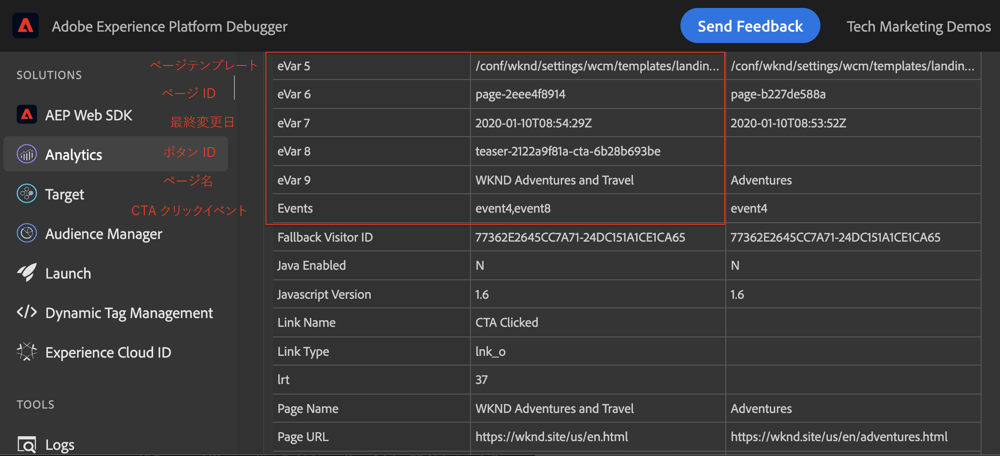
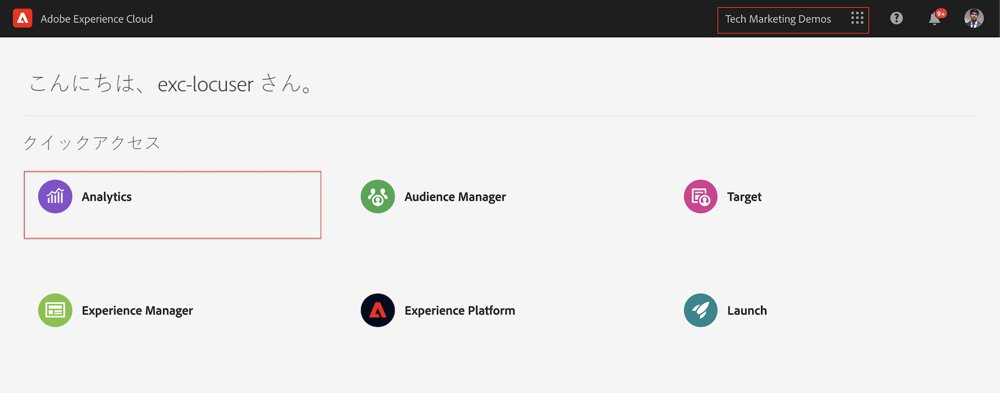
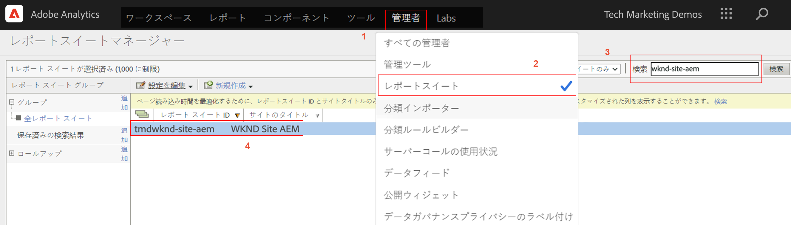
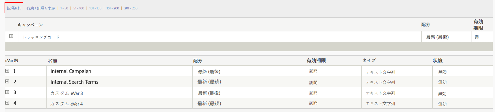
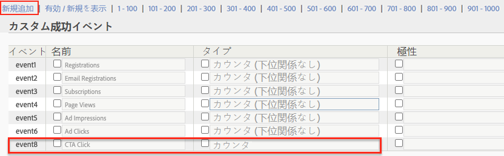
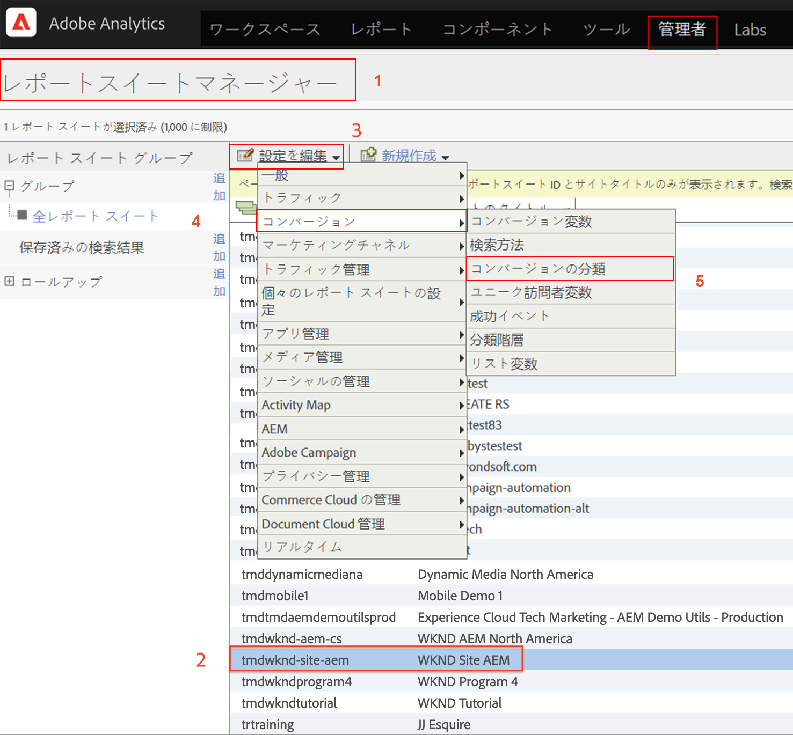
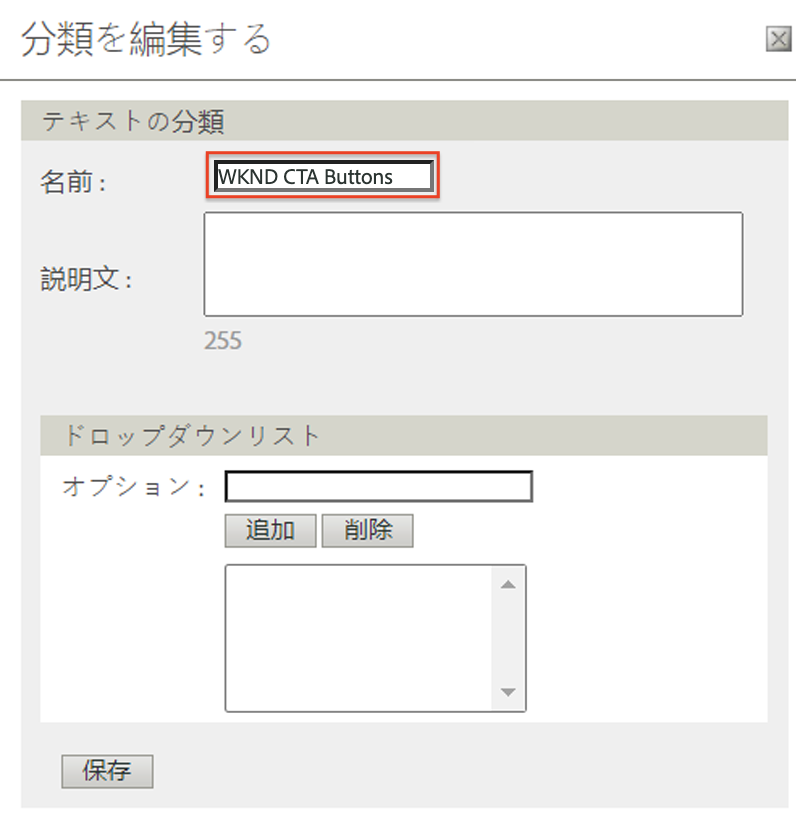
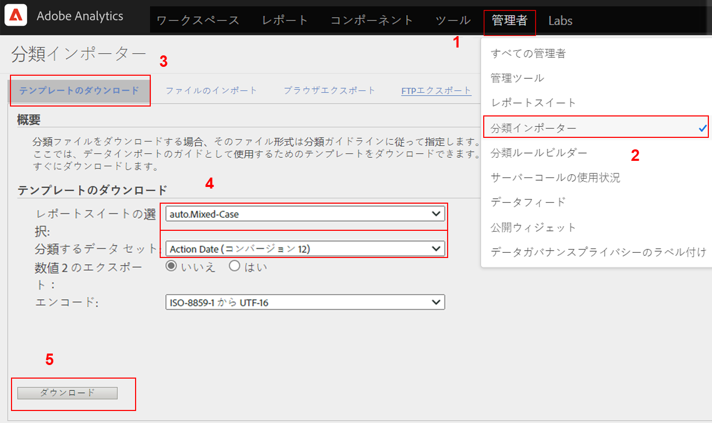
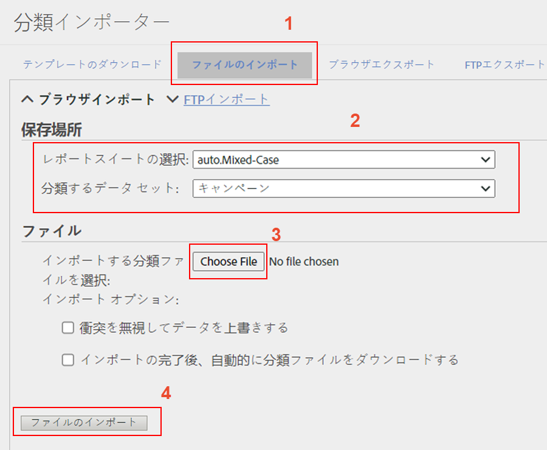
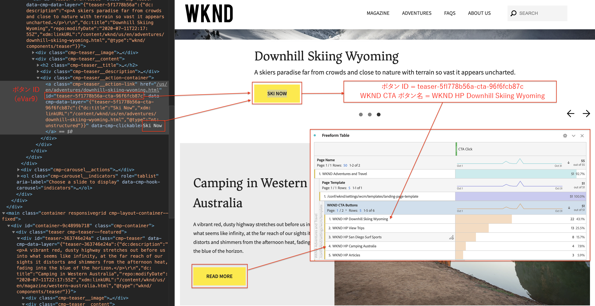

# Analysis Workspaceでデータを分析する

Adobe Experience Managerサイトから収集したデータを、Adobe Analyticsのレポートスイートの指標およびディメンションにマップする方法について説明します。 Adobe AnalyticsのAnalysis Workspace機能を使用して、詳細なレポートダッシュボードを作成する方法を学びます。

## 作成する内容

WKNDマーケティングチームは、ホームページで最もパフォーマンスの高い誘い文句(CTA)ボタンを把握したいと考えています。 このチュートリアルでは、Analysis Workspaceで新しいプロジェクトを作成し、様々なCTAボタンのパフォーマンスを視覚化して、サイトでのユーザの行動を把握します。 次の情報は、ユーザーがWKNDホームページのCall to Action(CTA)ボタンをクリックしたときに、Adobe Analyticsを使用して取得されます。

**Analytics変数**

以下に、現在追跡中のAnalytics変数を示します。

* `eVar5` -   `Page template`
* `eVar6` -  `Page Id`
* `eVar7` -  `Page last modified date`
* `eVar8` -  `CTA Button Id`
* `eVar9` -  `Page Name`
* `event8` -  `CTA Button Click event`
* `prop8` -  `CTA Button Id`

### 目的 {#objective}

1. 新しいレポートスイートを作成するか、既存のレポートスイートを使用します。
1. レポートスイートで[コンバージョン変数(eVars)](https://docs.adobe.com/content/help/en/analytics/admin/admin-tools/conversion-variables/conversion-var-admin.html)と[成功イベント(イベント)](https://docs.adobe.com/help/en/analytics/admin/admin-tools/success-events/success-event.html)を設定します。
1. [Analysis Workspaceプロジェクト](https://docs.adobe.com/content/help/en/analytics/analyze/analysis-workspace/home.html)を作成して、インサイトをすばやく作成、分析、共有できるツールの助けを借りてデータを分析します。
1. Analysis Workspaceプロジェクトを他のチームメンバーと共有します。

## 前提条件

このチュートリアルは、[クリックされたコンポーネントをAdobe Analytics](./track-clicked-component.md)で追跡するのと同じで、次の点が想定されています。

* **[Adobe Analytics拡張子](https://docs.adobe.com/content/help/ja-JP/launch/using/extensions-ref/adobe-extension/analytics-extension/overview.html)が有効な起動プロパティ**
* **Adobe** 分析/開発レポートスイートIDとトラッキングサーバー。[新しいレポートスイート](https://docs.adobe.com/content/help/en/analytics/admin/manage-report-suites/new-report-suite/new-report-suite.html)の作成については、次のドキュメントを参照してください。
* [Experience Platformデ](https://docs.adobe.com/content/help/en/platform-learn/tutorials/data-ingestion/web-sdk/introduction-to-the-experience-platform-debugger.html) ータレイヤーが有効なAEMサイトのhttps://wknd.site/us/en.  htmlまたはに読み込まれたLaunchプロパティを使用して設定されたAdobeデバッガーブラウザー拡張機能。

## コンバージョン変数(eVar)と成功イベント(イベント)

Custom Insightコンバージョン変数(またはeVar)は、サイトの選択したWebページのAdobeコードに配置されます。 その主な目的は、カスタムマーケティングレポートでコンバージョン成功指標をセグメント化することです。 eVarは訪問ベースにでき、cookieと同様に機能します。 eVar変数に渡される値は、ユーザーに従って所定の期間が経過します。

eVarを訪問者の値に設定すると、Adobeはその値を自動的に記憶し、期限切れになります。 eVar値がアクティブな間に訪問者が発生した成功イベントは、すべてeVar値にカウントされます。

eVarは、次のような原因と結果を測定するのに最適です。

* 売上高に影響を与えた内部キャンペーン
* 最終的に登録につながったバナー広告
* 注文前に内部検索が使用された回数

成功イベントとは、追跡できるアクションです。 成功イベントは何かを判断します。 例えば、訪問者がCTAボタンをクリックした場合、clickイベントは成功イベントと見なすことができます。

### eVarの設定

1. Adobe Experience Cloudホームページから組織を選択し、Adobe Analyticsを起動します。

   

1. Analyticsツールバーで、**管理者**/**レポートスイート**&#x200B;をクリックし、レポートスイートを探します。

   

1. レポートスイートを選択し、**設定を編集**/**コンバージョン**/**コンバージョン変数**

   

1. **追加新しい**&#x200B;オプションを使用して、コンバージョン変数を作成し、次のようにスキーマをマッピングします。

   * `eVar5` -   `Page Template`
   * `eVar6` -  `Page ID`
   * `eVar7` -  `Last Modified Date`
   * `eVar8` -  `Button Id`
   * `eVar9` -  `Page Name`

   

1. 各eVarに適切な名前と説明を入力し、**変更を保存**&#x200B;します。 次の節では、これらのeVarを使用してAnalysis Workspaceプロジェクトを作成します。 したがって、わかりやすい名前を付けると、変数が見つけやすくなります。

   

### 成功イベントの設定

次に、CTAボタンのクリックを追跡する偶数を作成します。

1. **Report Suite Manager**&#x200B;ウィンドウで&#x200B;**レポートスイートID**&#x200B;を選択し、**設定を編集**&#x200B;をクリックします。
1. **コンバージョン**/**成功イベント**&#x200B;をクリックします
1. 「**追加新しい**」オプションを使用して、CTAボタンのクリックを追跡する新しいカスタム成功イベントを作成し、**保存**&#x200B;して変更を追跡します。
   * `Event`：`event8`
   * `Name`:`CTA Click`
   * `Type`:`Counter`

   

## Analysis Workspaceで新しいプロジェクトを作成{#workspace-project}

Analysis Workspaceは柔軟なブラウザツールで、分析を作成し、インサイトを素早く共有できます。 ドラッグ&amp;ドロップインターフェイスを使用して、分析の作成、ビジュアライゼーションの追加を行い、データを有効に活用したり、データセットのキュレーション、組織内の任意のユーザーとの共有、プロジェクトのスケジュールを行うことができます。

次に、新しい[プロジェクト](https://docs.adobe.com/content/help/en/analytics/analyze/analysis-workspace/build-workspace-project/t-freeform-project.html)を作成して、サイト全体のCTAボタンのパフォーマンスを分析するダッシュボードを作成します。

1. Analyticsツールバーで、「**ワークスペース**」を選択し、「**新しいプロジェクトを作成**」をクリックします。

   

1. **空のプロジェクト**&#x200B;から開始を選択するか、Adobeが提供する事前ビルドテンプレートまたは組織が作成したカスタムテンプレートのいずれかを選択します。 使用する分析や用途に応じて、いくつかのテンプレートを使用できます。 [使用可能な様々なテンプレートオプションにつ](https://docs.adobe.com/content/help/en/analytics/analyze/analysis-workspace/build-workspace-project/starter-projects.html) いて詳しく説明します。

   Workspaceプロジェクトでは、パネル、テーブル、ビジュアライゼーションおよびコンポーネントに左側のレールからアクセスします。 これらはプロジェクトの構成要素です。

   * **[コンポーネント](https://docs.adobe.com/content/help/en/analytics/analyze/analysis-workspace/components/analysis-workspace-components.html)**  — コンポーネントは、ディメンション、指標、セグメントまたは日付範囲で、すべてフリーフォームテーブルで組み合わせて、開始の質問に答えることができます。分析に飛び込む前に、各コンポーネントのタイプについて理解しておいてください。 コンポーネントの用語を習得したら、ドラッグ&amp;ドロップを開始して、フリーフォームテーブルに分析を作成できます。
   * **[ビジュアライゼーション](https://docs.adobe.com/content/help/en/analytics/analyze/analysis-workspace/visualizations/freeform-analysis-visualizations.html)**  — 棒グラフや折れ線グラフなどのビジュアライゼーションをデータの上に追加して、視覚的に使いやすくします。左端のレールで、中央のビジュアライゼーションアイコンを選択して、使用可能なビジュアライゼーションの完全なリストを表示します。
   * **[パネル](https://docs.adobe.com/content/help/en/analytics/analyze/analysis-workspace/panels/panels.html)**  — パネルは、テーブルとビジュアライゼーションの集まりです。パネルには、ワークスペースの左上のアイコンからアクセスできます。 パネルは、期間、レポートスイート、分析の使用例に従ってプロジェクトを整理する場合に便利です。 Analysis Workspaceでは、次のパネルタイプを利用できます。

   

### Analysis Workspaceでの追加データ可視化

次に、WKNDサイトホームページの誘い文句(CTA)ボタンとのユーザーのやり取りを視覚的に示す表を作成します。 このような表現を作成するには、[クリックされたコンポーネントを追跡で収集したデータをAdobe Analytics](./track-clicked-component.md)で使用します。 以下に、WKNDサイトの「誘い文句（CTA：コールトゥアクション）」ボタンを使用したユーザーの操作に対して追跡されるデータの概要を簡単に示します。

* `eVar5` -   `Page template`
* `eVar6` -  `Page Id`
* `eVar7` -  `Page last modified date`
* `eVar8` -  `CTA Button Id`
* `eVar9` -  `Page Name`
* `event8` -  `CTA Button Click event`
* `prop8` -  `CTA Button Id`

1. **ページ**&#x200B;ディメンションコンポーネントをフリーフォームテーブルにドラッグ&amp;ドロップします。 これで、テーブル内に表示されるページ名(eVar9)と対応するページ表示（回数）を表示するビジュアライゼーションを表示できるはずです。

   

1. **CTA Click** (イベント8)指標を回数指標にドラッグ&amp;ドロップし、それを置き換えます。 ページ名(eVar9)と、ページ上のCTAクリックイベントの対応する数を表示するビジュアライゼーションを表示できるようになりました。

   

1. テンプレートタイプ別にページを分類します。 コンポーネントからページテンプレート指標を選択し、「ページテンプレート」指標を「ページ名」ディメンションにドラッグ&amp;ドロップします。 これで、テンプレートタイプ別にページ名を表示できます。

   * **前**

      

   * **後**

      

1. WKNDサイトページ上でユーザーがCTAボタンとどのようにやり取りするかを理解するには、ボタンID(eVar8)指標を追加して、ページテンプレート指標をさらに分類する必要があります。

   

1. 以下に、WKNDサイトがページテンプレート別に視覚的に表示され、WKNDサイトのクリックしてアクション(CTA)ボタンとのユーザーインタラクション別にさらに分類されています。

   

1. 「ボタンID」の値を、Adobe Analytics分類を使用して、よりわかりやすい名前に置き換えることができます。 特定の指標の分類を作成する方法について詳しくは、[ここ](https://docs.adobe.com/content/help/en/analytics/components/classifications/c-classifications.html)を参照してください。 この場合、`eVar8`の分類指標`Button Section (Button ID)`が設定され、ボタンIDをユーザーにわかりやすい名前にマッピングします。

   

## 分析追加変数の分類

### コンバージョンの分類

Analytics分類は、Analytics変数データを分類し、レポートを生成する際に様々な方法でデータを表示する方法です。 Analytics WorkspaceレポートでのボタンIDの表示を改善するには、ボタンID(eVar8)の分類変数を作成します。 分類を行うときは、変数とその変数に関連するメタデータとの間に関係を確立します。

次に、Analytics変数の分類を作成します。

1. **管理者**&#x200B;ツールバーメニューから&#x200B;**レポートスイート**&#x200B;を選択します
1. **レポートスイートマネージャー**&#x200B;ウィンドウで&#x200B;**レポートスイートID**&#x200B;を選択し、**設定を編集**/**コンバージョン**/**コンバージョンの分類**&#x200B;をクリックします。

   

1. **分類タイプ**&#x200B;を選択ドロップダウンリストから、変数(eVar8ボタンID)を選択して分類を追加します。
1. 「分類」セクションの下に表示される分類変数の右にある矢印をクリックして、新しい分類を追加します。

   

1. **分類の編集**&#x200B;ダイアログボックスで、テキスト分類に適した名前を指定します。 テキスト分類名を持つディメンションコンポーネントが作成されます。

   

1. **変更を保存します。**

### 分類インポーター

インポーターを使用して、分類をAdobe Analyticsにアップロードします。 また、インポートの前に、更新用にデータをエクスポートすることもできます。 読み込みツールを使用して読み込むデータは、特定の形式にする必要があります。 Adobeには、すべての適切なヘッダーの詳細を含むデータテンプレートをタブ区切りのデータファイルとしてダウンロードするオプションが用意されています。 このテンプレートに新しいデータを追加し、FTPを使用してブラウザーにデータファイルをインポートできます。

#### 分類テンプレート

分類をマーケティングレポートにインポートする前に、分類データファイルの作成に役立つテンプレートをダウンロードできます。 データファイルでは、目的の分類を列見出しとして使用し、レポートデータセットを適切な分類見出しの下に整理します。

次に、ボタンID(eVar8)変数の分類テンプレートをダウンロードします。

1. **管理者** > **分類インポーター**&#x200B;に移動します。
1. コンバージョン変数の分類テンプレートを&#x200B;**「テンプレート**をダウンロード」タブからダウンロードします。
   

1. 「テンプレートのダウンロード」タブで、データテンプレートの設定を指定します。
   * **レポートスイートの選択** :テンプレートで使用するレポートスイートを選択します。レポートスイートとデータセットが一致する必要があります。
   * **分類するデータセット** :データファイルのデータの種類を選択します。このメニューには、分類用に設定されたレポートスイート内のすべてのレポートが含まれます。
   * **エンコーディング** :データファイルの文字エンコーディングを選択します。デフォルトのエンコーディング形式はUTF-8です。

1. 「**ダウンロード**」をクリックし、テンプレートファイルをローカルシステムに保存します。 テンプレートファイルはタブ区切りのデータファイル（ファイル名の拡張子は.tab）で、ほとんどのスプレッドシートアプリケーションでサポートされています。
1. 任意のエディターを使用して、タブ区切りデータファイルを開きます。
1. セ追加クションの手順9の各eVar9値のボタンID(eVar9)とタブ区切りファイルに対応するボタン名。

   

1. **タブ区切りファイルを** 保存します。
1. 「**ファイルの読み込み**」タブに移動します。
1. ファイルのインポート先を設定します。
   * **レポートスイートの選択** :WKNDサイトAEM（レポートスイート）
   * **分類するデータセット** :ボタンId(コンバージョン変数eVar8)
1. 「**ファイル**&#x200B;を選択」オプションをクリックして、タブ区切りファイルをシステムからアップロードし、「**ファイルを読み込み**」をクリックします

   

   >[!NOTE]
   >
   > インポートが正常に完了すると、エクスポートで適切な変更がすぐに表示されます。 ただし、ブラウザーでインポートした場合、レポート内のデータ変更には最大4時間かかり、FTPインポートでは最大24時間かかります。

#### コンバージョン変数を分類変数に置き換える

1. Analyticsツールバーで、「**ワークスペース**」を選択し、このチュートリアルの「[Analysis Workspace](#workspace-project)で新しいプロジェクトを作成」で作成したワークスペースを開きます。

   

1. 次に、Call to Action(CTA)ボタンのIDを表示するワークスペースの&#x200B;**Button Id**&#x200B;指標を、前の手順で作成した分類名に置き換えます。

1. コンポーネントファインダーで、**WKND CTA Buttons**&#x200B;を検索し、**WKND CTA Buttons (Button Id)**&#x200B;ディメンションをButton Id指標にドラッグ&amp;ドロップして置き換えます。

   * **前**

      
   * **後**

      

1. 「行動喚起」(CTA)ボタンのボタンIDを含むボタンID指標が、分類テンプレートで提供された対応する名前に置き換えられました。
1. Analytics WorkspaceテーブルとWKNDホームページを比較し、CTAボタンクリック数とその分析を把握します。 ワークスペースのフリーフォームテーブルデータに基づいて、22回のユーザーが、西オーストラリアのWKNDホームページキャンピングの「**SKI NOW**」ボタンをクリックし、4回のクリックを行ったことが明らかです。**詳細を読む**

   

1. 必ず、Adobe Analyticsワークスペースプロジェクトを保存し、正しい名前と説明を入力してください。 必要に応じて、ワークスペースプロジェクトにタグを追加できます。

   

1. プロジェクトが正常に保存されたら、「共有」オプションを使用して、ワークスペースプロジェクトを他の同僚やチームメートと共有できます。

   

## バリデーターが

ここでは、Adobe Experience Managerサイトから収集したデータをAdobe Analyticsのレポートスイートの指標やディメンションにマッピングし、指標の分類を実行し、Adobe AnalyticsのAnalysis Workspace機能を使用して詳細なレポートダッシュボードを作成する方法を学びました。

