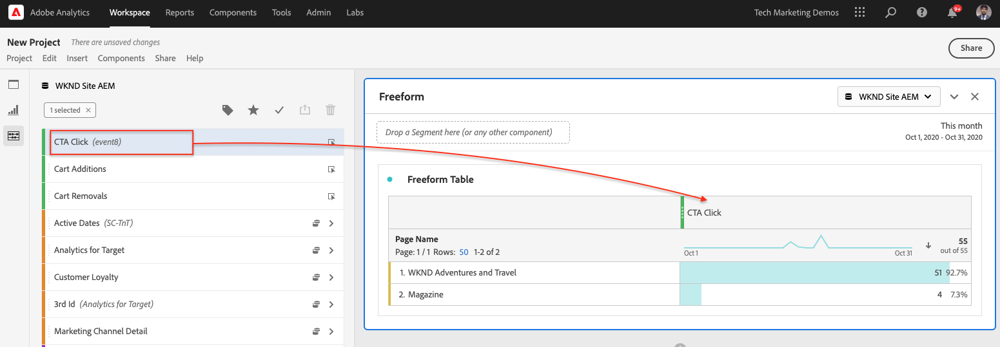

# Analysis Workspaceでのデータ分析

Adobe Experience Manager Site から取り込んだデータを、Adobe Analyticsレポートスイートの指標およびディメンションにマッピングする方法について説明します。 Adobe AnalyticsのAnalysis Workspace機能を使用して、詳細なレポートダッシュボードを作成する方法を説明します。

## 作成する内容

WKND マーケティングチームは、どのコールトゥアクション (CTA) ボタンがホームページで最も効果が高いかを把握したいと考えています。 このチュートリアルでは、Analysis Workspaceで新しいプロジェクトを作成して、様々な CTA ボタンのパフォーマンスを視覚化し、サイトでのユーザーの行動を理解します。 次の情報は、ユーザーが WKND ホームページ上のコールトゥアクション (CTA) ボタンをクリックすると、Adobe Analyticsを使用して取得されます。

**Analytics 変数**

現在追跡中の Analytics 変数を以下に示します。

* `eVar5` -  `Page template`
* `eVar6` - `Page Id`
* `eVar7` - `Page last modified date`
* `eVar8` - `CTA Button Id`
* `eVar9` - `Page Name`
* `event8` - `CTA Button Click event`
* `prop8` - `CTA Button Id`

### 目的 {#objective}

1. 新しいレポートスイートを作成するか、既存のレポートスイートを使用します。
1. 設定 [コンバージョン変数 (eVar)](https://experienceleague.adobe.com/docs/analytics/admin/admin-tools/conversion-variables/conversion-var-admin.html) および [成功イベント（イベント）](https://experienceleague.adobe.com/docs/analytics/admin/admin-tools/success-events/success-event.html) 」と入力します。
1. の作成 [Analysis Workspaceプロジェクト](https://experienceleague.adobe.com/docs/analytics/analyze/analysis-workspace/home.html) インサイトを迅速に作成、分析、共有できるツールを使用してデータを分析する。
1. Analysis Workspaceプロジェクトを他のチームメンバーと共有します。

## 前提条件

このチュートリアルは、 [Adobe Analyticsを使用したクリックされたコンポーネントの追跡](./track-clicked-component.md) およびは、以下があることを前提としています。

* A **Launch プロパティ** と [Adobe Analytics拡張機能](https://experienceleague.adobe.com/docs/experience-platform/tags/extensions/adobe/analytics/overview.html?lang=ja) 有効
* **Adobe Analytics** テスト/開発レポートスイート ID とトラッキングサーバー。 詳しくは、次のドキュメントを参照してください。 [新しいレポートスイートの作成](https://experienceleague.adobe.com/docs/analytics/admin/manage-report-suites/new-report-suite/new-report-suite.html).
* [Experience Platformデバッガー](https://experienceleague.adobe.com/docs/debugger-learn/tutorials/experience-platform-debugger/introduction-to-the-experience-platform-debugger.html) Launch プロパティがに読み込まれた状態で設定されたブラウザー拡張機能 [https://wknd.site/us/en.html](https://wknd.site/us/en.html) またはAEMサイトで、Adobeデータレイヤーが有効になっている。

## コンバージョン変数 (eVar) と成功イベント（イベント）

Custom Insightコンバージョン変数 ( またはeVar) は、サイトで選択した Web ページのAdobeコードに配置されます。 その主な目的は、カスタムマーケティングレポートでコンバージョン成功指標をセグメント化することです。 eVarは、訪問ベースにすることができ、cookie と同様に機能します。 eVar変数に渡された値は、所定の期間、ユーザーに従います。

eVarを 1 人の訪問者の値に設定すると、Adobeではその値が期限切れになるまで自動的に記憶されます。 eVar値がアクティブなときに訪問者が発生した成功イベントは、eVar値にカウントされます。

eVar は、次のような原因と効果の測定に最適です。

* 売上高に影響を与えた内部キャンペーン
* 最終的に登録に至ったバナー広告
* 注文前に内部検索が使用された回数

成功イベントは、追跡可能なアクションです。 成功イベントを決定します。 例えば、訪問者が CTA ボタンをクリックした場合、クリックイベントは成功イベントと見なすことができます。

### eVar の設定

1. Adobe Experience Cloudホームページから、組織を選択し、Adobe Analyticsを起動します。

   

1. Analytics ツールバーで、 **管理者** > **レポートスイート** をクリックし、レポートスイートを見つけます。

   

1. 「レポートスイート」を選択します。 **設定を編集** > **コンバージョン** > **コンバージョン変数**

   

1. の使用 **新規追加** 」オプションで、コンバージョン変数を作成して、次のようにスキーマをマッピングします。

   * `eVar5` -  `Page Template`
   * `eVar6` - `Page ID`
   * `eVar7` - `Last Modified Date`
   * `eVar8` - `Button Id`
   * `eVar9` - `Page Name`

   

1. 各 eVar に適切な名前と説明を入力し、 **保存** 変更内容。 次の節では、これらの eVar を使用してAnalysis Workspaceプロジェクトを作成します。 したがって、わかりやすい名前を指定すると、変数を見つけやすくなります。

   

### 成功イベントの設定

次に、CTA ボタンのクリックを追跡するイベントを作成します。

1. 次の **Report Suite Manager** ウィンドウで、 **レポートスイート ID** をクリックし、 **設定を編集**.
1. クリック **コンバージョン** > **成功イベント**
1. の使用 **新規追加** オプションを選択し、新しいカスタム成功イベントを作成して CTA ボタンのクリックを追跡し、 **保存** 変更内容。
   * `Event`：`event8`
   * `Name`:`CTA Click`
   * `Type`:`Counter`

   

## Analysis Workspaceで新しいプロジェクトを作成する {#workspace-project}

Analysis Workspaceは、分析を構築してインサイトをすばやく共有できる、柔軟なブラウザーツールです。 ドラッグ&amp;ドロップインターフェイスを使用して、分析を作成し、ビジュアライゼーションを追加して、データを有効にし、データセットをキュレーションし、組織内の任意のユーザーとプロジェクトを共有し、スケジュールできます。

次に、新しい [プロジェクト](https://experienceleague.adobe.com/docs/analytics/analyze/analysis-workspace/build-workspace-project/freeform-overview.html#analysis-workspace) を使用して、サイト全体での CTA ボタンのパフォーマンスを分析するダッシュボードを作成します。

1. Analytics ツールバーで、 **Workspace** をクリックし、 **新しいプロジェクトを作成**.

   

1. 次の中から開始を選択 **空のプロジェクト** または、組織が提供する事前定義済みテンプレートか、組織が作成したカスタムAdobeのいずれかを選択します。 想定している分析や使用事例に応じて、いくつかのテンプレートを使用できます。 [詳細情報](https://experienceleague.adobe.com/docs/analytics/analyze/analysis-workspace/build-workspace-project/starter-projects.html) 使用可能な様々なテンプレートオプションについて。

   Workspace プロジェクトでは、左パネルからパネル、テーブル、ビジュアライゼーションおよびコンポーネントにアクセスします。 これらはプロジェクトの構成要素です。

   * **[コンポーネント](https://experienceleague.adobe.com/docs/analytics/analyze/analysis-workspace/components/analysis-workspace-components.html)**  — コンポーネントは、ディメンション、指標、セグメントまたは日付範囲です。これらすべてをフリーフォームテーブルに組み合わせて、ビジネスに関する質問への回答を開始できます。 分析を開始する前に、各コンポーネントのタイプについて理解しておく必要があります。 コンポーネントの用語を習得したら、フリーフォームテーブルでドラッグ&amp;ドロップを開始し、分析を構築します。
   * **[ビジュアライゼーション](https://experienceleague.adobe.com/docs/analytics/analyze/analysis-workspace/visualizations/freeform-analysis-visualizations.html)** ：棒グラフや折れ線グラフなどのビジュアライゼーションをデータに追加して、データに命を吹き込みます。 左端のパネルで、中央のビジュアライゼーションアイコンを選択し、使用可能なビジュアライゼーションの完全なリストを表示します。
   * **[パネル](https://experienceleague.adobe.com/docs/analytics/analyze/analysis-workspace/panels/panels.html)**  — パネルは、テーブルとビジュアライゼーションのコレクションです。 パネルには、Workspace の左上のアイコンからアクセスできます。 パネルは、期間、レポートスイート、分析の使用例に従ってプロジェクトを整理する場合に役立ちます。 Analysis Workspaceでは、次のパネルタイプを使用できます。

   

### Analysis Workspaceでのデータのビジュアライゼーションの追加

次に、WKND サイトのホームページでユーザーがコールトゥアクション (CTA) ボタンとどのようにやり取りするかを視覚的に表現するテーブルを作成します。 このような表現を作成するには、 [Adobe Analyticsを使用したクリックされたコンポーネントの追跡](./track-clicked-component.md). 以下に、WKND サイトのコールトゥアクションボタンを使用したユーザーインタラクションで追跡されたデータの概要を示します。

* `eVar5` -  `Page template`
* `eVar6` - `Page Id`
* `eVar7` - `Page last modified date`
* `eVar8` - `CTA Button Id`
* `eVar9` - `Page Name`
* `event8` - `CTA Button Click event`
* `prop8` - `CTA Button Id`

1. ドラッグ&amp;ドロップ **ページ** ディメンションコンポーネントをフリーフォームテーブルに追加します。 これで、ページ名 (eVar9) と、対応するページビュー（回数）をテーブル内に表示するビジュアライゼーションを表示できるようになります。

   

1. ドラッグ&amp;ドロップ **CTA クリック** (event8) 指標を使用して、回数指標を置き換えます。 これで、ページ名 (eVar9) と、ページ上の CTA クリックイベントの対応する数を表示するビジュアライゼーションを表示できます。

   

1. では、テンプレートタイプ別にページを分類します。 コンポーネントからページテンプレート指標を選択し、ページテンプレート指標を「ページ名」ディメンションにドラッグ&amp;ドロップします。 これで、ページ名がテンプレートタイプ別に分類されて表示されるようになりました。

   * **前**

      

   * **後**

      

1. WKND サイトページ上でユーザーが CTA ボタンをどのように操作するかを理解するには、ボタン ID(eVar8) 指標を追加して、ページテンプレート指標をさらに分類する必要があります。

   

1. 以下に、WKND サイトをページテンプレート別に分類し、さらに WKND サイトのクリックトゥアクション (CTA) ボタンとのユーザーインタラクション別に分類した視覚的表現を示します。

   

1. Adobe Analytics Classifications を使用して、ボタン ID の値を、よりわかりやすい名前に置き換えることができます。 特定の指標の分類を作成する方法について詳しくは、 [ここ](https://experienceleague.adobe.com/docs/analytics/components/classifications/c-classifications.html). この例では、分類指標があります `Button Section (Button ID)` 設定 `eVar8` これは、ボタン id をユーザーにわかりやすい名前にマッピングします。

   

## 分析変数への分類の追加

### コンバージョンの分類

Analytics 分類を使用すると、Analytics 変数データを分類し、レポートを生成する際に様々な方法でデータを表示することができます。 Analytics Workspace レポートでボタン ID がどのように表示されるかを改善するには、ボタン ID(eVar8) の分類変数を作成します。 分類する際には、変数とその変数に関連するメタデータとの間に関係を確立します。

次に、Analytics 変数の分類を作成します。

1. 次の **管理者** ツールバーメニュー、選択 **レポートスイート**
1. を選択します。 **レポートスイート ID** から **Report Suite Manager** ウィンドウとクリック **設定を編集** > **コンバージョン** > **コンバージョンの分類**

   

1. 次の **分類タイプを選択** ドロップダウンリストから、変数 (eVar8 ボタン ID) を選択して分類を追加します。
1. 「分類」セクションの下に表示される分類変数の横にある矢印をクリックして、新しい分類を追加します。

   

1. 内 **分類の編集** ダイアログボックスで、テキスト分類に適した名前を指定します。 テキスト分類名を持つディメンションコンポーネントが作成されます。

   

1. **変更を保存します。**

### 分類インポーター

インポーターを使用して、分類をAdobe Analyticsにアップロードします。 インポートの前に、更新用にデータをエクスポートすることもできます。 インポートツールを使用してインポートするデータは、特定の形式にする必要があります。 Adobeには、適切なヘッダーの詳細をすべて含んだデータテンプレートをタブ区切りのデータファイルにダウンロードするオプションが用意されています。 新しいデータをこのテンプレートに追加し、FTP を使用してブラウザーにデータファイルをインポートできます。

#### 分類テンプレート

分類をマーケティングレポートにインポートする前に、分類データファイルの作成に役立つテンプレートをダウンロードできます。 データファイルでは、必要な分類を列見出しとして使用し、レポートデータセットを適切な分類見出しの下に整理します。

次に、ボタン ID(eVar8) 変数の分類テンプレートをダウンロードします。

1. に移動します。 **管理者** > **分類インポーター**
1. コンバージョン変数の分類テンプレートを **テンプレートをダウンロード** タブ。
   

1. 「テンプレートのダウンロード」タブで、データテンプレートの設定を指定します。
   * **レポートスイートの選択** :テンプレートで使用するレポートスイートを選択します。 レポートスイートとデータセットが一致している必要があります。
   * **分類するデータセット** :データファイルのデータのタイプを選択します。 このメニューには、分類用に設定されたレポートスイート内のすべてのレポートが含まれます。
   * **エンコード** :データファイルの文字エンコーディングを選択します。 デフォルトのエンコーディング形式は UTF-8 です。

1. クリック **ダウンロード** テンプレートファイルをローカルシステムに保存します。 このテンプレートファイルは、タブ区切りのデータファイル（.tab ファイル名の拡張子）で、ほとんどのスプレッドシートアプリケーションでサポートされています。
1. 任意のエディターを使用して、タブ区切りのデータファイルを開きます。
1. セクションの手順 9 の各eVar9 値に対して、ボタン ID(eVar9) と対応するボタン名をタブ区切りファイルに追加します。

   

1. **保存** タブ区切りファイル。
1. 次に移動： **ファイルのインポート** タブをクリックします。
1. ファイルのインポート先を設定します。
   * **レポートスイートの選択** :WKND サイトAEM （レポートスイート）
   * **分類するデータセット** :ボタン ID ( コンバージョン変数eVar8)
1. をクリックします。 **ファイルを選択** タブ区切りファイルをシステムからアップロードし、 **ファイルのインポート**

   

   >[!NOTE]
   >
   > インポートが正常に完了すると、エクスポートに適切な変更が直ちに表示されます。 ただし、ブラウザーインポートを使用する場合はレポートのデータ変更に最大 4 時間かかり、FTP インポートを使用する場合は最大 24 時間かかります。

#### コンバージョン変数を分類変数に置き換える

1. Analytics ツールバーで、 **Workspace** で、 [Analysis Workspaceで新しいプロジェクトを作成する](#workspace-project) の節を参照してください。

   

1. 次に、 **ボタン ID** 指標を使用して、前の手順で作成した分類名を持つコールトゥアクション (CTA) ボタンの ID を表示できます。

1. コンポーネントファインダーから、を検索します。 **WKND CTA ボタン** をクリックし、 **WKND CTA ボタン（ボタン ID）** ディメンションをボタン ID 指標に置き換え、

   * **前**

      
   * **後**

      

1. コールトゥアクション (CTA) ボタンのボタン ID を含むボタン ID 指標が、分類テンプレートで提供された対応する名前に置き換えられました。
1. Analytics Workspace テーブルと WKND ホームページを比較し、CTA ボタンのクリック数とその分析について説明します。 ワークスペースのフリーフォームテーブルデータに基づいて、22 回のユーザーが **今すぐスキー** WKND ホームページキャンピング（西オーストラリア）のボタンと 4 回 **詳細を表示** 」ボタンをクリックします。

   

1. Adobe Analytics Workspace プロジェクトを保存し、適切な名前と説明を指定してください。 必要に応じて、ワークスペースプロジェクトにタグを追加できます。

   

1. プロジェクトが正常に保存されたら、「共有」オプションを使用して、ワークスペースプロジェクトを他の同僚やチームメイトと共有できます。

   

## おめでとうございます。

Adobe Experience Manager Site から取り込んだデータをAdobe Analyticsレポートスイートの指標およびディメンションにマッピングし、指標の分類を実行し、Adobe AnalyticsのAnalysis Workspace機能を使用して詳細なレポートダッシュボードを作成する方法を学びました。
