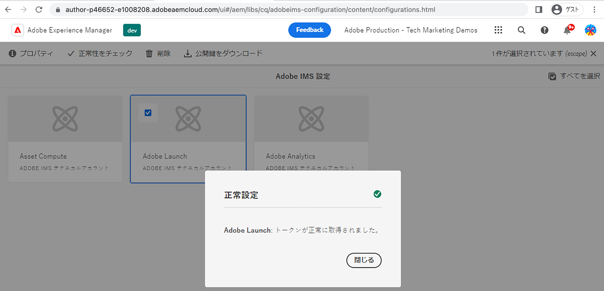

# IMS を使用した AEM Sites とタグプロパティの接続{#connect-aem-and-tag-property-using-ims}

AEM の IMS（Identity Management System）設定を使用して、AEM をタグプロパティに接続する方法について説明します。このセットアップでは、タグ API で AEM を認証し、AEM がタグ API を介して通信してタグプロパティにアクセスできるようにします。

## IMS 設定の作成または再利用

AEM を新規作成のタグプロパティと統合するには、Adobe Developer Console プロジェクトを使用した IMS 設定が必要です。この設定を使用することで、AEM はタグ API を使用してタグアプリケーションと通信できます。また、IMS はこの統合のセキュリティ面を処理します。

AEM as a Cloud Service 環境がプロビジョニングされるたびに、Asset Compute、Adobe Analytics、タグなど、いくつかの IMS 設定が自動的に作成されます。自動作成された **Adobe Experience Platform のタグ** IMS 設定を使用できます。ただし、AEM 6.x 環境を使用している場合は、新しい IMS 設定を作成する必要があります。

次の手順を使用して、自動作成された **Adobe Experience Platform のタグ** IMS 設定を確認します。

1. AEM オーサーで&#x200B;**ツール**&#x200B;メニューを開きます。
1. 「セキュリティ」セクションで、Adobe IMS 設定を選択します。
1. **Adobe Launch** カードを選択し、「**プロパティ**」をクリックし、「**証明書**」タブと「**アカウント**」タブで詳細を確認します。次に、「**キャンセル**」をクリックして、自動作成された詳細を変更せずに戻ります。
1. **Adobe Launch** カードを選択し、今度は「**正常性をチェック**」をクリックします。以下のような&#x200B;**成功**&#x200B;メッセージが表示されます。

   

## 次の手順

[AEM でのタグクラウドサービス設定の作成](create-aem-launch-cloud-service.md)
