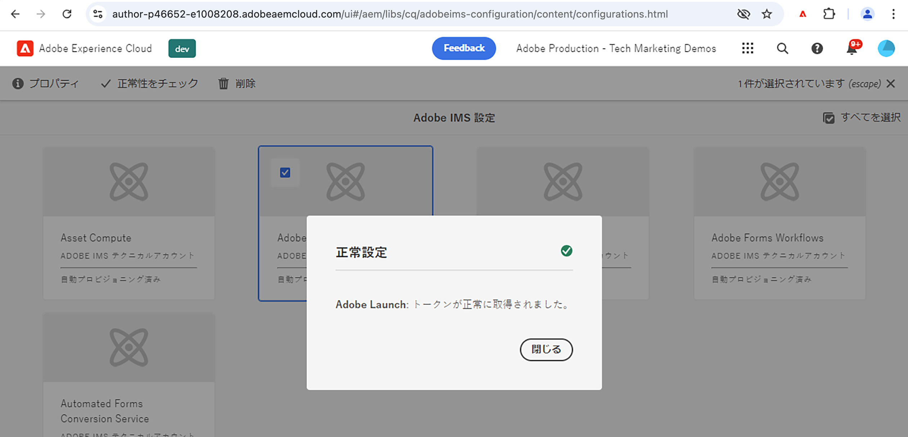

# IMS を使用してAEMをタグプロパティに接続{#connect-aem-and-tag-property-using-ims}

>[!NOTE]
>
>Adobe Experience Platform Launchの名前をデータ収集テクノロジーのセットとして変更するプロセスは、AEM製品の UI、コンテンツおよびドキュメントに実装されているので、Launch という用語は現在も使用されています。

AEMの IMS(Identity Management System) 設定を使用して、AEMをタグプロパティに接続する方法について説明します。 この設定は、AEM API で Launch を認証し、AEMが Launch API を介して通信してタグプロパティにアクセスできるようにします。

## IMS 設定を作成または再利用

AEMを新しく作成したタグプロパティと統合するには、Adobe Developer Console プロジェクトを使用した IMS 設定が必要です。 この設定により、AEMは Launch API を使用してタグアプリケーションと通信でき、IMS はこの統合のセキュリティ側面を処理します。

AEM as aCloud Service環境がプロビジョニングされるたびに、Asset compute、Adobe Analytics、AdobeLaunch など、いくつかの IMS 設定が自動的に作成されます。 自動作成された **Adobe起動** IMS 設定を使用できます。または、AEM 6.X 環境を使用している場合は、新しい IMS 設定を作成する必要があります。

自動作成されたレビュー **Adobe起動** 次の手順を使用した IMS の設定

1. AEMで、 **ツール** メニュー

1. 「セキュリティ」セクションで、「Adobe IMS構成」を選択します。

1. を選択します。 **Adobe起動** カードとクリック **プロパティ**、詳細を次の場所で確認します： **証明書** および **アカウント** タブ 次に、 **キャンセル** 自動作成された詳細を変更せずに戻す場合。

1. を選択します。 **Adobe起動** カードと今回はクリック **ヘルスチェック**&#x200B;を使用する場合、 **成功** 以下のようなメッセージ。

   

## 次の手順

[Launch クラウドサービス設定の作成 AEM内](create-aem-launch-cloud-service.md)
