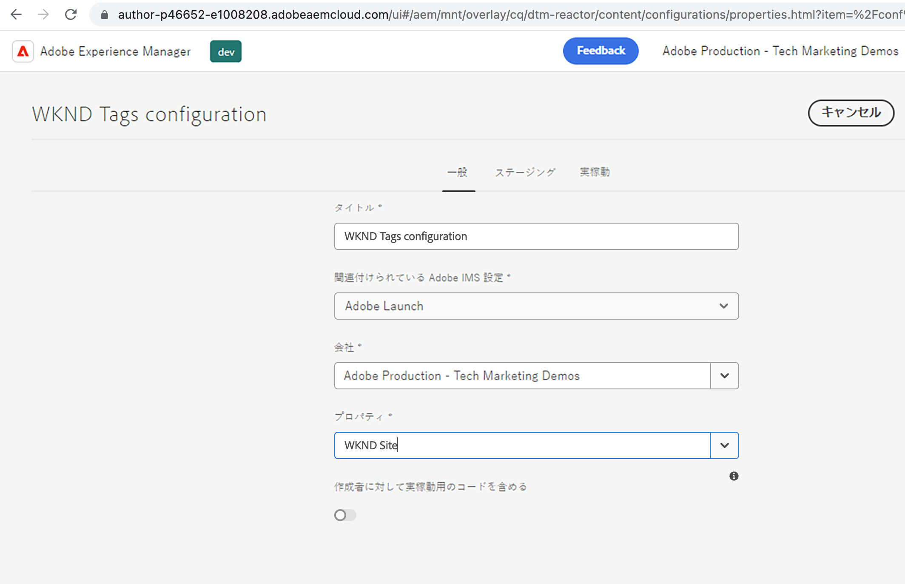

# AEMでの LaunchCloud Service設定の作成 {#create-launch-cloud-service}

>[!NOTE]
>
>Adobe Experience Platform Launchの名前をデータ収集テクノロジーのセットとして変更するプロセスは、AEM製品の UI、コンテンツおよびドキュメントに実装されているので、Launch という用語は現在も使用されています。

Adobe Experience Managerで Launch 設定を作成するCloud Serviceを説明します。 その後、AEM LaunchCloud Serviceの設定を既存のサイトに適用でき、タグライブラリの読み込みをオーサー環境とパブリッシュ環境の両方で監視できます。

## Launch クラウドサービスを作成する

以下の手順を使用して、Launch クラウドサービス設定を作成します。

1. 次の **ツール** メニュー、選択 **Cloud Services** 「 」セクションで、「 」をクリックします。 **Adobe起動設定**

1. サイトの config フォルダーを選択するか、 **WKND サイト** （WKND ガイドプロジェクトを使用する場合）、 **作成**

1. 次の _一般_ 」タブで、 **タイトル** フィールドを選択し、 **Adobe起動** から _関連するAdobe IMS設定_ ドロップダウン。 次に、 _会社_ ドロップダウンで、前に作成したプロパティを _プロパティ_ ドロップダウン。

1. 次の _ステージング_ および _実稼動_ 「 」タブはデフォルト設定のままです。 ただし、実際の実稼動環境の設定 ( 特に _ライブラリを非同期で読み込み_ パフォーマンスと最適化の要件に応じて切り替えます。 また、 _ライブラリ URI_ の値は、ステージングと実稼動で異なります。

1. 最後に、「 **作成** をクリックして、Launch クラウドサービスを完了します。

   

## サイトに Launch クラウドサービスを適用する

タグプロパティとそのライブラリをAEMサイトに読み込むには、Launch クラウドサービスの設定がサイトに適用されます。 前の手順では、クラウドサービスの設定がサイト名フォルダー（WKND サイト）の下に作成され、自動的に適用されるようになります。その場合は、確認してみましょう。

1. 次の **ナビゲーション** メニュー、選択 **サイト** アイコン

1. AEM Site のルートページを選択し、 **プロパティ**. 次に、 **詳細** 」タブと「」タブ **設定** セクションで、クラウド設定値がサイト固有の値を指していることを確認します。 `conf` フォルダー。

   

## 作成者ページと発行ページでのタグプロパティの読み込みを確認する

次に、タグプロパティとそのライブラリがAEMサイトページに読み込まれることを確認します。

1. お気に入りのサイトページを **公開済みとして表示** モードの場合は、ブラウザーコンソールにログメッセージが表示されます。 これは、タグプロパティルールの JavaScript コードスニペットからのメッセージで、 _読み込まれたライブラリ（ページ上部）_ イベントがトリガーされます。

1. パブリッシュで検証するには、まず **クラウドサービスを起動** を設定し、パブリッシュインスタンスでサイトページを開きます。

   

おめでとうございます。AEMプロジェクトコードを更新せずにAEMサイトに JavaScript コードを挿入するAEMとデータ収集タグの統合を完了している。

## チャレンジ — タグプロパティのルールを更新および公開します

前の [タグプロパティの作成](./create-tag-property.md) シンプルなチャレンジを完了するには、既存のルールを更新して、追加のコンソールステートメントを追加し、 _公開フロー_ AEMサイトにデプロイします。

## 次の手順

[タグ実装のデバッグ](debug-tags-implementation.md)
