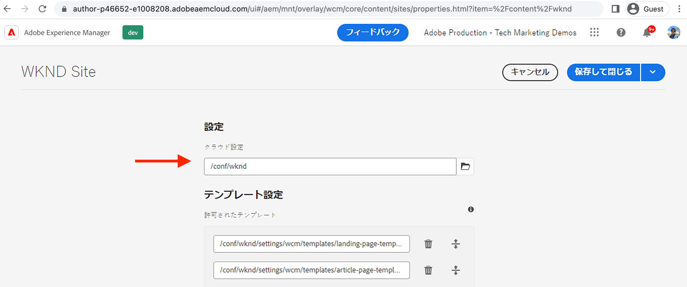

# AEMでタグCloud Service設定を作成する {#create-launch-cloud-service}

Adobe Experience ManagerでタグCloud Service設定を作成する方法を説明します。 その後、AEMタグCloud Service設定を既存のサイトに適用でき、タグライブラリの読み込みをオーサー環境とパブリッシュ環境の両方で監視できます。

## タグクラウドサービスの作成

以下の手順を使用して、タグクラウドサービス設定を作成します。

1. **ツール**&#x200B;メニューから&#x200B;**クラウドサービス**／**Adobe Launch 設定**&#x200B;を選択します。
1. サイトの config フォルダーまたは **WKND Site**（WKND ガイドプロジェクトを使用している場合）を選択し、「**作成**」をクリックします。
1. 「_一般_」タブから「**タイトル**」フィールドを使用して設定に名前を付け、「_関連する Adobe IMS 設定_」ドロップダウンから「**Adobe Launch**」を選択します。次に、「_会社_」ドロップダウンから会社名を選択し、「_プロパティ_」ドロップダウンから前に作成したプロパティを選択します。
1. 「_ステージング_」タブと「_実稼動_」タブは、デフォルト設定のままにします。ただし、パフォーマンスと最適化の要件に応じて、実際の実稼働セットアップの設定を確認し変更すること（特に「_ライブラリを非同期に読み込み_」への切り替え）をお勧めします。また、_ライブラリ URI_ の値は、ステージングと実稼動で異なることにも注意が必要です。
1. 最後に、「 **作成** をクリックして、タグクラウドサービスを完了します。

   

## サイトにタグクラウドサービスを適用する

タグのプロパティとそのライブラリをAEMサイトに読み込むには、タグクラウドサービスの設定がサイトに適用されます。 前の手順では、クラウドサービス設定をサイト名フォルダー（WKND Site）に作成したので、自動的に適用されます。それを確かめてみましょう。

1. **ナビゲーション**&#x200B;メニューから「**サイト**」アイコンを選択します。

1. AEM Site のルートページを選択し、「**プロパティ**」をクリックします。次に、「**詳細**」タブの「**設定**」セクションに移動し、クラウド設定の値がサイト固有の `conf` フォルダーを指していることを確認します。

   

## 作成ページと公開ページでのタグプロパティ読み込みの確認

次に、タグプロパティとそのライブラリが AEM サイトページに読み込まれていることを確認します。

1. お気に入りのサイトページを「**公開済みとして表示**」モードで開くと、ブラウザーコンソールにログメッセージが表示されます。これは、_ライブラリの読み込み（ページのトップ）_&#x200B;イベントがトリガーされたときに起動される、タグプロパティ Rule の JavaScript コードスニペットで定義されたメッセージと同じものです。

1. パブリッシュで検証するには、まず **タグクラウドサービス** を設定し、パブリッシュインスタンスでサイトページを開きます。

   

おめでとうございます。AEM サイトに JavaScript コードを挿入する、AEM とデータ収集タグの統合を、AEM プロジェクトコードを更新することなく完了しました。

## 課題 - タグプロパティ内のルールの更新と公開

前の[タグプロパティの作成](./create-tag-property.md)から学んだことを活かして簡単な課題を完了し、既存のルールを更新してコンソールステートメントを追加し、_公開フロー_&#x200B;を使用してそれを AEM サイトにデプロイします。

## 次の手順

[タグ実装のデバッグ](debug-tags-implementation.md)
