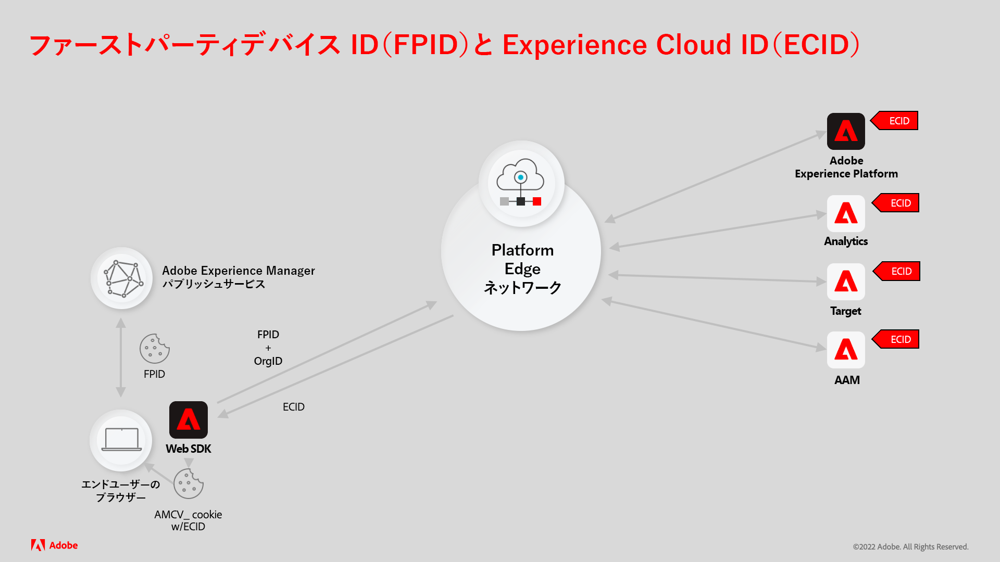
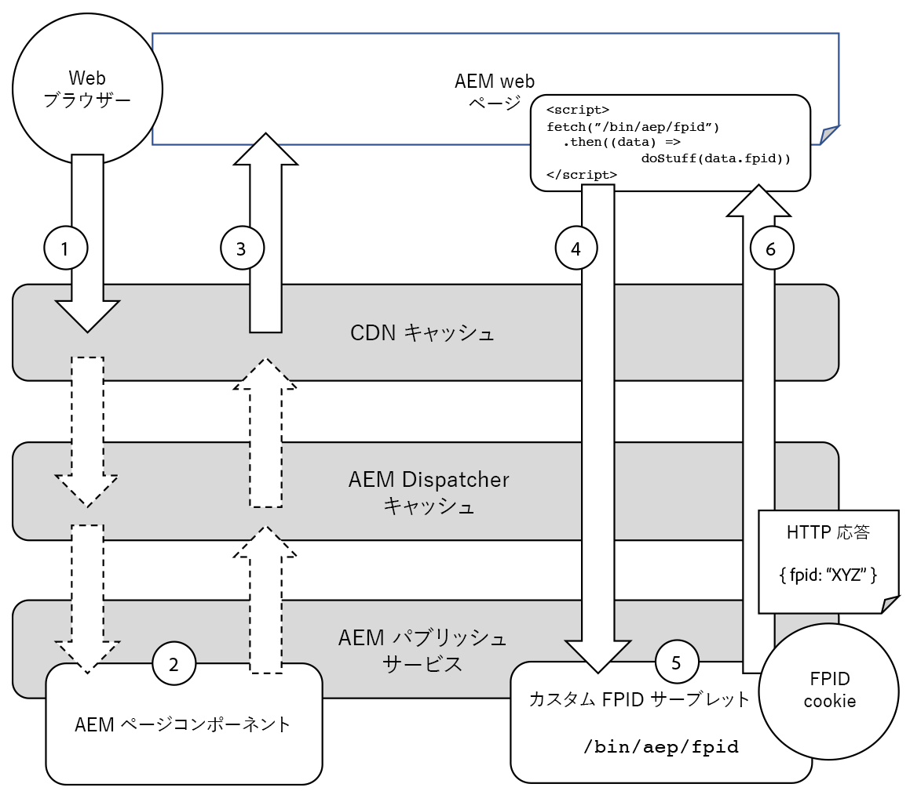

# AEM Sites を使用した Experience Platform FPID の生成

AEM Publish 経由で配信される Adobe Experience Manager（AEM）Sites と Adobe Experience Platform（AEP）を統合するには、AEM が、ユーザーアクティビティを一意に追跡するために一意のファーストパーティデバイス ID（FPID）Cookie を生成し維持管理する必要があります。

サポートドキュメントを読んで、[ファーストパーティデバイス ID と Experience Cloud ID の連携方法の詳細をご確認ください](https://experienceleague.adobe.com/docs/platform-learn/data-collection/edge-network/generate-first-party-device-ids.html?lang=ja)。

AEM を web ホストとして使用する場合の FPID の仕組みの概要を以下に示します。



## AEM を使用した FPID の生成と保持

AEM パブリッシュサービスは、CDN とAEM Dispatcher の両方のキャッシュで、リクエストをできるだけキャッシュすることで、パフォーマンスを最適化します。

ユーザーごとに一意の FPID cookie を生成し、FPID 値を返す必須の HTTP リクエストは絶対にキャッシュされてはいけません。これらはAEM パブリッシュから直接提供されて、一意性を保証するロジックを実装できます。

FPID の一意性要件を組み合わせると、これらのリソースがキャッシュ不可能になるので、web ページやその他のキャッシュ可能なリソースのリクエストで FPID cookie を生成しないでください。

次の図に、AEM パブリッシュサービスによる FPID の管理方法を示します。



1. Web ブラウザーは、AEM がホストする web ページに対してリクエストを行います。 リクエストは、CDN または AEM Dispatcher キャッシュからの web ページのキャッシュされたコピーを使用して応答されます。
1. Web ページを CDN またはAEM Dispatcher キャッシュから提供できない場合、リクエストは AEM パブリッシュサービスに到達し、リクエストされた web ページが生成されます。
1. 次に、web ページが web ブラウザーに返され、リクエストに対応できなかったキャッシュが生成されます。 AEM の場合、CDN とAEM Dispatcher のキャッシュヒット率が 90%を超えることを想定します。
1. Web ページには、AEM パブリッシュサービス内のカスタム FPID サーブレットに対してキャッシュ不能な非同期 XHR（AJAX）リクエストを実行する JavaScript が含まれています。 これは（ランダムなクエリパラメーターと Cache-Control ヘッダーにより）キャッシュ不可のリクエストなので、CDN や AEM Dispatcher によってキャッシュされず、常に AEM パブリッシュサービスに到達して応答を生成します。
1. AEM パブリッシュサービスのカスタム FPID サーブレットがリクエストを処理し、既存の FPID cookie が見つからない場合は新しい FPID を生成し、既存の FPID cookie の有効期間を延長します。 また、このサーブレットは、クライアントサイド JavaScript で使用する FPID を応答本文に返します。 幸いにも、カスタム FPID サーブレットロジックは軽量なので、このリクエストによって AEM パブリッシュサービスのパフォーマンスが影響を受けることはありません。
1. XHR リクエストに対する応答は、FPID cookie と FPID を応答本文の JSON としてブラウザーに返し、Platform Web SDK で使用されます。

## コードサンプル

次のコードと設定を AEM パブリッシュサービスにデプロイすると、既存の FPID cookie を生成または延長して FPID を JSON として返すエンドポイントを作成できます。

### AEM Publish FPID cookie サーブレット

FPID cookie を生成または拡張するには、[Sling サーブレット](https://sling.apache.org/documentation/the-sling-engine/servlets.html#registering-a-servlet-using-java-annotations-1)を使用して AEM Publish HTTP エンドポイントを作成する必要があります。

+ アクセスに認証が必要ないため、サーブレットは `/bin/aem/fpid` にバインドされています。認証が必要な場合は、Sling リソースタイプにバインドします。
+ このサーブレットは、HTTP GET リクエストを受け入れます。 応答はキャッシュを防ぐために `Cache-Control: no-store` でマークされていますが、このエンドポイントは一意のキャッシュ無効化クエリパラメーターも使用してリクエストする必要があります。

HTTP リクエストがサーブレットに到達すると、サーブレットは、リクエストに FPID cookie が存在するかどうかを確認します。

+ FPID cookie が存在する場合は、cookie の有効期間を延長し、その値を収集して応答に書き込みます。
+ FPID cookie が存在しない場合は、新しい FPID cookie を生成し、値を保存して応答に書き込みます。

次に、サーブレットは FPID を `{ fpid: "<FPID VALUE>" }` フォームの JSON オブジェクトとして応答に書き込みます。

FPID Cookie は `HttpOnly` とマークされているため、FPID を本文でクライアントに提供することが重要です。これは、サーバーのみがその値を読み取ることができ、クライアントサイドの JavaScript は読み取れないことを意味します。ページの読み込み時に FPID が不必要に再取得されるのを避けるために、`FPID_CLIENT` Cookie も設定されます。これは、FPID が生成されたことを示し、その値をクライアントサイドの JavaScript に公開して使用できるようにします。

FPID 値は、Platform Web SDK を使用して呼び出しをパラメーター化するために使用されます。

以下は、FPID cookie を生成または更新し、FPID を JSON として返す AEM サーブレットエンドポイント（`HTTP GET /bin/aep/fpid` 経由で利用可能）のコード例です。

+ `core/src/main/java/com/adobe/aem/guides/wkndexamples/core/aep/impl/FpidServlet.java`

```java
package com.adobe.aem.guides.wkndexamples.core.aep.impl;

import com.google.gson.JsonObject;
import org.apache.sling.api.SlingHttpServletRequest;
import org.apache.sling.api.SlingHttpServletResponse;
import org.apache.sling.api.servlets.SlingAllMethodsServlet;
import org.osgi.service.component.annotations.Component;
import org.slf4j.Logger;
import org.slf4j.LoggerFactory;

import javax.servlet.Servlet;
import javax.servlet.http.Cookie;
import java.io.IOException;
import java.util.UUID;

import static org.apache.sling.api.servlets.ServletResolverConstants.SLING_SERVLET_PATHS;
import static org.apache.sling.api.servlets.ServletResolverConstants.SLING_SERVLET_METHODS;

@Component(
        service = {Servlet.class},
        property = {
                SLING_SERVLET_PATHS + "=/bin/aep/fpid",
                SLING_SERVLET_METHODS + "=GET"
        }
)
public class FpidServlet extends SlingAllMethodsServlet {
    private static final Logger log = LoggerFactory.getLogger(FpidServlet.class);
    private static final String COOKIE_NAME = "FPID";
    private static final String CLIENT_COOKIE_NAME = "FPID_CLIENT";
    private static final String COOKIE_PATH = "/";
    private static final int COOKIE_MAX_AGE = 60 * 60 * 24 * 30 * 13; // 13 months
    private static final String JSON_KEY = "fpid";

    @Override
    protected final void doGet(SlingHttpServletRequest request, SlingHttpServletResponse response) throws IOException {
        // Try to get an existing FPID cookie, this will give us the user's current FPID if it exists
        final Cookie existingCookie = request.getCookie(COOKIE_NAME);

        String cookieValue;

        if (existingCookie == null) {
            //  If no FPID cookie exists, create a new FPID UUID
            cookieValue = UUID.randomUUID().toString();
        } else {
            // If a FPID cookie exists, get its FPID UUID so its life can be extended
            cookieValue = existingCookie.getValue();
        }

        // Add the FPID value to the response, either newly generated or the extended one
        // This can be read by the Server (AEM Publish) due to HttpOnly flag.
        response.addHeader("Set-Cookie",
                COOKIE_NAME + "=" + cookieValue + "; " +
                        "Max-Age=" + COOKIE_MAX_AGE + "; " +
                        "Path=" + COOKIE_PATH + "; " +
                        "HttpOnly; " +
                        "Secure; " +
                        "SameSite=Lax");

        // Also set FPID_CLIENT cookie to avoid further server-side FPID generation
        // This can be read by the client-side JavaScript to check if FPID is already generated
        // or if it needs to be requested from server (AEM Publish)
        response.addHeader("Set-Cookie",
                CLIENT_COOKIE_NAME + "=" + cookieValue + "; " +
                        "Max-Age=" + COOKIE_MAX_AGE + "; " +
                        "Path=" + COOKIE_PATH + "; " +
                        "Secure; " + 
                        "SameSite=Lax");

        // Avoid caching the response
        response.addHeader("Cache-Control", "no-store");

        // Return FPID in the response as JSON for client-side access
        final JsonObject json = new JsonObject();
        json.addProperty(JSON_KEY, cookieValue);

        response.setContentType("application/json");
        response.getWriter().write(json.toString());
```

### HTML スクリプト

カスタムのクライアントサイド JavaScript をページに追加して、サーブレットを非同期的に呼び出し、FPID cookie を生成または更新して、応答で FPID を返す必要があります。

この JavaScript スクリプトは、通常、次のいずれかのメソッドを使用して、ページに追加されます。

+ [Adobe Experience Platform のタグ](https://experienceleague.adobe.com/docs/experience-platform/tags/home.html?lang=ja)
+ [AEM クライアントライブラリ](https://experienceleague.adobe.com/docs/experience-manager-cloud-service/content/implementing/developing/full-stack/clientlibs.html?lang=ja)

カスタム AEM FPID サーブレットへの XHR 呼び出しは高速ですが、非同期であるため、ユーザーが AEM によって提供される web ページにアクセスして、リクエストが完了する前に移動する可能性があります。
この場合、AEM から web ページが次に読み込まれたときに、同じプロセスが再試行されます。

AEM FPID サーブレットへの HTTP GET（`/bin/aep/fpid`）は、ブラウザーと AEM パブリッシュサービスの間のインフラストラクチャがリクエストの応答をキャッシュしないように、ランダムクエリパラメーターでパラメーター化されます。
同様に、キャッシュを避けるために、`Cache-Control: no-store` リクエストヘッダーが追加されます。

AEM FPID サーブレットが呼び出されると、FPID が JSON 応答から取得され、[Platform Web SDK](https://experienceleague.adobe.com/docs/platform-learn/implement-web-sdk/tags-configuration/install-web-sdk.html?lang=ja) によって使用されて Experience Platform API に送信されます。

詳しくは、Experience Platform の [identityMap での FPID の使用](https://experienceleague.adobe.com/docs/experience-platform/edge/identity/first-party-device-ids.html?lang=ja#identityMap)ドキュメントを参照してください。 

```javascript
...
<script>
    // Wrap in anonymous function to avoid global scope pollution

    (function() {
        // Utility function to get a cookie value by name
        function getCookie(name) {
            const value = `; ${document.cookie}`;
            const parts = value.split(`; ${name}=`);
            if (parts.length === 2) return parts.pop().split(';').shift();
        }

        // Async function to handle getting the FPID via fetching from AEM, or reading an existing FPID_CLIENT cookie
        async function getFpid() {
            let fpid = getCookie('FPID_CLIENT');
            
            // If FPID can be retrieved from FPID_CLIENT then skip fetching FPID from server
            if (!fpid) {
                // Fetch FPID from the server if no FPID_CLIENT cookie value is present
                try {
                    const response = await fetch(`/bin/aep/fpid?_=${new Date().getTime() + '' + Math.random()}`, {
                        method: 'GET',
                        headers: {
                            'Cache-Control': 'no-store'
                        }
                    });
                    const data = await response.json();
                    fpid = data.fpid;
                } catch (error) {
                    console.error('Error fetching FPID:', error);
                }
            }

            console.log('My FPID is: ', fpid);
            return fpid;
        }

        // Invoke the async function to fetch or skip FPID
        const fpid = await getFpid();

        // Add the fpid to the identityMap in the Platform Web SDK
        // and/or send to AEP via AEP tags or direct AEP Web SDK calls (alloy.js)
    })();
</script>
```

### Dispatcher 許可フィルター

最後に、AEM Dispatcher の `filter.any` 設定を介して、カスタム FPID サーブレットへの HTTP GET リクエストを許可する必要があります。

この Dispatcher 設定が正しく実装されていない場合、`/bin/aep/fpid` への HTTP GET リクエストは 404 を返します。

+ `dispatcher/src/conf.dispatcher.d/filters/filters.any`

```
/1099 { /type "allow" /method "GET" /url "/bin/aep/fpid" }
```

## Experience Platform リソース

ファーストパーティデバイス ID（FPID）と Platform Web SDK を使用した ID データの管理については、次の Experience Platform ドキュメントを確認してください。

+ [ファーストパーティデバイス ID の生成](https://experienceleague.adobe.com/docs/platform-learn/data-collection/edge-network/generate-first-party-device-ids.html?lang=ja)
+ [Platform Web SDK のファーストパーティデバイス ID](https://experienceleague.adobe.com/docs/experience-platform/edge/identity/first-party-device-ids.html?lang=ja)
+ [Platform Web SDK の ID データ](https://experienceleague.adobe.com/docs/experience-platform/edge/identity/overview.html?lang=ja)
