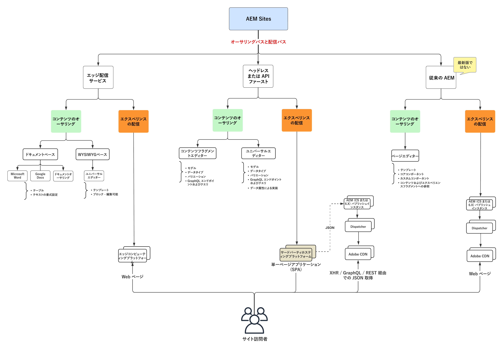
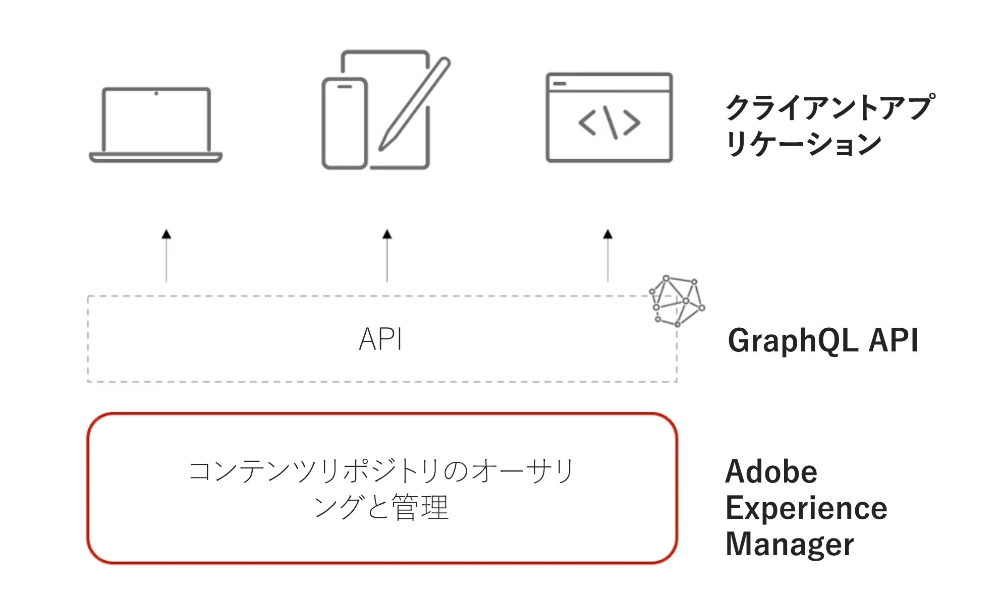

# AEM Sites のビデオおよびチュートリアル {#overview}

{{edge-delivery-services}}

Adobe Experience Manager（AEM） Sites は、Adobeの Experience Management Platform であり、Web サイト、モバイルアプリ、その他のデジタルチャネルなどを通じて、デジタルエクスペリエンスをオーサリング、管理および配信できます。

## AEM Sitesでエクスペリエンスを提供する 3 つの方法

AEM Sites では、エクスペリエンスの作成、オーサリング、配信を行うための 3 つの方法を用意しています。Web サイトを構築する場合でも、エッジのパフォーマンスに合わせて最適化する場合でも、ヘッドレスアプリを強化する場合でも、AEM Sitesはプロジェクトニーズに合わせた柔軟なオプションを提供します。

1. **Edge Delivery Services** のエクスペリエンスでは、AdobeのEdge Networkを使用して、高速かつ低遅延のコンテンツが配信されます。 このサービスは、消費デバイス、検索エンジン、GenAI エージェント用にコンテンツを自動的に最適化します。 作成者は、Adobe ユニバーサルエディターまたはドキュメントベースのオーサリングを使用してコンテンツを作成します。
1. **ヘッドレス/API ファースト** エクスペリエンスでは、AEM パブリッシュを使用して、モバイルアプリ、シングルページアプリケーション（SPA）、その他のヘッドレスクライアント向けに、HTTP API 経由でコンテンツを JSON として配信します。 作成者は、コンテンツフラグメントエディターまたはユニバーサルエディターを使用してコンテンツを作成します。
1. **従来のAEM** エクスペリエンスでは、AEM パブリッシュを使用して、コンテンツをHTML web ページとして配信します。 作成者は、AEM作成者のページエディターを使用してコンテンツを作成します。 このオプションは、既存のプロジェクトまたは移行済みのプロジェクトに最適です。

3 つのオプションはすべて強力なアプローチであり、最良の選択は使用例と組織のニーズによって異なります。 各アプローチを使用すると、チームは、パーソナライズされた魅力的なエクスペリエンスを、あらゆるチャネルやデバイスにわたって迅速かつ大規模に提供できます。

>[!IMPORTANT]
>
> **Edge Delivery Services** は、AEMで web サイトを配信するための最新かつ最も高度な方法です。 Adobe Edge Networkの速度と拡張性を、最新のオーサリングオプションと組み合わせています。 新規プロジェクトにはEdge Delivery Servicesをお勧めしますが、AEM Sitesは引き続きヘッドレスと従来のアプローチをサポートしており、ニーズに最適なパスを選択できます。

次の図は、AEM Sitesでエクスペリエンスを作成するための様々なオプションを示しています。

{width="700" zoomable="yes"}

### AEM Sites を使用した作成方法の比較

次の表では、3 つのパスを大まかに比較しています。各パスのコンテンツのオーサリングとエクスペリエンス配信のニュアンスに焦点を当てています。

|            | Edge Delivery Services | ヘッドレス／API ファースト | 従来のAEM |
|---------------------|------------------------------|---------------------------------|---------------------------------------------|
| **最適な対象** | 高いトラフィック、パフォーマンス、スケーラビリティが求められる web サイト | モバイルアプリ、SPA、その他のヘッドレスアプリケーション | 既存のプロジェクトまたは移行済みプロジェクト |
| **オーサリングツール** | ドキュメントベースのオーサリング、ユニバーサルエディター、ページエディター | コンテンツフラグメント、ユニバーサルエディター | ページエディター、ユニバーサルエディター |
| **作成したコンテンツストア** | ドキュメントまたは AEM オーサー（JCR） | AEM オーサー（JCR） | AEM オーサー（JCR） |
| **配信** | Edge Delivery Services | AEM パブリッシュ（Adobe CDN + Dispatcher を使用） | AEM パブリッシュ（Adobe CDN + Dispatcher を使用） |
| **配信コンテンツストア** | Edge Delivery Services | AEM パブリッシュ（JCR） | AEM パブリッシュ（JCR） |
| **配信フォーマット** | HTML | JSON | HTML |
| **開発技術** | JavaScript、CSS | 任意（例：Swift、React など） | Java™、HTL、JavaScript、CSS |
| **検索ボットと GenAI エージェントのサポート** | ボット、検索エンジン、GenAI エージェント向けに最適化 | ボットおよびエージェントに対して機能しますが、SSR または追加の設定が必要になる場合があります。 | ボットに適していますが、Edge Delivery Servicesに比べてパフォーマンスが低下する場合があります |

## AMS またはオンプレミスからの移行

AMS またはオンプレミス（OTP）からEdge Delivery Servicesに移行する場合は、AdobeからAEM as a Cloud Serviceに直接移行する評価を行うことをお勧めします。 この作業は、通常、AEM as a Cloud Service パブリッシュに移行する場合と同程度ですが、パフォーマンスと拡張性が向上します。 現時点でEdge Delivery Servicesが適切ではないと判断した場合、または他のアプローチがお客様のニーズにより適している場合、お客様のプロジェクトで引き続き完全にサポートされ、有効なオプションとなります。

## チュートリアル

AEM Sitesで構築する 3 つのアプローチを詳しく説明します。 以下のチュートリアルでは、各オプションの仕組み、関連するツール、それらを使用するタイミングについて説明します。

<!-- CARDS

* https://www.aem.live/docs/
  {title = Edge Delivery Services - Guides}
  {description = Explore Edge Delivery Services with comprehensive guides. The Build, Publish, and Launch guides cover everything you need to get started with Edge Delivery Services.}
  {image = ./assets/edge-delivery-services.png}
  {target = _blank}
* https://experienceleague.adobe.com/ja/docs/experience-manager-learn/getting-started-with-aem-headless/overview
  {title = Headless/API-First - Tutorials}
  {description = Learn how to build headless applications powered by AEM content. Tutorials cover frameworks like iOS, Android, and React—choose what fits your stack.}
  {image = ./assets/headless.png}
  {target = _self}
* https://experienceleague.adobe.com/ja/docs/experience-manager-learn/getting-started-wknd-tutorial-develop/overview
  {title = Traditional AEM - WKND Tutorial}
  {description = Learn how to build a sample AEM Sites project using the WKND tutorial. This guide walks you through project setup, Core Components, Editable Templates, client-side libraries, and component development.}
  {image = ./assets/aem-wknd-spa-editor-tutorial.png}
  {target = _self}
-->
<!-- START CARDS HTML - DO NOT MODIFY BY HAND -->

    

        

            

                <figure class="image x-is-16by9">
                    
                </figure>
            

            

                

                    

                        <a href="https://www.aem.live/docs/" target="_blank" rel="referrer" title="Edge Delivery Services - ガイド">Edge Delivery Services - ガイド</a>
                    

                    
包括的なガイドを使用して、Edge Delivery Services について説明します。ビルド、パブリッシュ、ローンチのガイドには、Edge Delivery Servicesを使い始めるために必要なすべてが記載されています。

                

                <a href="https://www.aem.live/docs/" target="_blank" rel="referrer" class="spectrum-Button spectrum-Button--outline spectrum-Button--primary spectrum-Button--sizeM" style="align-self: flex-start; margin-top: 1rem;">
                    詳細情報
                </a>
            

        

    

    

        

            

                <figure class="image x-is-16by9">
                    
                </figure>
            

            

                

                    

                        <a href="https://experienceleague.adobe.com/ja/docs/experience-manager-learn/getting-started-with-aem-headless/overview" target="_self" rel="referrer" title="ヘッドレス／API ファースト - チュートリアル">ヘッドレス／API ファースト - チュートリアル</a>
                    

                    
AEM コンテンツを活用したヘッドレスアプリケーションの作成方法について説明します。チュートリアルでは、iOS、Android、React などのフレームワークをカバーしています。お使いのスタックに適したものを選択してください。

                

                <a href="https://experienceleague.adobe.com/ja/docs/experience-manager-learn/getting-started-with-aem-headless/overview" target="_self" rel="referrer" class="spectrum-Button spectrum-Button--outline spectrum-Button--primary spectrum-Button--sizeM" style="align-self: flex-start; margin-top: 1rem;">
                    詳細情報
                </a>
            

        

    

    

        

            

                <figure class="image x-is-16by9">
                    
                </figure>
            

            

                

                    

                        <a href="https://experienceleague.adobe.com/ja/docs/experience-manager-learn/getting-started-wknd-tutorial-develop/overview" target="_self" rel="referrer" title="従来のAEM - WKND チュートリアル">従来の AEM - WKND チュートリアル</a>
                    

                    
WKND チュートリアルを使用して、サンプル AEM Sites プロジェクトを作成する方法について説明します。このガイドでは、プロジェクトの設定、コアコンポーネント、編集可能なテンプレート、クライアントサイドライブラリ、コンポーネント開発について説明します。

                

                <a href="https://experienceleague.adobe.com/ja/docs/experience-manager-learn/getting-started-wknd-tutorial-develop/overview" target="_self" rel="referrer" class="spectrum-Button spectrum-Button--outline spectrum-Button--primary spectrum-Button--sizeM" style="align-self: flex-start; margin-top: 1rem;">
                    詳細情報
                </a>
            

        

    

<!-- END CARDS HTML - DO NOT MODIFY BY HAND -->

## その他のリソース

* [AEM Sites オーサリングドキュメント](https://experienceleague.adobe.com/ja/docs/experience-manager-65/content/sites/authoring/essentials/first-steps)
* [AEM Sites 開発ドキュメント](https://experienceleague.adobe.com/ja/docs/experience-manager-65/content/implementing/developing/introduction/getting-started)
* [AEM Sites 管理ドキュメント](https://experienceleague.adobe.com/ja/docs/experience-manager-65/content/sites/administering/home)
* [AEM Sites 導入ドキュメント](https://experienceleague.adobe.com/ja/docs/experience-manager-65/content/implementing/deploying/introduction/platform)
* [AEM as a Cloud Service のチュートリアル](/help/cloud-service/overview.md)
* [AEM Assets のチュートリアル](/help/assets/overview.md)
* [AEM Forms のチュートリアル](/help/forms/overview.md)
* [AEM の基盤のチュートリアル](/help/foundation/overview.md)
