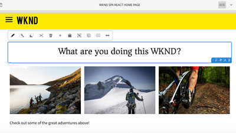

# 概要 {#overview}

Adobe Experience Manager(AEM)サイトは、主要なエクスペリエンス管理プラットフォームです。 このユーザガイドには、AEM Sitesの多くの機能に関するビデオとチュートリアルが含まれています。

## 新機能

* **[AEM Sitesでの起動の使用（ビデオ）](./page-authoring/launches.md)**

   *AEMサイトの起動について、およびAEMサイトの起動回数を使用して将来のリリース向けにWebサイトのコンテンツを準備する方法について説明します。*

* **[AEMコンポーネントを使用したAdobeクライアントデータレイヤーのカスタマイズ（チュートリアル）](./integrations/adobe-client-data-layer/data-layer-customize.md)**

   *Adobeクライアントデータレイヤーを、カスタムのAEMコンポーネントのコンテンツで更新する方法について説明します。*

* **[AEM Headless GraphQLの使用の手引き（チュートリアル）](https://experienceleague.adobe.com/docs/experience-manager-learn/getting-started-with-aem-headless/graphql/overview.html?lang=ja)**

   *AEM GraphQL APIを使用して、AEMのコンテンツを公開し、ネイティブモバイルアプリで使用する方法。*

* **[コンテンツフラグメントの使用（ビデオシリーズ）](./content-fragments/content-fragments-feature-video-use.md)**

   *コンテンツフラグメントは、チャネルにとらわれずに、コンテンツの再利用が可能な部分です。*

* **[SPAエディタの使用（ビデオ）](./spa-editor/spa-editor-framework-feature-video-use.md)**

   *シングルページアプリ(SPA)のAEM編集機能について説明します。*

## スタッフの選考

<table>
<tr>
  <td>
    
    

      <a href="https://docs.adobe.com/content/help/en/experience-manager-learn/getting-started-wknd-tutorial-develop/overview.html">
    <strong>AEM Sites 使用の手引き</strong>
    </a>
    

    

    <em>AEM Sitesの実装を検討している開発者向けの入門ガイド。</em>
    

  </td>
  <td>
    
    

    <a href="https://docs.adobe.com/content/help/en/experience-manager-learn/getting-started-with-aem-headless/overview.html">
    <strong>AEM ヘッドレス使用の手引き</strong>
    </a>
    

    

    <em>ヘッドレスCMSとしてAEMを使用したい開発者向けの入門ガイドです。</em>
    

  </td>
  <td>
    
     

      <a href="https://docs.adobe.com/content/help/en/experience-manager-learn/spa-react-tutorial/overview.html">
        <strong>AEM SPA Editor使用の手引き</strong>
      </a>
    

    

    <em>開発者向けの入門ガイドで、単一のページアプリ(SPA)をAEMと統合します。</em>
    

  </td>
</tr>
</table>

## その他のリソース

* [Experience League- AEMの調査](https://experienceleague.adobe.com/#recommended/solutions/experience-manager)
* [AEM Sitesオーサリングドキュメント](https://helpx.adobe.com/experience-manager/6-5/sites/authoring/user-guide.html)
* [AEM Sites開発文書](https://helpx.adobe.com/experience-manager/6-5/sites/developing/user-guide.html)
* [AEM Sites管理文書](https://helpx.adobe.com/experience-manager/6-5/sites/administering/user-guide.html)
* [AEM Sites導入ドキュメント](https://helpx.adobe.com/experience-manager/6-5/sites/deploying/user-guide.html)
* [AEM as a Cloud Service チュートリアル](/help/cloud-service/overview.md)
* [AEM Assets チュートリアル](/help/assets/overview.md)
* [AEM Forms チュートリアル](/help/forms/overview.md)
* [AEM Foundation チュートリアル](/help/foundation/overview.md)
