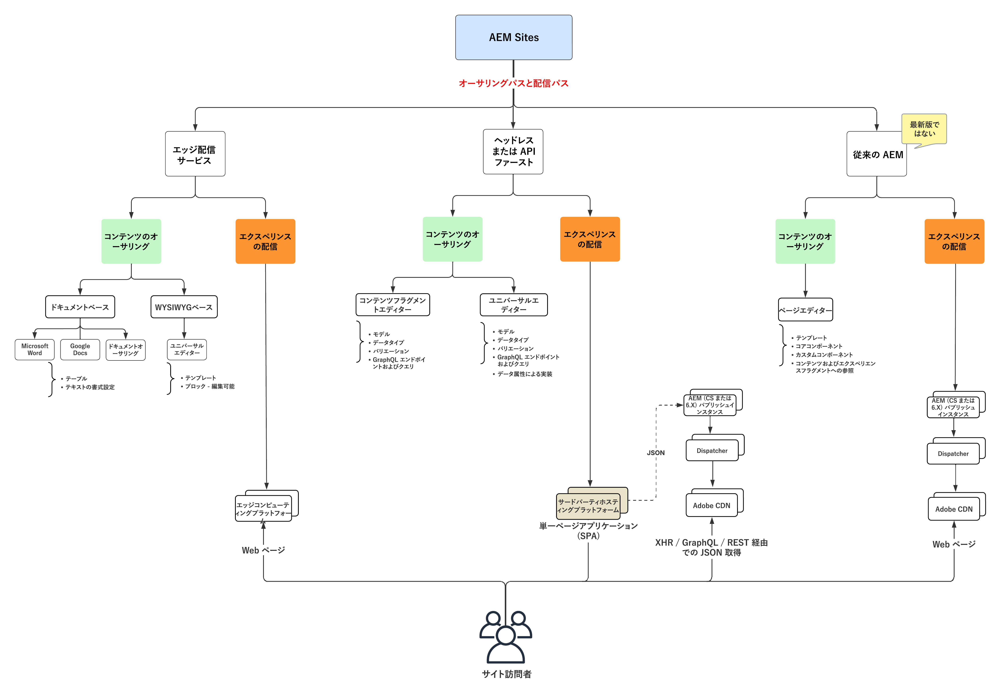
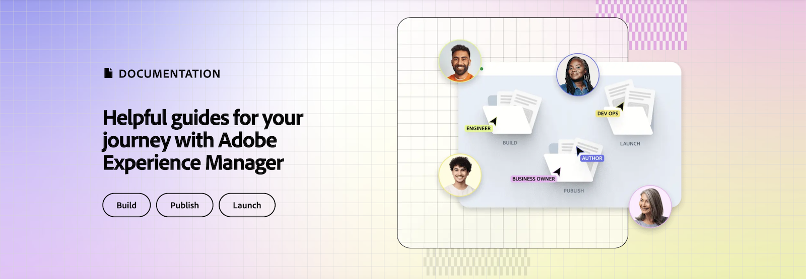
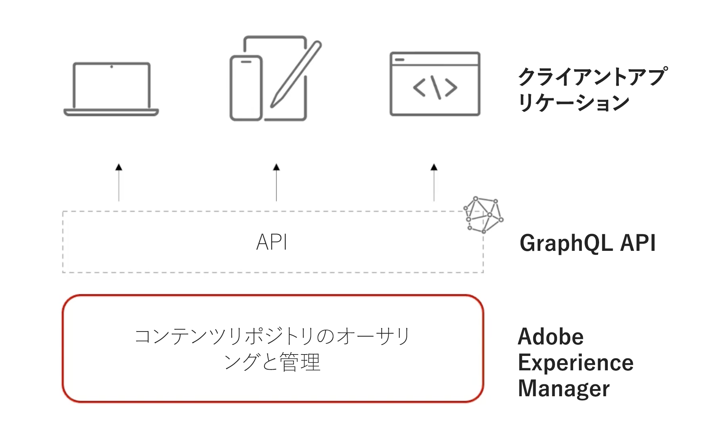
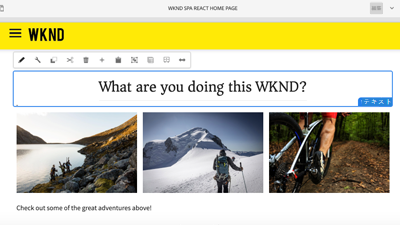

# AEM Sites のビデオおよびチュートリアル {#overview}

{{edge-delivery-services}}

Adobe Experience Manager（AEM） Adobe Experience Manager Sitesは、AdobeのCXM （顧客体験管理）基盤です。web サイトやモバイルアプリなどのデジタルチャネルを通じて、優れた顧客体験を創出できます。

## AEM Sitesでエクスペリエンスを提供する3つの方法

AEM Sites では、エクスペリエンスの作成、オーサリング、配信を行うための 3 つの方法を用意しています。web サイトの構築からエッジのパフォーマンスの最適化、ヘッドレスアプリの強化に至るまで、Adobe AEM Sitesには、プロジェクトのニーズに合わせた柔軟なオプションが用意されています。

1. **Edge Delivery Services**&#x200B;のエクスペリエンスは、Adobe Edge Networkを使用して、高速かつ低遅延でコンテンツを配信します。 このサービスは、消費するデバイス、検索エンジン、生成AI エージェントのコンテンツを自動的に最適化します。 Adobeのユニバーサルエディターや、ドキュメントベースのオーサリング機能を利用して、コンテンツを制作できます。
1. **ヘッドレス/API ファースト**&#x200B;のエクスペリエンスは、AEM パブリッシュを使用して、モバイルアプリ、シングルページアプリケーション（SPA）、またはその他のヘッドレスクライアント向けのHTTP APIを介してコンテンツをJSONとして配信します。 作成者は、コンテンツフラグメントエディターまたはユニバーサルエディターを使用してコンテンツを作成します。
1. **従来のAEM**&#x200B;体験では、AEM パブリッシュを使用して、コンテンツをHTML web ページとして配信します。 作成者は、AEMの作成者ページエディターを使用してコンテンツを作成します。 このオプションは、既存のプロジェクトまたは既に移行されているプロジェクトに最適です。

この3つのオプションはすべて強力なアプローチであり、最適な選択肢はユースケースと組織のニーズによって異なります。 それぞれのアプローチにより、あらゆるチャネルやデバイスをまたいで、パーソナライズされた魅力的なエクスペリエンスを迅速かつ大規模に提供できます。

>[!IMPORTANT]
>
> **Edge Delivery Services**&#x200B;は、AEMを使用してweb サイトを配信する最新かつ最も高度な方法です。 Adobe Edge Networkのスピードと拡張性に加え、最新のオーサリングオプションを備えています。 新しいプロジェクトにはEdge Delivery Servicesが推奨されますが、AEM Sitesでは引き続きヘッドレスおよび従来のアプローチをサポートしているので、ニーズに最適なパスを選択できます。

次の図は、AEM Sitesでエクスペリエンスを構築するための様々なオプションを示しています。

{width="700" zoomable="yes"}

### AEM Sites を使用した作成方法の比較

次の表では、3 つのパスを大まかに比較しています。各パスのコンテンツのオーサリングとエクスペリエンス配信のニュアンスに焦点を当てています。

|            | Edge Delivery Services | ヘッドレス／API ファースト | 従来のAEM |
|---------------------|------------------------------|---------------------------------|---------------------------------------------|
| **最適** | 高いトラフィック、パフォーマンス、スケーラビリティが求められる web サイト | モバイルアプリ、SPA、その他のヘッドレスアプリケーション | 既存のプロジェクトまたは移行されたプロジェクト |
| **オーサリングツール** | ドキュメントベースのオーサリング、ユニバーサルエディター、ページエディター | コンテンツフラグメント、ユニバーサルエディター | ページエディター、ユニバーサルエディター |
| **作成済みコンテンツストア** | ドキュメントまたは AEM オーサー（JCR） | AEM オーサー（JCR） | AEM オーサー（JCR） |
| **配信** | Edge Delivery Services | AEM パブリッシュ（Adobe CDN + Dispatcher を使用） | AEM パブリッシュ（Adobe CDN + Dispatcher を使用） |
| **配信コンテンツストア** | Edge Delivery Services | AEM パブリッシュ（JCR） | AEM パブリッシュ（JCR） |
| **配信形式** | HTML | JSON | HTML |
| **開発技術** | JavaScript、CSS | 任意（例：Swift、React など） | Java™、HTL、JavaScript、CSS |
| **検索ボットと生成AI エージェントのサポート** | ボット、検索エンジン、生成AI エージェント向けに最適化 | ボットとエージェントで機能しますが、SSRまたは追加のセットアップが必要になる場合があります | ボットに適していますが、Edge Delivery Servicesと比較するとパフォーマンスが低下する場合があります |

## AMSまたはオンプレミスからの移行

AMSまたはオンプレミス（OTP）からAEM as a Cloud Serviceに移行する場合は、AdobeでEdge Delivery Servicesへの直接移行を検討することをお勧めします。 通常、AEM as a Cloud Service Publishへの移行と同様の労力で優れたパフォーマンスと拡張性を実現します。 現時点では、Edge Delivery Servicesが適した選択肢ではないと判断した場合、または他のアプローチが自社のニーズにより適している場合は、プロジェクトで完全にサポートされ、有効なオプションのままです。

## チュートリアル

AEM Sitesによる3つの構築アプローチについて詳しく説明します。 以下のチュートリアルでは、各オプションの仕組み、関連するツール、およびそれらを使用するタイミングについて説明します。

<!-- 
CARDS

* https://www.aem.live/docs/
  {title = Edge Delivery Services - Guides}
  {description = Explore Edge Delivery Services with comprehensive guides. The Build, Publish, and Launch guides cover everything you need to get started with Edge Delivery Services.}
  {image = ./assets/edge-delivery-services.png}
  {target = _blank}
* https://experienceleague.adobe.com/en/docs/experience-manager-learn/getting-started-with-aem-headless/overview
  {title = Headless/API-First - Tutorials}
  {description = Learn how to build headless applications powered by AEM content. Tutorials cover frameworks like iOS, Android, and React—choose what fits your stack.}
  {image = ./assets/headless.png}
  {target = _self}
* https://experienceleague.adobe.com/en/docs/experience-manager-learn/getting-started-wknd-tutorial-develop/overview
  {title = Traditional AEM - WKND Tutorial}
  {description = Learn how to build a sample AEM Sites project using the WKND tutorial. This guide walks you through project setup, Core Components, Editable Templates, client-side libraries, and component development.}
  {image = ./assets/aem-wknd-spa-editor-tutorial.png}
  {target = _self}
-->
<!-- START CARDS HTML - DO NOT MODIFY BY HAND -->

    

        

            

                <figure class="image x-is-16by9">
                    
                </figure>
            

            

                

                    

                        <a href="https://www.aem.live/docs/" target="_blank" rel="referrer" title="Edge Delivery Services - ガイド">Edge Delivery Services - ガイド</a>
                    

                    
包括的なガイドを使用して、Edge Delivery Services について説明します。Edge Delivery Servicesのビルド、パブリッシュ、ローンチのガイドでは、使用を開始するために必要なすべての情報を説明します。

                

                <a href="https://www.aem.live/docs/" target="_blank" rel="referrer" class="spectrum-Button spectrum-Button--outline spectrum-Button--primary spectrum-Button--sizeM" style="align-self: flex-start; margin-top: 1rem;">
                    詳細情報
                </a>
            

        

    

    

        

            

                <figure class="image x-is-16by9">
                    
                </figure>
            

            

                

                    

                        <a href="https://experienceleague.adobe.com/ja/docs/experience-manager-learn/getting-started-with-aem-headless/overview" target="_self" rel="referrer" title="ヘッドレス／API ファースト - チュートリアル">ヘッドレス／API ファースト - チュートリアル</a>
                    

                    
AEM コンテンツを活用したヘッドレスアプリケーションの作成方法について説明します。チュートリアルでは、iOS、Android、React などのフレームワークをカバーしています。お使いのスタックに適したものを選択してください。

                

                <a href="https://experienceleague.adobe.com/ja/docs/experience-manager-learn/getting-started-with-aem-headless/overview" target="_self" rel="referrer" class="spectrum-Button spectrum-Button--outline spectrum-Button--primary spectrum-Button--sizeM" style="align-self: flex-start; margin-top: 1rem;">
                    詳細情報
                </a>
            

        

    

    

        

            

                <figure class="image x-is-16by9">
                    
                </figure>
            

            

                

                    

                        <a href="https://experienceleague.adobe.com/ja/docs/experience-manager-learn/getting-started-wknd-tutorial-develop/overview" target="_self" rel="referrer" title="従来のAEM - WKND チュートリアル">従来の AEM - WKND チュートリアル</a>
                    

                    
WKND チュートリアルを使用して、サンプル AEM Sites プロジェクトを作成する方法について説明します。このガイドでは、プロジェクトの設定、コアコンポーネント、編集可能なテンプレート、クライアントサイドライブラリ、コンポーネント開発について説明します。

                

                <a href="https://experienceleague.adobe.com/ja/docs/experience-manager-learn/getting-started-wknd-tutorial-develop/overview" target="_self" rel="referrer" class="spectrum-Button spectrum-Button--outline spectrum-Button--primary spectrum-Button--sizeM" style="align-self: flex-start; margin-top: 1rem;">
                    詳細情報
                </a>
            

        

    

<!-- END CARDS HTML - DO NOT MODIFY BY HAND -->

## その他のリソース

* [AEM Sites オーサリングドキュメント](https://experienceleague.adobe.com/ja/docs/experience-manager-65/content/sites/authoring/essentials/first-steps)
* [AEM Sites 開発ドキュメント](https://experienceleague.adobe.com/ja/docs/experience-manager-65/content/implementing/developing/introduction/getting-started)
* [AEM Sites 管理ドキュメント](https://experienceleague.adobe.com/ja/docs/experience-manager-65/content/sites/administering/home)
* [AEM Sites 導入ドキュメント](https://experienceleague.adobe.com/ja/docs/experience-manager-65/content/implementing/deploying/introduction/platform)
* [AEM as a Cloud Service のチュートリアル](/help/cloud-service/overview.md)
* [AEM Assets のチュートリアル](/help/assets/overview.md)
* [AEM Forms のチュートリアル](/help/forms/overview.md)
* [AEM の基盤のチュートリアル](/help/foundation/overview.md)
