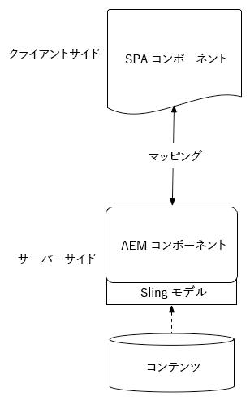
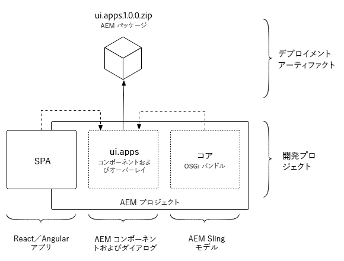
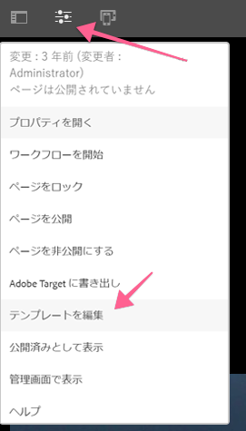
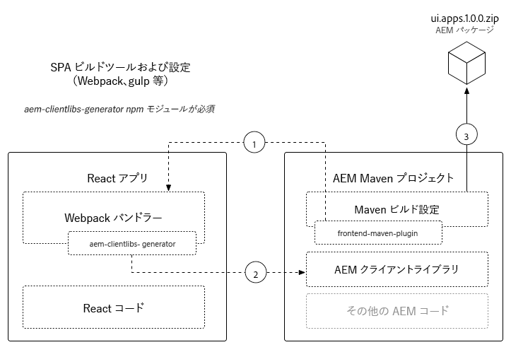
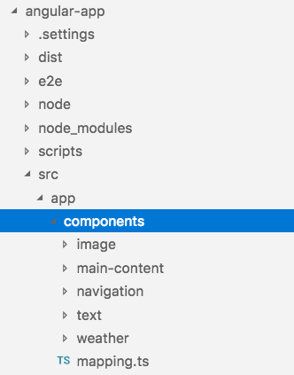
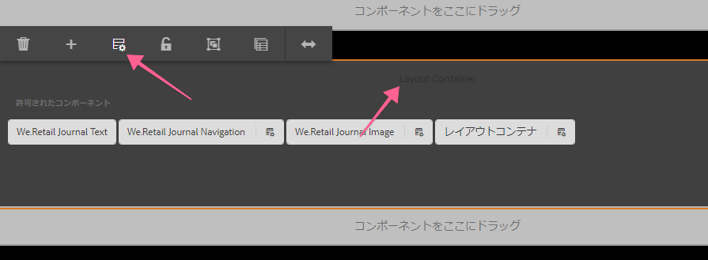
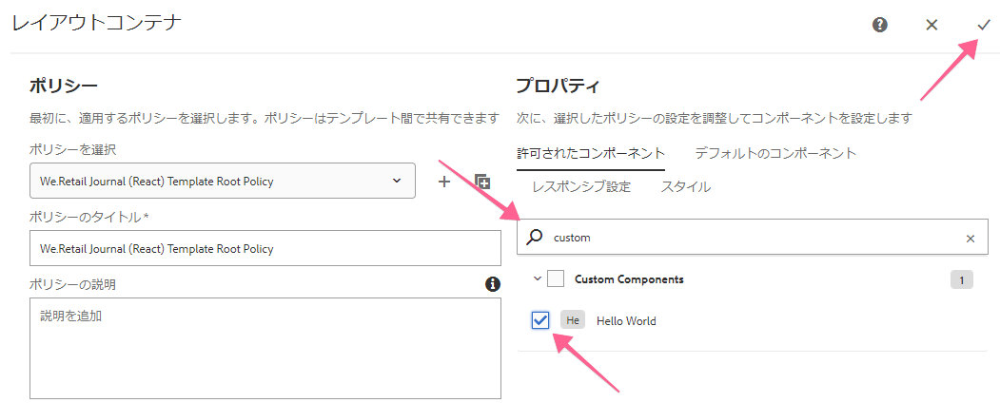
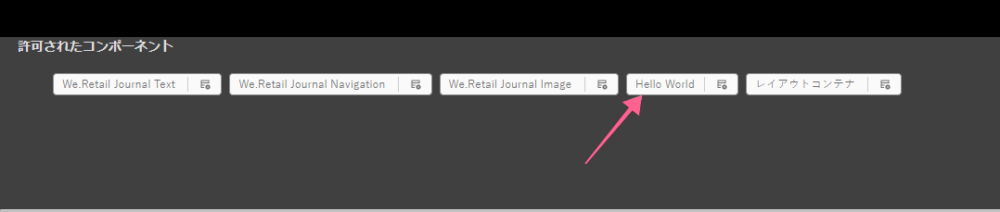
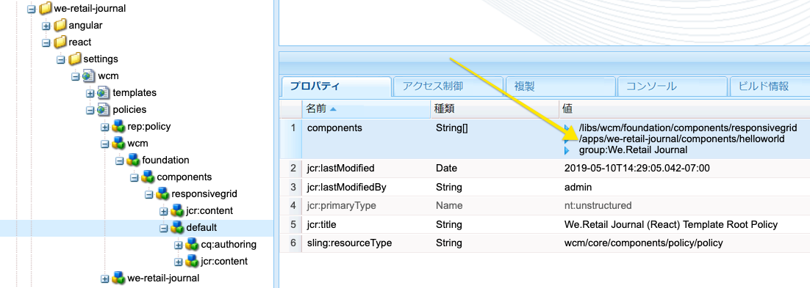
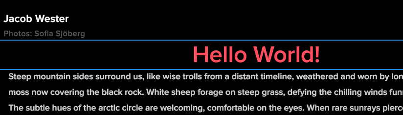

# AEM SPAエディタを使用した開発 — Hello World Tutorial {#developing-with-the-aem-spa-editor-hello-world-tutorial}

>[!WARNING]
>
> このチュートリアルは&#x200B;**非推奨**&#x200B;です。 次のいずれかを行うことをお勧めします。[AEM SPA EditorとAngularの使い始めに](https://docs.adobe.com/content/help/ja-JP/experience-manager-learn/spa-angular-tutorial/overview.html)または[AEM SPA EditorとReact](https://docs.adobe.com/content/help/ja-JP/experience-manager-learn/spa-react-tutorial/overview.html)を使用する

AEM SPA Editorでは、シングルページアプリケーションまたはSPAのコンテキスト内編集がサポートされています。 このチュートリアルでは、AEM SPAエディタJS SDKで使用するSPA開発の概要を説明します。 このチュートリアルでは、カスタムHello Worldコンポーネントを追加してWe.Retailジャーナルアプリを拡張します。 ユーザーは、ReactフレームワークまたはAngularフレームワークを使用して、このチュートリアルを完了できます。

>[!NOTE]
>
> シングルページアプリケーション(SPA)エディタ機能には、AEM 6.4 service pack 2以降が必要です。
>
> SPAフレームワークベースのクライアント側レンダリング(ReactやAngularなど)を必要とするプロジェクトには、SPA Editorが推奨されるソリューションです。

## 前提条件となる読み取り{#prereq}

このチュートリアルでは、文脈依存編集を有効にするために、SPAコンポーネントをAEMコンポーネントにマップするために必要な手順を強調します。 このチュートリアルを開始するユーザは、Adobe Experience ManagerとAEMの開発に関する基本的な概念と、Angularのフレームワークを使用した開発に関する基本的な概念を理解している必要があります。 このチュートリアルでは、バックエンドおよびフロントエンドの開発タスクについて説明します。

このチュートリアルを開始する前に、次のリソースを確認することをお勧めします。

* [SPA Editor機能のビデオ](spa-editor-framework-feature-video-use.md) -SPA EditorおよびWe.Retailジャーナルアプリの概要をビデオで紹介します。
* [React.js Tutorial](https://reactjs.org/tutorial/tutorial.html) - Reactフレームワークを使用した開発の紹介です。
* [Angularチュートリアル](https://angular.io/tutorial) -Angularを使用した開発の概要

## ローカル開発環境 {#local-dev}

このチュートリアルは、次の目的で開発されています。

[Adobe Experience Manager6.5](https://helpx.adobe.com/jp/experience-manager/6-5/release-notes.html) または [Adobe Experience Manager6.4](https://helpx.adobe.com/jp/experience-manager/6-4/sites/deploying/using/technical-requirements.html) +  [Service Pack 5](https://helpx.adobe.com/jp/experience-manager/6-4/release-notes/sp-release-notes.html)

このチュートリアルでは、次のテクノロジーとツールをインストールする必要があります。

1. [Java 11](https://downloads.experiencecloud.adobe.com/content/software-distribution/en/general.html)
2. [Apache Maven - 3.3.1以降](https://maven.apache.org/)
3. [Node.js - 8.11.1+](https://nodejs.org/ja/) およびnpm 5.6.0+（npmはnode.jsと共にインストールされます）

重複は、新しいターミナルを開いて次のコマンドを実行し、上記のツールのインストールを確認します。

```shell
$ java -version
java version "11 +"

$ mvn -version
Apache Maven 3.3.9

$ node --version
v8.11.1

$ npm --version
6.1.0
```

## 概要 {#overview}

基本的な概念は、SPAコンポーネントをAEMコンポーネントにマップすることです。 AEMコンポーネントは、サーバーサイドで実行し、JSON形式でコンテンツを書き出します。 JSONコンテンツは、ブラウザーでクライアント側を実行するSPAで使用されます。 SPAコンポーネントとAEMコンポーネント間の1:1マッピングが作成されます。



一般的なフレームワーク[React JS](https://reactjs.org/)と[Angular](https://angular.io/)は、すぐに使用できます。 最も使いやすいフレームワークを使用して、AngularーまたはReactでこのチュートリアルを完了できます。

## プロジェクトのセットアップ {#project-setup}

SPAの開発はAEMの開発に1足ずつ、もう1足ずつある。 目標は、SPAの開発を独立して行い、AEMにとって（ほとんど）不可知な状態で行うことです。

* SPAプロジェクトは、フロントエンド開発時にAEMプロジェクトとは独立して動作します。
* Webpack、NPM、[!DNL Grunt]、[!DNL Gulp]などのフロントエンドビルドツールおよびテクノロジーは引き続き使用できます。
* AEM用にビルドするには、SPAプロジェクトをコンパイルし、自動的にAEMプロジェクトに含めます。
* SPAのAEMへの展開に使用する標準AEMパッケージです。



*SPAの開発はAEMの開発において1つの足があり、もう1つは独自にSPAの開発を可能にし、（ほとんどは）AEMにとらわれない方法での開発を可能にします。*

このチュートリアルの目標は、We.Retailジャーナルアプリを新しいコンポーネントで拡張することです。 Web.Retailジャーナルアプリのソースコードをダウンロードし、ローカルAEMに展開することで開始します。

1. **最新の** We.RetailジャーナルコードをGitHubから [ダウンロードします](https://github.com/adobe/aem-sample-we-retail-journal)。

   または、次のコマンド・ラインからリポジトリをコピーします。

   ```shell
   $ git clone git@github.com:adobe/aem-sample-we-retail-journal.git
   ```

   >[!NOTE]
   >
   >このチュートリアルは、プロジェクトの&#x200B;**1.2.1-SNAPSHOT**&#x200B;バージョンの&#x200B;**マスター**&#x200B;ブランチに対して作業を行います。

1. 次の構造が表示されます。

   

   プロジェクトには、次のMavenモジュールが含まれています。

   * `all`:プロジェクト全体を1つのパッケージに埋め込んでインストールします。
   * `bundles`:2つのOSGiバンドルが含まれます。コモンとコア。この中には、 [!DNL Sling Models] および他のJavaコードが含まれています。
   * `ui.apps`:には、プロジェクトの/apps部分、ie JSおよびCSSクライアントライブラリ、コンポーネント、runmode固有の設定が含まれます。
   * `ui.content`:構造コンテンツと構成を含む(`/content`、 `/conf`)
   * `react-app`:We.小売ジャーナルの反応申し込み。これはMavenモジュールとWebPackプロジェクトの両方です。
   * `angular-app`:We.小売ジャーナルAngularの申し込み。これは[!DNL Maven]モジュールとwebpackプロジェクトの両方です。

1. 新しいターミナルウィンドウを開き、次のコマンドを実行して、[http://localhost:4502](http://localhost:4502)上で実行されているローカルAEMインスタンスにアプリケーション全体を構築してデプロイします。

   ```shell
   $ cd <src>/aem-sample-we-retail-journal
   $ mvn -PautoInstallSinglePackage clean install
   ```

   >[!NOTE]
   >
   > このプロジェクトでは、プロジェクト全体を構築しパッケージ化するMavenプロファイルは`autoInstallSinglePackage`です

   >[!CAUTION]
   >
   > ビルド中にエラーが発生した場合は、[Maven settings.xmlファイルにAdobeのMavenアーティファクトリポジトリ](https://helpx.adobe.com/jp/experience-manager/kb/SetUpTheAdobeMavenRepository.html)が含まれていることを確認してください。

1. 次の URL に移動します。

   * [http://localhost:4502/editor.html/content/we-retail-journal/react/en/home.html](http://localhost:4502/editor.html/content/we-retail-journal/react/en/home.html)
   * [http://localhost:4502/editor.html/content/we-retail-journal/angular/en/home.html](http://localhost:4502/editor.html/content/we-retail-journal/angular/en/home.html)

   We.RetailジャーナルアプリがAEM Sitesエディター内に表示されます。

1. [!UICONTROL 編集]モードで、編集するコンポーネントを選択し、コンテンツを更新します。

   

1. [!UICONTROL ページプロパティ]アイコンを選択して、[!UICONTROL ページプロパティ]を開きます。 「[!UICONTROL テンプレートを編集]」を選択して、ページのテンプレートを開きます。

   

1. 最新バージョンのSPAエディタでは、[編集可能なテンプレート](https://helpx.adobe.com/jp/experience-manager/6-5/sites/developing/using/page-templates-editable.html)は、従来のサイト実装と同じ方法で使用できます。 これは、後でカスタムコンポーネントで再訪問します。

   >[!NOTE]
   >
   > 編集可能なテンプレートは、AEM 6.5およびAEM 6.4 + **Service Pack 5**&#x200B;でのみサポートされます。

## 開発の概要{#development-overview}



SPA開発の反復は、AEMとは独立して発生します。 SPAをAEMに導入する準備ができたら、次の高レベルの手順を実行します（上図を参照）。

1. AEMプロジェクトビルドが呼び出され、続いてSPAプロジェクトのビルドがトリガーされます。 We.Retailジャーナルは、[**フロントエンド —maven-plugin**](https://github.com/eirslett/frontend-maven-plugin)を使用します。
1. SPAプロジェクトの&#x200B;[**aem-clientlib-generator**](https://www.npmjs.com/package/aem-clientlib-generator)は、コンパイル済みのSPAをAEMプロジェクトのAEMクライアントライブラリとして埋め込みます。
1. AEMプロジェクトは、コンパイル済みのSPAと他のサポートするAEMコードを含むAEMパッケージを生成します。

## AEMコンポーネントを作成{#aem-component}

**担当者：AEM 開発者**

最初にAEMコンポーネントが作成されます。 AEMコンポーネントは、Reactコンポーネントによって読み取られるJSONプロパティのレンダリングを担当します。 AEMコンポーネントは、コンポーネントの編集可能なプロパティに関するダイアログを提供する役割も果たします。

[!DNL Eclipse]または他の[!DNL IDE]を使用して、We.RetailジャーナルMavenプロジェクトをインポートします。

1. リアクタ&#x200B;**pom.xml**&#x200B;を更新し、[!DNL Apache Rat]プラグインを削除します。 このプラグインは、各ファイルをチェックして、ライセンスヘッダーがあることを確認します。 当社の目的上、この機能に関心を持つ必要はありません。

   **aem-sample-we-retail-journal/pom.xml**&#x200B;から&#x200B;**apache-rate-plugin**&#x200B;を削除します。

   ```xml
   <!-- Remove apache-rat-plugin -->
   <plugin>
           <groupId>org.apache.rat</groupId>
           <artifactId>apache-rat-plugin</artifactId>
           <configuration>
               <excludes combine.children="append">
                   <exclude>*</exclude>
                       ...
               </excludes>
           </configuration>
           <executions>
                   <execution>
                       <phase>verify</phase>
                       <goals>
                           <goal>check</goal>
                       </goals>
               </execution>
           </executions>
       </plugin>
   ```

1. **we-retail-ジャーナル-content** (`<src>/aem-sample-we-retail-journal/ui.apps`)モジュールで、`ui.apps/jcr_root/apps/we-retail-journal/components`の下に&#x200B;**cq:Component**&#x200B;というタイプの&#x200B;**helloworld**&#x200B;という新しいノードを作成します。
1. **helloworld追加**&#x200B;コンポーネントに対する次のプロパティ。以下のXML(`/helloworld/.content.xml`)で表されます。

   ```xml
   <?xml version="1.0" encoding="UTF-8"?>
   <jcr:root xmlns:cq="http://www.day.com/jcr/cq/1.0" xmlns:jcr="http://www.jcp.org/jcr/1.0"
       jcr:description="Hello World Component for We.Retail Journal"
       jcr:primaryType="cq:Component"
       jcr:title="Hello World"
       componentGroup="We.Retail Journal" />
   ```

   

   >[!NOTE]
   >
   > 編集可能なテンプレート機能を理解するために、意図的に`componentGroup="Custom Components"`を設定しました。 実際のプロジェクトでは、コンポーネントグループの数を最小に抑えることが最善策なので、他のコンテンツコンポーネントに合わせて「[!DNL We.Retail Journal]」の方が適切なグループにします。
   >
   > 編集可能なテンプレートは、AEM 6.5およびAEM 6.4 + **Service Pack 5**&#x200B;でのみサポートされます。

1. 次に、**Hello World**&#x200B;コンポーネント用にカスタムメッセージを設定できるダイアログが作成されます。 `/apps/we-retail-journal/components/helloworld`の下に、**nt:unstructured**&#x200B;のノード名&#x200B;**cq:dialog**&#x200B;を追加します。
1. **cq:dialog**&#x200B;には、**[!DNL message]**&#x200B;という名前のプロパティに対するテキストを保持する1つのテキストフィールドが表示されます。 新しく作成した&#x200B;**cq:dialog**&#x200B;の下に、次のノードとプロパティを追加します。これらのノードとプロパティは、下のXML(`helloworld/_cq_dialog/.content.xml`)で示します。

   ```xml
   <?xml version="1.0" encoding="UTF-8"?>
   <jcr:root xmlns:sling="http://sling.apache.org/jcr/sling/1.0" xmlns:cq="http://www.day.com/jcr/cq/1.0" xmlns:jcr="http://www.jcp.org/jcr/1.0" xmlns:nt="http://www.jcp.org/jcr/nt/1.0"
       jcr:primaryType="nt:unstructured"
       jcr:title="We.Retail Journal - Hello World"
       sling:resourceType="cq/gui/components/authoring/dialog">
       <content
           jcr:primaryType="nt:unstructured"
           sling:resourceType="granite/ui/components/coral/foundation/container">
           <items jcr:primaryType="nt:unstructured">
               <tabs
                   jcr:primaryType="nt:unstructured"
                   sling:resourceType="granite/ui/components/coral/foundation/tabs"
                   maximized="{Boolean}true">
                   <items jcr:primaryType="nt:unstructured">
                       <properties
                           jcr:primaryType="nt:unstructured"
                           jcr:title="Properties"
                           sling:resourceType="granite/ui/components/coral/foundation/container"
                           margin="{Boolean}true">
                           <items jcr:primaryType="nt:unstructured">
                               <columns
                                   jcr:primaryType="nt:unstructured"
                                   sling:resourceType="granite/ui/components/coral/foundation/fixedcolumns"
                                   margin="{Boolean}true">
                                   <items jcr:primaryType="nt:unstructured">
                                       <column
                                           jcr:primaryType="nt:unstructured"
                                           sling:resourceType="granite/ui/components/coral/foundation/container">
                                           <items jcr:primaryType="nt:unstructured">
                                               <message
                                                   jcr:primaryType="nt:unstructured"
                                                   sling:resourceType="granite/ui/components/coral/foundation/form/textfield"
                                                   fieldLabel="Message"
                                                   name="./message"
                                                   required="{Boolean}true"/>
                                           </items>
                                       </column>
                                   </items>
                               </columns>
                           </items>
                       </properties>
                   </items>
               </tabs>
           </items>
       </content>
   </jcr:root>
   ```

   

   上記のXMLノード定義は、1つのテキストフィールドを持つダイアログを作成し、ユーザーが「メッセージ」を入力できるようにします。 `<message />`ノード内のプロパティ`name="./message"`をメモしておきます。 AEM内のJCRに保存されるプロパティの名前です。

1. 次に、空のポリシーダイアログが作成されます(`cq:design_dialog`)。 テンプレートエディターでコンポーネントを表示するには、ポリシーダイアログが必要です。 この単純な使用例では、空のダイアログになります。

   `/apps/we-retail-journal/components/helloworld`の下に、`nt:unstructured`のノード名`cq:design_dialog`を追加します。

   設定は次のXMLで表されます(`helloworld/_cq_design_dialog/.content.xml`)

   ```xml
   <?xml version="1.0" encoding="UTF-8"?>
   <jcr:root xmlns:sling="http://sling.apache.org/jcr/sling/1.0" xmlns:cq="http://www.day.com/jcr/cq/1.0" xmlns:jcr="http://www.jcp.org/jcr/1.0" xmlns:nt="http://www.jcp.org/jcr/nt/1.0"
   jcr:primaryType="nt:unstructured" />
   ```

1. コマンドラインからAEMにコードベースをデプロイします。

   ```shell
   $ cd <src>/aem-sample-we-retail-journal/content
   $ mvn -PautoInstallPackage clean install
   ```

   [CRXDE Lite](http://localhost:4502/crx/de/index.jsp#/apps/we-retail-journal/global/components/helloworld)で、`/apps/we-retail-journal/components:`の下のフォルダーを検査して、コンポーネントが展開されたことを検証します

   

## Slingモデルを作成{#create-sling-model}

**担当者：AEM 開発者**

次に[!DNL Sling Model]が作成され、[!DNL Hello World]コンポーネントをバックします。 従来のWCMの使用例では、[!DNL Sling Model]がビジネスロジックを実装し、サーバー側レンダリングスクリプト(HTL)が[!DNL Sling Model]を呼び出します。 これにより、レンダリングスクリプトが比較的単純になります。

[!DNL Sling Models] は、サーバー側のビジネスロジックを実装するSPAの使用例でも使用されます。[!DNL SPA]の使用例では、[!DNL Sling Models]がそのメソッドをシリアル化されたJSONとして公開する点が異なります。

>[!NOTE]
>
>ベストプラクティスとして、開発者は可能な限り、[AEMコアコンポーネント](https://docs.adobe.com/content/help/ja/experience-manager-core-components/using/introduction.html)を使用するようにしてください。 他の機能の中でも、コアコンポーネントは「SPA対応」のJSON出力を[!DNL Sling Models]に提供し、開発者はよりフロントエンドでのプレゼンテーションに集中できます。

1. 任意のエディターで、**we-retail-commons**&#x200B;プロジェクト(`<src>/aem-sample-we-retail-journal/bundles/commons`)を開きます。
1. パッケージ`com.adobe.cq.sample.spa.commons.impl.models`内：
   * `HelloWorld`という名前の新しいクラスを作成します。
   * &lt;a0追加/>の実装インターフェイス`com.adobe.cq.export.json.ComponentExporter.`

   

   [!DNL Sling Model]がAEM Content Servicesと互換性を持つようにするには、`ComponentExporter`インターフェイスを実装する必要があります。

   ```java
    package com.adobe.cq.sample.spa.commons.impl.models;
   
    import com.adobe.cq.export.json.ComponentExporter;
   
    public class HelloWorld implements ComponentExporter {
   
        @Override
        public String getExportedType() {
            return null;
        }
    }
   ```

1. 追加`RESOURCE_TYPE`という静的変数。[!DNL HelloWorld]コンポーネントのリソースタイプを識別します。

   ```java
    ...
    public class HelloWorld implements ComponentExporter {
   
        static final String RESOURCE_TYPE = "we-retail-journal/components/helloworld";
   
        ...
    }
   ```

1. 追加`@Model`と`@Exporter`のOSGi注釈。 `@Model`注釈は、クラスを[!DNL Sling Model]として登録します。 `@Exporter`注釈は、[!DNL Jackson Exporter]フレームワークを使用して、シリアル化されたJSONとしてメソッドを公開します。

   ```java
   import org.apache.sling.api.SlingHttpServletRequest;
   import org.apache.sling.models.annotations.Exporter;
   import org.apache.sling.models.annotations.Model;
   import com.adobe.cq.export.json.ExporterConstants;
   ...
   
   @Model(
           adaptables = SlingHttpServletRequest.class,
           adapters = {ComponentExporter.class},
           resourceType = HelloWorld.RESOURCE_TYPE
   )
   @Exporter(
           name = ExporterConstants.SLING_MODEL_EXPORTER_NAME, 
           extensions = ExporterConstants.SLING_MODEL_EXTENSION
   )
   public class HelloWorld implements ComponentExporter {
   
   ...
   ```

1. メソッド`getDisplayMessage()`を実装して、JCRプロパティ`message`を返します。 `@ValueMapValue`の[!DNL Sling Model]注釈を使用すると、コンポーネントの下に保存されているプロパティ`message`を簡単に取得できます。 `@Optional`注釈は重要です。コンポーネントが最初にページに追加されたときに、`message`に値が入力されないからです。

   ビジネスロジックの一部として、「**Hello**」という文字列がメッセージの先頭に付加されます。

   ```java
   import org.apache.sling.models.annotations.injectorspecific.ValueMapValue;
   import org.apache.sling.models.annotations.Optional;
   
   ...
   
   public class HelloWorld implements ComponentExporter {
   
      static final String RESOURCE_TYPE = "we-retail-journal/components/helloworld";
   
      private static final String PREPEND_MSG = "Hello";
   
       @ValueMapValue @Optional
       private String message;
   
       public String getDisplayMessage() {
           if(message != null && message.length() > 0) {
               return PREPEND_MSG + " "  + message;
           }
           return null;
       }
   
   ...
   ```

   >[!NOTE]
   >
   > メソッド名`getDisplayMessage`は重要です。 [!DNL Sling Model]が[!DNL Jackson Exporter]でシリアル化されると、JSONプロパティとして公開されます。`displayMessage`。 [!DNL Jackson Exporter]は、（無視するように明示的にマークされていない限り）パラメーターを取らないすべての`getter`メソッドをシリアル化して公開します。 後ほど、リアクト/Angularアプリでこのプロパティ値を読み取り、アプリの一部として表示します。

   メソッド`getExportedType`も重要です。 コンポーネント`resourceType`の値は、JSONデータをフロントエンドコンポーネント(Angular/反応)に「マップ」するために使用されます。 次のセクションで、この点について説明します。

1. メソッド`getExportedType()`を実装して、`HelloWorld`コンポーネントのリソースタイプを返します。

   ```java
    @Override
       public String getExportedType() {
           return RESOURCE_TYPE;
       }
   ```

   [**HelloWorld.java**&#x200B;の完全なコードは、こちらから参照できます。](https://github.com/Adobe-Marketing-Cloud/aem-guides/blob/master/spa-helloworld-guide/src/bundles/commons/HelloWorld.java)

1. Apache Mavenを使用してAEMにコードをデプロイします。

   ```shell
   $ cd <src>/sample-we-retail-spa-content/bundles/commons
   $ mvn -PautoInstallPackage clean install
   ```

   OSGiコンソールで[[!UICONTROL ステータス] > [!UICONTROL スリングモデル]](http://localhost:4502/system/console/status-slingmodels)に移動して、[!DNL Sling Model]の展開と登録を確認します。

   `HelloWorld` Slingモデルが`we-retail-journal/components/helloworld` Slingリソースタイプにバインドされ、[!DNL Sling Model Exporter Servlet]として登録されていることがわかります。

   ```shell
   com.adobe.cq.sample.spa.commons.impl.models.HelloWorld - we-retail-journal/components/helloworld
   com.adobe.cq.sample.spa.commons.impl.models.HelloWorld exports 'we-retail-journal/components/helloworld' with selector 'model' and extension '[Ljava.lang.String;@6480f3e5' with exporter 'jackson'
   ```

## 反応コンポーネントを作成{#react-component}

**担当者：フロントエンド開発者**

次に、Reactコンポーネントが作成されます。 **react-app**&#x200B;モジュール(`<src>/aem-sample-we-retail-journal/react-app`)を開き、任意のエディターを使用します。

>[!NOTE]
>
> [Angular開発](#angular-component)にだけ興味がある場合は、このセクションを省略してください。

1. `react-app`フォルダー内で、srcフォルダーに移動します。 componentsフォルダーを展開して、既存のReactコンポーネントファイルを表示します。

   

1. componentsフォルダーの追加下に、`HelloWorld.js`という名前の新しいファイルがあります。
1. 開く `HelloWorld.js`. Reactコンポー追加ネントライブラリを読み込むための読み込みステートメント。 Adobeが提供する追加`MapTo`ヘルパーをインポートする2つ目のインポートステートメント。 `MapTo`ヘルパーは、ReactコンポーネントとAEMコンポーネントのJSONとのマッピングを提供します。

   ```js
   import React, {Component} from 'react';
   import {MapTo} from '@adobe/cq-react-editable-components';
   ```

1. インポートの下に、`HelloWorld`という名前の新しいクラスが作成され、React `Component`インターフェイスが拡張されます。 追加`HelloWorld`クラスに必要な`render()`メソッド。

   ```js
   import React, {Component} from 'react';
   import {MapTo} from '@adobe/cq-react-editable-components';
   
   class HelloWorld extends Component {
   
       render() {
   
       }
   }
   ```

1. `MapTo`ヘルパーは、`cqModel`という名前のオブジェクトをReactコンポーネントのpropの一部として自動的に含めます。 `cqModel`には、[!DNL Sling Model]によって公開されるすべてのプロパティが含まれます。

   前に作成した[!DNL Sling Model]には、`getDisplayMessage()`メソッドが含まれています。 `getDisplayMessage()` は、出力時に名前が付けられたJSONキー `displayMessage` として変換されます。

   `render()`メソッドを実装して、`displayMessage`の値を含む`h1`タグを出力します。 [JavaScriptの構文拡張子であるJSX](https://reactjs.org/docs/introducing-jsx.html)(JSX)は、コンポーネントの最終的なマークアップを返すために使用されます。

   ```js
   ...
   
   class HelloWorld extends Component {
       render() {
   
           if(this.props.displayMessage) {
               return (
                   <div className="cmp-helloworld">
                       <h1 className="cmp-helloworld_message">{this.props.displayMessage}</h1>
                   </div>
               );
           }
           return null;
       }
   }
   ```

1. 設定の編集メソッドを実装します。 このメソッドは`MapTo`ヘルパーを介して渡され、コンポーネントが空の場合にプレースホルダーを表示する情報をAEMエディターに提供します。 これは、コンポーネントがSPAに追加されているが、まだオーサリングされていない場合に発生します。 追加`HelloWorld`クラスの下に次のように記述します。

   ```js
   ...
   
   class HelloWorld extends Component {
       ...
   }
   
   const HelloWorldEditConfig = {
   
       emptyLabel: 'Hello World',
   
       isEmpty: function(props) {
           return !props || !props.displayMessage || props.displayMessage.trim().length < 1;
       }
   };
   
   ...
   ```

1. ファイルの末尾で`MapTo`ヘルパーを呼び出し、`HelloWorld`クラスと`HelloWorldEditConfig`を渡します。 これにより、AEMコンポーネントのリソースタイプに基づいて、React ComponentがAEMコンポーネントにマッピングされます。`we-retail-journal/components/helloworld`.

   ```js
   MapTo('we-retail-journal/components/helloworld')(HelloWorld, HelloWorldEditConfig);
   ```

   [**HelloWorld.js**&#x200B;の完成したコードは、こちらを参照してください。](https://github.com/Adobe-Marketing-Cloud/aem-guides/blob/master/spa-helloworld-guide/src/react-app/components/HelloWorld.js)

1. `ImportComponents.js` ファイルを開きます。`<src>/aem-sample-we-retail-journal/react-app/src/ImportComponents.js`にあります。

   コンパイ追加ルされたJavaScriptバンドル内の他のコンポーネントと`HelloWorld.js`を必要とする行：

   ```js
   ...
     require('./components/Text');
     require('./components/Image');
     require('./components/HelloWorld');
   ...
   ```

1. `components`フォルダーに、`HelloWorld.js.`の兄弟として`HelloWorld.css`という名前の新しいファイルを作成します。次のようにファイルに入力して、`HelloWorld`コンポーネントの基本的なスタイルを作成します。

   ```css
   /* HelloWorld.css to style HelloWorld component */
   
   .cmp-helloworld_message {
       text-align: center;
       color: #ff505e;
       text-transform: unset;
       letter-spacing: unset;
   }
   ```

1. `HelloWorld.js`を再度開き、インポート文の下で更新して`HelloWorld.css`を必要とします：

   ```js
   import React, {Component} from 'react';
   import {MapTo} from '@adobe/cq-react-editable-components';
   
   require('./HelloWorld.css');
   
   ...
   ```

1. Apache Mavenを使用してAEMにコードをデプロイします。

   ```shell
   $ cd <src>/sample-we-retail-spa-content
   $ mvn -PautoInstallSinglePackage clean install
   ```

1. [CRXDE-Lite](http://localhost:4502/crx/de/index.jsp#/apps/we-retail-journal/react/clientlibs/we-retail-journal-react/js/app.js)で`/apps/we-retail-journal/react/clientlibs/we-retail-journal-react/js/app.js`を開きます。 app.jsでHelloWorldのクイック検索を実行し、コンパイル済みアプリにReactコンポーネントが含まれていることを確認します。

   >[!NOTE]
   >
   > **app.** jsは、バンドルされたReactアプリと同じです。コードが人間に読み取り可能でなくなりました。 `npm run build`コマンドは、最新のブラウザーで解釈できるコンパイル済みJavaScriptを出力する最適化ビルドをトリガーしました。


## angularコンポーネントの作成{#angular-component}

**担当者：フロントエンド開発者**

>[!NOTE]
>
> Reactの開発に関心がある場合は、このセクションを省略してかまいません。

次に、Angularコンポーネントが作成されます。 **angularアプリ**&#x200B;モジュール(`<src>/aem-sample-we-retail-journal/angular-app`)を開き、任意のエディターを使用します。

1. `angular-app`フォルダー内で、`src`フォルダーに移動します。 componentsフォルダーを展開し、既存のAngularコンポーネントファイルを表示します。

   

1. componentsフォルダーの追加下に、`helloworld`という名前の新しいフォルダーがあります。 `helloworld`フォルダーの下に、`helloworld.component.css, helloworld.component.html, helloworld.component.ts`という名前の新しいファイルを追加します。

   ```plain
   /angular-app
       /src
           /app
               /components
   +                /helloworld
   +                    helloworld.component.css
   +                    helloworld.component.html
   +                    helloworld.component.ts
   ```

1. 開く `helloworld.component.ts`. angular追加`Component`および`Input`クラスを読み込む読み込みステートメント。 `styleUrls`と`templateUrl`を`helloworld.component.css`と`helloworld.component.html`に向けて、新しいコンポーネントを作成します。 最後に、`HelloWorldComponent`の予期された入力を`displayMessage`にエクスポートします。

   ```js
   //helloworld.component.ts
   
   import { Component, Input } from '@angular/core';
   
   @Component({
     selector: 'app-helloworld',
     host: { 'class': 'cmp-helloworld' },
     styleUrls:['./helloworld.component.css'],
     templateUrl: './helloworld.component.html',
   })
   
   export class HelloWorldComponent {
     @Input() displayMessage: string;
   }
   ```

   >[!NOTE]
   >
   > 以前に作成した[!DNL Sling Model]を思い出すと、**getDisplayMessage()**&#x200B;メソッドがありました。 このメソッドのシリアル化されたJSONは&#x200B;**displayMessage**&#x200B;です。現在、Angularアプリで読んでいます。

1. `helloworld.component.html`を開き、`displayMessage`プロパティを印刷する`h1`タグを含めます。

   ```html
   <h1 *ngIf="displayMessage" class="cmp-helloworld_message">
       {{displayMessage}}
   </h1>
   ```

1. `helloworld.component.css`を更新して、コンポーネントの基本的なスタイルを含めます。

   ```css
   :host-context {
       display: block;
   };
   
   .cmp-helloworld {
       display:block;
   }
   .cmp-helloworld_message {
       text-align: center;
       color: #ff505e;
       text-transform: unset;
       letter-spacing: unset;
   }
   ```

1. `helloworld.component.spec.ts`を次のテストベッドに更新します：

   ```js
   import { async, ComponentFixture, TestBed } from '@angular/core/testing';
   
   import { HelloWorldComponent } from './helloworld.component';
   
       describe('HelloWorld', () => {
       let component: HelloWorldComponent;
       let fixture: ComponentFixture<HelloWorldComponent>;
   
       beforeEach(async(() => {
           TestBed.configureTestingModule({
           declarations: [ HelloWorldComponent ]
           })
           .compileComponents();
       }));
   
       beforeEach(() => {
           fixture = TestBed.createComponent(HelloWorldComponent);
           component = fixture.componentInstance;
           fixture.detectChanges();
       });
   
       it('should create', () => {
           expect(component).toBeTruthy();
       });
   });
   ```

1. 次に`src/components/mapping.ts`を更新し、`HelloWorldComponent`を含めます。 コンポーネントが追加設定される前に、AEMエディタでプレースホルダーを示す`HelloWorldEditConfig`。 最後に、`MapTo`ヘルパーを使用してAEMコンポーネントをAngularコンポーネントにマップする行を追加します。

   ```js
   // src/components/mapping.ts
   
   import { HelloWorldComponent } from "./helloworld/helloworld.component";
   
   ...
   
   const HelloWorldEditConfig = {
   
       emptyLabel: 'Hello World',
   
       isEmpty: function(props) {
           return !props || !props.displayMessage || props.displayMessage.trim().length < 1;
       }
   };
   
   ...
   
   MapTo('we-retail-journal/components/helloworld')(HelloWorldComponent, HelloWorldEditConfig);
   ```

   [**mapping.ts**&#x200B;の完全なコードはこちらにあります。](https://github.com/Adobe-Marketing-Cloud/aem-guides/blob/master/spa-helloworld-guide/src/angular-app/mapping.ts)

1. `src/app.module.ts`を更新して&#x200B;**NgModule**&#x200B;を更新します。 追加&#x200B;**`HelloWorldComponent`**&#x200B;は、**AppModule**&#x200B;に属する&#x200B;**宣言**&#x200B;として指定します。 また、`HelloWorldComponent`を&#x200B;**entryComponent**&#x200B;として追加し、コンパイルして、JSONモデルの処理時にアプリに動的に含めることもできます。

   ```js
   import { HelloWorldComponent } from './components/helloworld/helloworld.component';
   
   ...
   
   @NgModule({
     imports: [BrowserModule.withServerTransition({ appId: 'we-retail-sample-angular' }),
       SpaAngularEditableComponentsModule,
     AngularWeatherWidgetModule.forRoot({
       key: "37375c33ca925949d7ba331e52da661a",
       name: WeatherApiName.OPEN_WEATHER_MAP,
       baseUrl: 'http://api.openweathermap.org/data/2.5'
     }),
       AppRoutingModule,
       BrowserTransferStateModule],
     providers: [ModelManagerService,
       { provide: APP_BASE_HREF, useValue: '/' }],
     declarations: [AppComponent,
       TextComponent,
       ImageComponent,
       WeatherComponent,
       NavigationComponent,
       MenuComponent,
       MainContentComponent,
       HelloWorldComponent],
     entryComponents: [TextComponent,
       ImageComponent,
       WeatherComponent,
       NavigationComponent,
       MainContentComponent,
       HelloWorldComponent],
     bootstrap: [AppComponent]
    })
   ```

   [**app.module.ts**&#x200B;の完成したコードは、こちらから参照できます。](https://github.com/Adobe-Marketing-Cloud/aem-guides/blob/master/spa-helloworld-guide/src/angular-app/app.module.ts)

1. Mavenを使用してAEMにコードをデプロイします。

   ```shell
   $ cd <src>/sample-we-retail-spa-content
   $ mvn -PautoInstallSinglePackage clean install
   ```

1. [CRXDE-Lite](http://localhost:4502/crx/de/index.jsp#/apps/we-retail-journal/angular/clientlibs/we-retail-journal-angular/js/main.js)で`/apps/we-retail-journal/angular/clientlibs/we-retail-journal-angular/js/main.js`を開きます。 `main.js`で&#x200B;**HelloWorld**&#x200B;のクイック検索を実行し、Angularコンポーネントが含まれていることを確認します。

   >[!NOTE]
   >
   > **main.** jsは、バンドル済みのAngularアプリを表します。コードが人間に読み取り可能でなくなりました。 npm run buildコマンドは、最新のブラウザーで解釈できるコンパイル済みJavaScriptを出力する最適化ビルドをトリガーしました。

## テンプレートの更新{#template-update}

1. ReactまたはAngularのバージョンの編集可能なテンプレートに移動します。

   * (Angular)[http://localhost:4502/editor.html/conf/we-retail-journal/angular/settings/wcm/templates/we-retail-angular-weather-template/structure.html](http://localhost:4502/editor.html/conf/we-retail-journal/angular/settings/wcm/templates/we-retail-angular-weather-template/structure.html)
   * (React) [http://localhost:4502/editor.html/conf/we-retail-journal/react/settings/wcm/templates/we-retail-react-weather-template/structure.html](http://localhost:4502/editor.html/conf/we-retail-journal/react/settings/wcm/templates/we-retail-react-weather-template/structure.html)

1. メインの[!UICONTROL レイアウトコンテナ]を選択し、[!UICONTROL ポリシー]アイコンを選択してポリシーを開きます。

   

   **[!UICONTROL プロパティ]** > **[!UICONTROL 許可されているコンポーネント]**&#x200B;の下で、**[!DNL Custom Components]**&#x200B;を検索します。 **[!DNL Hello World]**&#x200B;コンポーネントが表示されたら、それを選択します。 右上隅のチェックボックスをクリックして、変更を保存します。

   

1. 保存後は、**[!DNL HelloWorld]**&#x200B;コンポーネントが[!UICONTROL レイアウトコンテナ]で許可されているコンポーネントとして表示されます。

   

   >[!NOTE]
   >
   > SPAエディタの編集可能なテンプレート機能をサポートしているのはAEM 6.5およびAEM 6.4.5のみです。 AEM 6.4を使用している場合は、次のCRXDE Liteを介して、許可されたコンポーネントのポリシーを手動で設定する必要があります。`/conf/we-retail-journal/react/settings/wcm/policies/wcm/foundation/components/responsivegrid/default`または`/conf/we-retail-journal/angular/settings/wcm/policies/wcm/foundation/components/responsivegrid/default`

   [!UICONTROL レイアウトコンテナ]の[!UICONTROL 許可されているコンポーネント]の更新されたポリシー設定を示すCRXDE Lite:

   

## まとめ {#putting-together}

1. angularまたはリアクトページに移動します。

   * [http://localhost:4502/editor.html/content/we-retail-journal/react/en/home.html](http://localhost:4502/editor.html/content/we-retail-journal/react/en/home.html)
   * [http://localhost:4502/editor.html/content/we-retail-journal/angular/en/home.html](http://localhost:4502/editor.html/content/we-retail-journal/angular/en/home.html)

1. **[!DNL Hello World]**&#x200B;コンポーネントを探し、**[!DNL Hello World]**&#x200B;コンポーネントをページにドラッグ&amp;ドロップします。

   

   プレースホルダーが表示されます。

   

1. コンポーネントを選択し、ダイアログに「World」や「Your Name」などのメッセージを追加します。 変更内容を保存します。

   

   「Hello」という文字列は、常にメッセージの先頭に付加されます。 これは、`HelloWorld.java` [!DNL Sling Model]のロジックの結果です。

## 次の手順 {#next-steps}

[HelloWorldコンポーネントの完了したソリューション](assets/spa-editor-helloworld-tutorial-use/aem-sample-we-retail-journal-HelloWorldSolution.zip)

* GitHub](https://github.com/adobe/aem-sample-we-retail-journal)の[[!DNL We.Retail Journal] の完全なソースコード
* [[!DNL Getting Started with the AEM SPA Editor - WKND Tutorial]](https://helpx.adobe.com/jp/experience-manager/kt/sites/using/getting-started-spa-wknd-tutorial-develop.html)と反応を開発する際の詳細なチュートリアルを見てみましょう。

## トラブルシューティング {#troubleshooting}

### Eclipse {#unable-to-build-project-in-eclipse}にプロジェクトを構築できません

**エラー：認識さ** れない目標実行に対して [!DNL We.Retail Journal] プロジェクトをEclipseに読み込むときにエラーが発生しました：

`Execution npm install, Execution npm run build, Execution default-analyze-classes*`


**解像度**:後でこれらを解決するには、「完了」をクリックします。これにより、チュートリアルが完了します。

**エラー**:Reactモジュール `react-app`は、Mavenのビルド中は正常にビルドされません。

**解像度：リアクトアプリの下にある** フォルダーの削除を `node_modules` 試みてみ **ます**。プロジェクトのルートからApache Mavenコマンド`mvn  clean install -PautoInstallSinglePackage`を再実行します。

### AEM {#unsatisfied-dependencies-in-aem}で満たされていない依存関係


AEMの依存関係が満たされない場合、**[!UICONTROL AEM Package Manager]**&#x200B;または&#x200B;**[!UICONTROL AEM Webコンソール]**（Felixコンソール）で、SPAエディタ機能が使用できないことを示します。

### コンポーネントが表示されません

**エラー**:デプロイが成功し、コンパイルされたバージョンのReact/ReactAngularアプリに更新された `helloworld` コンポーネントがあることを確認した後でも、コンポーネントをページにドラッグしても表示されません。コンポーネントはAEM UIで確認できます。

**解像度**:ブラウザの履歴/キャッシュをクリアしたり、新しいブラウザを開いたり、匿名モードを使用したりします。それでも問題が発生しない場合は、ローカルのAEMインスタンスのクライアントライブラリキャッシュを無効にします。 AEMは、大きなクライアントライブラリをキャッシュして効率を高めようとします。 古いコードがキャッシュされる問題を修正するために、手動でキャッシュを無効にする必要がある場合があります。

移動先：[http://localhost:4502/libs/granite/ui/content/dumplibs.rebuild.html](http://localhost:4502/libs/granite/ui/content/dumplibs.rebuild.html)を開き、「キャッシュを無効にする」をクリックします。 反応/Angularページに戻り、ページを更新します。


