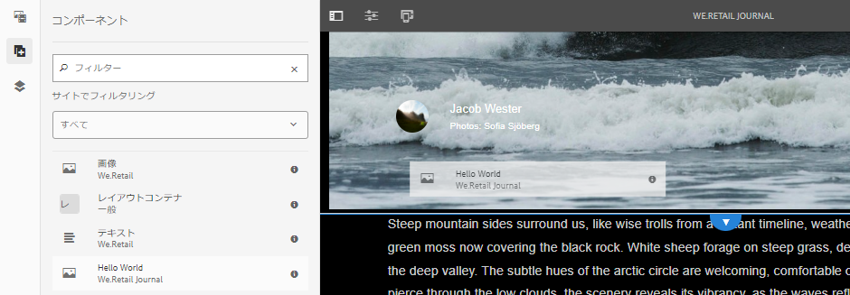

# AEM SPA Editorを使用した開発 — Hello Worldチュートリアル{#developing-with-the-aem-spa-editor-hello-world-tutorial}

>[!WARNING]
>
> このチュートリアルは&#x200B;**非推奨**&#x200B;です。 次のいずれかを実行することをお勧めします。[AEM SPA EditorおよびAngularの概要](https://docs.adobe.com/content/help/ja-JP/experience-manager-learn/spa-angular-tutorial/overview.html)または[AEM SPA EditorおよびReactの概要](https://docs.adobe.com/content/help/ja-JP/experience-manager-learn/spa-react-tutorial/overview.html)

AEM SPA Editorは、シングルページアプリケーションまたはSPAのコンテキスト内編集をサポートします。 このチュートリアルでは、AEM SPA Editor JS SDKで使用するSPA開発の概要を説明します。 このチュートリアルでは、カスタムHello Worldコンポーネントを追加して、We.Retailジャーナルアプリを拡張します。 ユーザーは、ReactフレームワークまたはAngularフレームワークを使用して、チュートリアルを完了できます。

>[!NOTE]
>
> シングルページアプリケーション(SPA)エディター機能には、AEM 6.4サービスパック2以降が必要です。
>
> SPA Editorは、SPAフレームワークベースのクライアントサイドレンダリング(ReactやAngularなど)が必要なプロジェクトで推奨されるソリューションです。

## 前提条件の読み取り {#prereq}

このチュートリアルでは、コンテキスト内編集を有効にするために、SPAコンポーネントをAEMコンポーネントにマッピングするために必要な手順を説明します。 このチュートリアルを開始するユーザーは、Adobe Experience Manager、AEMの開発の基本概念と、AngularフレームワークのReactを使用した開発に精通している必要があります。 このチュートリアルでは、バックエンドとフロントエンドの両方の開発タスクについて説明します。

このチュートリアルを開始する前に、次のリソースを確認することをお勧めします。

* [SPA Editor機能のビデオ](spa-editor-framework-feature-video-use.md)  - SPA EditorおよびWe.Retail Journalアプリの概要を示すビデオです。
* [React.jsチュートリアル](https://reactjs.org/tutorial/tutorial.html)  - Reactフレームワークを使用した開発の概要です。
* [Angularチュートリアル](https://angular.io/tutorial)  -Angularを使用した開発の概要

## ローカル開発環境 {#local-dev}

このチュートリアルは、次の用途に設計されています。

[Adobe Experience Manager 6.5](https://helpx.adobe.com/jp/experience-manager/6-5/release-notes.html) または [Adobe Experience Manager 6.4](https://helpx.adobe.com/jp/experience-manager/6-4/sites/deploying/using/technical-requirements.html)  +  [Service Pack 5](https://helpx.adobe.com/jp/experience-manager/6-4/release-notes/sp-release-notes.html)

このチュートリアルでは、次のテクノロジーとツールをインストールする必要があります。

1. [Java 11](https://downloads.experiencecloud.adobe.com/content/software-distribution/en/general.html)
2. [Apache Maven - 3.3.1以降](https://maven.apache.org/)
3. [Node.js - 8.11.1以降お](https://nodejs.org/ja/) よびnpm 5.6.0以降（npmはnode.jsと共にインストールされます）

新しいターミナルを開き、次のコマンドを実行して、上記のツールのインストールを再確認します。

```shell
$ java -version
java version "11 +"

$ mvn -version
Apache Maven 3.3.9

$ node --version
v8.11.1

$ npm --version
6.1.0
```

## 概要 {#overview}

基本的な概念は、SPAコンポーネントをAEMコンポーネントにマッピングすることです。 AEMコンポーネントは、サーバー側で実行され、JSON形式でコンテンツを書き出します。 JSONコンテンツは、ブラウザーでクライアント側を実行するSPAで使用されます。 SPAコンポーネントとAEMコンポーネントの間に1対1のマッピングが作成されます。


一般的なフレームワーク[React JS](https://reactjs.org/)と[Angular](https://angular.io/)は、すぐに使用できます。 ユーザーは、最も慣れたAngularまたはReactのいずれでも、このチュートリアルを完了できます。

## プロジェクトのセットアップ {#project-setup}

SPAの開発はAEMの開発で1フィート、もう1フィートです。 目標は、SPAの開発を独立して（ほとんどが）AEMに依存しないようにすることです。

* SPAプロジェクトは、フロントエンド開発時に、AEMプロジェクトとは独立して動作します。
* Webpack、NPM、[!DNL Grunt]、[!DNL Gulp]などのフロントエンドビルドツールとテクノロジーは、引き続き使用されます。
* AEM用にビルドするには、SPAプロジェクトがコンパイルされ、AEMプロジェクトに自動的に含まれます。
* SPAをAEMにデプロイする際に使用する標準AEMパッケージです。


*SPAの開発にはAEMの開発が1つあり、もう1つはSPAの開発が独立しておこなわれ、（ほとんどが）AEMに依存しないことが可能です。*

このチュートリアルの目標は、 We.Retailジャーナルアプリを新しいコンポーネントで拡張することです。 まず、We.Retail Journalアプリのソースコードをダウンロードし、ローカルAEMにデプロイします。

1. **** 最新の [We.RetailジャーナルコードをGitHubからダウンロードします](https://github.com/adobe/aem-sample-we-retail-journal)。

   または、コマンドラインからリポジトリのクローンを作成します。

   ```shell
   $ git clone git@github.com:adobe/aem-sample-we-retail-journal.git
   ```

   >[!NOTE]
   >
   >このチュートリアルは、**1.2.1-SNAPSHOT**&#x200B;バージョンのプロジェクトで、**master**&#x200B;ブランチに対して動作します。

1. 次の構造が表示されます。

   

   プロジェクトには、次のMavenモジュールが含まれています。

   * `all`:プロジェクト全体を1つのパッケージに埋め込んでインストールします。
   * `bundles`:次の2つのOSGiバンドルが含まれます。とその他のJavaコードを含 [!DNL Sling Models] むコモンとコア。
   * `ui.apps`:には、プロジェクトの/apps部分（JSおよびCSS clientlib、コンポーネント、実行モード固有の設定）が含まれます。
   * `ui.content`:構造コンテンツと設定(`/content`、 `/conf`)を含む
   * `react-app`:We.RetailジャーナルReactアプリケーション。これは、MavenモジュールとWebpackプロジェクトの両方です。
   * `angular-app`:We.RetailジャーナルAngularアプリケーション。これは[!DNL Maven]モジュールとwebpackプロジェクトの両方です。

1. 新しいターミナルウィンドウを開き、次のコマンドを実行して、[http://localhost:4502](http://localhost:4502)上で実行されているローカルAEMインスタンスにアプリ全体をビルドしてデプロイします。

   ```shell
   $ cd <src>/aem-sample-we-retail-journal
   $ mvn -PautoInstallSinglePackage clean install
   ```

   >[!NOTE]
   >
   > このプロジェクトでは、プロジェクト全体をビルドおよびパッケージ化するMavenプロファイルは`autoInstallSinglePackage`です。

   >[!CAUTION]
   >
   > ビルド中にエラーが発生した場合は、[Maven settings.xmlファイルにAdobeのMavenアーティファクトリポジトリ](https://helpx.adobe.com/jp/experience-manager/kb/SetUpTheAdobeMavenRepository.html)が含まれていることを確認します。

1. 次の URL に移動します。

   * [http://localhost:4502/editor.html/content/we-retail-journal/react/en/home.html](http://localhost:4502/editor.html/content/we-retail-journal/react/en/home.html)
   * [http://localhost:4502/editor.html/content/we-retail-journal/angular/en/home.html](http://localhost:4502/editor.html/content/we-retail-journal/angular/en/home.html)

   We.RetailジャーナルアプリがAEM Sitesエディター内に表示されます。

1. [!UICONTROL 編集]モードで、編集するコンポーネントを選択し、コンテンツを更新します。

   

1. [!UICONTROL ページのプロパティ]アイコンを選択して、[!UICONTROL ページのプロパティ]を開きます。 「[!UICONTROL テンプレートを編集]」を選択して、ページのテンプレートを開きます。

   

1. SPAエディターの最新バージョンでは、従来のSites実装と同じ方法で[編集可能なテンプレート](https://helpx.adobe.com/jp/experience-manager/6-5/sites/developing/using/page-templates-editable.html)を使用できます。 これは、後でカスタムコンポーネントで再度表示されます。

   >[!NOTE]
   >
   > 編集可能なテンプレートは、AEM 6.5とAEM 6.4 + **Service Pack 5**&#x200B;でのみサポートされます。

## 開発の概要{#development-overview}


SPAの開発の繰り返しは、AEMとは独立しておこなわれます。 SPAをAEMにデプロイする準備が整ったら、（上の図に示すように）次の大まかな手順を実行します。

1. AEMプロジェクトビルドが呼び出され、SPAプロジェクトのビルドがトリガーされます。 We.Retailジャーナルは、[**frontend-maven-plugin**](https://github.com/eirslett/frontend-maven-plugin)を使用します。
1. SPAプロジェクトの&#x200B;[**aem-clientlib-generator**](https://www.npmjs.com/package/aem-clientlib-generator)は、コンパイル済みのSPAをAEMプロジェクトにAEMクライアントライブラリとして埋め込みます。
1. AEMプロジェクトは、コンパイル済みのSPAと、その他のサポートするAEMコードを含むAEMパッケージを生成します。

## AEMコンポーネント{#aem-component}の作成

**担当者：AEM 開発者**

最初にAEMコンポーネントが作成されます。 AEMコンポーネントは、Reactコンポーネントによって読み取られるJSONプロパティのレンダリングを担当します。 AEMコンポーネントは、コンポーネントの編集可能なプロパティのダイアログを提供する役割も果たします。

[!DNL Eclipse]または他の[!DNL IDE]を使用して、We.Retail Journal Mavenプロジェクトをインポートします。

1. リアクター&#x200B;**pom.xml**&#x200B;を更新して、[!DNL Apache Rat]プラグインを削除します。 このプラグインは、各ファイルをチェックして、Licenseヘッダーがあることを確認します。 この機能に関心を持つ必要はありません。

   **aem-sample-we-retail-journal/pom.xml**&#x200B;で、**apache-rate-plugin**&#x200B;を削除します。

   ```xml
   <!-- Remove apache-rat-plugin -->
   <plugin>
           <groupId>org.apache.rat</groupId>
           <artifactId>apache-rat-plugin</artifactId>
           <configuration>
               <excludes combine.children="append">
                   <exclude>*</exclude>
                       ...
               </excludes>
           </configuration>
           <executions>
                   <execution>
                       <phase>verify</phase>
                       <goals>
                           <goal>check</goal>
                       </goals>
               </execution>
           </executions>
       </plugin>
   ```

1. **we-retail-journal-content** (`<src>/aem-sample-we-retail-journal/ui.apps`)モジュールで、`ui.apps/jcr_root/apps/we-retail-journal/components`の下に&#x200B;**cq:Component**&#x200B;型の&#x200B;**helloworld**&#x200B;という名前の新しいノードを作成します。
1. **helloworld**&#x200B;コンポーネントに次のプロパティを追加します。以下に示すXML(`/helloworld/.content.xml`)で表されます。

   ```xml
   <?xml version="1.0" encoding="UTF-8"?>
   <jcr:root xmlns:cq="http://www.day.com/jcr/cq/1.0" xmlns:jcr="http://www.jcp.org/jcr/1.0"
       jcr:description="Hello World Component for We.Retail Journal"
       jcr:primaryType="cq:Component"
       jcr:title="Hello World"
       componentGroup="We.Retail Journal" />
   ```

   

   >[!NOTE]
   >
   > 編集可能テンプレート機能を説明するために、意図的に`componentGroup="Custom Components"`を設定しました。 実際のプロジェクトでは、コンポーネントグループの数を最小限に抑えることをお勧めします。そのため、他のコンテンツコンポーネントに合わせて「[!DNL We.Retail Journal]」を適切なグループにします。
   >
   > AEM 6.5とAEM 6.4 + **Service Pack 5**&#x200B;のみが編集可能なテンプレートをサポートしています。

1. 次に、**Hello World**&#x200B;コンポーネント用にカスタムメッセージを設定するためのダイアログが作成されます。 `/apps/we-retail-journal/components/helloworld`の下に、**nt:unstructured**&#x200B;のノード名&#x200B;**cq:dialog**&#x200B;を追加します。
1. **cq:dialog**&#x200B;には、**[!DNL message]**&#x200B;という名前のプロパティに対するテキストを保持する1つのテキストフィールドが表示されます。 新しく作成した&#x200B;**cq:dialog**&#x200B;の下に、以下のノードとプロパティを追加します。これらのノードとプロパティは、以下のXML(`helloworld/_cq_dialog/.content.xml`)で表されます。

   ```xml
   <?xml version="1.0" encoding="UTF-8"?>
   <jcr:root xmlns:sling="http://sling.apache.org/jcr/sling/1.0" xmlns:cq="http://www.day.com/jcr/cq/1.0" xmlns:jcr="http://www.jcp.org/jcr/1.0" xmlns:nt="http://www.jcp.org/jcr/nt/1.0"
       jcr:primaryType="nt:unstructured"
       jcr:title="We.Retail Journal - Hello World"
       sling:resourceType="cq/gui/components/authoring/dialog">
       <content
           jcr:primaryType="nt:unstructured"
           sling:resourceType="granite/ui/components/coral/foundation/container">
           <items jcr:primaryType="nt:unstructured">
               <tabs
                   jcr:primaryType="nt:unstructured"
                   sling:resourceType="granite/ui/components/coral/foundation/tabs"
                   maximized="{Boolean}true">
                   <items jcr:primaryType="nt:unstructured">
                       <properties
                           jcr:primaryType="nt:unstructured"
                           jcr:title="Properties"
                           sling:resourceType="granite/ui/components/coral/foundation/container"
                           margin="{Boolean}true">
                           <items jcr:primaryType="nt:unstructured">
                               <columns
                                   jcr:primaryType="nt:unstructured"
                                   sling:resourceType="granite/ui/components/coral/foundation/fixedcolumns"
                                   margin="{Boolean}true">
                                   <items jcr:primaryType="nt:unstructured">
                                       <column
                                           jcr:primaryType="nt:unstructured"
                                           sling:resourceType="granite/ui/components/coral/foundation/container">
                                           <items jcr:primaryType="nt:unstructured">
                                               <message
                                                   jcr:primaryType="nt:unstructured"
                                                   sling:resourceType="granite/ui/components/coral/foundation/form/textfield"
                                                   fieldLabel="Message"
                                                   name="./message"
                                                   required="{Boolean}true"/>
                                           </items>
                                       </column>
                                   </items>
                               </columns>
                           </items>
                       </properties>
                   </items>
               </tabs>
           </items>
       </content>
   </jcr:root>
   ```

   

   上記のXMLノード定義は、ユーザーが「メッセージ」を入力できる単一のテキストフィールドを持つダイアログを作成します。 `<message />`ノード内のプロパティ`name="./message"`に注意してください。 これは、AEM内のJCRに保存されるプロパティの名前です。

1. 次に、空のポリシーダイアログが作成されます(`cq:design_dialog`)。 テンプレートエディターでコンポーネントを表示するには、ポリシーダイアログが必要です。 このシンプルな使用例では、空のダイアログになります。

   `/apps/we-retail-journal/components/helloworld`の下に、`nt:unstructured`のノード名`cq:design_dialog`を追加します。

   設定は、以下のXMLで表されます(`helloworld/_cq_design_dialog/.content.xml`)。

   ```xml
   <?xml version="1.0" encoding="UTF-8"?>
   <jcr:root xmlns:sling="http://sling.apache.org/jcr/sling/1.0" xmlns:cq="http://www.day.com/jcr/cq/1.0" xmlns:jcr="http://www.jcp.org/jcr/1.0" xmlns:nt="http://www.jcp.org/jcr/nt/1.0"
   jcr:primaryType="nt:unstructured" />
   ```

1. コマンドラインからAEMにコードベースをデプロイします。

   ```shell
   $ cd <src>/aem-sample-we-retail-journal/content
   $ mvn -PautoInstallPackage clean install
   ```

   [CRXDE Lite](http://localhost:4502/crx/de/index.jsp#/apps/we-retail-journal/global/components/helloworld)で、`/apps/we-retail-journal/components:`の下のフォルダーを調べて、コンポーネントがデプロイされたことを検証します。

   

## Slingモデル{#create-sling-model}の作成

**担当者：AEM 開発者**

次に、[!DNL Sling Model]コンポーネントをバックする[!DNL Hello World]が作成されます。 従来のWCMの使用例では、 [!DNL Sling Model]がビジネスロジックを実装し、サーバー側レンダリングスクリプト(HTL)が[!DNL Sling Model]を呼び出します。 これにより、レンダリングスクリプトが比較的シンプルになります。

[!DNL Sling Models] は、サーバー側のビジネスロジックを実装するSPAの使用例でも使用されます。違いは、[!DNL SPA]の使用例では、[!DNL Sling Models]がそのメソッドをシリアル化されたJSONとして公開する点です。

>[!NOTE]
>
>ベストプラクティスとして、開発者は可能な限り[AEMコアコンポーネント](https://docs.adobe.com/content/help/ja/experience-manager-core-components/using/introduction.html)を使用するようにしてください。 他の機能の中でも、コアコンポーネントは「SPA対応」のJSON出力を[!DNL Sling Models]に提供し、開発者はフロントエンドプレゼンテーションに専念できます。

1. 任意のエディターで、**we-retail-journal-commons**&#x200B;プロジェクト(`<src>/aem-sample-we-retail-journal/bundles/commons`)を開きます。
1. パッケージ`com.adobe.cq.sample.spa.commons.impl.models`内：
   * `HelloWorld`という名前の新しいクラスを作成します。
   * `com.adobe.cq.export.json.ComponentExporter.`の実装インターフェイスを追加します。

   

   `ComponentExporter`インターフェイスは、[!DNL Sling Model]がAEM Content Servicesと互換性を持つように実装する必要があります。

   ```java
    package com.adobe.cq.sample.spa.commons.impl.models;
   
    import com.adobe.cq.export.json.ComponentExporter;
   
    public class HelloWorld implements ComponentExporter {
   
        @Override
        public String getExportedType() {
            return null;
        }
    }
   ```

1. `RESOURCE_TYPE`という名前の静的変数を追加して、[!DNL HelloWorld]コンポーネントのリソースタイプを識別します。

   ```java
    ...
    public class HelloWorld implements ComponentExporter {
   
        static final String RESOURCE_TYPE = "we-retail-journal/components/helloworld";
   
        ...
    }
   ```

1. `@Model`と`@Exporter`のOSGi注釈を追加します。 `@Model`注釈は、クラスを[!DNL Sling Model]として登録します。 `@Exporter`注釈は、[!DNL Jackson Exporter]フレームワークを使用して、メソッドをシリアル化されたJSONとして公開します。

   ```java
   import org.apache.sling.api.SlingHttpServletRequest;
   import org.apache.sling.models.annotations.Exporter;
   import org.apache.sling.models.annotations.Model;
   import com.adobe.cq.export.json.ExporterConstants;
   ...
   
   @Model(
           adaptables = SlingHttpServletRequest.class,
           adapters = {ComponentExporter.class},
           resourceType = HelloWorld.RESOURCE_TYPE
   )
   @Exporter(
           name = ExporterConstants.SLING_MODEL_EXPORTER_NAME, 
           extensions = ExporterConstants.SLING_MODEL_EXTENSION
   )
   public class HelloWorld implements ComponentExporter {
   
   ...
   ```

1. メソッド`getDisplayMessage()`を実装して、JCRプロパティ`message`を返します。 `@ValueMapValue`の[!DNL Sling Model]注釈を使用すると、コンポーネントの下に保存されているプロパティ`message`を簡単に取得できます。 `@Optional`注釈は重要です。コンポーネントが最初にページに追加されると、`message`に値が入力されなくなるからです。

   ビジネスロジックの一部として、文字列「**Hello**」がメッセージの先頭に追加されます。

   ```java
   import org.apache.sling.models.annotations.injectorspecific.ValueMapValue;
   import org.apache.sling.models.annotations.Optional;
   
   ...
   
   public class HelloWorld implements ComponentExporter {
   
      static final String RESOURCE_TYPE = "we-retail-journal/components/helloworld";
   
      private static final String PREPEND_MSG = "Hello";
   
       @ValueMapValue @Optional
       private String message;
   
       public String getDisplayMessage() {
           if(message != null && message.length() > 0) {
               return PREPEND_MSG + " "  + message;
           }
           return null;
       }
   
   ...
   ```

   >[!NOTE]
   >
   > メソッド名`getDisplayMessage`は重要です。 [!DNL Sling Model]が[!DNL Jackson Exporter]でシリアル化されると、JSONプロパティとして公開されます。`displayMessage`. [!DNL Jackson Exporter]は、（無視するように明示的にマークされていない限り）パラメーターを受け取らないすべての`getter`メソッドをシリアル化して公開します。 後でReact /Angularアプリで、このプロパティ値を読み取り、アプリの一部として表示します。

   メソッド`getExportedType`も重要です。 コンポーネント`resourceType`の値を使用して、JSONデータをフロントエンドコンポーネント(Angular/React)に「マッピング」します。 次の節でこれについて説明します。

1. メソッド`getExportedType()`を実装して、`HelloWorld`コンポーネントのリソースタイプを返します。

   ```java
    @Override
       public String getExportedType() {
           return RESOURCE_TYPE;
       }
   ```

   [**HelloWorld.java**&#x200B;の完全なコードは、こちらを参照してください。](https://github.com/Adobe-Marketing-Cloud/aem-guides/blob/master/spa-helloworld-guide/src/bundles/commons/HelloWorld.java)

1. Apache Mavenを使用してAEMにコードをデプロイします。

   ```shell
   $ cd <src>/sample-we-retail-spa-content/bundles/commons
   $ mvn -PautoInstallPackage clean install
   ```

   OSGiコンソールで[[!UICONTROL Status] / [!UICONTROL Sling Models]](http://localhost:4502/system/console/status-slingmodels)に移動して、[!DNL Sling Model]のデプロイメントと登録を確認します。

   `HelloWorld` Sling Modelが`we-retail-journal/components/helloworld` Slingリソースタイプにバインドされ、[!DNL Sling Model Exporter Servlet]として登録されていることがわかります。

   ```shell
   com.adobe.cq.sample.spa.commons.impl.models.HelloWorld - we-retail-journal/components/helloworld
   com.adobe.cq.sample.spa.commons.impl.models.HelloWorld exports 'we-retail-journal/components/helloworld' with selector 'model' and extension '[Ljava.lang.String;@6480f3e5' with exporter 'jackson'
   ```

## Reactコンポーネントの作成{#react-component}

**担当者：フロントエンド開発者**

次に、Reactコンポーネントが作成されます。 **react-app**&#x200B;モジュール(`<src>/aem-sample-we-retail-journal/react-app`)を、任意のエディターで開きます。

>[!NOTE]
>
> [Angular開発](#angular-component)のみをご利用の場合は、このセクションを省略してください。

1. `react-app`フォルダー内で、srcフォルダーに移動します。 componentsフォルダーを展開して、既存のReactコンポーネントファイルを表示します。

   

1. componentsフォルダーの下に`HelloWorld.js`という名前の新しいファイルを追加します。
1. `HelloWorld.js` を開きます。Reactコンポーネントライブラリを読み込むためのimport文を追加します。 2つ目のimport文を追加して、Adobeが提供する`MapTo`ヘルパーをインポートします。 `MapTo`ヘルパーは、ReactコンポーネントのAEMコンポーネントのJSONへのマッピングを提供します。

   ```js
   import React, {Component} from 'react';
   import {MapTo} from '@adobe/cq-react-editable-components';
   ```

1. インポートの下に、React `Component`インターフェイスを拡張する`HelloWorld`という新しいクラスを作成します。 必要な`render()`メソッドを`HelloWorld`クラスに追加します。

   ```js
   import React, {Component} from 'react';
   import {MapTo} from '@adobe/cq-react-editable-components';
   
   class HelloWorld extends Component {
   
       render() {
   
       }
   }
   ```

1. `MapTo`ヘルパーには、Reactコンポーネントのpropの一部として`cqModel`という名前のオブジェクトが自動的に含まれます。 `cqModel`には、[!DNL Sling Model]によって公開されるすべてのプロパティが含まれます。

   前に作成した[!DNL Sling Model]には、メソッド`getDisplayMessage()`が含まれています。 `getDisplayMessage()` は、出力時にという名前のJSONキーとし `displayMessage` て変換されます。

   `render()`メソッドを実装して、`displayMessage`の値を含む`h1`タグを出力します。 [JSX](https://reactjs.org/docs/introducing-jsx.html)（JavaScriptの構文拡張）は、コンポーネントの最終的なマークアップを返すために使用されます。

   ```js
   ...
   
   class HelloWorld extends Component {
       render() {
   
           if(this.props.displayMessage) {
               return (
                   <div className="cmp-helloworld">
                       <h1 className="cmp-helloworld_message">{this.props.displayMessage}</h1>
                   </div>
               );
           }
           return null;
       }
   }
   ```

1. 設定編集メソッドを実装します。 このメソッドは`MapTo`ヘルパーを介して渡され、コンポーネントが空の場合にプレースホルダーを表示する情報をAEMエディターに提供します。 これは、コンポーネントがSPAに追加されたが、まだオーサリングされていない場合に発生します。 `HelloWorld`クラスの下に次を追加します。

   ```js
   ...
   
   class HelloWorld extends Component {
       ...
   }
   
   const HelloWorldEditConfig = {
   
       emptyLabel: 'Hello World',
   
       isEmpty: function(props) {
           return !props || !props.displayMessage || props.displayMessage.trim().length < 1;
       }
   };
   
   ...
   ```

1. ファイルの最後で、 `MapTo`ヘルパーを呼び出し、 `HelloWorld`クラスと`HelloWorldEditConfig`を渡します。 これにより、AEMコンポーネントのリソースタイプに基づいて、ReactコンポーネントがAEMコンポーネントにマッピングされます。`we-retail-journal/components/helloworld`.

   ```js
   MapTo('we-retail-journal/components/helloworld')(HelloWorld, HelloWorldEditConfig);
   ```

   [**HelloWorld.js**&#x200B;の完成したコードは、こちらを参照してください。](https://github.com/Adobe-Marketing-Cloud/aem-guides/blob/master/spa-helloworld-guide/src/react-app/components/HelloWorld.js)

1. `ImportComponents.js` ファイルを開きます。`<src>/aem-sample-we-retail-journal/react-app/src/ImportComponents.js`にあります。

   コンパイル済みJavaScriptバンドル内の他のコンポーネントと`HelloWorld.js`を必要とする行を追加します。

   ```js
   ...
     require('./components/Text');
     require('./components/Image');
     require('./components/HelloWorld');
   ...
   ```

1. `components`フォルダーに、`HelloWorld.css`という名前の新しいファイルを`HelloWorld.js.`の兄弟として作成します。次のようにファイルを設定して、`HelloWorld`コンポーネントの基本的なスタイルを作成します。

   ```css
   /* HelloWorld.css to style HelloWorld component */
   
   .cmp-helloworld_message {
       text-align: center;
       color: #ff505e;
       text-transform: unset;
       letter-spacing: unset;
   }
   ```

1. `HelloWorld.js`を再度開き、`HelloWorld.css`が必要になるようにimport文の下で更新します。

   ```js
   import React, {Component} from 'react';
   import {MapTo} from '@adobe/cq-react-editable-components';
   
   require('./HelloWorld.css');
   
   ...
   ```

1. Apache Mavenを使用してAEMにコードをデプロイします。

   ```shell
   $ cd <src>/sample-we-retail-spa-content
   $ mvn -PautoInstallSinglePackage clean install
   ```

1. [CRXDE-Lite](http://localhost:4502/crx/de/index.jsp#/apps/we-retail-journal/react/clientlibs/we-retail-journal-react/js/app.js)で、`/apps/we-retail-journal/react/clientlibs/we-retail-journal-react/js/app.js`を開きます。 app.jsでHelloWorldをクイック検索し、Reactコンポーネントがコンパイル済みアプリに含まれていることを確認します。

   >[!NOTE]
   >
   > **app.js** は、バンドルされたReactアプリを表示します。コードは人間が読み取れなくなりました。 `npm run build`コマンドは、最新のブラウザーで解釈できるコンパイル済みのJavaScriptを出力する最適化されたビルドをトリガーしました。


## angularコンポーネント{#angular-component}の作成

**担当者：フロントエンド開発者**

>[!NOTE]
>
> Reactの開発にのみ関心がある場合は、この節をスキップしてください。

次に、Angularコンポーネントが作成されます。 **angularアプリ**&#x200B;モジュール(`<src>/aem-sample-we-retail-journal/angular-app`)を任意のエディターで開きます。

1. `angular-app`フォルダー内で、 `src`フォルダーに移動します。 componentsフォルダーを展開して、既存のAngularコンポーネントファイルを表示します。

   

1. componentsフォルダーの下に`helloworld`という名前の新しいフォルダーを追加します。 `helloworld`フォルダーの下に、`helloworld.component.css, helloworld.component.html, helloworld.component.ts`という名前の新しいファイルを追加します。

   ```plain
   /angular-app
       /src
           /app
               /components
   +                /helloworld
   +                    helloworld.component.css
   +                    helloworld.component.html
   +                    helloworld.component.ts
   ```

1. `helloworld.component.ts` を開きます。angular`Component`および`Input`クラスをインポートするimport文を追加します。 `styleUrls`と`templateUrl`を`helloworld.component.css`と`helloworld.component.html`に向けて、新しいコンポーネントを作成します。 最後に、`displayMessage`の入力を想定してクラス`HelloWorldComponent`を書き出します。

   ```js
   //helloworld.component.ts
   
   import { Component, Input } from '@angular/core';
   
   @Component({
     selector: 'app-helloworld',
     host: { 'class': 'cmp-helloworld' },
     styleUrls:['./helloworld.component.css'],
     templateUrl: './helloworld.component.html',
   })
   
   export class HelloWorldComponent {
     @Input() displayMessage: string;
   }
   ```

   >[!NOTE]
   >
   > 前に作成した[!DNL Sling Model]を思い出すと、**getDisplayMessage()**&#x200B;メソッドがあります。 このメソッドのシリアル化されたJSONは、**displayMessage**&#x200B;で、Angularアプリで読み上げます。

1. `helloworld.component.html`を開き、`displayMessage`プロパティを印刷する`h1`タグを含めます。

   ```html
   <h1 *ngIf="displayMessage" class="cmp-helloworld_message">
       {{displayMessage}}
   </h1>
   ```

1. コンポーネントの基本的なスタイルを含めるように`helloworld.component.css`を更新します。

   ```css
   :host-context {
       display: block;
   };
   
   .cmp-helloworld {
       display:block;
   }
   .cmp-helloworld_message {
       text-align: center;
       color: #ff505e;
       text-transform: unset;
       letter-spacing: unset;
   }
   ```

1. `helloworld.component.spec.ts`を次のテストベッドに更新します。

   ```js
   import { async, ComponentFixture, TestBed } from '@angular/core/testing';
   
   import { HelloWorldComponent } from './helloworld.component';
   
       describe('HelloWorld', () => {
       let component: HelloWorldComponent;
       let fixture: ComponentFixture<HelloWorldComponent>;
   
       beforeEach(async(() => {
           TestBed.configureTestingModule({
           declarations: [ HelloWorldComponent ]
           })
           .compileComponents();
       }));
   
       beforeEach(() => {
           fixture = TestBed.createComponent(HelloWorldComponent);
           component = fixture.componentInstance;
           fixture.detectChanges();
       });
   
       it('should create', () => {
           expect(component).toBeTruthy();
       });
   });
   ```

1. 次に`src/components/mapping.ts`を更新し、`HelloWorldComponent`を含めます。 コンポーネントが設定される前に、AEMエディターでプレースホルダーをマークする`HelloWorldEditConfig`を追加します。 最後に、`MapTo`ヘルパーを使用してAEMコンポーネントをAngularコンポーネントにマッピングする行を追加します。

   ```js
   // src/components/mapping.ts
   
   import { HelloWorldComponent } from "./helloworld/helloworld.component";
   
   ...
   
   const HelloWorldEditConfig = {
   
       emptyLabel: 'Hello World',
   
       isEmpty: function(props) {
           return !props || !props.displayMessage || props.displayMessage.trim().length < 1;
       }
   };
   
   ...
   
   MapTo('we-retail-journal/components/helloworld')(HelloWorldComponent, HelloWorldEditConfig);
   ```

   [**mapping.ts**&#x200B;の完全なコードは、こちらを参照してください。](https://github.com/Adobe-Marketing-Cloud/aem-guides/blob/master/spa-helloworld-guide/src/angular-app/mapping.ts)

1. `src/app.module.ts`を更新して、**NgModule**&#x200B;を更新します。 **`HelloWorldComponent`**&#x200B;を、**AppModule**&#x200B;に属する&#x200B;**宣言**&#x200B;として追加します。 また、JSONモデルの処理時にコンパイルされ、アプリに動的に含められるように、 `HelloWorldComponent`を&#x200B;**entryComponent**&#x200B;として追加します。

   ```js
   import { HelloWorldComponent } from './components/helloworld/helloworld.component';
   
   ...
   
   @NgModule({
     imports: [BrowserModule.withServerTransition({ appId: 'we-retail-sample-angular' }),
       SpaAngularEditableComponentsModule,
     AngularWeatherWidgetModule.forRoot({
       key: "37375c33ca925949d7ba331e52da661a",
       name: WeatherApiName.OPEN_WEATHER_MAP,
       baseUrl: 'http://api.openweathermap.org/data/2.5'
     }),
       AppRoutingModule,
       BrowserTransferStateModule],
     providers: [ModelManagerService,
       { provide: APP_BASE_HREF, useValue: '/' }],
     declarations: [AppComponent,
       TextComponent,
       ImageComponent,
       WeatherComponent,
       NavigationComponent,
       MenuComponent,
       MainContentComponent,
       HelloWorldComponent],
     entryComponents: [TextComponent,
       ImageComponent,
       WeatherComponent,
       NavigationComponent,
       MainContentComponent,
       HelloWorldComponent],
     bootstrap: [AppComponent]
    })
   ```

   [**app.module.ts**&#x200B;の完成したコードは、こちらから参照できます。](https://github.com/Adobe-Marketing-Cloud/aem-guides/blob/master/spa-helloworld-guide/src/angular-app/app.module.ts)

1. Mavenを使用してAEMにコードをデプロイします。

   ```shell
   $ cd <src>/sample-we-retail-spa-content
   $ mvn -PautoInstallSinglePackage clean install
   ```

1. [CRXDE-Lite](http://localhost:4502/crx/de/index.jsp#/apps/we-retail-journal/angular/clientlibs/we-retail-journal-angular/js/main.js)で、`/apps/we-retail-journal/angular/clientlibs/we-retail-journal-angular/js/main.js`を開きます。 `main.js`で&#x200B;**HelloWorld**&#x200B;のクイック検索を実行し、Angularコンポーネントが含まれていることを確認します。

   >[!NOTE]
   >
   > **main.js** は、バンドルされたAngularアプリです。コードは人間が読み取れなくなりました。 npm run buildコマンドにより、最新のブラウザーで解釈できるコンパイル済みのJavaScriptを出力する最適化ビルドがトリガーされました。

## テンプレート{#template-update}の更新

1. ReactまたはAngular版の編集可能テンプレートに移動します。

   * (Angular) [http://localhost:4502/editor.html/conf/we-retail-journal/angular/settings/wcm/templates/we-retail-angular-weather-template/structure.html](http://localhost:4502/editor.html/conf/we-retail-journal/angular/settings/wcm/templates/we-retail-angular-weather-template/structure.html)
   * (React) [http://localhost:4502/editor.html/conf/we-retail-journal/react/settings/wcm/templates/we-retail-react-weather-template/structure.html](http://localhost:4502/editor.html/conf/we-retail-journal/react/settings/wcm/templates/we-retail-react-weather-template/structure.html)

1. メインの[!UICONTROL レイアウトコンテナ]を選択し、[!UICONTROL ポリシー]アイコンを選択してポリシーを開きます。

   

   **[!UICONTROL プロパティ]** > **[!UICONTROL 許可されているコンポーネント]**&#x200B;の下で、**[!DNL Custom Components]**&#x200B;を検索します。 **[!DNL Hello World]**&#x200B;コンポーネントが表示されたら、それを選択します。 右上隅のチェックボックスをクリックして、変更を保存します。

   

1. 保存後、**[!DNL HelloWorld]**&#x200B;コンポーネントが[!UICONTROL レイアウトコンテナ]に許可されたコンポーネントとして表示されます。

   

   >[!NOTE]
   >
   > AEM 6.5およびAEM 6.4.5のみが、SPA Editorの編集可能なテンプレート機能をサポートしています。 AEM 6.4を使用している場合は、CRXDE Liteを使用して、許可されたコンポーネントのポリシーを手動で設定する必要があります。`/conf/we-retail-journal/react/settings/wcm/policies/wcm/foundation/components/responsivegrid/default`または`/conf/we-retail-journal/angular/settings/wcm/policies/wcm/foundation/components/responsivegrid/default`

   [!UICONTROL レイアウトコンテナ]の[!UICONTROL 許可されたコンポーネント]の更新されたポリシー設定を示すCRXDE Lite:

   

## まとめ {#putting-together}

1. angularまたはReactページに移動します。

   * [http://localhost:4502/editor.html/content/we-retail-journal/react/en/home.html](http://localhost:4502/editor.html/content/we-retail-journal/react/en/home.html)
   * [http://localhost:4502/editor.html/content/we-retail-journal/angular/en/home.html](http://localhost:4502/editor.html/content/we-retail-journal/angular/en/home.html)

1. **[!DNL Hello World]**&#x200B;コンポーネントを探し、**[!DNL Hello World]**&#x200B;コンポーネントをページにドラッグ&amp;ドロップします。

   

   プレースホルダーが表示されます。

   

1. コンポーネントを選択し、ダイアログに「World」または「Your Name」というメッセージを追加します。 変更内容を保存します。

   

   「Hello」という文字列は、常にメッセージの先頭に付加されます。 これは、`HelloWorld.java` [!DNL Sling Model]のロジックの結果です。

## 次の手順 {#next-steps}

[HelloWorldコンポーネントの完成したソリューション](assets/spa-editor-helloworld-tutorial-use/aem-sample-we-retail-journal-HelloWorldSolution.zip)

* GitHubの[[!DNL We.Retail Journal] の完全なソースコード](https://github.com/adobe/aem-sample-we-retail-journal)
* [[!DNL Getting Started with the AEM SPA Editor - WKND Tutorial]](https://helpx.adobe.com/jp/experience-manager/kt/sites/using/getting-started-spa-wknd-tutorial-develop.html)でのReactの開発に関する、より詳しいチュートリアルをご覧ください。

## トラブルシューティング {#troubleshooting}

### Eclipseにプロジェクトを構築できません{#unable-to-build-project-in-eclipse}

**エラー：** 認識されていない目標の実行に対し [!DNL We.Retail Journal] て、プロジェクトをEclipseに読み込む際にエラーが発生しました。

`Execution npm install, Execution npm run build, Execution default-analyze-classes*`


**解像度**:「完了」をクリックして、後で解決します。これにより、チュートリアルが完了することを妨げないでください。

**エラー**:Reactモジュール( ) `react-app`は、Mavenビルド中に正常にビルドされません。

**解決方法：** react-appの下にあ `node_modules` るフォルダーを **削除してみてください**。プロジェクトのルートからApache Mavenコマンド`mvn  clean install -PautoInstallSinglePackage`を再実行します。

### AEM {#unsatisfied-dependencies-in-aem}内の未満の依存関係


AEMの依存関係が満たされない場合、**[!UICONTROL AEM Package Manager]**&#x200B;または&#x200B;**[!UICONTROL AEM Webコンソール]**（Felixコンソール）で、SPAエディター機能が使用できないことを示します。

### コンポーネントが表示されない

**エラー**:デプロイメントが正常に完了し、React/Angularアプリのコンパイル済みバージョンに更新済みコンポーネントがあることを確認した後で `helloworld` も、コンポーネントをページにドラッグしてもコンポーネントが表示されません。コンポーネントはAEM UIで確認できます。

**解像度**:ブラウザの履歴/キャッシュをクリアし、新しいブラウザを開くか、匿名モードを使用します。それが機能しない場合は、ローカルのAEMインスタンス上のクライアントライブラリキャッシュを無効にします。 AEMは、効率を上げるために、大規模なクライアントライブラリをキャッシュしようとします。 古いコードがキャッシュされる問題を修正するために、キャッシュを手動で無効にする必要が生じる場合があります。

次の場所に移動します。[http://localhost:4502/libs/granite/ui/content/dumplibs.rebuild.html](http://localhost:4502/libs/granite/ui/content/dumplibs.rebuild.html)を開き、「キャッシュを無効にする」をクリックします。 React/Reactページに戻り、Angularを更新します。


