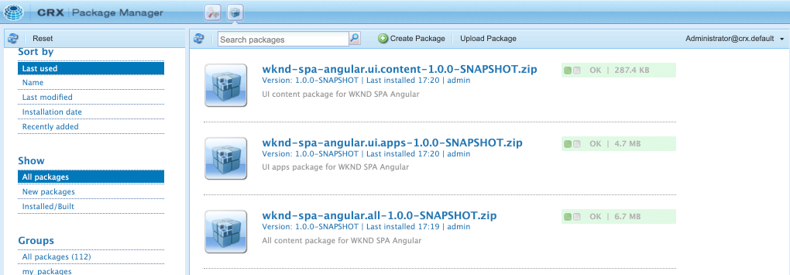
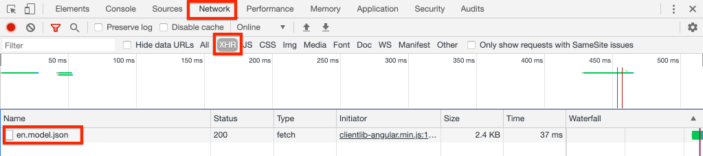

# SPA Editor Project {#create-project}

AEM SPA Editorと統合されたAngularアプリケーションの出発点として、Adobe Experience Manager(AEM)Mavenプロジェクトを使用する方法を説明します。

## 目的

1. Mavenアーキタイプから構築された新しいAEM SPA Editorプロジェクトの構造を理解します。
2. スタータープロジェクトをAEMのローカルインスタンスにデプロイします。

## 作成する内容

この章では、[AEMプロジェクトアーキタイプ](https://github.com/adobe/aem-project-archetype)に基づいて、新しいAEMプロジェクトがデプロイされます。 AEMプロジェクトは、AngularSPAの非常にシンプルな出発点でブートストラップされます。 この章で使用されるプロジェクトは、WKND SPAの実装の基礎となり、今後の章で構築される予定です。


*クラシックなHello Worldメッセージです。*

## 前提条件

[ローカル開発環境](overview.md#local-dev-environment)の設定に必要なツールと手順を確認します。 **author**&#x200B;モードで開始した、Adobe Experience Managerの新しいインスタンスがローカルで実行されていることを確認します。

## プロジェクトの取得

AEM用のMavenマルチモジュールプロジェクトを作成するには、いくつかのオプションがあります。 このチュートリアルでは、チュートリアルコードの基礎として最新の[AEMプロジェクトアーキタイプ](https://github.com/adobe/aem-project-archetype)を使用しました。 複数のバージョンのAEMをサポートするために、プロジェクトコードに変更が加えられました。 [後方互換性に関する注意](overview.md#compatibility)を確認してください。

>[!CAUTION]
>
>ベストプラクティスは、[アーキタイプ](https://github.com/adobe/aem-project-archetype)の最新バージョン&#x200B;**を使用して、実際の実装用の新しいプロジェクトを生成することです。** AEMプロジェクトでは、アーキタイプの`aemVersion`プロパティを使用して、単一バージョンのAEMをターゲットにする必要があります。

1. このチュートリアルの開始点をGitからダウンロードします。

   ```shell
   $ git clone git@github.com:adobe/aem-guides-wknd-spa.git
   $ cd aem-guides-wknd-spa
   $ git checkout Angular/create-project-start
   ```

2. 次のフォルダーとファイル構造は、ローカルファイルシステム上のMavenアーキタイプによって生成されたAEMプロジェクトを表しています。

   ```plain
   |--- aem-guides-wknd-spa
       |--- all/
       |--- core/
       |--- dispatcher/
       |--- ui.apps/
       |--- ui.apps.structure/
       |--- ui.content/
       |--- ui.frontend /
       |--- it.tests/
       |--- pom.xml
       |--- README.md
       |--- .gitignore
       |--- archetype.properties
   ```

3. [AEMプロジェクトアーキタイプ](https://github.com/Adobe-Marketing-Cloud/aem-project-archetype/releases/tag/aem-project-archetype-14)からAEMプロジェクトを生成する際に、次のプロパティを使用しました。

   | プロパティ | 値 |
   |-----------------|---------------------------------------|
   | aemVersion | クラウド |
   | appTitle | WKNDSPAAngular |
   | appId | wknd-spa-angular |
   | groupId | com.adobe.aem.guides |
   | frontendModule | angular |
   | package | com.adobe.aem.guides.wknd.spa.angular |
   | includeExamples | n |

   >[!NOTE]
   >
   > `frontendModule=angular`プロパティに注意してください。 これにより、AEMプロジェクトアーキタイプは、スターター[Angularコードベース](https://docs.adobe.com/content/help/en/experience-manager-core-components/using/developing/archetype/uifrontend-angular.html)を使用して、AEM SPA Editorでプロジェクトをブートストラップするようになります。

## プロジェクトの構築

次に、Mavenを使用して、プロジェクトコードをコンパイル、ビルド、AEMのローカルインスタンスにデプロイします。

1. AEMのインスタンスがポート&#x200B;**4502**&#x200B;上でローカルに実行されていることを確認します。
2. コマンドラインターミナルから、Mavenがインストールされていることを確認します。

   ```shell
   $ mvn --version
   Apache Maven 3.6.2
   Maven home: /Library/apache-maven-3.6.2
   Java version: 11.0.4, vendor: Oracle Corporation, runtime: /Library/Java/JavaVirtualMachines/jdk-11.0.4.jdk/Contents/Home
   ```

3. `aem-guides-wknd-spa`ディレクトリから次のMavenコマンドを実行して、プロジェクトを構築し、AEMにデプロイします。

   ```shell
   $ mvn -PautoInstallSinglePackage clean install
   ```

   [AEM 6.x](overview.md#compatibility)を使用する場合：

   ```shell
   $ mvn clean install -PautoInstallSinglePackage -Pclassic
   ```

   プロジェクトの複数のモジュールをコンパイルし、AEMにデプロイする必要があります。

   ```plain
   [INFO] ------------------------------------------------------------------------
   [INFO] Reactor Summary for wknd-spa-angular 1.0.0-SNAPSHOT:
   [INFO] 
   [INFO] wknd-spa-angular ................................... SUCCESS [  0.473 s]
   [INFO] WKND SPA Angular - Core ............................ SUCCESS [ 54.866 s]
   [INFO] wknd-spa-angular.ui.frontend - UI Frontend ......... SUCCESS [02:10 min]
   [INFO] WKND SPA Angular - Repository Structure Package .... SUCCESS [  0.694 s]
   [INFO] WKND SPA Angular - UI apps ......................... SUCCESS [  6.351 s]
   [INFO] WKND SPA Angular - UI content ...................... SUCCESS [  2.885 s]
   [INFO] WKND SPA Angular - All ............................. SUCCESS [  1.736 s]
   [INFO] WKND SPA Angular - Integration Tests Bundles ....... SUCCESS [  2.563 s]
   [INFO] WKND SPA Angular - Integration Tests Launcher ...... SUCCESS [  1.846 s]
   [INFO] WKND SPA Angular - Dispatcher ...................... SUCCESS [  0.270 s]
   [INFO] ------------------------------------------------------------------------
   [INFO] BUILD SUCCESS
   [INFO] ------------------------------------------------------------------------
   ```

   Mavenプロファイル&#x200B;***autoInstallSinglePackage***&#x200B;は、プロジェクトの個々のモジュールをコンパイルし、AEMインスタンスに1つのパッケージをデプロイします。 デフォルトでは、このパッケージは、ポート&#x200B;**4502**&#x200B;でローカルに実行され、資格情報&#x200B;**admin:admin**&#x200B;のAEMインスタンスにデプロイされます。

4. ローカルのAEMインスタンスで&#x200B;**[!UICONTROL パッケージマネージャー]**&#x200B;に移動します。[http://localhost:4502/crx/packmgr/index.jsp](http://localhost:4502/crx/packmgr/index.jsp).

5. `wknd-spa-angular.all`、`wknd-spa-angular.ui.apps`、`wknd-spa-angular.ui.content`の3つのパッケージが表示されます。

   

   プロジェクトに必要なすべてのカスタムコードは、これらのパッケージにバンドルされ、AEMランタイムにインストールされます。

6. また、`spa.project.core`と`core.wcm.components`の複数のパッケージも表示されます。 これらは、アーキタイプによって自動的に含まれる依存関係です。 [AEMコアコンポーネントの詳細については、](https://docs.adobe.com/content/help/ja/experience-manager-core-components/using/introduction.html)を参照してください。

## 作成者コンテンツ

次に、アーキタイプで生成されたスターターSPAを開き、コンテンツの一部を更新します。

1. **[!UICONTROL サイト]**&#x200B;コンソールに移動します。[http://localhost:4502/sites.html/content](http://localhost:4502/sites.html/content).

   WKND SPAは、国、言語、ホームページを備えた基本的なサイト構造を含んでいます。 この階層は、`language_country`と`isSingleCountryWebsite`のアーキタイプのデフォルト値に基づいています。 これらの値は、プロジェクトの生成時に[使用可能なプロパティ](https://github.com/adobe/aem-project-archetype#available-properties)を更新することで上書きできます。

2. **[!DNL us]** / **[!DNL en]** / **[!DNL WKND SPA Angular Home Page]**&#x200B;ページを開くには、ページを選択し、メニューバーの「**[!UICONTROL 編集]**」ボタンをクリックします。

   

3. **[!UICONTROL テキスト]**&#x200B;コンポーネントが既にページに追加されています。 このコンポーネントは、AEMの他のコンポーネントと同様に編集できます。

   

4. 追加の&#x200B;**[!UICONTROL テキスト]**&#x200B;コンポーネントをページに追加します。

   オーサリングエクスペリエンスは、従来のAEM Sitesページと似ています。 現在使用できるコンポーネントの数は限られています。 このチュートリアルでは、さらに詳しく説明します。

## Inspect the Single Page Application

次に、ブラウザーの開発者ツールを使用して、これがシングルページアプリケーションであることを確認します。

1. **[!UICONTROL ページエディター]**&#x200B;で、**[!UICONTROL ページ情報]**&#x200B;メニュー/**[!UICONTROL 公開済みとして表示]**&#x200B;をクリックします。

   

   これにより、クエリパラメーター`?wcmmode=disabled`を持つ新しいタブが開き、AEMエディターが効果的にオフになります。[http://localhost:4502/content/wknd-spa-angular/us/en/home.html?wcmmode=disabled](http://localhost:4502/content/wknd-spa-angular/us/en/home.html?wcmmode=disabled)

2. ページのソースを表示し、テキストコンテンツ&#x200B;**[!DNL Hello World]**&#x200B;や他のコンテンツが見つからないことに注意してください。 代わりに、次のようなHTMLが表示されます。

   ```html
   ...
   <body>
       <noscript>You need to enable JavaScript to run this app.</noscript>
       <div id="spa-root"></div>
       <script type="text/javascript" src="/etc.clientlibs/wknd-spa-angular/clientlibs/clientlib-angular.min.js"></script>
       ...
   </body>
   ...
   ```

   `clientlib-angular.min.js` は、ページに読み込まれ、コンテンツのレンダリングを担当するAngularSPAです。

   *コンテンツの取得元*

3. 「 」タブに戻ります。[http://localhost:4502/content/wknd-spa-angular/us/en/home.html?wcmmode=disabled](http://localhost:4502/content/wknd-spa-angular/us/en/home.html?wcmmode=disabled)
4. ブラウザーの開発者ツールを開き、更新中にページのネットワークトラフィックを調べます。 **XHR**&#x200B;リクエストを表示します。

   

   [http://localhost:4502/content/wknd-spa-angular/us/en.model.json](http://localhost:4502/content/wknd-spa-angular/us/en.model.json)へのリクエストが必要です。 SPAを駆動するJSON形式のすべてのコンテンツが含まれます。

5. 新しいタブで、[http://localhost:4502/content/wknd-spa-angular/us/en.model.json](http://localhost:4502/content/wknd-spa-angular/us/en.model.json)を開きます。

   リクエスト`en.model.json`は、アプリケーションを駆動するコンテンツモデルを表します。 JSON出力をInspectに送信すると、**[!UICONTROL テキスト]**&#x200B;コンポーネントを表すスニペットが表示されます。

   ```json
   ...
   ":items": {
       "text": {
           "text": "<p>Hello World! Updated content!</p>\r\n",
           "richText": true,
           ":type": "wknd-spa-angular/components/text"
       },
       "text_98796435": {
           "text": "<p>A new text component.</p>\r\n",
           "richText": true,
           ":type": "wknd-spa-angular/components/text"
   },
   ...
   ```

   次の章では、JSONコンテンツがAEMコンポーネントからSPAコンポーネントにマッピングされ、AEM SPA Editorのエクスペリエンスの基盤となる方法を調べます。

   >[!NOTE]
   >
   > JSON出力を自動的にフォーマットするには、ブラウザー拡張機能をインストールすると便利です。

## バリデーターが {#congratulations}

これで、最初のAEM SPA Editorプロジェクトが作成されました。

現在は非常にシンプルですが、今後の数章では、さらに機能が追加されます。

### 次の手順 {#next-steps}

[SPAの統合](integrate-spa.md)  - SPAソースコードをAEMプロジェクトと統合する方法と、SPAを迅速に開発するために使用できるツールについて説明します。
