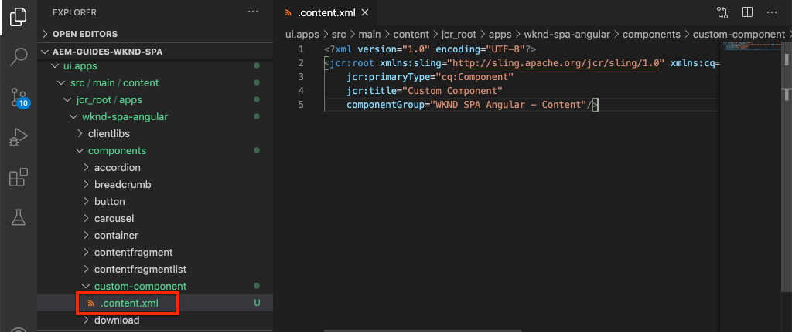

# カスタムコンポーネントの作成{#custom-component}

AEM SPAエディタで使用するカスタムコンポーネントを作成する方法を学びます。 JSONモデルを拡張してカスタムコンポーネントに入力するための作成者ダイアログとSlingモデルの開発方法を学びます。

## 目的

1. AEMが提供するJSONモデルAPIを操作する際のSlingモデルの役割を理解します。
2. 新しいAEMコンポーネントダイアログを作成する方法を理解します。
3. SPAエディタのフレームワークと互換性のある&#x200B;**カスタム** AEMコンポーネントを作成する方法を説明します。

## 作成する内容

前の章では、SPAコンポーネントを開発し、それらを&#x200B;*既存の* AEMコアコンポーネントにマッピングすることに重点を置いていました。 この章では、*新しい* AEMコンポーネントを作成および拡張し、AEMが提供するJSONモデルを操作する方法に焦点を当てます。

単純な`Custom Component`は、新しい新しいAEMコンポーネントを作成するために必要な手順を説明しています。


## 前提条件

[ローカル開発環境](overview.md#local-dev-environment)の設定に必要なツールと手順を確認します。

### コードの取得

1. Gitを介して、このチュートリアルのスタートポイントをダウンロードします。

   ```shell
   $ git clone git@github.com:adobe/aem-guides-wknd-spa.git
   $ cd aem-guides-wknd-spa
   $ git checkout Angular/custom-component-start
   ```

2. Mavenを使用して、ローカルのAEMインスタンスにコードベースをデプロイします。

   ```shell
   $ mvn clean install -PautoInstallSinglePackage
   ```

   [AEM 6.x](overview.md#compatibility)を使用している場合は、`classic`プロファイルを追加します。

   ```shell
   $ mvn clean install -PautoInstallSinglePackage -Pclassic
   ```

3. 従来の[WKNDリファレンスサイト](https://github.com/adobe/aem-guides-wknd/releases/latest)用に完成したパッケージをインストールします。 [WKNDリファレンスサイト](https://github.com/adobe/aem-guides-wknd/releases/latest)から提供された画像は、WKND SPAで再利用されます。 パッケージは、[AEM Package Manager](http://localhost:4502/crx/packmgr/index.jsp)を使用してインストールできます。

   

終了したコードは、[GitHub](https://github.com/adobe/aem-guides-wknd-spa/tree/Angular/custom-component-solution)に常に表示できます。また、ブランチ`Angular/custom-component-solution`に切り替えて、コードをローカルでチェックアウトすることもできます。

## AEMコンポーネントの定義

AEMコンポーネントは、ノードとプロパティとして定義されます。 プロジェクトでは、これらのノードとプロパティは`ui.apps`モジュールでXMLファイルとして表されます。 次に、`ui.apps`モジュールでAEMコンポーネントを作成します。

>[!NOTE]
>
> AEMコンポーネントの[基本に関するクイックリフレッシャーが役立つ](https://docs.adobe.com/content/help/en/experience-manager-learn/getting-started-wknd-tutorial-develop/component-basics.html)場合があります。

1. 選択したIDEで`ui.apps`フォルダを開きます。
2. `ui.apps/src/main/content/jcr_root/apps/wknd-spa-angular/components`に移動し、`custom-component`という名前の新しいフォルダーを作成します。
3. `custom-component`フォルダーの下に`.content.xml`という名前の新しいファイルを作成します。 `custom-component/.content.xml`に次の値を入力します。

   ```xml
   <?xml version="1.0" encoding="UTF-8"?>
   <jcr:root xmlns:sling="http://sling.apache.org/jcr/sling/1.0" xmlns:cq="http://www.day.com/jcr/cq/1.0" xmlns:jcr="http://www.jcp.org/jcr/1.0"
       jcr:primaryType="cq:Component"
       jcr:title="Custom Component"
       componentGroup="WKND SPA Angular - Content"/>
   ```

   

   `jcr:primaryType="cq:Component"`  — このノードがAEMコンポーネントであることを示します。

   `jcr:title` は、コンテンツ作成者に表示される値です。この値によって、オーサリングUIでのコンポーネントのグループが `componentGroup` 決まります。

4. `custom-component`フォルダーの下に、`_cq_dialog`という名前の別のフォルダーを作成します。
5. `_cq_dialog`フォルダーの下に、`.content.xml`という名前の新しいファイルを作成し、次の情報を入力します。

   ```xml
   <?xml version="1.0" encoding="UTF-8"?>
   <jcr:root xmlns:sling="http://sling.apache.org/jcr/sling/1.0" xmlns:granite="http://www.adobe.com/jcr/granite/1.0" xmlns:cq="http://www.day.com/jcr/cq/1.0" xmlns:jcr="http://www.jcp.org/jcr/1.0" xmlns:nt="http://www.jcp.org/jcr/nt/1.0"
       jcr:primaryType="nt:unstructured"
       jcr:title="Custom Component"
       sling:resourceType="cq/gui/components/authoring/dialog">
       <content
           jcr:primaryType="nt:unstructured"
           sling:resourceType="granite/ui/components/coral/foundation/container">
           <items jcr:primaryType="nt:unstructured">
               <tabs
                   jcr:primaryType="nt:unstructured"
                   sling:resourceType="granite/ui/components/coral/foundation/tabs"
                   maximized="{Boolean}true">
                   <items jcr:primaryType="nt:unstructured">
                       <properties
                           jcr:primaryType="nt:unstructured"
                           jcr:title="Properties"
                           sling:resourceType="granite/ui/components/coral/foundation/container"
                           margin="{Boolean}true">
                           <items jcr:primaryType="nt:unstructured">
                               <columns
                                   jcr:primaryType="nt:unstructured"
                                   sling:resourceType="granite/ui/components/coral/foundation/fixedcolumns"
                                   margin="{Boolean}true">
                                   <items jcr:primaryType="nt:unstructured">
                                       <column
                                           jcr:primaryType="nt:unstructured"
                                           sling:resourceType="granite/ui/components/coral/foundation/container">
                                           <items jcr:primaryType="nt:unstructured">
                                               <message
                                                   jcr:primaryType="nt:unstructured"
                                                   sling:resourceType="granite/ui/components/coral/foundation/form/textfield"
                                                   fieldDescription="The text to display on the component."
                                                   fieldLabel="Message"
                                                   name="./message"/>
                                           </items>
                                       </column>
                                   </items>
                               </columns>
                           </items>
                       </properties>
                   </items>
               </tabs>
           </items>
       </content>
   </jcr:root>
   ```

   

   上記のXMLファイルは、`Custom Component`のための非常に単純なダイアログを生成します。 ファイルの重要な部分は、内部の`<message>`ノードです。 このダイアログには`Message`という名前の単純な`textfield`が含まれ、textfieldの値は`message`という名前のプロパティに保持されます。

   `message`プロパティの値をJSONモデルを介して公開するために、次にSlingモデルが作成されます。

   >[!NOTE]
   >
   > コアコンポーネントの定義](https://github.com/adobe/aem-core-wcm-components/tree/master/content/src/content/jcr_root/apps/core/wcm/components)を参照すると、[ダイアログの例を表示できます。 `select`、`textarea`、`pathfield`など、[CRXDE-Lite](http://localhost:4502/crx/de/index.jsp#/libs/granite/ui/components/coral/foundation/form)の`/libs/granite/ui/components/coral/foundation/form`の下で利用できる追加のフォームフィールドを表示することもできます。

   従来のAEMコンポーネントでは、通常、[HTL](https://docs.adobe.com/content/help/ja-JP/experience-manager-htl/using/overview.html)スクリプトが必要です。 SPAはコンポーネントをレンダリングするので、HTLスクリプトは不要です。

## Slingモデルの作成

Slingモデルは、JCRからJava変数へのデータのマッピングを容易にする注釈駆動のJava 「POJO」(Plain Old Java Objects)です。 [Sling](https://docs.adobe.com/content/help/en/experience-manager-learn/getting-started-wknd-tutorial-develop/component-basics.html#sling-models)  Modelsticは通常、AEMコンポーネント用の複雑なサーバー側のビジネスロジックをカプセル化するために機能します。

SPAエディターのコンテキストでは、Slingモデルは、[Slingモデルエクスポーター](https://docs.adobe.com/content/help/ja-JP/experience-manager-learn/foundation/development/develop-sling-model-exporter.html)を使用する機能を使用して、JSONモデルを介してコンポーネントのコンテンツを公開します。

1. 選択したIDEで`core`モジュールを開きます。 `CustomComponent.java` チャプタ `CustomComponentImpl.java` ースターターコードの一部として、既に作成され、スタブアウトされています。

   >[!NOTE]
   >
   > Visual StudioコードIDEを使用している場合は、Java](https://code.visualstudio.com/docs/java/extensions)用の[拡張機能をインストールすると便利です。

2. `core/src/main/java/com/adobe/aem/guides/wknd/spa/angular/core/models/CustomComponent.java`にあるJavaインターフェイス`CustomComponent.java`を開きます。

   

   これは、Slingモデルによって実装されるJavaインターフェイスです。

3. `CustomComponent.java`を更新して`ComponentExporter`インターフェイスを拡張します。

   ```java
   package com.adobe.aem.guides.wknd.spa.angular.core.models;
   import com.adobe.cq.export.json.ComponentExporter;
   
   public interface CustomComponent extends ComponentExporter {
   
       public String getMessage();
   
   }
   ```

   `ComponentExporter`インターフェイスの実装は、SlingモデルがJSONモデルAPIによって自動的に取得される必要があります。

   `CustomComponent`インターフェイスは、単一のgetterメソッド`getMessage()`を含む。 これは、JSONモデルを介して作成者ダイアログの値を公開するメソッドです。 空のパラメーター`()`を持つgetterメソッドのみがJSONモデルにエクスポートされます。

4. `CustomComponentImpl.java`を`core/src/main/java/com/adobe/aem/guides/wknd/spa/angular/core/models/impl/CustomComponentImpl.java`で開きます。

   これは`CustomComponent`インターフェイスの実装です。 `@Model`注釈は、JavaクラスをSlingモデルとして識別します。 `@Exporter`注釈を使用すると、Javaクラスをシリアライズし、Slingモデルエクスポーターを通じてエクスポートできます。

5. 静的変数`RESOURCE_TYPE`を更新して、前の演習で作成したAEMコンポーネント`wknd-spa-angular/components/custom-component`を指すようにします。

   ```java
   static final String RESOURCE_TYPE = "wknd-spa-angular/components/custom-component";
   ```

   コンポーネントのリソースタイプは、SlingモデルをAEMコンポーネントにバインドし、最終的にAngularコンポーネントにマップされます。

6. コ追加ンポーネントリソースタイプを返す`CustomComponentImpl`クラスに対する`getExportedType()`メソッド：

   ```java
   @Override
   public String getExportedType() {
       return CustomComponentImpl.RESOURCE_TYPE;
   }
   ```

   このメソッドは、`ComponentExporter`インターフェイスを実装する際に必要で、Angularコンポーネントへのマッピングを可能にするリソースタイプを公開します。

7. 作成者ダイアログで保持される`message`プロパティの値を返すように`getMessage()`メソッドを更新します。 `@ValueMap`注釈を使用して、JCR値`message`をJava変数にマップします。

   ```java
   import org.apache.commons.lang3.StringUtils;
   ...
   
   @ValueMapValue
   private String message;
   
   @Override
   public String getMessage() {
       return StringUtils.isNotBlank(message) ? message.toUpperCase() : null;
   }
   ```

   メッセージの値を大文字で返すために、「ビジネスロジック」がいくつか追加されました。 これにより、作成者ダイアログに保存された生の値とSlingモデルによって公開された値との違いを確認できます。

   >[!NOTE]
   >
   > [完了したCustomComponentImpl.javaをここ](https://github.com/adobe/aem-guides-wknd-spa/blob/Angular/custom-component-solution/core/src/main/java/com/adobe/aem/guides/wknd/spa/angular/core/models/impl/CustomComponentImpl.java)で表示できます。

## 角度コンポーネントを更新する

カスタムコンポーネントの角度コードは既に作成されています。 次に、AngularコンポーネントをAEMコンポーネントにマップするために、いくつかの更新を行います。

1. `ui.frontend`モジュールで`ui.frontend/src/app/components/custom/custom.component.ts`ファイルを開きます
2. `@Input() message: string;`の行を確認します。 変換後の大文字の値は、この変数にマップされることが期待されます。
3. AEM SPA Editor JS SDKから`MapTo`オブジェクトを読み込み、それを使用してAEMコンポーネントにマッピングします。

   ```diff
   + import {MapTo} from '@adobe/cq-angular-editable-components';
   
    ...
    export class CustomComponent implements OnInit {
        ...
    }
   
   + MapTo('wknd-spa-angular/components/custom-component')(CustomComponent, CustomEditConfig);
   ```

4. `cutom.component.html`を開き、`{{message}}`の値が`<h2>`タグの横に表示されることを確認します。
5. `custom.component.css`を開き、次のルールを追加します。

   ```css
   :host-context {
       display: block;
   }
   ```

   コンポーネントが空の場合にAEMエディタのプレースホルダを正しく表示するには、`:host-context`または別の`<div>`を`display: block;`に設定する必要があります。

6. Mavenのスキルを使用して、すべての更新をプロジェクト環境のルートからローカルAEMディレクトリに展開します。

   ```shell
   $ cd aem-guides-wknd-spa
   $ mvn clean install -PautoInstallSinglePackage
   ```

## テンプレートポリシーの更新

次に、AEMに移動してアップデートを確認し、`Custom Component`をSPAに追加できるようにします。

1. [http://localhost:4502/system/console/status-slingmodels](http://localhost:4502/system/console/status-slingmodels)に移動して、新しいSlingモデルの登録を確認します。

   ```plain
   com.adobe.aem.guides.wknd.spa.angular.core.models.impl.CustomComponentImpl - wknd-spa-angular/components/custom-component
   
   com.adobe.aem.guides.wknd.spa.angular.core.models.impl.CustomComponentImpl exports 'wknd-spa-angular/components/custom-component' with selector 'model' and extension '[Ljava.lang.String;@6fb4a693' with exporter 'jackson'
   ```

   上記の2行は、`CustomComponentImpl`が`wknd-spa-angular/components/custom-component`コンポーネントに関連付けられ、Slingモデルエクスポータを介して登録されていることを示しています。

2. [http://localhost:4502/editor.html/conf/wknd-spa-angular/settings/wcm/templates/spa-page-template/structure.html](http://localhost:4502/editor.html/conf/wknd-spa-angular/settings/wcm/templates/spa-page-template/structure.html)にあるSPAページテンプレートに移動します。
3. レイアウトコンテナのポリシーを更新し、新しい`Custom Component`を許可されたコンポーネントとして追加します。

   

   ポリシーに対する変更を保存し、`Custom Component`を許可されたコンポーネントとして確認します。

   

## カスタムコンポーネントの作成

次に、AEM SPAエディタを使用して`Custom Component`を作成します。

1. [http://localhost:4502/editor.html/content/wknd-spa-angular/us/en/home.html](http://localhost:4502/editor.html/content/wknd-spa-angular/us/en/home.html)に移動します。
2. `Edit`モードで、`Custom Component`を`Layout Container`に追加します。

   

3. コンポーネントのダイアログを開き、一部の小文字を含むメッセージを入力します。

   

   これは、前の章でXMLファイルに基づいて作成されたダイアログです。

4. 変更内容を保存します。表示されるメッセージは、すべて大文字で表示されていることを確認してください。

   

5. [http://localhost:4502/content/wknd-spa-angular/us/en.model.json](http://localhost:4502/content/wknd-spa-angular/us/en.model.json)に移動してJSONモデルを表示します。 `wknd-spa-angular/components/custom-component`を検索：

   ```json
   "custom_component_208183317": {
       "message": "HELLO WORLD",
       ":type": "wknd-spa-angular/components/custom-component"
   }
   ```

   JSON値は、Slingモデルに追加されたロジックに基づいて、すべての大文字に設定されます。

## バリデーターが{#congratulations}

おめでとうございます。カスタムAEMコンポーネントの作成方法と、SlingモデルとダイアログがJSONモデルと連携する方法を学びました。

終了したコードは、[GitHub](https://github.com/adobe/aem-guides-wknd-spa/tree/Angular/custom-component-solution)に常に表示できます。また、ブランチ`Angular/custom-component-solution`に切り替えて、コードをローカルでチェックアウトすることもできます。

### 次の手順 {#next-steps}

[コアコンポーネントの拡張](extend-component.md) - AEM SPAエディタで使用する既存のコアコンポーネントを拡張する方法を学びます。既存のコンポーネントにプロパティやコンテンツを追加する方法を理解することは、AEM SPA Editorの実装機能を拡張する強力なテクニックです。
