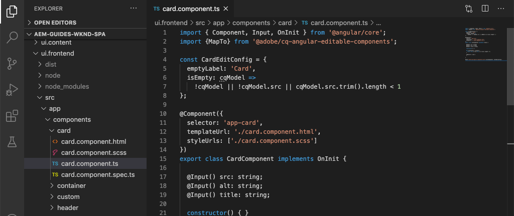
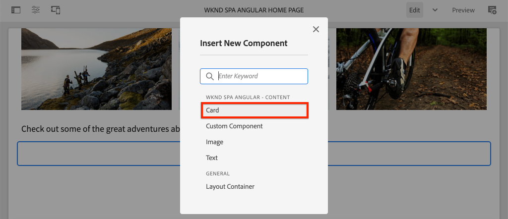

# コアコンポーネントの拡張{#extend-component}

既存のコアコンポーネントを拡張してAEM SPA Editorで使用する方法を説明します。 既存のコンポーネントの拡張方法を理解することは、AEM SPA Editor実装の機能をカスタマイズおよび拡張する強力な手法です。

## 目的

1. 追加のプロパティとコンテンツを使用して、既存のコアコンポーネントを拡張します。
2. `sling:resourceSuperType`を使用して、コンポーネントの継承の基本を理解します。
3. Slingモデルの[委任パターン](https://github.com/adobe/aem-core-wcm-components/wiki/Delegation-Pattern-for-Sling-Models)を活用して、既存のロジックと機能を再利用する方法を説明します。

## 作成する内容

この章では、新しい`Card`コンポーネントが作成されます。 `Card`コンポーネントは、[画像コアコンポーネント](https://docs.adobe.com/content/help/ja/experience-manager-core-components/using/components/image.html)を拡張し、「タイトル」や「アクションの呼び出し」ボタンなどの追加のコンテンツフィールドを追加して、SPA内の他のコンテンツに対してティーザーの役割を実行します。


>[!NOTE]
>
> 実際の実装では、単に[ティーザーコンポーネント](https://docs.adobe.com/content/help/ja/experience-manager-core-components/using/components/teaser.html)を使用し、次に[画像コアコンポーネント](https://docs.adobe.com/content/help/en/experience-manager-core-components/using/components/image.html)を拡張して`Card`コンポーネントをプロジェクト要件に応じて作成する方が適しています。 可能な場合は、[コアコンポーネント](https://docs.adobe.com/content/help/ja/experience-manager-core-components/using/introduction.html)を直接使用することを常にお勧めします。

## 前提条件

[ローカル開発環境](overview.md#local-dev-environment)の設定に必要なツールと手順を確認します。

### コードの取得

1. このチュートリアルの開始点をGitからダウンロードします。

   ```shell
   $ git clone git@github.com:adobe/aem-guides-wknd-spa.git
   $ cd aem-guides-wknd-spa
   $ git checkout Angular/extend-component-start
   ```

2. Mavenを使用して、コードベースをローカルのAEMインスタンスにデプロイします。

   ```shell
   $ mvn clean install -PautoInstallSinglePackage
   ```

   [AEM 6.x](overview.md#compatibility)を使用する場合は、`classic`プロファイルを追加します。

   ```shell
   $ mvn clean install -PautoInstallSinglePackage -Pclassic
   ```

3. 従来の[WKNDリファレンスサイト](https://github.com/adobe/aem-guides-wknd/releases/latest)用に完成したパッケージをインストールします。 [WKND参照サイト](https://github.com/adobe/aem-guides-wknd/releases/latest)から提供された画像は、WKND SPAで再利用されます。 パッケージは、[AEM Package Manager](http://localhost:4502/crx/packmgr/index.jsp)を使用してインストールできます。

   

[GitHub](https://github.com/adobe/aem-guides-wknd-spa/tree/Angular/extend-component-solution)で完成したコードをいつでも表示したり、ブランチ`Angular/extend-component-solution`に切り替えてコードをローカルでチェックアウトしたりできます。

## Inspectの初期カード実装

チャプタースターターコードによって、初期カードコンポーネントが提供されました。 Inspectカード実装の出発点。

1. 任意のIDEで、`ui.apps`モジュールを開きます。
2. `ui.apps/src/main/content/jcr_root/apps/wknd-spa-angular/components/card`に移動し、`.content.xml`ファイルを表示します。

   

   ```xml
   <?xml version="1.0" encoding="UTF-8"?>
   <jcr:root xmlns:sling="http://sling.apache.org/jcr/sling/1.0" xmlns:cq="http://www.day.com/jcr/cq/1.0" xmlns:jcr="http://www.jcp.org/jcr/1.0"
       jcr:primaryType="cq:Component"
       jcr:title="Card"
       sling:resourceSuperType="wknd-spa-angular/components/image"
       componentGroup="WKND SPA Angular - Content"/>
   ```

   プロパティ`sling:resourceSuperType`が`wknd-spa-angular/components/image`を指し、`Card`コンポーネントがWKND SPA Imageコンポーネントからすべての機能を継承することを示します。

3. `ui.apps/src/main/content/jcr_root/apps/wknd-spa-angular/components/image/.content.xml` ファイルを検査します。

   ```xml
   <?xml version="1.0" encoding="UTF-8"?>
   <jcr:root xmlns:sling="http://sling.apache.org/jcr/sling/1.0" xmlns:cq="http://www.day.com/jcr/cq/1.0" xmlns:jcr="http://www.jcp.org/jcr/1.0"
       jcr:primaryType="cq:Component"
       jcr:title="Image"
       sling:resourceSuperType="core/wcm/components/image/v2/image"
       componentGroup="WKND SPA Angular - Content"/>
   ```

   `sling:resourceSuperType`が`core/wcm/components/image/v2/image`を指していることに注意してください。 これは、WKND SPA画像コンポーネントがコアコンポーネントの画像からすべての機能を継承していることを示しています。

   [プロキシパターン](https://docs.adobe.com/content/help/en/experience-manager-core-components/using/developing/guidelines.html#proxy-component-pattern)とも呼ばれます。Slingリソースの継承は、子コンポーネントが機能を継承し、必要に応じて動作を拡張/上書きできる強力なデザインパターンです。 Slingの継承は複数レベルの継承をサポートするので、最終的に、新しい`Card`コンポーネントはコアコンポーネント画像の機能を継承します。

   多くの開発チームは、DRY(D.R.Y.)になるよう努めています（自分で繰り返さないでください）。 Slingの継承により、AEMでこれを実現できます。

4. `card`フォルダーの下で、`_cq_dialog/.content.xml`ファイルを開きます。

   このファイルは、`Card`コンポーネントのコンポーネントダイアログ定義です。 Slingの継承を使用する場合、[Sling Resource Merger](https://docs.adobe.com/content/help/en/experience-manager-65/developing/platform/sling-resource-merger.html)の機能を使用して、ダイアログの一部を上書きまたは拡張できます。 このサンプルでは、作成者から追加データを取り込み、カードコンポーネントに入力するための新しいタブがダイアログに追加されています。

   `sling:orderBefore`などのプロパティを使用すると、開発者は新しいタブやフォームフィールドを挿入する場所を選択できます。 この場合、`Text`タブは`asset`タブの前に挿入されます。 Sling Resource Mergerを最大限に活用するには、[画像コンポーネントダイアログ](https://github.com/adobe/aem-core-wcm-components/blob/master/content/src/content/jcr_root/apps/core/wcm/components/image/v2/image/_cq_dialog/.content.xml)の元のダイアログノード構造を知ることが重要です。

5. `card`フォルダーの下で、`_cq_editConfig.xml`ファイルを開きます。 このファイルは、AEMオーサリングUIでのドラッグ&amp;ドロップ動作を指示します。 画像コンポーネントを拡張する場合、リソースタイプがコンポーネント自体に一致することが重要です。 `<parameters>`ノードを確認します。

   ```xml
   <parameters
       jcr:primaryType="nt:unstructured"
       sling:resourceType="wknd-spa-angular/components/card"
       imageCrop=""
       imageMap=""
       imageRotate=""/>
   ```

   ほとんどのコンポーネントには`cq:editConfig`は必要ありません。画像コンポーネントとその子コンポーネントは例外です。

6. IDEスイッチで`ui.frontend`モジュールに移動し、`ui.frontend/src/app/components/card`に移動します。

   

7. `card.component.ts` ファイルを検査します。

   標準の`MapTo`関数を使用してAEM `Card`コンポーネントにマッピングするために、コンポーネントは既にスタブ化されています。

   ```js
   MapTo('wknd-spa-angular/components/card')(CardComponent, CardEditConfig);
   ```

   `src`、`alt`、`title`の3つの`@Input`パラメーターを確認します。 これらは、AngularコンポーネントにマッピングされるAEMコンポーネントの期待されるJSON値です。

8. ファイル`card.component.html`を開きます。

   ```html
   <div class="card"  *ngIf="hasContent">
       <app-image class="card__image" [src]="src" [alt]="alt" [title]="title"></app-image>
   </div>
   ```

   この例では、`card.component.ts`から`@Input`パラメーターを渡すだけで、既存のAngular画像コンポーネント`app-image`を再利用することを選択しました。 チュートリアルの後半で、追加のプロパティが追加され、表示されます。

## テンプレートポリシーの更新

この最初の`Card`実装で、AEM SPA Editorで機能を確認します。 初期の`Card`コンポーネントを確認するには、テンプレートポリシーを更新する必要があります。

1. スターターコードをAEMのローカルインスタンスにデプロイします（まだデプロイしていない場合）。

   ```shell
   $ cd aem-guides-wknd-spa
   $ mvn clean install -PautoInstallSinglePackage
   ```

2. [http://localhost:4502/editor.html/conf/wknd-spa-angular/settings/wcm/templates/spa-page-template/structure.html](http://localhost:4502/editor.html/conf/wknd-spa-angular/settings/wcm/templates/spa-page-template/structure.html)にあるSPAページテンプレートに移動します。
3. レイアウトコンテナのポリシーを更新し、新しい`Card`コンポーネントを許可されたコンポーネントとして追加します。

   

   ポリシーに対する変更を保存し、`Card`コンポーネントを許可されたコンポーネントとして監視します。

   

## オーサーの初期カードコンポーネント

次に、AEM SPA Editorを使用して`Card`コンポーネントを作成します。

1. [http://localhost:4502/editor.html/content/wknd-spa-angular/us/en/home.html](http://localhost:4502/editor.html/content/wknd-spa-angular/us/en/home.html)に移動します。
2. `Edit`モードで、`Card`コンポーネントを`Layout Container`に追加します。

   

3. アセットファインダーから`Card`コンポーネントに画像をドラッグ&amp;ドロップします。

   

4. `Card`コンポーネントダイアログを開き、「**テキスト**」タブが追加されていることを確認します。
5. 「**テキスト**」タブで次の値を入力します。

   

   **カードのパス**  - SPAホームページの下でページを選択します。

   **CTAテキスト** - 「詳細を表示」

   **カードタイトル**  — 空白のままにします。

   **リンクされたページからタイトルを取得する**  - trueを示すチェックボックスをオンにします。

6. **「アセットのメタデータ**」タブを更新して、**代替テキスト**&#x200B;と&#x200B;**キャプション**&#x200B;の値を追加します。

   現在、ダイアログの更新後に追加の変更は表示されません。 新しいフィールドをAngularコンポーネントに公開するには、`Card`コンポーネントのSling Modelを更新する必要があります。

7. 新しいタブを開き、[CRXDE-Lite](http://localhost:4502/crx/de/index.jsp#/content/wknd-spa-angular/us/en/home/jcr%3Acontent/root/responsivegrid/card)に移動します。 `/content/wknd-spa-angular/us/en/home/jcr:content/root/responsivegrid`の下のコンテンツノードをInspectして、`Card`コンポーネントのコンテンツを見つけます。

   

   プロパティ`cardPath`、`ctaText`、`titleFromPage`がダイアログで保持されることを確認します。

## カードSlingモデルの更新

最終的に、コンポーネントダイアログの値をAngularコンポーネントに公開するには、`Card`コンポーネントのJSONを入力するSling Modelを更新する必要があります。 また、次の2つのビジネスロジックを実装する機会もあります。

* `titleFromPage`から&#x200B;**true**&#x200B;の場合、`cardPath`で指定されたページのタイトルを返します。それ以外の場合は、`cardTitle`テキストフィールドの値を返します。
* `cardPath`で指定されたページの最終変更日を返します。

目的のIDEに戻り、`core`モジュールを開きます。

1. `Card.java`（`core/src/main/java/com/adobe/aem/guides/wknd/spa/angular/core/models/Card.java`）ファイルを開きます。

   `Card`インターフェイスが現在`com.adobe.cq.wcm.core.components.models.Image`を拡張しているので、`Image`インターフェイスのすべてのメソッドを継承していることを確認します。 `Image`インターフェイスは、既に`ComponentExporter`インターフェイスを拡張しています。このインターフェイスを使用して、Sling ModelをJSONとして書き出し、SPAエディターでマッピングできます。 したがって、[カスタムコンポーネントの章](custom-component.md)で行ったように、`ComponentExporter`インターフェイスを明示的に拡張する必要はありません。

2. インターフェイスに次のメソッドを追加します。

   ```java
   @ProviderType
   public interface Card extends Image {
   
       /***
       * The URL to populate the CTA button as part of the card.
       * The link should be based on the cardPath property that points to a page.
       * @return String URL
       */
       public String getCtaLinkURL();
   
       /***
       * The text to display on the CTA button of the card.
       * @return String CTA text
       */
       public String getCtaText();
   
   
   
       /***
       * The date to be displayed as part of the card.
       * This is based on the last modified date of the page specified by the cardPath
       * @return
       */
       public Calendar getCardLastModified();
   
   
       /**
       * Return the title of the page specified by cardPath if `titleFromPage` is set to true.
       * Otherwise return the value of `cardTitle`
       * @return
       */
       public String getCardTitle();
   }
   ```

   これらのメソッドは、JSONモデルAPIを介して公開され、Angularコンポーネントに渡されます。

3. `CardImpl.java` を開きます。これは`Card.java`インターフェイスの実装です。 この実装は、チュートリアルを高速化するために、既に部分的にスタブ化されています。  `@Model`および`@Exporter`注釈を使用して、Sling Model Exporterを介してSling ModelをJSONとしてシリアル化できることに注意してください。

   `CardImpl.java` また、はSling Modelの委 [任パターンを使用し](https://github.com/adobe/aem-core-wcm-components/wiki/Delegation-Pattern-for-Sling-Models) て、画像コアコンポーネントからすべてのロジックが書き換えられないようにします。

4. 次の行を確認します。

   ```java
   @Self
   @Via(type = ResourceSuperType.class)
   private Image image;
   ```

   上記の注釈は、`Card`コンポーネントの`sling:resourceSuperType`継承に基づいて、`image`という名前の画像オブジェクトをインスタンス化します。

   ```java
   @Override
   public String getSrc() {
       return null != image ? image.getSrc() : null;
   }
   ```

   その後、`image`オブジェクトを使用するだけで、ロジックを自分で書く必要なく、`Image`インターフェイスで定義されたメソッドを実装できます。 この手法は、`getSrc()`、`getAlt()`および`getTitle()`に使用されます。

5. 次に、 `initModel()`メソッドを実装して、`cardPath`の値に基づいてプライベート変数`cardPage`を開始します

   ```java
   @PostConstruct
   public void initModel() {
       if(StringUtils.isNotBlank(cardPath) && pageManager != null) {
           cardPage = pageManager.getPage(this.cardPath);
       }
   }
   ```

   `@PostConstruct initModel()`は、Sling Modelの初期化時に常に呼び出されるので、モデル内の他のメソッドで使用できるオブジェクトを初期化する良い機会です。 `pageManager`は、`@ScriptVariable`注釈を介してSling Modelで使用可能になる、多数の[Javaベースのグローバルオブジェクト](https://docs.adobe.com/content/help/en/experience-manager-htl/using/htl/global-objects.html#java-backed-objects)の1つです。 [getPage](https://docs.adobe.com/content/help/en/experience-manager-cloud-service/implementing/developing/ref/javadoc/com/day/cq/wcm/api/PageManager.html#getPage-java.lang.String-)メソッドはパスを受け取り、AEM [Page](https://docs.adobe.com/content/help/en/experience-manager-cloud-service/implementing/developing/ref/javadoc/com/day/cq/wcm/api/Page.html)オブジェクトを返します。パスが有効なページを指していない場合はnullを返します。

   これにより、`cardPage`変数が初期化されます。この変数は、基になるリンクされたページに関するデータを返すために、他の新しいメソッドで使用されます。

6. オーサーダイアログを保存したJCRプロパティに既にマッピングされているグローバル変数を確認します。 `@ValueMapValue`注釈は、マッピングを自動的に実行するために使用されます。

   ```java
   @ValueMapValue
   private String cardPath;
   
   @ValueMapValue
   private String ctaText;
   
   @ValueMapValue
   private boolean titleFromPage;
   
   @ValueMapValue
   private String cardTitle;
   ```

   これらの変数は、`Card.java`インターフェイス用の追加のメソッドを実装するために使用されます。

7. `Card.java`インターフェイスで定義された追加のメソッドを実装します。

   ```java
   @Override
   public String getCtaLinkURL() {
       if(cardPage != null) {
           return cardPage.getPath() + ".html";
       }
       return null;
   }
   
   @Override
   public String getCtaText() {
       return ctaText;
   }
   
   @Override
   public Calendar getCardLastModified() {
      if(cardPage != null) {
          return cardPage.getLastModified();
      }
      return null;
   }
   
   @Override
   public String getCardTitle() {
       if(titleFromPage) {
           return cardPage != null ? cardPage.getTitle() : null;
       }
       return cardTitle;
   }
   ```

   >[!NOTE]
   >
   > [完成したCardImpl.javaは、](https://github.com/adobe/aem-guides-wknd-spa/blob/Angular/extend-component-solution/core/src/main/java/com/adobe/aem/guides/wknd/spa/angular/core/models/impl/CardImpl.java)で確認できます。

8. ターミナルウィンドウを開き、`core`ディレクトリのMaven `autoInstallBundle`プロファイルを使用して、`core`モジュールの更新のみをデプロイします。

   ```shell
   $ cd core/
   $ mvn clean install -PautoInstallBundle
   ```

   [AEM 6.x](overview.md#compatibility)を使用する場合は、`classic`プロファイルを追加します。

9. JSONモデルの応答を次の場所に表示します。[http://localhost:4502/content/wknd-spa-angular/us/en.model.json](http://localhost:4502/content/wknd-spa-angular/us/en.model.json)を探し、`wknd-spa-angular/components/card`を探します。

   ```json
   "card": {
       "ctaText": "Read More",
       "cardTitle": "Page 1",
       "title": "Woman chillaxing with river views in Australian bushland",
       "src": "/content/wknd-spa-angular/us/en/home/_jcr_content/root/responsivegrid/card.coreimg.jpeg/1595190732886/adobestock-216674449.jpeg",
       "alt": "Female sitting on a large rock relaxing in afternoon dappled light the Australian bushland with views over the river",
       "cardLastModified": 1591360492414,
       "ctaLinkURL": "/content/wknd-spa-angular/us/en/home/page-1.html",
       ":type": "wknd-spa-angular/components/card"
   }
   ```

   `CardImpl` Sling Modelのメソッドを更新すると、JSONモデルが更新され、追加のキーと値のペアが追加されます。

## angularコンポーネントの更新

これで、JSONモデルに`ctaLinkURL`、`ctaText`、`cardTitle`および`cardLastModified`の新しいプロパティが入力され、Angularコンポーネントを更新して表示できます。

1. IDEに戻り、`ui.frontend`モジュールを開きます。 必要に応じて、新しいターミナルウィンドウからwebpack開発サーバーを起動して、変更をリアルタイムで確認します。

   ```shell
   $ cd ui.frontend
   $ npm install
   $ npm start
   ```

2. `ui.frontend/src/app/components/card/card.component.ts`で`card.component.ts`を開きます。 追加の`@Input`注釈を追加して、新しいモデルをキャプチャします。

   ```diff
   export class CardComponent implements OnInit {
   
        @Input() src: string;
        @Input() alt: string;
        @Input() title: string;
   +    @Input() cardTitle: string;
   +    @Input() cardLastModified: number;
   +    @Input() ctaLinkURL: string;
   +    @Input() ctaText: string;
   ```

3. コールトゥアクションの準備ができたかどうかを確認し、`cardLastModified`入力に基づいて日付/時間文字列を返すためのメソッドを追加します。

   ```js
   export class CardComponent implements OnInit {
       ...
       get hasCTA(): boolean {
           return this.ctaLinkURL && this.ctaLinkURL.trim().length > 0 && this.ctaText && this.ctaText.trim().length > 0;
       }
   
       get lastModifiedDate(): string {
           const lastModifiedDate = this.cardLastModified ? new Date(this.cardLastModified) : null;
   
           if (lastModifiedDate) {
           return lastModifiedDate.toLocaleDateString();
           }
           return null;
       }
       ...
   }
   ```

4. `card.component.html`を開き、次のマークアップを追加して、タイトル、コールトゥアクション、最終変更日を表示します。

   ```html
   <div class="card"  *ngIf="hasContent">
       <app-image class="card__image" [src]="src" [alt]="alt" [title]="title"></app-image>
       <div class="card__content">
           <h2 class="card__title">
               {{cardTitle}}
               <span class="card__lastmod" *ngIf="lastModifiedDate">{{lastModifiedDate}}</span>
           </h2>
           <div class="card__action-container" *ngIf="hasCTA">
               <a [routerLink]="ctaLinkURL" class="card__action-link" [title]="ctaText">
                   {{ctaText}}
               </a>
           </div>
       </div>
   </div>
   ```

   `card.component.scss`に、タイトルのスタイル設定、コールトゥアクション、最終変更日の設定を行うためのSassルールが既に追加されています。

   >[!NOTE]
   >
   > 完成した[Angularカードコンポーネントコードは、](https://github.com/adobe/aem-guides-wknd-spa/tree/Angular/extend-component-solution/ui.frontend/src/app/components/card)で確認できます。

5. Mavenを使用して、プロジェクトのルートからAEMに完全な変更をデプロイします。

   ```shell
   $ cd aem-guides-wknd-spa
   $ mvn clean install -PautoInstallSinglePackage
   ```

6. [http://localhost:4502/editor.html/content/wknd-spa-angular/us/en/home.html](http://localhost:4502/editor.html/content/wknd-spa-angular/us/en/home.html)に移動して、更新されたコンポーネントを確認します。

   

7. 既存のコンテンツを再オーサリングして、次のようなページを作成できるはずです。

   

## バリデーターが {#congratulations}

これで、を使用してAEMコンポーネントを拡張する方法と、SlingのモデルとダイアログがJSONモデルと連携する方法を学びました。

[GitHub](https://github.com/adobe/aem-guides-wknd-spa/tree/Angular/extend-component-solution)で完成したコードをいつでも表示したり、ブランチ`Angular/extend-component-solution`に切り替えてコードをローカルでチェックアウトしたりできます。
