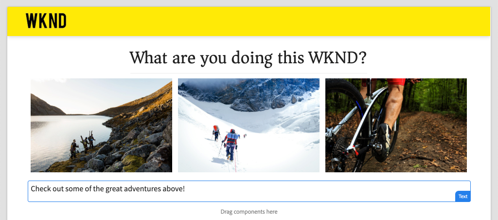

# SPAコンポーネントをAEMコンポーネントにマップ{#map-components}

AEM SPA Editor JS SDKを使用して、AngularコンポーネントをAdobe Experience Manager(AEM)コンポーネントにマッピングする方法について説明します。 コンポーネントマッピングを使用すると、従来のAEMオーサリングと同様、AEM SPAエディタ内でSPAコンポーネントを動的に更新できます。

この章では、AEM JSONモデルAPIについて詳しく説明し、AEMコンポーネントによって公開されたJSONコンテンツを、propとしてAngularコンポーネントに自動的に挿入する方法について説明します。

## 目的

1. AEMコンポーネントをSPAコンポーネントにマップする方法を学びます。
2. **コンテナ**&#x200B;コンポーネントと&#x200B;**コンテンツ**&#x200B;コンポーネントの違いを理解します。
3. 既存のAEMコンポーネントにマップする新しいAngularコンポーネントを作成します。

## 作成する内容

この章では、提供された`Text` SPAコンポーネントがAEM `Text`コンポーネントにどのようにマッピングされるかを調べます。 新しい`Image` SPAコンポーネントが作成され、SPAで使用してAEMで作成できます。 **レイアウトコンテナ**&#x200B;および&#x200B;**テンプレートエディター**&#x200B;ポリシーの初期設定の機能は、外観が少し変化する表示の作成にも使用されます。



## 前提条件

[ローカル開発環境](overview.md#local-dev-environment)の設定に必要なツールと手順を確認します。

### コードの取得

1. Gitを介して、このチュートリアルのスタートポイントをダウンロードします。

   ```shell
   $ git clone git@github.com:adobe/aem-guides-wknd-spa.git
   $ cd aem-guides-wknd-spa
   $ git checkout Angular/map-components-start
   ```

2. Mavenを使用して、ローカルのAEMインスタンスにコードベースをデプロイします。

   ```shell
   $ mvn clean install -PautoInstallSinglePackage
   ```

   [AEM 6.x](overview.md#compatibility)を使用している場合は、`classic`プロファイルを追加します。

   ```shell
   $ mvn clean install -PautoInstallSinglePackage -Pclassic
   ```

終了したコードは、[GitHub](https://github.com/adobe/aem-guides-wknd-spa/tree/Angular/map-components-solution)に常に表示できます。また、ブランチ`Angular/map-components-solution`に切り替えて、コードをローカルでチェックアウトすることもできます。

## マッピング手法

基本的な概念は、SPAコンポーネントをAEMコンポーネントにマップすることです。 AEMコンポーネントでは、サーバーサイドで実行し、JSONモデルAPIの一部としてコンテンツを書き出します。 JSONコンテンツは、ブラウザーでクライアント側を実行するSPAで使用されます。 SPAコンポーネントとAEMコンポーネント間の1:1マッピングが作成されます。


*AEMコンポーネントとAngularコンポーネントのマッピングの概要*

## テキストコンポーネントのInspect

[AEMプロジェクトのアーキタイプ](https://github.com/adobe/aem-project-archetype)には、AEM [テキストコンポーネント](https://docs.adobe.com/content/help/ja-JP/experience-manager-core-components/using/components/text.html)にマップされる`Text`コンポーネントが用意されています。 これは、AEMの&#x200B;**content**&#x200B;コンポーネントの例で、の&#x200B;*content*&#x200B;をレンダリングします。

コンポーネントの動作を見てみましょう。

### JSONモデルのInspect

1. SPAコードにジャンプする前に、AEMが提供するJSONモデルを理解することが重要です。 [コアコンポーネントライブラリ](https://www.aemcomponents.dev/content/core-components-examples/library/page-authoring/text.html)に移動し、テキストコンポーネントのページを表示します。 コアコンポーネントライブラリは、すべてのAEMコアコンポーネントの例を提供します。
2. 次のいずれかの例の&#x200B;**JSON**&#x200B;タブを選択します。

   

   次の3つのプロパティが表示されます。`text`、`richText`、`:type`。

   `:type` は、AEMコンポーネントの `sling:resourceType` （またはパス）をリストする予約済みのプロパティです。`:type`の値は、AEMコンポーネントをSPAコンポーネントにマップする際に使用する値です。

   `text` および `richText` は、SPAコンポーネントに公開される追加のプロパティです。

### テキストコンポーネントのInspect化

1. 新しいターミナルを開き、プロジェクト内の`ui.frontend`フォルダーに移動します。 `npm install`を実行し、`npm start`を実行して&#x200B;**webpack dev server**&#x200B;を開始します。

   ```shell
   $ cd ui.frontend
   $ npm run start:mock
   ```

   `ui.frontend`モジュールは現在、[mock JSONモデル](./integrate-spa.md#mock-json)を使用するように設定されています。

2. 新しいブラウザウィンドウが開いて[http://localhost:4200/content/wknd-spa-angular/us/en/home.html](http://localhost:4200/content/wknd-spa-angular/us/en/home.html)が開きます。

   

3. 選択したIDEで、WKND SPA用のAEMプロジェクトを開きます。 `ui.frontend`モジュールを展開し、`ui.frontend/src/app/components/text/text.component.ts`の下の&#x200B;**text.component.ts**&#x200B;を開きます。

   

4. 最初に調査する領域は、～行35の`class TextComponent`です。

   ```js
   export class TextComponent {
       @Input() richText: boolean;
       @Input() text: string;
       @Input() itemName: string;
   
       @HostBinding('innerHtml') get content() {
           return this.richText
           ? this.sanitizer.bypassSecurityTrustHtml(this.text)
           : this.text;
       }
       @HostBinding('attr.data-rte-editelement') editAttribute = true;
   
       constructor(private sanitizer: DomSanitizer) {}
   }
   ```

   [@Input()](https://angular.io/api/core/Input) decoratorは、マップされたJSONオブジェクトを介して値が設定されるフィールドを宣言する際に使用します。

   `@HostBinding('innerHtml') get content()` は、の値からオーサリング済みのテキストコンテンツを公開するメソッド `this.text`です。コンテンツがリッチテキストの場合（`this.richText`フラグで決定）、Angularの組み込みセキュリティは迂回されます。 Angularの[DomSanitizer](https://angular.io/api/platform-browser/DomSanitizer)は、生のHTMLを「スクラブ」し、クロスサイトスクリプティングの脆弱性を防ぐために使用されます。 このメソッドは、[@HostBinding](https://angular.io/api/core/HostBinding)デコレーターを使用して`innerHtml`プロパティにバインドされます。

5. 次に`TextEditConfig`を調べます。

   ```js
   const TextEditConfig = {
       emptyLabel: 'Text',
       isEmpty: cqModel =>
           !cqModel || !cqModel.text || cqModel.text.trim().length < 1
   };
   ```

   上記のコードは、AEM作成者環境でプレースホルダーをレンダリングするタイミングを決定する役割を持ちます。 `isEmpty`メソッドが&#x200B;**true**&#x200B;を返す場合は、プレースホルダーがレンダリングされます。

6. 最後に、～line 53の`MapTo`呼び出しを見てみましょう。

   ```js
   MapTo('wknd-spa-angular/components/text')(TextComponent, TextEditConfig );
   ```

   **AEM** SPAエディタJS SDK(`@adobe/cq-angular-editable-components`)で提供されるMapTois。パス`wknd-spa-angular/components/text`は、AEMコンポーネントの`sling:resourceType`を表します。 このパスは、前に確認したJSONモデルによって公開された`:type`と一致します。 **MapToparsesはJSONモデルの応答を解析し、正しい値をSPAコンポーネントの**  `@Input()` 変数に渡します。

   AEM `Text`コンポーネント定義は`ui.apps/src/main/content/jcr_root/apps/wknd-spa-angular/components/text`にあります。

7. `ui.frontend/src/mocks/json/en.model.json`の&#x200B;**en.model.json**&#x200B;ファイルを変更してテストします。

   ～line 62で、最初の`Text`値を更新して&#x200B;**`H1`**&#x200B;タグと&#x200B;**`u`**&#x200B;タグを使用します。

   ```json
       "text": {
           "text": "<h1><u>Hello World!</u></h1>",
           "richText": true,
           ":type": "wknd-spa-angular/components/text"
       }
   ```

   ブラウザに戻り、**webpack dev server**&#x200B;が提供する効果を確認します。

   

   `richText`プロパティを&#x200B;**true** / **false**&#x200B;の間で切り替えて、実行中のレンダリングロジックを確認してください。

8. Inspect **text.component.html** (`ui.frontend/src/app/components/text/text.component.html`)

   コンポーネントの内容全体が`innerHTML`プロパティによって設定されるので、このファイルは空です。

9. **app.module.ts**&#x200B;のInspect`ui.frontend/src/app/app.module.ts`

   ```js
   @NgModule({
   imports: [
       BrowserModule,
       SpaAngularEditableComponentsModule,
       AppRoutingModule
   ],
   providers: [ModelManagerService, { provide: APP_BASE_HREF, useValue: '/' }],
   declarations: [AppComponent, TextComponent, PageComponent, HeaderComponent],
   entryComponents: [TextComponent, PageComponent],
   bootstrap: [AppComponent]
   })
   export class AppModule {}
   ```

   **TextComponent**&#x200B;は明示的に含まれず、AEM SPAエディターJS SDKが提供する&#x200B;**AEMResponsiveGridComponent**&#x200B;を介して動的に含められます。 したがって、**app.module.ts**&#39; [entryComponents](https://angular.io/guide/entry-components)配列に指定する必要があります。

## 画像コンポーネントの作成

次に、AEM [Angularコンポーネント](https://docs.adobe.com/content/help/ja/experience-manager-core-components/using/components/image.html)にマップする`Image`イメージコンポーネントを作成します。 `Image`コンポーネントは、**content**&#x200B;コンポーネントの別の例です。

### InspectJSON

SPAコードにジャンプする前に、AEMが提供するJSONモデルを調べます。

1. コアコンポーネントライブラリ](https://www.aemcomponents.dev/content/core-components-examples/library/page-authoring/image.html)の[イメージサンプルに移動します。

   

   `src`、`alt`、および`title`のプロパティは、SPA `Image`コンポーネントの入力に使用されます。

   >[!NOTE]
   >
   > 開発者がアダプティブおよび遅延読み込みコンポーネントを作成できるように、公開されている他の画像プロパティ(`lazyEnabled`、`widths`)があります。 このチュートリアルで作成されるコンポーネントは単純で、****&#x200B;はこれらの高度なプロパティを使用しません。

2. IDEに戻り、`ui.frontend/src/mocks/json/en.model.json`の`en.model.json`を開きます。 これはプロジェクトの新しいコンポーネントなので、画像JSONを「モック」する必要があります。

   ～line 70で、`image`モデルのJSONエントリを追加し（2番目の`text_386303036`の後ろのカンマ`,`を忘れないでください）、`:itemsOrder`配列を更新します。

   ```json
   ...
   ":items": {
               ...
               "text_386303036": {
                   "text": "<p>A new text component.</p>\r\n",
                   "richText": true,
                   ":type": "wknd-spa-angular/components/text"
                   },
               "image": {
                   "alt": "Rock Climber in New Zealand",
                   "title": "Rock Climber in New Zealand",
                   "src": "/mocks/images/adobestock-140634652.jpeg",
                   ":type": "wknd-spa-angular/components/image"
               }
           },
           ":itemsOrder": [
               "text",
               "text_386303036",
               "image"
           ],
   ```

   このプロジェクトには、`/mock-content/adobestock-140634652.jpeg`webpack dev server **で使用するサンプルイメージが**&#x200B;に含まれています。

   [en.model.jsonの完全な表示はここ](https://github.com/adobe/aem-guides-wknd-spa/blob/Angular/map-components-solution/ui.frontend/src/mocks/json/en.model.json)で行うことができます。

3. コンポ追加ーネントが表示するストック写真。

   `ui.frontend/src/mocks`の下に&#x200B;**images**&#x200B;という名前の新しいフォルダーを作成します。 [adobestock-140634652.jpeg](assets/map-components/adobestock-140634652.jpeg)をダウンロードし、新しく作成した&#x200B;**images**&#x200B;フォルダーに配置します。 必要に応じて、自由に自分の画像を使用できます。

### 画像コンポーネントの実装

1. **webpack dev server**&#x200B;を起動した場合は停止します。
2. `ui.frontend`フォルダ内からAngularCLI `ng generate component`コマンドを実行して、新しいイメージコンポーネントを作成します。

   ```shell
   $ ng generate component components/image
   ```

3. IDEで、**image.component.ts**&#x200B;を`ui.frontend/src/app/components/image/image.component.ts`で開き、次のように更新します。

   ```js
   import {Component, Input, OnInit} from '@angular/core';
   import {MapTo} from '@adobe/cq-angular-editable-components';
   
   const ImageEditConfig = {
   emptyLabel: 'Image',
   isEmpty: cqModel =>
       !cqModel || !cqModel.src || cqModel.src.trim().length < 1
   };
   
   @Component({
   selector: 'app-image',
   templateUrl: './image.component.html',
   styleUrls: ['./image.component.scss']
   })
   export class ImageComponent implements OnInit {
   
   @Input() src: string;
   @Input() alt: string;
   @Input() title: string;
   
   constructor() { }
   
   get hasImage() {
       return this.src && this.src.trim().length > 0;
   }
   
   ngOnInit() { }
   }
   
   MapTo('wknd-spa-angular/components/image')(ImageComponent, ImageEditConfig);
   ```

   `ImageEditConfig` は、プ `src` ロパティが設定されているかどうかに基づいて、AEMで作成者プレースホルダーをレンダリングするかどうかを決定する設定です。

   `@Input()` の、 `src`およびはJSON APIからマッピングさ `alt` `title` れたプロパティです。

   `hasImage()` は、イメージをレンダリングする必要があるかどうかを決定するメソッドです。

   `MapTo` SPAコンポーネントをにあるAEMコンポーネントにマップし `ui.apps/src/main/content/jcr_root/apps/wknd-spa-angular/components/image`ます。

4. **image.component.html**&#x200B;を開き、次のように更新します。

   ```html
   <ng-container *ngIf="hasImage">
       
   </ng-container>
   ```

   `hasImage`が&#x200B;**true**&#x200B;を返すと、``要素がレンダリングされます。

5. **image.component.scss**&#x200B;を開き、次のように更新します。

   ```scss
   :host-context {
       display: block;
   }
   
   .image {
       margin: 1rem 0;
       width: 100%;
       border: 0;
   }
   ```

   >[!NOTE]
   >
   > AEM SPAエディタのプレースホルダーが正しく機能するためには、`:host-context`規則は&#x200B;**重要な**&#x200B;です。 AEMページエディターで作成するSPAコンポーネントはすべて、少なくともこのルールが必要です。

6. `app.module.ts`を開き、`ImageComponent`を`entryComponents`配列に追加します。

   ```js
   entryComponents: [TextComponent, PageComponent, ImageComponent],
   ```

   `TextComponent`と同様に、`ImageComponent`は動的に読み込まれ、`entryComponents`配列に含める必要があります。

7. **webpack dev server**&#x200B;に開始して`ImageComponent`レンダリングを確認します。

   ```shell
   $ npm run start:mock
   ```

   

   *SPAに追加された画像*

   >[!NOTE]
   >
   > **ボーナスの課題**:の値を画像の下にキャプション `title` として表示する新しいメソッドを実装しました。

## AEMでのポリシーの更新

`ImageComponent`コンポーネントは、**webpack dev server**&#x200B;でのみ表示されます。 次に、更新したSPAをAEMにデプロイし、テンプレートポリシーを更新します。

1. **webpack dev server**&#x200B;を停止し、プロジェクトの&#x200B;**root**&#x200B;から、Mavenスキルを使用してAEMに変更をデプロイします。

   ```shell
   $ cd aem-guides-wknd-spa
   $ mvn clean install -PautoInstallSinglePackage
   ```

2. AEM開始画面で、**[!UICONTROL ツール]** > **[!UICONTROL テンプレート]** > **[WKND SPAAngular](http://localhost:4502/libs/wcm/core/content/sites/templates.html/conf/wknd-spa-angular)**&#x200B;に移動します。

   **SPAページ**&#x200B;を選択して編集します。

   

3. **レイアウトコンテナ**&#x200B;を選択し、**ポリシー**&#x200B;アイコンをクリックして、ポリシーを編集します。

   

4. **許可されているコンポーネント** > **WKND SPAAngular — コンテンツ** > **イメージ**&#x200B;コンポーネントを確認します。

   

   **デフォルトコンポーネント** > **追加マッピング**&#x200B;の下で、**画像 — WKND SPAAngular — コンテンツ**&#x200B;コンポーネントを選択します。

   

   `image/*`の&#x200B;**MIMEタイプ**&#x200B;を入力します。

   「**完了**」をクリックして、ポリシーの更新を保存します。

5. **レイアウトコンテナ**&#x200B;で、**テキスト**&#x200B;コンポーネントの&#x200B;**ポリシー**&#x200B;アイコンをクリックします。

   

   **WKND SPA Text**&#x200B;という名前の新しいポリシーを作成します。 「**プラグイン**/**書式設定**」の下のすべてのチェックボックスをオンにして、追加の書式設定オプションを有効にします。

   

   **プラグイン**/**段落スタイル**&#x200B;の下で、**段落スタイル**&#x200B;を有効にするチェックボックスをオンにします。

   

   「**完了**」をクリックして、ポリシーの更新を保存します。

6. **ホームページ** [http://localhost:4502/editor.html/content/wknd-spa-angular/us/en/home.html](http://localhost:4502/editor.html/content/wknd-spa-angular/us/en/home.html)に移動します。

   また、`Text`コンポーネントを編集し、**フルスクリーン**&#x200B;モードで段落スタイルを追加することもできます。

   

7. また、**アセットファインダー**&#x200B;から画像をドラッグ&amp;ドロップすることもできます。

   

8. &lt;a0/追加>AEM Assets](http://localhost:4502/assets.html/content/dam)を通して自分のイメージを作るか、標準の[WKNDリファレンスサイト](https://github.com/adobe/aem-guides-wknd/releases/latest)の完成したコードベースをインストールします。 [[WKNDリファレンスサイト](https://github.com/adobe/aem-guides-wknd/releases/latest)には、WKND SPAで再利用できる多くの画像が含まれています。 パッケージは、[AEM Package Manager](http://localhost:4502/crx/packmgr/index.jsp)を使用してインストールできます。

   

## レイアウトコンテナのInspect

**レイアウトコンテナ**&#x200B;は、AEM SPAエディタSDKによって自動的に提供されます。 **レイアウトコンテナ**&#x200B;は、名前で示されているとおり、**コンテナ**&#x200B;コンポーネントです。 コンテナコンポーネントは、*他の*&#x200B;コンポーネントを表すJSON構造を受け入れ、動的にインスタンス化するコンポーネントです。

レイアウトコンテナをさらに詳しく見てみましょう。

1. IDEで&#x200B;**responsive-grid.component.ts**&#x200B;を`ui.frontend/src/app/components/responsive-grid`で開きます。

   ```js
   import { AEMResponsiveGridComponent,MapTo } from '@adobe/cq-angular-editable-components';
   
   MapTo('wcm/foundation/components/responsivegrid')(AEMResponsiveGridComponent);
   ```

   `AEMResponsiveGridComponent`は、AEM SPAエディタSDKの一部として実装され、`import-components`を介してプロジェクトに含まれます。

2. ブラウザーで、[http://localhost:4502/content/wknd-spa-angular/us/en.model.json](http://localhost:4502/content/wknd-spa-angular/us/en.model.json)に移動します。

   

   **レイアウトコンテナ**&#x200B;コンポーネントは`wcm/foundation/components/responsivegrid`の`sling:resourceType`を持ち、`Text`コンポーネントと`Image`コンポーネントのように、`:type`プロパティを使用してSPAエディターで認識されます。

   [レイアウトモード](https://docs.adobe.com/content/help/en/experience-manager-65/authoring/siteandpage/responsive-layout.html#defining-layouts-layout-mode)を使用してコンポーネントのサイズを変更する場合と同じ機能をSPAエディタで使用できます。

3. [http://localhost:4502/editor.html/content/wknd-spa-angular/us/en/home.html](http://localhost:4502/editor.html/content/wknd-spa-angular/us/en/home.html)に戻ります。 追加の追加&#x200B;**画像**&#x200B;コンポーネントを&#x200B;**レイアウト**&#x200B;オプションを使用してサイズ変更を試みます。

   

4. JSONモデル[http://localhost:4502/content/wknd-spa-angular/us/en.model.json](http://localhost:4502/content/wknd-spa-angular/us/en.model.json)を再度開き、`columnClassNames`をJSONの一部として観察します。

   

   クラス名`aem-GridColumn--default--4`は、12列のグリッドに基づく4列幅のコンポーネントである必要があることを示します。 [レスポンシブグリッドの詳細は、](https://adobe-marketing-cloud.github.io/aem-responsivegrid/)を参照してください。

5. IDEに戻り、`ui.apps`モジュールに`ui.apps/src/main/content/jcr_root/apps/wknd-spa-angular/clientlibs/clientlib-grid`に定義されたクライアント側ライブラリがあります。 `less/grid.less` ファイルを開きます。

   このファイルは、**レイアウトコンテナ**&#x200B;で使用されるブレークポイント(`default`、`tablet`、`phone`)を決定します。 このファイルは、プロジェクト仕様に合わせてカスタマイズすることを目的としています。 現在、ブレークポイントは`1200px`と`650px`に設定されています。

6. `Text`コンポーネントのレスポンシブ機能と更新されたリッチテキストポリシーを使用して、次のような表示を作成できるはずです。

   

## これで完了です! {#congratulations}

SPAコンポーネントをAEMコンポーネントにマップする方法を学び、新しい`Image`コンポーネントを実装しました。 **レイアウトコンテナ**&#x200B;のレスポンシブ機能を調べる機会もあります。

終了したコードは、[GitHub](https://github.com/adobe/aem-guides-wknd-spa/tree/Angular/map-components-solution)に常に表示できます。また、ブランチ`Angular/map-components-solution`に切り替えて、コードをローカルでチェックアウトすることもできます。

### 次の手順 {#next-steps}

[ナビゲーションとルーティング](navigation-routing.md) - SPA Editor SDKを使用してAEMページにマッピングすることで、SPAの複数の表示をどのようにサポートできるかを学びます。ダイナミックナビゲーションは、Angularルータを使用して実装され、既存のヘッダコンポーネントに追加されます。

## ボーナス — ソース管理{#bonus}に対する構成の永続化

多くの場合、特にAEMプロジェクトの最初に、テンプレートや関連するコンテンツポリシーなどの設定を保持してソース管理を行うことが重要です。 これにより、すべての開発者が同じコンテンツと設定のセットに対して作業を行い、環境間の一貫性を確保できます。 プロジェクトが一定の成熟度に達したら、テンプレートの管理方法をパワーユーザーの特別なグループに変えることができます。

次の手順は、Visual StudioコードIDEと[VSCode AEM同期](https://marketplace.visualstudio.com/items?itemName=yamato-ltd.vscode-aem-sync)を使用して行いますが、AEMのローカルインスタンスから&#x200B;**pull**&#x200B;または&#x200B;**import**&#x200B;に設定した任意のツールとIDEを使用して行う場合があります。

1. Visual StudioコードIDEで、Marketplaceの拡張機能を介して&#x200B;**VSCode AEM Sync**&#x200B;がインストールされていることを確認します。

   

2. プロジェクトエクスプローラーで&#x200B;**ui.content**&#x200B;モジュールを展開し、`/conf/wknd-spa-angular/settings/wcm/templates`に移動します。

3. **フォルダーを右** クリックし、「AEM Server `templates` から **読み込み**」を選択します。

   

4. コンテンツを読み込む手順を繰り返しますが、`/conf/wknd-spa-angular/settings/wcm/policies`にある&#x200B;**ポリシー**&#x200B;フォルダーを選択します。

5. `filter.xml`ファイルをInspect`ui.content/src/main/content/META-INF/vault/filter.xml`に置きます。

   ```xml
   <!--ui.content filter.xml-->
   <?xml version="1.0" encoding="UTF-8"?>
    <workspaceFilter version="1.0">
        <filter root="/conf/wknd-spa-angular" mode="merge"/>
        <filter root="/content/wknd-spa-angular" mode="merge"/>
        <filter root="/content/dam/wknd-spa-angular" mode="merge"/>
        <filter root="/content/experience-fragments/wknd-spa-angular" mode="merge"/>
    </workspaceFilter>
   ```

   `filter.xml`ファイルは、パッケージと共にインストールされるノードのパスを識別します。 各フィルターの`mode="merge"`は、既存のコンテンツは変更されず、新しいコンテンツのみが追加されることを示しています。 コンテンツ作成者がこれらのパスを更新する可能性があるので、コードのデプロイメントではコンテンツを&#x200B;**上書きしない**&#x200B;ことが重要です。 フィルタ要素の操作の詳細については、[FileVaultドキュメント](https://jackrabbit.apache.org/filevault/filter.html)を参照してください。

   `ui.content/src/main/content/META-INF/vault/filter.xml`と`ui.apps/src/main/content/META-INF/vault/filter.xml`を比較して、各モジュールで管理される異なるノードを理解します。
