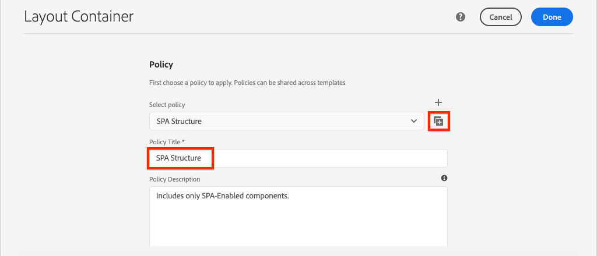

# ナビゲーションとルーティングを追加{#navigation-routing}

AEM PagesとSPA Editor SDKを使用した、SPAの複数のビューのサポート方法について説明します。 動的ナビゲーションは、Angularルートを使用して実装され、既存のヘッダーコンポーネントに追加されます。

## 目的

1. SPA Editorを使用する場合に使用できるSPAモデルのルーティングオプションを理解します。
2. [Angularルーティング](https://angular.io/guide/router)を使用してSPAの異なるビュー間を移動する方法を説明します。
3. AEMページ階層によって駆動される動的ナビゲーションを実装します。

## 作成する内容

この章では、既存の`Header`コンポーネントにナビゲーションメニューを追加します。 ナビゲーションメニューは、AEMページ階層によって駆動され、[ナビゲーションコアコンポーネント](https://docs.adobe.com/content/help/jp/experience-manager-core-components/using/components/navigation.html)が提供するJSONモデルを使用します。


## 前提条件

[ローカル開発環境](overview.md#local-dev-environment)の設定に必要なツールと手順を確認します。

### コードの取得

1. このチュートリアルの開始点をGitからダウンロードします。

   ```shell
   $ git clone git@github.com:adobe/aem-guides-wknd-spa.git
   $ cd aem-guides-wknd-spa
   $ git checkout Angular/navigation-routing-start
   ```

2. Mavenを使用して、コードベースをローカルのAEMインスタンスにデプロイします。

   ```shell
   $ mvn clean install -PautoInstallSinglePackage
   ```

   [AEM 6.x](overview.md#compatibility)を使用する場合は、`classic`プロファイルを追加します。

   ```shell
   $ mvn clean install -PautoInstallSinglePackage -Pclassic
   ```

3. 従来の[WKNDリファレンスサイト](https://github.com/adobe/aem-guides-wknd/releases/latest)用に完成したパッケージをインストールします。 [WKND参照サイト](https://github.com/adobe/aem-guides-wknd/releases/latest)から提供された画像は、WKND SPAで再利用されます。 パッケージは、[AEM Package Manager](http://localhost:4502/crx/packmgr/index.jsp)を使用してインストールできます。

   

[GitHub](https://github.com/adobe/aem-guides-wknd-spa/tree/Angular/navigation-routing-solution)で完成したコードをいつでも表示したり、ブランチ`Angular/navigation-routing-solution`に切り替えてコードをローカルでチェックアウトしたりできます。

## Inspect HeaderComponentの更新{#inspect-header}

以前の章では、`HeaderComponent`コンポーネントは、`app.component.html`を介して含まれる純粋なAngularコンポーネントとして追加されました。 この章では、`HeaderComponent`コンポーネントをアプリから削除し、[テンプレートエディター](https://docs.adobe.com/content/help/ja-JP/experience-manager-learn/sites/page-authoring/template-editor-feature-video-use.html)を使用して追加します。 これにより、ユーザーはAEM内から`HeaderComponent`のナビゲーションメニューを設定できます。

>[!NOTE]
>
> この章を開始するために、コードベースに対して、いくつかのCSSおよびJavaScriptの更新が既におこなわれています。 コード変更の&#x200B;**すべて**&#x200B;ではなく、コア概念に焦点を当てます。 [ここで](https://github.com/adobe/aem-guides-wknd-spa/compare/Angular/map-components-solution...Angular/navigation-routing-start)の全変更を確認できます。

1. 任意のIDEで、この章のSPAスタータープロジェクトを開きます。
2. `ui.frontend`モジュールの下で、次の場所にあるファイル`header.component.ts`を検査します。`ui.frontend/src/app/components/header/header.component.ts`.

   コンポーネントをAEMコンポーネント`wknd-spa-angular/components/header`にマッピングできるように、`HeaderEditConfig`と`MapTo`を追加するなど、いくつかの更新がおこなわれました。

   ```js
   /* header.component.ts */
   ...
   const HeaderEditConfig = {
       ...
   };
   
   @Component({
   selector: 'app-header',
   templateUrl: './header.component.html',
   styleUrls: ['./header.component.scss']
   })
   export class HeaderComponent implements OnInit {
   @Input() items: object[];
       ...
   }
   ...
   MapTo('wknd-spa-angular/components/header')(withRouter(Header), HeaderEditConfig);
   ```

   `items`の`@Input()`注釈に注意してください。 `items` は、AEMから渡されたナビゲーションオブジェクトの配列を含みます。

3. `ui.apps`モジュールで、AEM `Header`コンポーネントのコンポーネント定義を検査します。`ui.apps/src/main/content/jcr_root/apps/wknd-spa-angular/components/header/.content.xml`:

   ```xml
   <?xml version="1.0" encoding="UTF-8"?>
   <jcr:root xmlns:sling="http://sling.apache.org/jcr/sling/1.0" xmlns:cq="http://www.day.com/jcr/cq/1.0"
       xmlns:jcr="http://www.jcp.org/jcr/1.0"
       jcr:primaryType="cq:Component"
       jcr:title="Header"
       sling:resourceSuperType="wknd-spa-angular/components/navigation"
       componentGroup="WKND SPA Angular - Structure"/>
   ```

   AEM `Header`コンポーネントは、`sling:resourceSuperType`プロパティを介して[ナビゲーションコアコンポーネント](https://docs.adobe.com/content/help/en/experience-manager-core-components/using/components/navigation.html)のすべての機能を継承します。

## SPAテンプレートにHeaderComponentを追加します。 {#add-header-template}

1. ブラウザーを開き、 AEM [http://localhost:4502/](http://localhost:4502/)にログインします。 開始コードベースは、既にデプロイされている必要があります。
2. **[!UICONTROL SPA Page Template]**&#x200B;に移動します。[http://localhost:4502/editor.html/conf/wknd-spa-angular/settings/wcm/templates/spa-page-template/structure.html](http://localhost:4502/editor.html/conf/wknd-spa-angular/settings/wcm/templates/spa-page-template/structure.html).
3. 最も外側にある&#x200B;**[!UICONTROL ルートレイアウトコンテナ]**&#x200B;を選択し、**[!UICONTROL ポリシー]**&#x200B;アイコンをクリックします。 オーサリング用に&#x200B;**[!UICONTROL レイアウトコンテナ]**&#x200B;をロック解除して選択する場合は、**非**&#x200B;に注意してください。

   

4. 現在のポリシーをコピーし、**[!UICONTROL SPA Structure]**&#x200B;という名前の新しいポリシーを作成します。

   

   「**[!UICONTROL 許可されているコンポーネント]** > **[!UICONTROL 一般]** 」で、**[!UICONTROL レイアウトコンテナ]**&#x200B;コンポーネントを選択します。

   **[!UICONTROL 許可されているコンポーネント]** > **[!UICONTROL WKND SPAANGULAR- STRUCTURE]**&#x200B;の下で、**[!UICONTROL ヘッダー]**&#x200B;コンポーネントを選択します。

   

   「**[!UICONTROL 許可されているコンポーネント]** / **[!UICONTROL WKND SPAANGULAR — コンテンツ]** 」で、「**[!UICONTROL 画像]**」および「**[!UICONTROL テキスト]**」コンポーネントを選択します。 合計4つのコンポーネントを選択する必要があります。

   「**[!UICONTROL 完了]**」をクリックして、変更を保存します。

5. **ページを更新します。**&#x200B;ロックされていない&#x200B;**[!UICONTROL レイアウトコンテナ]**&#x200B;の上に、**[!UICONTROL ヘッダー]**&#x200B;コンポーネントを追加します。

   

6. **[!UICONTROL ヘッダー]**&#x200B;コンポーネントを選択し、**ポリシー**&#x200B;アイコンをクリックしてポリシーを編集します。

   

7. **[!UICONTROL ポリシーのタイトル]**&#x200B;を&#x200B;**&quot;WKND SPA Header&quot;**&#x200B;にして新しいポリシーを作成します。

   **[!UICONTROL プロパティ]**&#x200B;の下：

   * **[!UICONTROL ナビゲーションルート]**&#x200B;を`/content/wknd-spa-angular/us/en`に設定します。
   * **[!UICONTROL Exclude Root Levels]**&#x200B;を&#x200B;**1**&#x200B;に設定します。
   * 「 **[!UICONTROL すべての子ページを収集]** 」のチェックを外します。
   * **[!UICONTROL ナビゲーション構造の深さ]**&#x200B;を&#x200B;**3**&#x200B;に設定します。

   

   これにより、`/content/wknd-spa-angular/us/en`の下の2レベルのナビゲーションが収集されます。

8. 変更を保存すると、テンプレートの一部として入力された`Header`が表示されます。

   

## 子ページの作成

次に、AEMで別のビューとして機能する追加のページを作成します。 また、AEMが提供するJSONモデルの階層構造も調べます。

1. **サイト**&#x200B;コンソールに移動します。[http://localhost:4502/sites.html/content/wknd-spa-angular/us/en/home](http://localhost:4502/sites.html/content/wknd-spa-angular/us/en/home). **WKND SPAAngularホームページ**&#x200B;を選択し、**[!UICONTROL 作成]** / **[!UICONTROL ページ]**&#x200B;をクリックします。

   

2. 「**[!UICONTROL テンプレート]**」で、「**[!UICONTROL SPAページ]**」を選択します。 **[!UICONTROL 「プロパティ]**」で、**[!UICONTROL タイトル]**&#x200B;に&#x200B;**「ページ1」**&#x200B;を、名前に&#x200B;**「ページ1」**&#x200B;を入力します。

   

   「**[!UICONTROL 作成]**」をクリックし、ダイアログポップアップで「**[!UICONTROL 開く]**」をクリックしてAEM SPAエディターでページを開きます。

3. 新しい&#x200B;**[!UICONTROL テキスト]**&#x200B;コンポーネントをメインの&#x200B;**[!UICONTROL レイアウトコンテナ]**&#x200B;に追加します。 コンポーネントを編集し、次のテキストを入力します。**&quot;ページ1&quot;**&#x200B;は、RTEと&#x200B;**H1**&#x200B;要素を使用します（段落要素を変更するには、フルスクリーンモードにする必要があります）。

   

   画像などのコンテンツを自由に追加できます。

4. AEM Sitesコンソールに戻り、上記の手順を繰り返し、**&quot;Page 2&quot;**&#x200B;という名前の2番目のページを&#x200B;**Page 1**&#x200B;の兄弟として作成します。 識別しやすいように、**ページ2**&#x200B;にコンテンツを追加します。
5. 最後に、3番目のページ&#x200B;**&quot;Page 3&quot;**&#x200B;を、**ページ2**&#x200B;の&#x200B;**子**&#x200B;として作成します。 完了すると、サイト階層は次のようになります。

   

6. 新しいタブで、AEMが提供するJSONモデルAPIを開きます。[http://localhost:4502/content/wknd-spa-angular/us/en.model.json](http://localhost:4502/content/wknd-spa-angular/us/en.model.json). このJSONコンテンツは、SPAが最初に読み込まれたときにリクエストされます。 外側の構造は次のようになります。

   ```json
   {
   "language": "en",
   "title": "en",
   "templateName": "spa-app-template",
   "designPath": "/libs/settings/wcm/designs/default",
   "cssClassNames": "spa page basicpage",
   ":type": "wknd-spa-angular/components/spa",
   ":items": {},
   ":itemsOrder": [],
   ":hierarchyType": "page",
   ":path": "/content/wknd-spa-angular/us/en",
   ":children": {
       "/content/wknd-spa-angular/us/en/home": {},
       "/content/wknd-spa-angular/us/en/home/page-1": {},
       "/content/wknd-spa-angular/us/en/home/page-2": {},
       "/content/wknd-spa-angular/us/en/home/page-2/page-3": {}
       }
   }
   ```

   `:children`の下に、作成された各ページのエントリが表示されます。 すべてのページのコンテンツは、この最初のJSONリクエストに含まれます。 ナビゲーションルーティングが実装されると、コンテンツは既にクライアント側で使用可能なので、SPAの以降のビューはすばやく読み込まれます。

   最初のJSONリクエストでSPAのコンテンツの&#x200B;**ALL**&#x200B;を読み込むと、最初のページ読み込みが遅くなるので、賢明ではありません。 次に、ページの階層の深さがどのように収集されるかを見てみましょう。

7. 次の場所にある&#x200B;**SPA Root**&#x200B;テンプレートに移動します。[http://localhost:4502/editor.html/conf/wknd-spa-angular/settings/wcm/templates/spa-app-template/structure.html](http://localhost:4502/editor.html/conf/wknd-spa-angular/settings/wcm/templates/spa-app-template/structure.html).

   **[!UICONTROL ページプロパティメニュー]** / **[!UICONTROL ページポリシー]**&#x200B;をクリックします。

   

8. **SPA Root**&#x200B;テンプレートには、収集されるJSONコンテンツを制御するための追加の「**[!UICONTROL 階層構造]**」タブがあります。 **[!UICONTROL 構造の深さ]**&#x200B;は、サイト階層の深さを決定し、**ルート**&#x200B;の下の子ページを収集します。 「**[!UICONTROL 構造パターン]**」フィールドを使用して、正規表現に基づいて追加のページを除外することもできます。

   **[!UICONTROL 構造の深さ]**&#x200B;を&#x200B;**&quot;2&quot;**&#x200B;に更新します。

   

   「**[!UICONTROL 完了]**」をクリックして、ポリシーに対する変更を保存します。

9. JSONモデル[http://localhost:4502/content/wknd-spa-angular/us/en.model.json](http://localhost:4502/content/wknd-spa-angular/us/en.model.json)を再度開きます。

   ```json
   {
   "language": "en",
   "title": "en",
   "templateName": "spa-app-template",
   "designPath": "/libs/settings/wcm/designs/default",
   "cssClassNames": "spa page basicpage",
   ":type": "wknd-spa-angular/components/spa",
   ":items": {},
   ":itemsOrder": [],
   ":hierarchyType": "page",
   ":path": "/content/wknd-spa-angular/us/en",
   ":children": {
       "/content/wknd-spa-angular/us/en/home": {},
       "/content/wknd-spa-angular/us/en/home/page-1": {},
       "/content/wknd-spa-angular/us/en/home/page-2": {}
       }
   }
   ```

   **ページ3**&#x200B;のパスが削除されていることに注意してください。`/content/wknd-spa-angular/us/en/home/page-2/page-3`を最初のJSONモデルから取得します。

   後で、AEM SPA Editor SDKが追加コンテンツを動的に読み込む方法を確認します。

## ナビゲーションの実装

次に、新しい`NavigationComponent`を使用してナビゲーションメニューを実装します。 `header.component.html`にコードを直接追加する方法もありますが、大きなコンポーネントを避ける方がよい方法です。 代わりに、後で再利用される可能性のある`NavigationComponent`を実装します。

1. AEM `Header`コンポーネントによって公開されたJSONを[http://localhost:4502/content/wknd-spa-angular/us/en.model.json](http://localhost:4502/content/wknd-spa-angular/us/en.model.json)で確認します。

   ```json
   ...
   "header": {
       "items": [
       {
       "level": 0,
       "active": true,
       "path": "/content/wknd-spa-angular/us/en/home",
       "description": null,
       "url": "/content/wknd-spa-angular/us/en/home.html",
       "lastModified": 1589062597083,
       "title": "WKND SPA Angular Home Page",
       "children": [
               {
               "children": [],
               "level": 1,
               "active": false,
               "path": "/content/wknd-spa-angular/us/en/home/page-1",
               "description": null,
               "url": "/content/wknd-spa-angular/us/en/home/page-1.html",
               "lastModified": 1589429385100,
               "title": "Page 1"
               },
               {
               "level": 1,
               "active": true,
               "path": "/content/wknd-spa-angular/us/en/home/page-2",
               "description": null,
               "url": "/content/wknd-spa-angular/us/en/home/page-2.html",
               "lastModified": 1589429603507,
               "title": "Page 2",
               "children": [
                   {
                   "children": [],
                   "level": 2,
                   "active": false,
                   "path": "/content/wknd-spa-angular/us/en/home/page-2/page-3",
                   "description": null,
                   "url": "/content/wknd-spa-angular/us/en/home/page-2/page-3.html",
                   "lastModified": 1589430413831,
                   "title": "Page 3"
                   }
               ],
               }
           ]
           }
       ],
   ":type": "wknd-spa-angular/components/header"
   ```

   AEMページの階層性は、ナビゲーションメニューの入力に使用できるJSON形式でモデル化されています。 `Header`コンポーネントは[ナビゲーションコアコンポーネント](https://www.aemcomponents.dev/content/core-components-examples/library/templating/navigation.html)のすべての機能を継承し、JSONを通じて公開されたコンテンツは、Angular`@Input`注釈に自動的にマッピングされます。

2. 新しいターミナルウィンドウを開き、SPAプロジェクトの`ui.frontend`フォルダーに移動します。 angularCLIツールを使用して、新しい`NavigationComponent`を作成します。

   ```shell
   $ cd ui.frontend
   $ ng generate component components/navigation
   CREATE src/app/components/navigation/navigation.component.scss (0 bytes)
   CREATE src/app/components/navigation/navigation.component.html (25 bytes)
   CREATE src/app/components/navigation/navigation.component.spec.ts (656 bytes)
   CREATE src/app/components/navigation/navigation.component.ts (286 bytes)
   UPDATE src/app/app.module.ts (2032 bytes)
   ```

3. 次に、新しく作成した`components/navigation`ディレクトリのAngularCLIを使用して、`NavigationLink`という名前のクラスを作成します。

   ```shell
   $ cd src/app/components/navigation/
   $ ng generate class NavigationLink
   CREATE src/app/components/navigation/navigation-link.spec.ts (187 bytes)
   CREATE src/app/components/navigation/navigation-link.ts (32 bytes)
   ```

4. 目的のIDEに戻り、`/src/app/components/navigation/navigation-link.ts`にある`navigation-link.ts`ファイルを開きます。

   

5. `navigation-link.ts` に以下を入力します。

   ```js
   export class NavigationLink {
   
       title: string;
       path: string;
       url: string;
       level: number;
       children: NavigationLink[];
       active: boolean;
   
       constructor(data) {
           this.path = data.path;
           this.title = data.title;
           this.url = data.url;
           this.level = data.level;
           this.active = data.active;
           this.children = data.children.map( item => {
               return new NavigationLink(item);
           });
       }
   }
   ```

   これは、個々のナビゲーションリンクを表す単純なクラスです。 クラスコンストラクターでは、`data`はAEMから渡されたJSONオブジェクトになります。 このクラスは、`NavigationComponent`と`HeaderComponent`の両方で使用し、ナビゲーション構造を簡単に設定できます。

   データ変換は実行されません。このクラスは主にJSONモデルを強く入力するために作成されます。 `this.children`は`NavigationLink[]`と型指定され、コンストラクタは`children`配列内の各項目に対して新しい`NavigationLink`オブジェクトを再帰的に作成します。 `Header`のJSONモデルは階層的です。

6. `navigation-link.spec.ts` ファイルを開きます。これは`NavigationLink`クラスのテストファイルです。 次のように更新します。

   ```js
   import { NavigationLink } from './navigation-link';
   
   describe('NavigationLink', () => {
       it('should create an instance', () => {
           const data = {
               children: [],
               level: 1,
               active: false,
               path: '/content/wknd-spa-angular/us/en/home/page-1',
               description: null,
               url: '/content/wknd-spa-angular/us/en/home/page-1.html',
               lastModified: 1589429385100,
               title: 'Page 1'
           };
           expect(new NavigationLink(data)).toBeTruthy();
       });
   });
   ```

   `const data`は、前に検査したのと同じJSONモデルに従って、単一のリンクが検査されることに注意してください。 これは、堅牢な単体テストとは程遠いですが、`NavigationLink`のコンストラクタをテストするのに十分です。

7. `navigation.component.ts` ファイルを開きます。次のように更新します。

   ```js
   import { Component, OnInit, Input } from '@angular/core';
   import { NavigationLink } from './navigation-link';
   
   @Component({
   selector: 'app-navigation',
   templateUrl: './navigation.component.html',
   styleUrls: ['./navigation.component.scss']
   })
   export class NavigationComponent implements OnInit {
   
       @Input() items: object[];
   
       constructor() { }
   
       get navigationLinks(): NavigationLink[] {
   
           if (this.items && this.items.length > 0) {
               return this.items.map(item => {
                   return new NavigationLink(item);
               });
           }
   
           return null;
       }
   
       ngOnInit() {}
   
   }
   ```

   `NavigationComponent` には、AEMの `object[]` JSONモ `items` デルであるという名前が必要です。このクラスは、`NavigationLink`オブジェクトの配列を返す単一のメソッド`get navigationLinks()`を公開します。

8. ファイル`navigation.component.html`を開き、次のように更新します。

   ```html
   <ul *ngIf="navigationLinks && navigationLinks.length > 0" class="navigation__group">
       <ng-container *ngTemplateOutlet="recursiveListTmpl; context:{ links: navigationLinks }"></ng-container>
   </ul>
   ```

   これにより、最初の`<ul>`が生成され、`navigation.component.ts`から`get navigationLinks()`メソッドが呼び出されます。 `<ng-container>`は、`recursiveListTmpl`という名前のテンプレートを呼び出し、`links`という名前の変数として`navigationLinks`に渡すために使用されます。

   次に`recursiveListTmpl`を追加します。

   ```html
   <ng-template #recursiveListTmpl let-links="links">
       <li *ngFor="let link of links" class="{{'navigation__item navigation__item--' + link.level}}">
           <a [routerLink]="link.url" class="navigation__item-link" [title]="link.title" [attr.aria-current]="link.active">
               {{link.title}}
           </a>
           <ul *ngIf="link.children && link.children.length > 0">
               <ng-container *ngTemplateOutlet="recursiveListTmpl; context:{ links: link.children }"></ng-container>
           </ul>
       </li>
   </ng-template>
   ```

   ここでは、ナビゲーションリンクの残りのレンダリングが実装されます。 変数`link`の型は`NavigationLink`で、そのクラスで作成されるすべてのメソッド/プロパティを使用できます。 [`[routerLink]`](https://angular.io/api/router/RouterLink) は、通常の属性の代わりに使用 `href` されます。これにより、全ページを更新することなく、アプリ内の特定のルートにリンクできます。

   現在の`link`に空でない`children`配列がある場合は、別の`<ul>`を作成することで、ナビゲーションの再帰的な部分も実装されます。

9. `navigation.component.spec.ts`を更新して、`RouterTestingModule`のサポートを追加します。

   ```diff
    ...
   + import { RouterTestingModule } from '@angular/router/testing';
    ...
    beforeEach(async(() => {
       TestBed.configureTestingModule({
   +   imports: [ RouterTestingModule ],
       declarations: [ NavigationComponent ]
       })
       .compileComponents();
    }));
    ...
   ```

   コンポーネントは`[routerLink]`を使用するので、`RouterTestingModule`を追加する必要があります。

10. `navigation.component.scss`を更新して、`NavigationComponent`に基本的なスタイルを追加します。

   ```scss
   @import "~src/styles/variables";
   
   $link-color: $black;
   $link-hover-color: $white;
   $link-background: $black;
   
   :host-context {
       display: block;
       width: 100%;
   }
   
   .navigation__item {
       list-style: none;
   }
   
   .navigation__item-link {
       color: $link-color;
       font-size: $font-size-large;
       text-transform: uppercase;
       padding: $gutter-padding;
       display: flex;
       border-bottom: 1px solid $gray;
   
       &:hover {
           background: $link-background;
           color: $link-hover-color;
       }
   
   }
   ```

## ヘッダーコンポーネントの更新

`NavigationComponent`が実装されたので、`HeaderComponent`を更新して参照する必要があります。

1. ターミナルを開き、SPAプロジェクト内の`ui.frontend`フォルダーに移動します。 **webpack開発サーバー**&#x200B;を起動します。

   ```shell
   $ npm start
   ```

2. ブラウザータブを開き、[http://localhost:4200/](http://localhost:4200/)に移動します。

   AEMのローカルインスタンス(`ui.frontend/proxy.conf.json`)からJSONモデルをプロキシするように、**webpack開発サーバー**&#x200B;を設定する必要があります。 これにより、チュートリアルの前の段階でからAEMで作成されたコンテンツに対して直接コードを作成できます。

   

   `HeaderComponent`には現在、メニュー切り替え機能が実装されています。 次に、ナビゲーションコンポーネントを追加します。

3. 目的のIDEに戻り、`ui.frontend/src/app/components/header/header.component.ts`にある`header.component.ts`ファイルを開きます。
4. `setHomePage()`メソッドを更新して、ハードコードされたStringを削除し、AEMコンポーネントによって渡された動的propを使用します。

   ```js
   /* header.component.ts */
   import { NavigationLink } from '../navigation/navigation-link';
   ...
    setHomePage() {
       if (this.hasNavigation) {
           const rootNavigationLink: NavigationLink = new NavigationLink(this.items[0]);
           this.isHome = rootNavigationLink.path === this.route.snapshot.data.path;
           this.homePageUrl = rootNavigationLink.url;
       }
   }
   ...
   ```

   `NavigationLink`の新しいインスタンスは、AEMから渡されたナビゲーションJSONモデルのルートである`items[0]`に基づいて作成されます。 `this.route.snapshot.data.path` 現在のパスルートのAngularを返します。この値は、現在のルートが&#x200B;**Home Page**&#x200B;であるかどうかを判断するために使用されます。 `this.homePageUrl` を使用して、ロゴ **にアンカーリンクを設**&#x200B;定します。

5. `header.component.html`を開き、ナビゲーション用の静的プレースホルダーを新しく作成した`NavigationComponent`への参照に置き換えます。

   ```diff
       <div class="header-navigation">
           <div class="navigation">
   -            Navigation Placeholder
   +           <app-navigation [items]="items"></app-navigation>
           </div>
       </div>
   ```

   `[items]=items` 属性は、から `@Input() items` ナビゲ `HeaderComponent` ーシ `NavigationComponent` ョンの作成先にを渡します。

6. `header.component.spec.ts`を開き、`NavigationComponent`の宣言を追加します。

   ```diff
       /* header.component.spect.ts */
   +   import { NavigationComponent } from '../navigation/navigation.component';
   
       describe('HeaderComponent', () => {
       let component: HeaderComponent;
       let fixture: ComponentFixture<HeaderComponent>;
   
       beforeEach(async(() => {
           TestBed.configureTestingModule({
           imports: [ RouterTestingModule ],
   +       declarations: [ HeaderComponent, NavigationComponent ]
           })
           .compileComponents();
       }));
   ```

   `NavigationComponent`は`HeaderComponent`の一部として使用されるので、テストベッドの一部として宣言する必要があります。

7. 開いているファイルに変更を保存し、**webpack開発サーバー**&#x200B;に戻ります。[http://localhost:4200/](http://localhost:4200/)

   

   メニューの切り替えをクリックしてナビゲーションを開くと、入力されたナビゲーションリンクが表示されます。 SPAの様々なビューに移動できるようになります。

## SPAルーティングについて

ナビゲーションが実装されたので、AEMのルーティングを調べます。

1. IDEで、`ui.frontend/src/app`にある`app-routing.module.ts`ファイルを開きます。

   ```js
   /* app-routing.module.ts */
   import { AemPageDataResolver, AemPageRouteReuseStrategy } from '@adobe/cq-angular-editable-components';
   import { NgModule } from '@angular/core';
   import { RouteReuseStrategy, RouterModule, Routes, UrlMatchResult, UrlSegment } from '@angular/router';
   import { PageComponent } from './components/page/page.component';
   
   export function AemPageMatcher(url: UrlSegment[]): UrlMatchResult {
       if (url.length) {
           return {
               consumed: url,
               posParams: {
                   path: url[url.length - 1]
               }
           };
       }
   }
   
   const routes: Routes = [
       {
           matcher: AemPageMatcher,
           component: PageComponent,
           resolve: {
               path: AemPageDataResolver
           }
       }
   ];
   @NgModule({
       imports: [RouterModule.forRoot(routes)],
       exports: [RouterModule],
       providers: [
           AemPageDataResolver,
           {
           provide: RouteReuseStrategy,
           useClass: AemPageRouteReuseStrategy
           }
       ]
   })
   export class AppRoutingModule {}
   ```

   `routes: Routes = [];`配列は、Angularコンポーネントマッピングへのルートまたはナビゲーションパスを定義します。

   `AemPageMatcher` は、カスタムAngularル [ーターのUrlMatcher](https://angular.io/api/router/UrlMatcher)で、このAngularアプリケーションの一部であるAEMのページに「似ている」ものを照合します。

   `PageComponent` は、AEMのAngularを表すページコンポーネントで、一致したルートが呼び出されます。`PageComponent`はさらに検査されます。

   `AemPageDataResolver`(AEM SPA Editor JS SDKが提供する)カスタム [Angularルータ](https://angular.io/api/router/Resolve) ーResolverは、.html拡張を含むAEM内のパスであるルートURLを、拡張より短いページパスであるAEM内のリソースパスに変換するために使用します。

   例えば、`AemPageDataResolver`は、ルートのURL `content/wknd-spa-angular/us/en/home.html`を`/content/wknd-spa-angular/us/en/home`のパスに変換します。 これは、JSONモデルAPIのパスに基づいてページのコンテンツを解決するために使用されます。

   `AemPageRouteReuseStrategy`はAEM SPA Editor JS SDKで提供されるカスタムRouteReuseStrategyで、複数のル [](https://angular.io/api/router/RouteReuseStrategy) ート間での再利用を `PageComponent` 防ぎます。そうしないと、ページ「B」に移動すると、ページ「A」のコンテンツが表示される場合があります。

2. `page.component.ts`（`ui.frontend/src/app/components/page/`）ファイルを開きます。

   ```js
   ...
   export class PageComponent {
       items;
       itemsOrder;
       path;
   
       constructor(
           private route: ActivatedRoute,
           private modelManagerService: ModelManagerService
       ) {
           this.modelManagerService
           .getData({ path: this.route.snapshot.data.path })
           .then(data => {
               this.path = data[Constants.PATH_PROP];
               this.items = data[Constants.ITEMS_PROP];
               this.itemsOrder = data[Constants.ITEMS_ORDER_PROP];
           });
       }
   }
   ```

   `PageComponent`は、AEMから取得したJSONを処理するために必要で、ルートをレンダリングするAngularコンポーネントとして使用されます。

   `ActivatedRoute`はAngularルーターモジュールで提供され、このAngularページコンポーネントインスタンスに読み込む必要があるAEMページのJSONコンテンツを示す状態を含みます。

   `ModelManagerService`では、ルートに基づいてJSONデータを取得し、データをクラス変数、 、にマッピ `path`ング `items`しま `itemsOrder`す。これらは、次に[AEMPageComponent](https://www.npmjs.com/package/@adobe/cq-angular-editable-components#aempagecomponent.md)に渡されます。

3. `ui.frontend/src/app/components/page/`にある`page.component.html`ファイルを開きます。

   ```html
   <aem-page 
       class="structure-page" 
       [attr.data-cq-page-path]="path" 
       [cqPath]="path" 
       [cqItems]="items" 
       [cqItemsOrder]="itemsOrder">
   </aem-page>
   ```

   `aem-page` には、AEMPageComponentが含ま [れています](https://www.npmjs.com/package/@adobe/cq-angular-editable-components#aempagecomponent.md)。変数`path`、`items`および`itemsOrder`が`AEMPageComponent`に渡されます。 SPA Editor JavaScript SDKを介して提供される`AemPageComponent`は、このデータを繰り返し処理し、 [コンポーネントのマップのチュートリアル](./map-components.md)に示すように、JSONデータに基づいてAngularコンポーネントを動的にインスタンス化します。

   `PageComponent`は、実際には`AEMPageComponent`の代わりにすぎません。JSONモデルをAngularコンポーネントに正しくマッピングするために、大部分の処理は`AEMPageComponent`です。

## AEMでのSPAルーティングのInspect

1. ターミナルを開き、起動した場合は&#x200B;**webpack開発サーバー**&#x200B;を停止します。 プロジェクトのルートに移動し、Mavenのスキルを使用してAEMにプロジェクトをデプロイします。

   ```shell
   $ cd aem-guides-wknd-spa
   $ mvn clean install -PautoInstallSinglePackage
   ```

   >[!CAUTION]
   >
   > angularプロジェクトでは、非常に厳密なリントルールが有効になっています。 Mavenビルドに失敗した場合は、エラーを確認し、一覧に表示されているファイルで&#x200B;**Lintエラーを探します。**」を選択します。リンターで見つかった問題を修正し、Mavenコマンドを再実行します。

2. AEMのSPAホームページに移動します。[http://localhost:4502/content/wknd-spa-angular/us/en/home.html](http://localhost:4502/content/wknd-spa-angular/us/en/home.html)を開き、ブラウザーの開発者ツールを開きます。 以下のスクリーンショットは、Google Chromeブラウザーからキャプチャされたものです。

   ページを更新すると、SPAルートである`/content/wknd-spa-angular/us/en.model.json`へのXHRリクエストが表示されます。 このチュートリアルで既に作成したSPAルートテンプレートの階層の深さ設定に基づいて、3つの子ページのみが含まれています。 **ページ3**&#x200B;は含まれません。

   

3. 開発者ツールを開き、**ページ3**&#x200B;に移動します。

   

   新しいXHRリクエストが次の処理に対しておこなわれることを確認します。`/content/wknd-spa-angular/us/en/home/page-2/page-3.model.json`

   

   AEM Model Managerは、**ページ3**&#x200B;のJSONコンテンツが使用できないことを認識し、追加のXHRリクエストを自動的にトリガーします。

4. 様々なナビゲーションリンクを使用してSPA内を移動し続けます。 追加のXHRリクエストがおこなわれず、完全なページ更新がおこなわれないことを確認します。 これにより、エンドユーザーにとって高速なSPAが実現し、AEMへの不要なリクエストが削減されます。

   

5. 次の場所に直接移動して、ディープリンクを試してみます。[http://localhost:4502/content/wknd-spa-angular/us/en/home/page-2.html](http://localhost:4502/content/wknd-spa-angular/us/en/home/page-2.html). ブラウザーの戻るボタンが引き続き機能することを確認します。

## バリデーターが {#congratulations}

これで、SPA Editor SDKを使用してAEMページにマッピングすることで、SPAの複数のビューをサポートする方法を学びました。 動的ナビゲーションは、Angularルーティングを使用して実装され、`Header`コンポーネントに追加されました。

[GitHub](https://github.com/adobe/aem-guides-wknd-spa/tree/Angular/navigation-routing-solution)で完成したコードをいつでも表示したり、ブランチ`Angular/navigation-routing-solution`に切り替えてコードをローカルでチェックアウトしたりできます。

### 次の手順 {#next-steps}

[カスタムコンポーネントの作成](custom-component.md)  - AEM SPA Editorで使用するカスタムコンポーネントを作成する方法を説明します。JSONモデルを拡張してカスタムコンポーネントを設定するためのオーサーダイアログとSlingモデルの開発方法について説明します。
