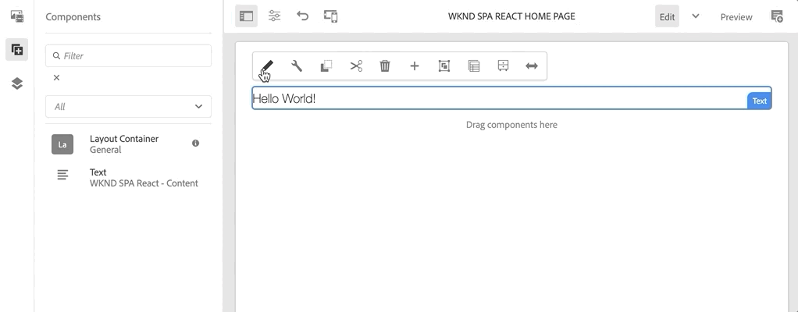

# SPAエディタプロジェクト {#spa-editor-project}

AEM SPA Editorと統合されたReactアプリケーションの起点として、Adobe Experience Manager(AEM) Mavenプロジェクトを使用する方法を説明します。

## 目的

1. Mavenアーキタイプから構築された新しいAEM SPA Editorプロジェクトの構造を理解します。
2. スタータープロジェクトをAEMのローカルインスタンスにデプロイします。

## 作成する内容

この章では、 [AEMプロジェクトのアーキタイプに基づいて新しいAEMプロジェクトを導入します](https://github.com/adobe/aem-project-archetype)。 AEMプロジェクトは、非常に単純なReact SPAの起点でブートストラップされます。 本章で使用するプロジェクトは、WKND SPAの導入の基盤となり、今後の章で構築される予定です。


*WKND SPAのサイト階層の開始。*

## 前提条件

Review the required tooling and instructions for setting up a [local development environment](overview.md#local-dev-environment). オーサー **モードで開始したAdobe Experience Managerの新しいインスタンスが、ローカルで実行されていることを確認し** ます。

## プロジェクトの取得

AEM用のMavenマルチモジュールプロジェクトを作成するには、いくつかのオプションがあります。 このチュートリアルでは、最新の [AEMプロジェクトのアーキタイプ](https://github.com/adobe/aem-project-archetype) (Archetype)をチュートリアルコードの基礎として使用しました。 AEMの複数のバージョンをサポートするために、プロジェクトコードに変更が加えられました。 下位互換性 [に関する注意を確認してください](overview.md#compatibility)。

>[!CAUTION]
>
> ベストプラクティスとして、 **最新バージョンの** アーキタイプを使用して [](https://github.com/adobe/aem-project-archetype) 、実際の実装用の新しいプロジェクトを生成することができます。 AEMプロジェクトでは、アーキタイプの `aemVersion` プロパティを使用して1つのバージョンのAEMをターゲットする必要があります。

1. Gitを介して、このチュートリアルのスタートポイントをダウンロードします。

   ```shell
   $ git clone git@github.com:adobe/aem-guides-wknd-spa.git
   $ cd aem-guides-wknd-spa
   $ git checkout React/create-project-start
   ```

2. 次のフォルダーとファイル構造は、ローカルファイルシステム上のMavenアーキタイプによって生成されたAEMプロジェクトを表しています。

   ```plain
   |--- aem-guides-wknd-spa
       |--- all/
       |--- core/
       |--- dispatcher/
       |--- ui.apps/
       |--- ui.apps.structure/
       |--- ui.content/
       |--- ui.frontend /
       |--- it.tests/
       |--- pom.xml
       |--- README.md
       |--- .gitignore
       |--- archetype.properties
   ```

3. The following properties were used when generating the AEM project from the [AEM Project archetype](https://github.com/Adobe-Marketing-Cloud/aem-project-archetype/releases/tag/aem-project-archetype-14):

   | プロパティ | 値 |
   |-----------------|-------------------------------------|
   | aemVersion | クラウド |
   | appTitle | WKND SPAリアクト |
   | appId | wknd-spa-react |
   | groupId | com.adobe.aem.guides |
   | frontendModule | 反応する |
   | package | com.adobe.aem.guides.wknd.spa.react |
   | includeExamples | n |

   >[!NOTE]
   >
   > プロパティに注目して `frontendModule=react` ください。 これにより、AEMプロジェクトのアーキタイプは、AEM SPAエディタで使用するスターター [リアクトコードベース](https://docs.adobe.com/content/help/en/experience-manager-core-components/using/developing/archetype/uifrontend-react.html) (base)を使用してプロジェクトをブートストラップするように指示されます。

## プロジェクトの構築

次に、Mavenを使用して、プロジェクトコードをコンパイル、構築、およびAEMのローカルインスタンスにデプロイします。

1. AEMのインスタンスがローカルでポート4502で実行されているこ **とを確認します**。
2. コマンドラインターミナルから、Mavenがインストールされていることを確認します。

   ```shell
   $ mvn --version
    Apache Maven 3.6.2
    Maven home: /Library/apache-maven-3.6.2
    Java version: 11.0.4, vendor: Oracle Corporation, runtime: /Library/Java/JavaVirtualMachines/jdk-11.0.4.jdk/Contents/Home
   ```

3. 次のMaven下のコマンドを `aem-guides-wknd-spa` ディレクトリから実行し、プロジェクトを構築してAEMにデプロイします。

   ```shell
   $ mvn clean install -PautoInstallSinglePackage
   ```

   AEM [6.xを使用している場合](overview.md#compatibility):

   ```shell
   $ mvn clean install -PautoInstallSinglePackage -Pclassic
   ```

   プロジェクトの複数のモジュールをコンパイルし、AEMにデプロイする必要があります。

   ```plain
    [INFO] ------------------------------------------------------------------------
    [INFO] Reactor Summary for wknd-spa-react 1.0.0-SNAPSHOT:
    [INFO] 
    [INFO] wknd-spa-react ..................................... SUCCESS [  0.523 s]
    [INFO] WKND SPA React - Core .............................. SUCCESS [  8.069 s]
    [INFO] wknd-spa-react.ui.frontend - UI Frontend ........... SUCCESS [01:23 min]
    [INFO] WKND SPA React - Repository Structure Package ...... SUCCESS [  0.830 s]
    [INFO] WKND SPA React - UI apps ........................... SUCCESS [  4.654 s]
    [INFO] WKND SPA React - UI content ........................ SUCCESS [  1.607 s]
    [INFO] WKND SPA React - All ............................... SUCCESS [  0.384 s]
    [INFO] WKND SPA React - Integration Tests Bundles ......... SUCCESS [  0.770 s]
    [INFO] WKND SPA React - Integration Tests Launcher ........ SUCCESS [  1.407 s]
    [INFO] WKND SPA React - Dispatcher ........................ SUCCESS [  0.055 s]
    [INFO] ------------------------------------------------------------------------
    [INFO] BUILD SUCCESS
    [INFO] ------------------------------------------------------------------------
    [INFO] Total time:  01:44 min
   ```

   Mavenプロファイル ***autoInstallSinglePackage*** は、プロジェクトの個々のモジュールをコンパイルし、1つのパッケージをAEMインスタンスに展開します。 デフォルトでは、このパッケージは、ローカルのポート4502で実行され **ているAEMインスタンスにデプロイされ** 、 **admin:adminの資格情報が付与されます**。

4. Navigate to **[!UICONTROL Package Manager]** on your local AEM instance: [http://localhost:4502/crx/packmgr/index.jsp](http://localhost:4502/crx/packmgr/index.jsp).

5. との3つのパッケージが表示され `wknd-spa-react.all`るはず `wknd-spa-react.ui.apps` で `wknd-spa-react.ui.content`す。

   

   *AEM Package Manager*

   プロジェクトに必要なすべてのカスタムコードは、これらのパッケージにバンドルされ、AEMランタイムにインストールされます。

6. また、との複数のパッケージも表示さ `spa.project.core` れ `core.wcm.components`ます。 これらの依存関係は、アーキタイプによって自動的に含まれます。 [AEMコアコンポーネントの詳細については、こちらを参照してください](https://docs.adobe.com/content/help/ja-JP/experience-manager-core-components/using/introduction.html)。

   `spa.project.core` は、SPAエディターが必要とするJSONモデルAPIの生成に必要な依存関係です。

## 作成者コンテンツ

次に、アーキタイプによって生成されたスターターSPAを開き、コンテンツの一部を更新します。

1. Navigate to the **[!UICONTROL Sites]** console: [http://localhost:4502/sites.html/content](http://localhost:4502/sites.html/content).

   WKND SPAには、国、言語、ホームページを持つ基本的なサイト構造が含まれています。 この階層は、およびのアーキタイプのデフォルト値に基づ `language_country` き `isSingleCountryWebsite`ます。 これらの値は、プロジェクトの生成時に [使用可能なプロパティを更新することで上書きできます](https://github.com/adobe/aem-project-archetype#available-properties) 。

2. ページを選択し、メニューバーの **[!DNL us]** 「 **[!DNL en]** 編集 **[!DNL WKND SPA React Home Page]** 」ボタンをクリックして、// **** ページを開きます。

   

3. ページに **[!UICONTROL テキスト]** コンポーネントが既に追加されています。 このコンポーネントは、AEMの他のコンポーネントと同様に編集できます。

   

4. ペ追加ージの追加の **[!UICONTROL テキスト]** コンポーネント。

   オーサリングエクスペリエンスは、従来のAEM Sitesページのエクスペリエンスと似ています。 現在、使用できるコンポーネントの数に制限があります。 チュートリアルの過程でさらに追加されます。

## シングルページアプリのInspect

次に、ブラウザーの開発者ツールを使用して、これがシングルページアプリであることを確認します。

1. **[!UICONTROL ページエディターで]**、 **[!UICONTROL ページ情報]** ボタン/ **[!UICONTROL 表示を「公開済み]**」としてクリックします。

   

   これにより、クエリパラメータを持つ新しいタブが開き、AEMエディタ `?wcmmode=disabled` が効果的にオフになります。 [http://localhost:4502/content/wknd-spa-react/us/en/home.html?wcmmode=disabled](http://localhost:4502/content/wknd-spa-react/us/en/home.html?wcmmode=disabled)

2. ページのソースを表示し、テキストコンテンツ **[!DNL Hello World]** または他のコンテンツが見つからないことに注意します。 代わりに、次のようなHTMLが表示されます。

   ```html
   ...
   <body>
       <noscript>You need to enable JavaScript to run this app.</noscript>
       <div id="spa-root"></div>
       <script type="text/javascript" src="/etc.clientlibs/wknd-spa-react/clientlibs/clientlib-react.min.js"></script>
   </body>
   ...
   ```

   `clientlib-react.min.js` は、ページに読み込まれ、コンテンツのレンダリングを行うReact SPAです。

   ただし、コンテンツ *の提供元はどこですか。*

3. タブに戻る： [http://localhost:4502/content/wknd-spa-react/us/en/home.html?wcmmode=disabled](http://localhost:4502/content/wknd-spa-react/us/en/home.html?wcmmode=disabled)
4. ブラウザーの開発者ツールを開き、更新中のページのネットワークトラフィックを調べます。 XHR **要求の表示** :

   

   http://localhost:4502/content/wknd-spa-react/us/en.model.jsonにリクエストが送信され [ます](http://localhost:4502/content/wknd-spa-react/us/en.model.json)。 SPAをドライブするすべてのコンテンツがJSON形式で含まれます。

5. 新しいタブで、http://localhost:4502/content/wknd-spa-react/us/en.model.jsonを開き [ます。](http://localhost:4502/content/wknd-spa-react/us/en.model.json)

   リクエストは、アプリを駆動するコンテンツモデルを `en.model.json` 表します。 JSON出力をInspectに送信します。 **[!UICONTROL Text]** コンポーネントを表すスニペットを見つけることができます。

   ```json
   ...
   ":items": {
       "text": {
           "text": "<p>Hello World! Updated content!</p>\r\n",
           "richText": true,
           ":type": "wknd-spa-react/components/text"
       },
       "text_98796435": {
           "text": "<p>A new text component.</p>\r\n",
           "richText": true,
           ":type": "wknd-spa-react/components/text"
       },
   }
   ...
   ```

   次の章では、AEM SPAエディターの使用感を基にして、このJSONコンテンツがAEMコンポーネントからSPAコンポーネントにどのようにマッピングされるかを調べます。

   >[!NOTE]
   >
   > JSON出力の形式を自動的に設定するには、ブラウザー拡張機能をインストールすると便利です。

## バリデーターが{#congratulations}

AEM SPAエディタープロジェクトを初めて作成しました。

SPAは非常に単純です。 次の数章では、さらに機能が追加されます。

### 次の手順 {#next-steps}

[SPAの統合](integrate-spa.md) - SPAソースコードがAEMプロジェクトとどのように統合されているかを学び、SPAを迅速に開発するために利用可能なツールを理解します。
