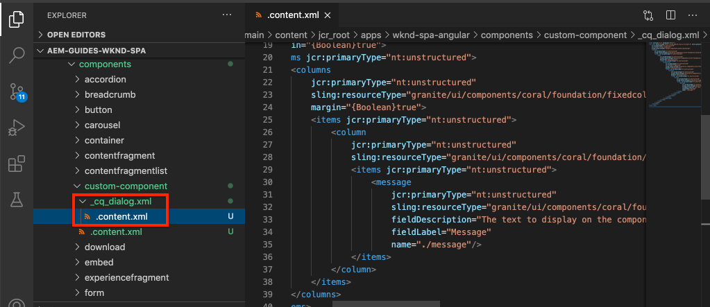

# カスタムコンポーネント{#custom-component}の作成

AEM SPA Editorで使用するカスタムコンポーネントを作成する方法を説明します。 JSONモデルを拡張してカスタムコンポーネントを設定するためのオーサーダイアログとSlingモデルの開発方法について説明します。

## 目的

1. AEMが提供するJSONモデルAPIを操作する際のSlingモデルの役割を理解します。
2. 新しいAEMコンポーネントダイアログの作成方法を説明します。
3. SPAエディターフレームワークと互換性のある&#x200B;**カスタム** AEMコンポーネントの作成について説明します。

## 作成する内容

以前の章では、SPAコンポーネントの開発と、既存の&#x200B;*AEMコアコンポーネントへのマッピングに焦点を当てていました。*&#x200B;この章では、*新しい* AEMコンポーネントの作成と拡張、およびAEMが提供するJSONモデルの操作の方法に焦点を当てます。

簡単な`Custom Component`は、新しいAEMコンポーネントを作成するために必要な手順を示しています。


## 前提条件

[ローカル開発環境](overview.md#local-dev-environment)の設定に必要なツールと手順を確認します。

### コードの取得

1. このチュートリアルの開始点をGitからダウンロードします。

   ```shell
   $ git clone git@github.com:adobe/aem-guides-wknd-spa.git
   $ cd aem-guides-wknd-spa
   $ git checkout React/custom-component-start
   ```

2. Mavenを使用して、コードベースをローカルのAEMインスタンスにデプロイします。

   ```shell
   $ mvn clean install -PautoInstallSinglePackage
   ```

   [AEM 6.x](overview.md#compatibility)を使用する場合は、`classic`プロファイルを追加します。

   ```shell
   $ mvn clean install -PautoInstallSinglePackage -Pclassic
   ```

3. 従来の[WKNDリファレンスサイト](https://github.com/adobe/aem-guides-wknd/releases/latest)用に完成したパッケージをインストールします。 [WKND参照サイト](https://github.com/adobe/aem-guides-wknd/releases/latest)から提供された画像は、WKND SPAで再利用されます。 パッケージは、[AEM Package Manager](http://localhost:4502/crx/packmgr/index.jsp)を使用してインストールできます。

   

[GitHub](https://github.com/adobe/aem-guides-wknd-spa/tree/React/custom-component-solution)で完成したコードをいつでも表示したり、ブランチ`React/custom-component-solution`に切り替えてコードをローカルでチェックアウトしたりできます。

## AEMコンポーネントの定義

AEMコンポーネントは、ノードおよびプロパティとして定義されます。 プロジェクトでは、これらのノードとプロパティは`ui.apps`モジュール内でXMLファイルとして表されます。 次に、`ui.apps`モジュールにAEMコンポーネントを作成します。

>[!NOTE]
>
> AEMコンポーネントの[基本に関する簡単なリフレッシャーが役立つ場合があります。](https://docs.adobe.com/content/help/en/experience-manager-learn/getting-started-wknd-tutorial-develop/component-basics.html)

1. 任意のIDEで、`ui.apps`フォルダーを開きます。
2. `ui.apps/src/main/content/jcr_root/apps/wknd-spa-react/components`に移動し、`custom-component`という名前の新しいフォルダーを作成します。
3. `custom-component`フォルダーの下に`.content.xml`という名前の新しいファイルを作成します。 `custom-component/.content.xml`に以下を入力します。

   ```xml
   <?xml version="1.0" encoding="UTF-8"?>
   <jcr:root xmlns:sling="http://sling.apache.org/jcr/sling/1.0" xmlns:cq="http://www.day.com/jcr/cq/1.0" xmlns:jcr="http://www.jcp.org/jcr/1.0"
       jcr:primaryType="cq:Component"
       jcr:title="Custom Component"
       componentGroup="WKND SPA React - Content"/>
   ```

   

   `jcr:primaryType="cq:Component"`  — このノードがAEMコンポーネントであることを示します。

   `jcr:title` は、コンテンツ作成者に表示される値で、はオーサリングUI `componentGroup` でのコンポーネントのグループを決定します。

4. `custom-component`フォルダーの下に、`_cq_dialog`という名前の別のフォルダーを作成します。
5. `_cq_dialog`フォルダーの下に、`.content.xml`という名前の新しいファイルを作成し、次のように設定します。

   ```xml
   <?xml version="1.0" encoding="UTF-8"?>
   <jcr:root xmlns:sling="http://sling.apache.org/jcr/sling/1.0" xmlns:granite="http://www.adobe.com/jcr/granite/1.0" xmlns:cq="http://www.day.com/jcr/cq/1.0" xmlns:jcr="http://www.jcp.org/jcr/1.0" xmlns:nt="http://www.jcp.org/jcr/nt/1.0"
       jcr:primaryType="nt:unstructured"
       jcr:title="Custom Component"
       sling:resourceType="cq/gui/components/authoring/dialog">
       <content
           jcr:primaryType="nt:unstructured"
           sling:resourceType="granite/ui/components/coral/foundation/container">
           <items jcr:primaryType="nt:unstructured">
               <tabs
                   jcr:primaryType="nt:unstructured"
                   sling:resourceType="granite/ui/components/coral/foundation/tabs"
                   maximized="{Boolean}true">
                   <items jcr:primaryType="nt:unstructured">
                       <properties
                           jcr:primaryType="nt:unstructured"
                           jcr:title="Properties"
                           sling:resourceType="granite/ui/components/coral/foundation/container"
                           margin="{Boolean}true">
                           <items jcr:primaryType="nt:unstructured">
                               <columns
                                   jcr:primaryType="nt:unstructured"
                                   sling:resourceType="granite/ui/components/coral/foundation/fixedcolumns"
                                   margin="{Boolean}true">
                                   <items jcr:primaryType="nt:unstructured">
                                       <column
                                           jcr:primaryType="nt:unstructured"
                                           sling:resourceType="granite/ui/components/coral/foundation/container">
                                           <items jcr:primaryType="nt:unstructured">
                                               <message
                                                   jcr:primaryType="nt:unstructured"
                                                   sling:resourceType="granite/ui/components/coral/foundation/form/textfield"
                                                   fieldDescription="The text to display on the component."
                                                   fieldLabel="Message"
                                                   name="./message"/>
                                           </items>
                                       </column>
                                   </items>
                               </columns>
                           </items>
                       </properties>
                   </items>
               </tabs>
           </items>
       </content>
   </jcr:root>
   ```

   

   上記のXMLファイルは、`Custom Component`のための非常に単純なダイアログを生成します。 ファイルの重要な部分は、内部の`<message>`ノードです。 このダイアログには、`Message`という名前の単純な`textfield`が含まれ、テキストフィールドの値を`message`という名前のプロパティに保持します。

   次にSlingモデルが作成され、JSONモデルを介して`message`プロパティの値が公開されます。

   >[!NOTE]
   >
   > コアコンポーネントの定義](https://github.com/adobe/aem-core-wcm-components/tree/master/content/src/content/jcr_root/apps/core/wcm/components)を参照すると、さらに多くの[ダイアログの例を確認できます。 [CRXDE-Lite](http://localhost:4502/crx/de/index.jsp#/libs/granite/ui/components/coral/foundation/form)の`/libs/granite/ui/components/coral/foundation/form`の下にある`select`、`textarea`、`pathfield`など、追加のフォームフィールドを表示することもできます。

   従来のAEMコンポーネントでは、通常、[HTL](https://docs.adobe.com/content/help/ja/experience-manager-htl/using/overview.html)スクリプトが必要です。 SPAはコンポーネントをレンダリングするので、HTLスクリプトは不要です。

## Slingモデルの作成

Slingモデルは、JCRからJava変数へのデータのマッピングを容易にする注釈駆動型のJava「POJO」(Plain Old Java Objects)です。 [Sling Modelstypcalに](https://docs.adobe.com/content/help/en/experience-manager-learn/getting-started-wknd-tutorial-develop/component-basics.html#sling-models) より、AEM Components用の複雑なサーバー側のビジネスロジックがカプセル化されます。

SPA Editorのコンテキストでは、Sling Modelsは、[Sling Model Exporter](https://docs.adobe.com/content/help/ja-JP/experience-manager-learn/foundation/development/develop-sling-model-exporter.html)を使用する機能を使用して、JSONモデルを介してコンポーネントのコンテンツを公開します。

1. 任意のIDEで、`core`モジュールを開きます。 `CustomComponent.java` チャプ `CustomComponentImpl.java` タースターターコードの一部として既に作成およびスタブ化されている。

   >[!NOTE]
   >
   > Visual Studio Code IDEを使用している場合は、Java](https://code.visualstudio.com/docs/java/extensions)用の[拡張機能をインストールすると便利です。

2. `core/src/main/java/com/adobe/aem/guides/wknd/spa/react/core/models/CustomComponent.java`にあるJavaインターフェイス`CustomComponent.java`を開きます。

   

   これは、Sling Modelによって実装されるJavaインターフェイスです。

3. `CustomComponent.java`を更新して、`ComponentExporter`インターフェイスを拡張します。

   ```java
   package com.adobe.aem.guides.wknd.spa.react.core.models;
   import com.adobe.cq.export.json.ComponentExporter;
   
   public interface CustomComponent extends ComponentExporter {
   
       public String getMessage();
   
   }
   ```

   `ComponentExporter`インターフェイスの実装は、JSONモデルAPIでSlingモデルを自動的に取得するための要件です。

   `CustomComponent`インターフェイスは、単一のゲッターメソッド`getMessage()`を含みます。 これは、JSONモデルを使用してオーサーダイアログの値を公開するメソッドです。 空のパラメーター`()`を持つパブリックのゲッターメソッドのみがJSONモデルに書き出されます。

4. `core/src/main/java/com/adobe/aem/guides/wknd/spa/react/core/models/impl/CustomComponentImpl.java`で`CustomComponentImpl.java`を開きます。

   これは`CustomComponent`インターフェイスの実装です。 `@Model`注釈は、JavaクラスをSling Modelとして識別します。 `@Exporter`注釈を使用すると、Sling Model Exporterを通じてJavaクラスをシリアル化および書き出すことができます。

5. 静的変数`RESOURCE_TYPE`を更新して、前の演習で作成したAEMコンポーネント`wknd-spa-react/components/custom-component`を指すようにします。

   ```java
   static final String RESOURCE_TYPE = "wknd-spa-react/components/custom-component";
   ```

   コンポーネントのリソースタイプは、Sling ModelをAEMコンポーネントにバインドし、最終的にReactコンポーネントにマッピングされます。

6. `getExportedType()`メソッドを`CustomComponentImpl`クラスに追加して、コンポーネントのリソースタイプを返します。

   ```java
   @Override
   public String getExportedType() {
       return CustomComponentImpl.RESOURCE_TYPE;
   }
   ```

   このメソッドは、`ComponentExporter`インターフェイスを実装する際に必要で、Reactコンポーネントへのマッピングを可能にするリソースタイプを公開します。

7. `getMessage()`メソッドを更新して、オーサーダイアログで保持されている`message`プロパティの値を返します。 `@ValueMap`注釈を使用して、JCR値`message`をJava変数にマッピングします。

   ```java
   import org.apache.commons.lang3.StringUtils;
   ...
   
   @ValueMapValue
   private String message;
   
   @Override
   public String getMessage() {
       return StringUtils.isNotBlank(message) ? message.toUpperCase() : null;
   }
   ```

   メッセージのString値をすべて大文字で返す「ビジネスロジック」が追加されました。 これにより、オーサーダイアログで保存される生の値とSling Modelで公開される値の違いを確認できます。

   >[!NOTE]
   >
   > [完成したCustomComponentImpl.javaは、](https://github.com/adobe/aem-guides-wknd-spa/blob/React/custom-component-solution/core/src/main/java/com/adobe/aem/guides/wknd/spa/react/core/models/impl/CustomComponentImpl.java)で確認できます。

## Reactコンポーネントの更新

カスタムコンポーネントのReactコードは既に作成されています。 次に、ReactコンポーネントをAEMコンポーネントにマッピングするために、いくつかの更新をおこないます。

1. `ui.frontend`モジュールで、ファイル`ui.frontend/src/components/Custom/Custom.js`を開きます。
2. `render()`メソッドの一部として`{this.props.message}`変数を観察します。

   ```js
   return (
           <div className="CustomComponent">
               <h2 className="CustomComponent__message">{this.props.message}</h2>
           </div>
       );
   ```

   Slingモデルの変換後の大文字の値は、この`message`プロパティにマッピングされる必要があります。

3. AEM SPA Editor JS SDKから`MapTo`オブジェクトを読み込み、それを使用してAEMコンポーネントにマッピングします。

   ```diff
   + import {MapTo} from '@adobe/aem-react-editable-components';
   
    ...
    export default class Custom extends Component {
        ...
    }
   
   + MapTo('wknd-spa-react/components/custom-component')(Custom, CustomEditConfig);
   ```

4. Mavenのスキルを使用して、すべての更新をローカルAEM環境にプロジェクトディレクトリのルートからデプロイします。

   ```shell
   $ cd aem-guides-wknd-spa
   $ mvn clean install -PautoInstallSinglePackage
   ```

## テンプレートポリシーの更新

次に、AEMに移動して更新を確認し、`Custom Component`をSPAに追加できるようにします。

1. [http://localhost:4502/system/console/status-slingmodels](http://localhost:4502/system/console/status-slingmodels)に移動して、新しいSling Modelの登録を確認します。

   ```plain
   com.adobe.aem.guides.wknd.spa.react.core.models.impl.CustomComponentImpl - wknd-spa-react/components/custom-component
   
   com.adobe.aem.guides.wknd.spa.react.core.models.impl.CustomComponentImpl exports 'wknd-spa-react/components/custom-component' with selector 'model' and extension '[Ljava.lang.String;@6fb4a693' with exporter 'jackson'
   ```

   上記の2行が表示され、`CustomComponentImpl`が`wknd-spa-react/components/custom-component`コンポーネントに関連付けられ、Sling Model Exporterを介して登録されていることを示しています。

2. [http://localhost:4502/editor.html/conf/wknd-spa-react/settings/wcm/templates/spa-page-template/structure.html](http://localhost:4502/editor.html/conf/wknd-spa-react/settings/wcm/templates/spa-page-template/structure.html)にあるSPAページテンプレートに移動します。
3. レイアウトコンテナのポリシーを更新し、新しい`Custom Component`を許可されたコンポーネントとして追加します。

   

   ポリシーに対する変更を保存し、`Custom Component`を許可されたコンポーネントとして監視します。

   

## カスタムコンポーネントのオーサリング

次に、AEM SPA Editorを使用して`Custom Component`を作成します。

1. [http://localhost:4502/editor.html/content/wknd-spa-react/us/en/home.html](http://localhost:4502/editor.html/content/wknd-spa-react/us/en/home.html)に移動します。
2. `Edit`モードで、`Custom Component`を`Layout Container`に追加します。

   

3. コンポーネントのダイアログを開き、小文字を含むメッセージを入力します。

   

   これは、前の章のXMLファイルに基づいて作成されたダイアログです。

4. 変更内容を保存します。表示されるメッセージがすべて大文字であることを確認します。

   

5. [http://localhost:4502/content/wknd-spa-react/us/en.model.json](http://localhost:4502/content/wknd-spa-react/us/en.model.json)に移動して、JSONモデルを表示します。 `wknd-spa-react/components/custom-component`を検索します。

   ```json
   "custom_component_208183317": {
       "message": "HELLO WORLD",
       ":type": "wknd-spa-react/components/custom-component"
   }
   ```

   JSON値は、Sling Modelに追加されたロジックに基づいて、すべての大文字に設定されます。

## バリデーターが {#congratulations}

これで、SPA Editorで使用するカスタムAEMコンポーネントの作成方法を学びました。 また、ダイアログ、JCRプロパティ、Sling ModelがJSONモデルを出力する方法も学びました。

[GitHub](https://github.com/adobe/aem-guides-wknd-spa/tree/React/custom-component-solution)で完成したコードを表示したり、ブランチ`React/custom-component-solution`に切り替えてコードをローカルでチェックアウトしたりできます。

### 次の手順 {#next-steps}

[コアコンポーネントの拡張](extend-component.md)  - AEM SPA Editorで使用する既存のコアコンポーネントを拡張する方法を説明します。既存のコンポーネントにプロパティとコンテンツを追加する方法を理解することは、AEM SPA Editor実装の機能を拡張する強力な手法です。
