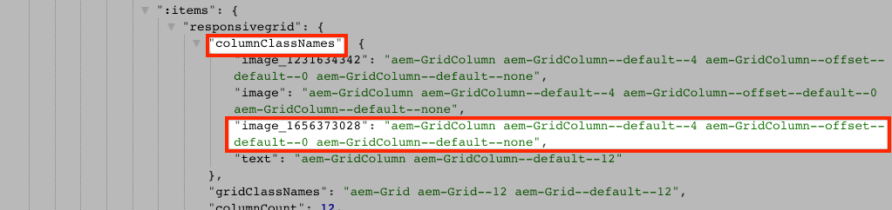

# SPAコンポーネントのAEMコンポーネントへのマッピング{#map-components}

AEM SPA Editor JS SDKを使用して、ReactコンポーネントをAdobe Experience Manager(AEM)コンポーネントにマッピングする方法について説明します。 コンポーネントマッピングを使用すると、AEM SPA Editor内で、従来のAEMオーサリングと同様に、SPAコンポーネントを動的に更新できます。

この章では、AEM JSONモデルAPIについて詳しく説明し、AEMコンポーネントによって公開されたJSONコンテンツをpropとしてReactコンポーネントに自動的に挿入する方法について説明します。

## 目的

1. AEMコンポーネントをSPAコンポーネントにマッピングする方法について説明します。
2. **コンテナ**&#x200B;コンポーネントと&#x200B;**コンテンツ**&#x200B;コンポーネントの違いを理解します。
3. 既存のReactコンポーネントにマッピングする新しいReactコンポーネントをAEMします。

## 作成する内容

この章では、指定された`Text` SPAコンポーネントがAEM `Text`コンポーネントにどのようにマッピングされているかを調べます。 新しい`Image` SPAコンポーネントが作成され、SPAで使用してAEMでオーサリングできます。 **レイアウトコンテナ**&#x200B;および&#x200B;**テンプレートエディター**&#x200B;ポリシーの初期設定済み機能も使用して、外観が少し変化するビューを作成します。


## 前提条件

[ローカル開発環境](overview.md#local-dev-environment)の設定に必要なツールと手順を確認します。

### コードの取得

1. このチュートリアルの開始点をGitからダウンロードします。

   ```shell
   $ git clone git@github.com:adobe/aem-guides-wknd-spa.git
   $ cd aem-guides-wknd-spa
   $ git checkout React/map-components-start
   ```

2. Mavenを使用して、コードベースをローカルのAEMインスタンスにデプロイします。

   ```shell
   $ mvn clean install -PautoInstallSinglePackage
   ```

   [AEM 6.x](overview.md#compatibility)を使用する場合は、`classic`プロファイルを追加します。

   ```shell
   $ mvn clean install -PautoInstallSinglePackage -Pclassic
   ```

[GitHub](https://github.com/adobe/aem-guides-wknd-spa/tree/React/map-components-solution)で完成したコードをいつでも表示したり、ブランチ`React/map-components-solution`に切り替えてコードをローカルでチェックアウトしたりできます。

## マッピング方法

基本的な概念は、SPAコンポーネントをAEMコンポーネントにマッピングすることです。 AEMコンポーネントを使用して、サーバー側で実行し、JSONモデルAPIの一部としてコンテンツを書き出す。 JSONコンテンツは、ブラウザーでクライアント側を実行するSPAで使用されます。 SPAコンポーネントとAEMコンポーネントの間に1対1のマッピングが作成されます。


*AEMコンポーネントとReactコンポーネントのマッピングの概要*

## Inspect the Text Component

[AEMプロジェクトアーキタイプ](https://github.com/adobe/aem-project-archetype)は、AEM [テキストコンポーネント](https://docs.adobe.com/content/help/ja-JP/experience-manager-core-components/using/components/text.html)にマッピングされる`Text`コンポーネントを提供します。 これは、AEMから&#x200B;*content*&#x200B;をレンダリングする&#x200B;**content**&#x200B;コンポーネントの例です。

コンポーネントの動作を見てみましょう。

### JSONモデルのInspect

1. SPAのコードを調べる前に、AEMが提供するJSONモデルを理解しておくことが重要です。 [コアコンポーネントライブラリ](https://www.aemcomponents.dev/content/core-components-examples/library/page-authoring/text.html)に移動し、テキストコンポーネントのページを表示します。 コアコンポーネントライブラリは、すべてのAEMコアコンポーネントの例を提供しています。
2. 次のいずれかの例の「**JSON**」タブを選択します。

   

   次の3つのプロパティが表示されます。`text`、`richText`、および`:type`。

   `:type` は、AEMコンポーネントの(また `sling:resourceType` はパス)をリストする予約済みプロパティです。`:type`の値は、AEMコンポーネントをSPAコンポーネントにマッピングするために使用されます。

   `text` と `richText` は、SPAコンポーネントに公開される追加のプロパティです。

### Inspect the Textコンポーネント

1. 新しいターミナルを開き、プロジェクト内の`ui.frontend`フォルダーに移動します。 `npm install`を実行し、`npm start`を実行して&#x200B;**webpack-dev-server**&#x200B;を起動します。

   ```shell
   $ cd ui.frontend
   $ npm install
   $ npm start
   ```

   `ui.frontend`モジュールは、現在、[モックJSONモデル](./integrate-spa.md#mock-json)を使用するように設定されています。

2. 新しいブラウザウィンドウが開いて[http://localhost:3000/content/wknd-spa-react/us/en/home.html](http://localhost:3000/content/wknd-spa-react/us/en/home.html)が表示されます。

   

3. 任意のIDEで、WKND SPA用のAEMプロジェクトを開きます。 `ui.frontend`モジュールを展開し、`ui.frontend/src/components/Text/Text.js`の下の`Text.js`ファイルを開きます。

   

4. 最初に調べるのは、40行目(`class Text`)です。

   ```js
   class Text extends Component {
   
       get richTextContent() {
           return (<div
                   id={extractModelId(this.props.cqPath)}
                   data-rte-editelement
                   dangerouslySetInnerHTML={{__html: DOMPurify.sanitize(this.props.text)}} />
                   );
       }
   
       get textContent() {
           return <div>{this.props.text}</div>;
       }
   
       render() {
           return this.props.richText ? this.richTextContent : this.textContent;
       }
   }
   ```

   `Text` は、標準のReactコンポーネントです。コンポーネントは、`this.props.richText`を使用して、レンダリングするコンテンツをリッチテキストにするかプレーンテキストにするかを決定します。 実際に使用される「コンテンツ」は`this.props.text`から取得されます。 XSS攻撃の可能性を回避するために、リッチテキストは`DOMPurify`経由でエスケープされてから、[dangerlySetInnerHTML](https://reactjs.org/docs/dom-elements.html#dangerouslysetinnerhtml)を使用してコンテンツをレンダリングします。 この演習の前のJSONモデルから`richText`および`text`プロパティを呼び出します。

5. 次に、～29行目の`TextEditConfig`を見てみましょう。

   ```js
   const TextEditConfig = {
   emptyLabel: 'Text',
   
       isEmpty: function(props) {
           return !props || !props.text || props.text.trim().length < 1;
       }
   };
   ```

   上記のコードは、AEMオーサー環境でプレースホルダーをレンダリングするタイミングを決定する役割を果たします。 `isEmpty`メソッドが&#x200B;**true**&#x200B;を返す場合は、プレースホルダーがレンダリングされます。

6. 最後に、 ～62行目の`MapTo`呼び出しを見てみましょう。

   ```js
   export default MapTo('wknd-spa-react/components/text')(Text, TextEditConfig);
   ```

   `MapTo` は、AEM SPA Editor JS SDK(`@adobe/aem-react-editable-components`)で提供されます。パス`wknd-spa-react/components/text`は、AEMコンポーネントの`sling:resourceType`を表します。 このパスは、前に確認したJSONモデルで公開された`:type`と一致します。 `MapTo` は、JSONモデルの応答を解析し、正しい値をSPAコンポーネントに渡 `props` す処理を行います。

   AEMの`Text`コンポーネント定義は`ui.apps/src/main/content/jcr_root/apps/wknd-spa-react/components/text`にあります。

7. `ui.frontend/public/mock-content/mock.model.json`にある`mock.model.json`ファイルを変更して、実験を行います。 ～行62で、最初の`Text`値を更新し、**`H1`**&#x200B;タグと&#x200B;**`u`**&#x200B;タグを使用します。

   ```json
       "text": {
           "text": "<h1><u>Hello World!</u></h1>",
           "richText": true,
           ":type": "wknd-spa-react/components/text"
       }
   ```

   [http://localhost:3000](http://localhost:3000)に移動して、効果を確認します。

   

   `richText`プロパティを&#x200B;**true** / **false**&#x200B;の間で切り替えて、実行中のレンダリングロジックを確認してください。

8. Inspect `Text.scss` (`ui.frontend/src/components/Text/Text.scss`)

   このファイルは、この章のスターターコードベースによって追加され、前の章で追加した[Sass](https://sass-lang.com/)機能を利用します。 `ui.frontend/src/styles/_variables.scss`から参照される変数に注意してください。

## 画像コンポーネントの作成

次に、AEM [画像コンポーネント](https://docs.adobe.com/content/help/ja/experience-manager-core-components/using/components/image.html)にマッピングされる`Image` Reactコンポーネントを作成します。 `Image`コンポーネントは、**content**&#x200B;コンポーネントの別の例です。

### Inspect the JSON

SPAコードを調べる前に、AEMから提供されたJSONモデルを調べます。

1. コアコンポーネントライブラリの[画像の例](https://www.aemcomponents.dev/content/core-components-examples/library/page-authoring/image.html)に移動します。

   

   `src`、`alt`および`title`のプロパティは、SPA `Image`コンポーネントの設定に使用されます。

   >[!NOTE]
   >
   > 開発者がアダプティブな遅延読み込みコンポーネントを作成できる、その他の画像プロパティ(`lazyEnabled`、`widths`)が公開されています。 このチュートリアルで作成されるコンポーネントはシンプルで、これらの高度なプロパティは&#x200B;**使用**&#x200B;しません。

2. IDEに戻り、`ui.frontend/public/mock-content/mock.model.json`の`mock.model.json`を開きます。 これはプロジェクトの新しいコンポーネントなので、画像JSONのモックを作成する必要があります。

   ～行70に、`image`モデルのJSONエントリを追加し（2番目の`text_23828680`の後の末尾のコンマ`,`を忘れないでください）、`:itemsOrder`配列を更新します。

   ```json
   ...
   ":items": {
               ...
               "text_23828680": {
                   "text": "<p>Mock Model JSON!</p>",
                   "richText": true,
                   ":type": "wknd-spa-react/components/text"
               },
               "image": {
                   "alt": "Rock Climber in New Zealand",
                   "title": "Rock Climber in New Zealand",
                   "src": "/mock-content/adobestock-140634652.jpeg",
                   ":type": "wknd-spa-react/components/image"
               }
           },
           ":itemsOrder": [
               "text",
               "text_23828680",
               "image"
           ],
   ```

   このプロジェクトには、`/mock-content/adobestock-140634652.jpeg`にサンプルイメージが含まれており、このイメージは&#x200B;**webpack-dev-server**&#x200B;で使用されます。

   完全な[mock.model.jsonは、](https://github.com/adobe/aem-guides-wknd-spa/blob/React/map-components-solution/ui.frontend/public/mock-content/mock.model.json)で確認できます。

### 画像コンポーネントの実装

1. 次に、`ui.frontend/src/components`の下に`Image`という名前の新しいフォルダーを作成します。
2. `Image`フォルダーの下に、`Image.js`という名前の新しいファイルを作成します。

   

3. 次の`import`文を`Image.js`に追加します。

   ```js
   import React, {Component} from 'react';
   import {MapTo} from '@adobe/aem-react-editable-components';
   ```

4. 次に、`ImageEditConfig`を追加して、AEMでプレースホルダーを表示するタイミングを指定します。

   ```js
   export const ImageEditConfig = {
   
       emptyLabel: 'Image',
   
       isEmpty: function(props) {
           return !props || !props.src || props.src.trim().length < 1;
       }
   };
   ```

   `src`プロパティが設定されていない場合、プレースホルダーが表示されます。

5. 次に、`Image`クラスを実装します。

   ```js
    export default class Image extends Component {
   
       get content() {
           return ;
       }
   
       render() {
           if(ImageEditConfig.isEmpty(this.props)) {
               return null;
           }
   
           return (
                   <div className="Image">
                       {this.content}
                   </div>
           );
       }
   }
   ```

   上記のコードは、JSONモデルによって渡されたprop `src`、`alt`および`title`に基づいて``をレンダリングします。

6. `MapTo`コードを追加して、ReactコンポーネントをAEMコンポーネントにマッピングします。

   ```js
   MapTo('wknd-spa-react/components/image')(Image, ImageEditConfig);
   ```

   文字列`wknd-spa-react/components/image`は、次の場所にある`ui.apps`のAEMコンポーネントの場所に対応しています。`ui.apps/src/main/content/jcr_root/apps/wknd-spa-react/components/image`.

7. `Image.scss`という名前の新しいファイルを同じディレクトリに作成し、次のコードを追加します。

   ```scss
   .Image-src {
       margin: 1rem 0;
       width: 100%;
       border: 0;
   }
   ```

8. `Image.js`内で、`import`ステートメントの下の先頭にファイルへの参照を追加します。

   ```js
   import React, {Component} from 'react';
   import {MapTo} from '@adobe/aem-react-editable-components';
   
   require('./Image.scss');
   ```

   完成した[Image.jsは、](https://github.com/adobe/aem-guides-wknd-spa/blob/React/map-components-solution/ui.frontend/src/components/Image/Image.js)で確認できます。

9. ファイル`ui.frontend/src/components/import-components.js`を開き、新しい`Image`コンポーネントへの参照を追加します。

   ```js
   import './Page/Page';
   import './Text/Text';
   import './Image/Image'; //add reference to Image component
   ```

10. まだ起動していない場合は、**webpack-dev-server**&#x200B;を起動します。 [http://localhost:3000](http://localhost:3000)に移動すると、イメージレンダーが表示されます。

   

   >[!NOTE]
   >
   > **ボーナスチャレンジ**:での値を画像の下にキャ `Image.js` プションとして表 `this.props.title` 示する新しいメソッドを実装します。

## AEMのポリシーの更新

`Image`コンポーネントは、**webpack-dev-server**&#x200B;にのみ表示されます。 次に、更新されたSPAをAEMにデプロイし、テンプレートポリシーを更新します。

1. **webpack-dev-server**&#x200B;を停止し、プロジェクトのルートから、Mavenのスキルを使用してAEMに変更をデプロイします。

   ```shell
   $ cd aem-guides-wknd-spa
   $ mvn clean install -PautoInstallSinglePackage
   ```

2. AEM Start画面で、**Tools** > **Templates** > **[WKND SPA React](http://localhost:4502/libs/wcm/core/content/sites/templates.html/conf/wknd-spa-react)**&#x200B;に移動します。

   **SPA Page**&#x200B;を選択して編集します。

   

3. **レイアウトコンテナ**&#x200B;を選択し、**ポリシー**&#x200B;アイコンをクリックしてポリシーを編集します。

   

4. **許可されているコンポーネント** > **WKND SPA React - Content** >の下で、**画像**&#x200B;コンポーネントを確認します。

   

   **Default Components** > **Add mapping**&#x200B;を選択し、**Image - WKND SPA React - Content**&#x200B;コンポーネントを選択します。

   

   **MIMEタイプ**&#x200B;を`image/*`と入力します。

   「**完了**」をクリックして、ポリシーの更新を保存します。

5. **レイアウトコンテナ**&#x200B;で、**テキスト**&#x200B;コンポーネントの&#x200B;**ポリシー**&#x200B;アイコンをクリックします。

   

   **WKND SPA Text**&#x200B;という名前の新しいポリシーを作成します。 「**プラグイン** / **書式** 」で、すべてのボックスをオンにして追加の書式設定オプションを有効にします。

   

   **プラグイン** > **段落スタイル**&#x200B;で、「**段落スタイル**&#x200B;を有効にする」チェックボックスをオンにします。

   

   「**完了**」をクリックして、ポリシーの更新を保存します。

6. **ホームページ** [http://localhost:4502/editor.html/content/wknd-spa-react/us/en/home.html](http://localhost:4502/editor.html/content/wknd-spa-react/us/en/home.html)に移動します。

   また、`Text`コンポーネントを編集し、**フルスクリーン**&#x200B;モードで段落スタイルを追加することもできます。

   

7. また、**アセットファインダー**&#x200B;から画像をドラッグ&amp;ドロップすることもできます。

   

8. [AEM Assets](http://localhost:4502/assets.html/content/dam)を使用して独自の画像を追加するか、標準の[WKNDリファレンスサイト](https://github.com/adobe/aem-guides-wknd/releases/latest)の完成したコードベースをインストールします。 [WKND参照サイト](https://github.com/adobe/aem-guides-wknd/releases/latest)には、WKND SPAで再利用できる多くの画像が含まれています。 パッケージは、[AEM Package Manager](http://localhost:4502/crx/packmgr/index.jsp)を使用してインストールできます。

   

## Inspect the Layout Container

**レイアウトコンテナ**&#x200B;のサポートは、AEM SPA Editor SDKによって自動的に提供されます。 **レイアウトコンテナ**&#x200B;は、名前で示されているように、 **コンテナ**&#x200B;コンポーネントです。 コンテナコンポーネントは、*他の*&#x200B;コンポーネントを表すJSON構造を受け入れ、動的にインスタンス化するコンポーネントです。

ここでは、レイアウトコンテナをさらに詳しく調べます。

1. ブラウザーで、[http://localhost:4502/content/wknd-spa-react/us/en.model.json](http://localhost:4502/content/wknd-spa-react/us/en.model.json)に移動します。

   

   **レイアウトコンテナ**&#x200B;コンポーネントは`wcm/foundation/components/responsivegrid`の`sling:resourceType`を持ち、`Text`コンポーネントと`Image`コンポーネントと同様に、`:type`プロパティを使用してSPAエディターで認識されます。

   [レイアウトモード](https://docs.adobe.com/content/help/en/experience-manager-65/authoring/siteandpage/responsive-layout.html#defining-layouts-layout-mode)を使用してコンポーネントのサイズを変更する場合と同じ機能をSPA Editorで使用できます。

2. [http://localhost:4502/editor.html/content/wknd-spa-react/us/en/home.html](http://localhost:4502/editor.html/content/wknd-spa-react/us/en/home.html)に戻ります。 **画像**&#x200B;コンポーネントを追加し、**レイアウト**&#x200B;オプションを使用してサイズ変更を試みます。

   

3. JSONモデル[http://localhost:4502/content/wknd-spa-react/us/en.model.json](http://localhost:4502/content/wknd-spa-react/us/en.model.json)を再度開き、JSONの一部として`columnClassNames`を観察します。

   

   クラス名`aem-GridColumn--default--4`は、12列のグリッドに基づいて、幅が4列であるコンポーネントを示します。 [レスポンシブグリッドの詳細については、](https://adobe-marketing-cloud.github.io/aem-responsivegrid/)を参照してください。

4. IDEに戻り、`ui.apps`モジュール内に`ui.apps/src/main/content/jcr_root/apps/wknd-spa-react/clientlibs/clientlib-grid`に定義されたクライアント側ライブラリがあります。 `less/grid.less` ファイルを開きます。

   このファイルは、**レイアウトコンテナ**&#x200B;で使用されるブレークポイント(`default`、`tablet`、`phone`)を決定します。 このファイルは、プロジェクト仕様に応じてカスタマイズすることを目的としています。 現在、ブレークポイントは`1200px`と`650px`に設定されています。

5. `Text`コンポーネントのレスポンシブ機能と更新されたリッチテキストポリシーを使用して、次のようなビューを作成できます。

   

## バリデーターが {#congratulations}

これで、SPAコンポーネントをAEMコンポーネントにマッピングする方法と、新しい`Image`コンポーネントを実装する方法を学びました。 また、**レイアウトコンテナ**&#x200B;のレスポンシブ機能を調べることもできます。

[GitHub](https://github.com/adobe/aem-guides-wknd-spa/tree/React/map-components-solution)で完成したコードをいつでも表示したり、ブランチ`React/map-components-solution`に切り替えてコードをローカルでチェックアウトしたりできます。

### 次の手順 {#next-steps}

[ナビゲーションとルーティング](navigation-routing.md)  - SPAエディターSDKを使用してAEMページにマッピングすることで、SPAの複数のビューをサポートする方法を説明します。ダイナミックナビゲーションは、React Routerを使用して実装され、既存のヘッダーコンポーネントに追加されます。

## ボーナス — ソース管理に対する構成の保持 {#bonus}

多くの場合、特にAEMプロジェクトの開始時に、テンプレートや関連するコンテンツポリシーなどの設定をソース管理に保持すると役立ちます。 これにより、すべての開発者が同じコンテンツと設定のセットに対して作業を行い、環境間の一貫性をさらに高めることができます。 プロジェクトがある程度の成熟度に達すると、テンプレート管理の手法を特別なパワーユーザーのグループに引き継ぐことができます。

次の手順は、Visual Studio Code IDEと[VSCode AEM Sync](https://marketplace.visualstudio.com/items?itemName=yamato-ltd.vscode-aem-sync)を使用して実行しますが、AEMのローカルインスタンスから&#x200B;**pull&lt;a3/または** import **に設定した任意のツールとIDEを使用して実行できます。**

1. Visual Studio Code IDEで、Marketplace拡張機能を使用して&#x200B;**VSCode AEM Sync**&#x200B;がインストールされていることを確認します。

   

2. プロジェクトエクスプローラーで、 **ui.content**&#x200B;モジュールを展開し、 `/conf/wknd-spa-react/settings/wcm/templates`に移動します。

3. **フォルダーを右** クリック `templates` し、「 AEM Serverからインポ **ート」を選択します**。

   

4. コンテンツを読み込む手順を繰り返しますが、`/conf/wknd-spa-react/settings/wcm/templates/policies`にある&#x200B;**policies**&#x200B;フォルダーを選択します。

5. `ui.content/src/main/content/META-INF/vault/filter.xml`にある`filter.xml`ファイルをInspectします。

   ```xml
   <!--ui.content filter.xml-->
   <?xml version="1.0" encoding="UTF-8"?>
    <workspaceFilter version="1.0">
        <filter root="/conf/wknd-spa-react" mode="merge"/>
        <filter root="/content/wknd-spa-react" mode="merge"/>
        <filter root="/content/dam/wknd-spa-react" mode="merge"/>
        <filter root="/content/experience-fragments/wknd-spa-react" mode="merge"/>
    </workspaceFilter>
   ```

   `filter.xml`ファイルは、パッケージと共にインストールされるノードのパスを識別します。 各フィルターの`mode="merge"`は、既存のコンテンツは変更されず、新しいコンテンツのみが追加されることを示しています。 コンテンツ作成者はこれらのパスを更新する可能性があるので、コードデプロイメントではコンテンツを上書き&#x200B;**しない**&#x200B;ことが重要です。 フィルタ要素の使用について詳しくは、[FileVaultのドキュメント](https://jackrabbit.apache.org/filevault/filter.html)を参照してください。

   `ui.content/src/main/content/META-INF/vault/filter.xml`と`ui.apps/src/main/content/META-INF/vault/filter.xml`を比較して、各モジュールで管理される異なるノードを理解します。
